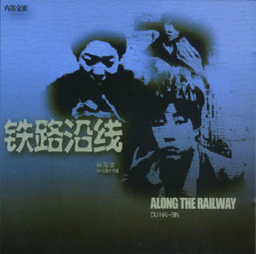

# ＜独立影像＞第十一期：无处还乡

我当时认为这不过是剧情片罢了，即便确有类似事件也定然是八、九十年代的异事了。然而之后的某一天我却无意中在报纸上读到了一篇几乎完全相同的罪案报道，而案发时间却是在08、09年期间。我当时便意识到自己的幼稚，同时也实在无法理解为何这样的事件竟能发生。我想如果当时推荐电影《盲井》的同时能附上这篇报道，一定能够使人更深刻地理解独立电影的社会性；如果再对此类事件稍加分析，谈一谈是什么原因使得这样的事件发生、使得罪犯得以肆无忌惮两年之久、使得9名打工者无端丧命他乡……或者竟只是收集些背景资料供读者自己研究或以之为基础进行扩展，若如此则必定能使人在观看电影之后有更多的思考和更深的理解，而不仅仅停留于“了解”的层次。  

# ＜独立影像＞第十一期：无处还乡

**（另附HAFF亚洲青年电影节广告）**

## 文 / 独立影像栏目组

 

#### 题记：

本期独立影像的形式与之前十期完全不同。前十期皆由“影评人”为读者撰稿并推荐电影，文章的优点在于原创性以及作者的感性认识。而本期文章内容多非原创，主要是由北斗编辑将与电影相关的背景资料搜集整理而成。

也许读者还记得独立影像第一期中所推荐的电影《盲井》。这部电影是根据刘庆邦的小说《神木》改编而成，讲述的内容可谓罪恶之极——两个罪犯先将打工者诱骗至矿区工作之后再将他们害死在矿井之中并伪造成矿难事故，最后伪装成遇难者亲属向矿主索要赔偿金。我当时认为这不过是剧情片罢了，即便确有类似事件也定然是八、九十年代的异事了。然而之后的某一天我却无意中在报纸上读到了一篇几乎完全相同的罪案报道，而案发时间却是在08、09年期间。我当时便意识到自己的幼稚，同时也实在无法理解为何这样的事件竟能发生。我想如果当时推荐电影《盲井》的同时能附上这篇报道，一定能够使人更深刻地理解独立电影的社会性；如果再对此类事件稍加分析，谈一谈是什么原因使得这样的事件发生、使得罪犯得以肆无忌惮两年之久、使得9名打工者无端丧命他乡……或者竟只是收集些背景资料供读者自己研究或以之为基础进行扩展，若如此则必定能使人在观看电影之后有更多的思考和更深的理解，而不仅仅停留于“了解”的层次。

以上便是本期独立影像栏目文章形式的来源。今后，独立影像栏目将根据电影主题适当选择文章的形式。当然，我们对于此新形式也尚处于摸索阶段，诸多不足之处或也受限于编辑的知识水平、思维能力。经我们整理过的资料的深度和广度或为读者所鄙，欢迎读者留言评论，丰富背景资料或深化主题理解。

#### 正文：

不论是在北上广这样的一线大城市还是全国各地近乎无名的小城市，我们总是能在街上看到衣衫褴褛、蓬头垢面的流浪汉。有些人看起来无所事事只是在街头游荡，有些人则沦为乞丐或于天桥上或于地下通道中大大方方的坐下乞讨……我们不禁疑惑——他们究竟来自何处？又缘何流落至此？为何此情此景竟成每一座城市的共景？

凤凰网：寒冬中的流浪者突显农村社会保障缺陷

[http://news.ifeng.com/society/2/detail_2010_12/21/3628643_0.shtml](http://news.ifeng.com/society/2/detail_2010_12/21/3628643_0.shtml)

对于这些流浪者，虽然救助站会提供温暖的床铺、味道尚可的食物和回乡的车票，但是“除非年纪很大、病得很严重的，很少有人愿意去救助站。而那些接受了免费的火车票回老家的人“不久之后又在这儿出现了，而且很多人都已经去了又来，反复多次了。””

“乞丐村”现象：“很多村民发现有人去大城市乞讨，回家过年时都发了财，于是他们都加入了这一行列。”

使他们坚持在街头乞讨的根本原因在于“巨大的贫富差距以及农村落后的生活条件。北京理工大学经济学教授胡星斗说：“乞丐在古今中外都有，但是造成中国流浪乞讨现状的根源是贫富的两极分化和农村落后的社会保障制度。””

社会保障现状：“新型农村养老保险试点于去年9月起在全国试点，保障每一位60岁以上的老人能拿到每月最低55元的养老金。但是新农保按预期要到2020年才能覆盖全国。”

“当农村的社保更完善时，我们相信城市街头的露宿者会越来越少。”

这样看来我们能做的似乎只有等待？

相关的法律文件——《城市生活无着的流浪乞讨人员救助管理办法》

[http://www.china.com.cn/chinese/PI-c/370030.htm](http://www.china.com.cn/chinese/PI-c/370030.htm)

其中值得注意的有

第二条《救助管理办法》规定的“城市生活无着的流浪乞讨人员”是指因自身无力解决食宿，无亲友投靠，又不享受城市最低生活保障或者农村五保供养，正在城市流浪乞讨度日的人员。虽有流浪乞讨行为，但不具备前款规定情形的，不属于救助对象。

第十二条救助站应当根据受助人员的情况确定救助期限，一般不超过10天；因特殊情况需要延长的，报上级民政主管部门备案。

第十八条受助人员户口所在地、住所地的乡级、县级人民政府应当帮助返回的受助人员解决生产、生活困难，避免其再次外出流浪乞讨；对遗弃残疾人、未成年人、老年人的近亲属或者其他监护人，责令其履行抚养、赡养义务；对确实无家可归的残疾人、未成年人、老年人应当给予安置。

由此可以看出，救助站的职能十分有限，其作用主要在于将流浪者送回家乡或亲属身边。主要针对的是那些由于特殊原因暂时流落街头而无法返回家乡的人，对于决心依靠乞讨谋生的人则无能为力，甚至对于那些举目无亲的孤寡老人也只能提供暂时性的帮助。

探访“流浪者一条街” 外地客聚集南京路市民头痛

[http://www.gxnews.com.cn/staticpages/20040415/newgx407e038a-174627.shtml](http://www.gxnews.com.cn/staticpages/20040415/newgx407e038a-174627.shtml)

相对于《寒冬》一文中救助站尽职尽责有心无力的形象，这篇文章中的救助站则显得底气不足。由于《救助管理办法》的规定，“一部分尚有劳动能力的青壮年流浪者，显然不在救助范围之内”，这些青壮年流浪者甚至对社会治安构成威胁。这些青壮年流浪汉为什么不寻找一份正当的工作，过一种更加体面的生活而选择放下尊严沿街乞讨呢？也许他们有其独特的个人原因，或者其实缘于教育、经济、文化等更深层次的社会性因素。

 

### **【如何下载】~@_@?~**

**请加入独立影像流动分享群，在群共享中下载本期所推荐的独立电影！**

**流动群群号：94075202 ****入群请注意以下几点哦：**

1.流动群专供北斗读者下载本栏目所推荐的资源，验证身份时请注明“北斗读者”。

2.当期资源自发布后14天内可以下载，到期后工作人员将手动删除以上传后续资源，请注意时间。

3.此群采取流动制，群满员时，完成下载后请自动退群，以便他人入群下载。（但是请注意：只有当群满员时才需要各位流动，现在则无需退群，需要大家流动时会另行通知。）

**DNEY****新人群群号：152511792******

注：DNEY新人群为DNEY独立影像官方交流群，非流动制。DNEY同时为流动群和新人群提供资源，但新人群资源并不一定与本栏目同步。

关于**独立电影**和**DNEY**请参见[<独立影像>第一期：初识独立影像（上）](/?p=11506)，其中的**广告**也要记得看哦！

 

### 【广告】

 DNEY携手HAFF亚洲青年电影节，完全免费报名索取观影票券，现场有惊喜礼物好礼相送！ 杭州亚洲青年电影节排片表正式发布啦！各位杭州观众可以去我们的网上票务系统预报名了： [http://haff2011.sojump.com/jq/980931.aspx](http://haff2011.sojump.com/jq/980931.aspx) 勾选场次前请各位仔细查看八点注意要点。 排片表下载地址： [http://www.sojump.com/Upload/JoinActivityUploadFile/970622/5_4.pdf](http://www.sojump.com/Upload/JoinActivityUploadFile/970622/5_4.pdf) 点击好戏网专题主页还可以详细查看每部影片的影片简介与选片人的话： [http://www.mask9.com/node/38619](http://www.mask9.com/node/38619) 

#### 更多问题或详情请联系以下人员：

**HAFF电影节策划人：** 单佐龙 QQ：491411034 **HAFF电影节协调人：** 闻光凯：15068862824 QQ：1465993527 项冰冰 QQ：554636064 严丹丹：15068862824 **DNEY管理组组长：** 廖梦丹：18250877536 QQ：330476250 **DNEY品牌宣传：** 杨侑：13538141963 QQ：398776221  

（采编：黄希敏；责编：黄希敏）

 
