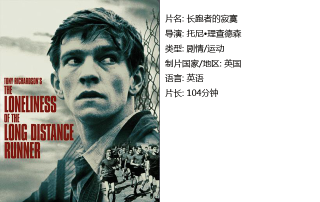
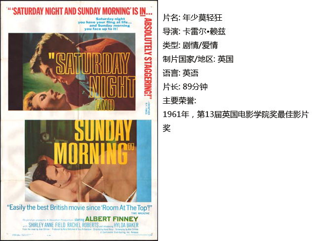
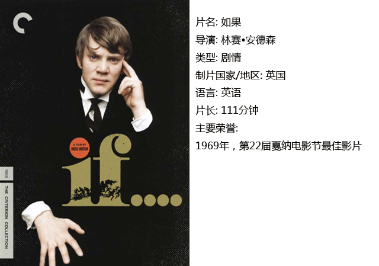

# ＜独立影像＞第十七期：愤怒的年轻人

**而或许只有经历过了放纵，逃避和承担，一个人才能成长。就像男主角的第一句台词：“我只是想享受一下，其他一切都是宣传之词。”看上去他或许是一个没有什么原则和理想的虚无主义者。但是最后一句：“这不会是我抛出的最后一块石头。”却让我们看到了一个其实对未来对社会有着自己想法的真正的年轻人。**  

# 第十七期：愤怒的年轻人

## 影评人 / 李润龙（山东艺术学院）

 

英国人经常会给人一种追求有序生活的印象，所以虽然英国的电影常常很惊艳，但大多也是有一系列规矩可以遵循的。然而，在上世纪六十年代的时候，大量的英国青年觉得这样的生活实在是过于死气沉沉，他们想要表达对于这个迂腐的社会的愤怒却又不知道如何宣泄。就在这个时候，一群年轻人发现电影是一种不错的表达个人诉求的方式，于是发起了一次破陈出新的电影运动——“自由电影运动”。

就像法国的“新浪潮”运动一样，这次运动持续的时间不长，但是却取得了巨大的成就。下面就列举其中的三部代表作，分别是《长跑者的寂寞》、《年少莫轻狂》和《如果》。这三部影片虽然是不同导演拍摄于不同年代的作品，但是却因电影人都有着共同的反抗意识和先锋的电影处理技巧而存在很大的内在联系，基本上可以连成一部英伦愤怒青年的成长史。

#### 一、长跑者的寂寞

因为家庭的糟烂，他根本不喜欢现在的生活，但是迫于现实的压力无奈选择了盗窃，之后又被关进了少年感化院。感化院是一个能把那些“坏孩子”变成“好孩子”的地方。年轻人因为自己的处世理念而决定利用自己的长处去讨好院长，希望能够在感化院得到一种舒适的生活，但似乎他变成了自己以前最讨厌的那种人，这个时候他该如何抉择呢？

影片中并没有按照传统的叙事方式进行，而是利用现在和过去双线交叉叙事的方法来表达一个年轻人的愤怒，并且运用了意识流的手法来展现他的叛逆心理。

#### 二、年少莫轻狂

他是个已经工作了的青年，生活最大的乐趣就是每个周末到酒吧去酗酒、同时追求好几个女人，并通过这些事情来表达对社会的不满。他总是觉得自己想要向这个社会发泄一些什么，之后将会有光明的未来。但是当自己的情人怀孕了他却想逃避责任，这种状态太符合当下的年轻人了。而或许只有经历过了放纵，逃避和承担，一个人才能成长。就像男主角的第一句台词：“我只是想享受一下，其他一切都是宣传之词。”看上去他或许是一个没有什么原则和理想的虚无主义者。但是最后一句：“这不会是我抛出的最后一块石头。”却让我们看到了一个其实对未来对社会有着自己想法的真正的年轻人。

影片故事上没有什么中心，只是叙述一个年轻人在生活中不断遇到的麻烦。正是这种看似散乱的叙事，却向我们展现了一个年轻人的成长过程。

#### 三、如果

影片恰好诞生在1968年那个不平凡的年份。男主角是一位在寄宿学校上学的青年。而本片中的学校就是寓言中权威的缩影，它是一座典型的英国11至18岁男生寄读学校，里面允许高年级学生随意惩罚低年级学生，高年级学生也为了继续保证自己的权利而不停地讨好学校的管理人员。男主角是一个天真的人，始终认为自己对于将来残酷的社会做好了一切准备。但其实因为自己一直没有受到什么真正的处罚，所以当第一次受到处罚之后，他对于社会的一切幻想全部破灭了。角色坦率直接的心理和情感流露是一个关于个体是否必须遵从或者反抗等级社会强加其上的专制权威的寓言。

影片中使用了很多后现代的叙事方式，其中最有意思的就是彩色与黑白胶片交叉使用的叙事段落。结尾堪称点睛之笔，表达了一个个即将迈入社会的年轻人在面对未来的时候的态度，也为迂腐的社会划下了一个大大的问号：如果僵化的等级制度继续横行，那么…？

《如果》在这三部影片中拍摄时间最晚，实际上1968年的时候自由电影运动已经结束。但是作为这个运动的中心人物，林赛•安德森依旧拍出了这么一部有着浓厚自由电影运动印记的电影，像是对那个短暂而辉煌的年代的挽歌。

 

### **【如何下载】~@_@?~**

**请加入独立影像流动分享群，在群共享中下载本期所推荐的独立电影！**

**流动群群号：187213480(新群)****入群请注意以下几点哦：**

1.流动群专供北斗读者下载本栏目所推荐的资源，验证身份时请注明“北斗读者”。

2.当期资源自发布后14天内可以下载，到期后工作人员将手动删除以上传后续资源，请注意时间。

3.此群采取流动制，群满员时，完成下载后请自动退群，以便他人入群下载。（但是请注意：只有当群满员时才需要各位流动，现在则无需退群，需要大家流动时会另行通知。）

  

关于**独立电影**和**DNEY**请参见[<独立影像>第一期：初识独立影像（上）](/?p=11506)，其中的**广告**也要记得看哦！

 

（采编：黄楚涵；责编：黄希敏）

 
