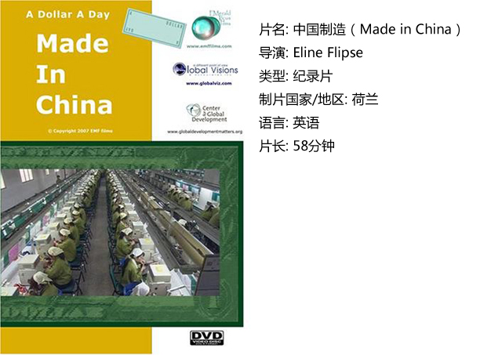
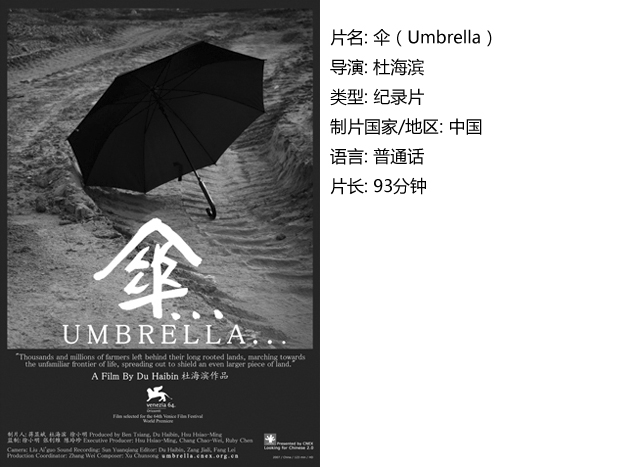
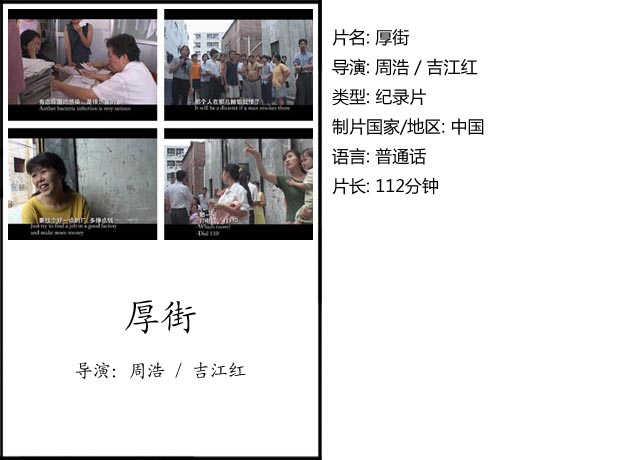

# ＜独立影像＞第十三期：中国式工业殇歌

**对于逝去的生活和慢慢消解的群体，人们总是有着深深不可挥去的怀旧情结，而集中表现在电影中，就变成一种带着伤感与无奈的氛围，对于一个曾经把工业当作重要道路的国家来说，这种氛围尤其明显。**

# 第十三期：中国式工业殇歌

## 影评人 / 马特（北京师范大学珠海分校）

 

对于逝去的生活和慢慢消解的群体，人们总是有着深深不可挥去的怀旧情结，而集中表现在电影中，就变成一种带着伤感与无奈的氛围，对于一个曾经把工业当作重要道路的国家来说，这种氛围尤其明显。

在计划经济体制下，工人曾被当作国家财富的主要创造者，被赋予了国家的主人这样的荣誉感。然而在改革开放之后，不可否认的是这个群体在走向没落，一个以国家意志为主导而产生的群体，随着国家意志的转变而被抛弃。当历史的车轮无情碾压过的时候，我们可以透过影像资料看到这个群体所面对的苦难和他们身上发生的变化。从《二十四城记》、《中国制造》、《伞》和《厚街》这些电影中，我们看到这个群体中的不同的面容，被遗弃之后的落寞，或者无可奈何地勉强坚持，也有那些鲜亮的生命固执地把这当作唯一的希望。或者对他们来说，本来就没所谓希望，只是生存而已。

#### 一、二十四城记

也许对于很多期待着贾樟柯作品的人来说，这部电影其实是略显的有些薄弱的。但毫无疑问，没有任何一个国家像中国这样经历如此快速而猛烈的变化，更没有任何一个人能够像贾樟柯这么深刻地反映出这种变化。如果剥离开导演本身来说，这部影片值得骄傲的一点是讲述故事的姿态，没有从一种事情的发展来讲述，而是真的从人的视角，这在同类影片中很难得，我们看一部这样的影片，不是为了怀旧，因为那旧的也不见得美好。我们只是要记得，记得曾有这样的人，这样的生活。如同电影海报里所写的“集体回忆尘封在时间里的信仰、青春与热情”。

#### 二、中国制造

外国人眼中的中国印象通常带着独特的视角，甚至比中国人自己拍的片子更能深入细节。在全球化情景下，产业链两端的不同生活和不同危机体现在个人身上，形成了鲜明的对比。这并非是谁生活得更好的问题，而是谁可以生存的问题。在发展中国家，人们不得不用一种所谓“蓝蚂蚁》一样的状态来维持生计。可以想象，在中国变成世界廉价工厂之后，会有多少年轻人的梦想变成流水线上的一个零件。这部影片通过讲述两个看起来毫不相干的人的生活，却深刻地反映了全球经济一体化之下的迷惑。人们不得不选择改变，适应改变，却不知为何改变，或者改变的方向是什么。

#### 三、伞

也许在影评家眼里，这部片子还是存在一个明显的问题的，那就是符号化的表现和概念。其实这就会提及到，我们看电影，看得是什么？或者我们想看到什么？通过“伞”这样一个联系，我们看到了一种极其悲感的氛围弥漫在这个国家里。带着阴雨绵绵的失落，我们体验到农民失去土地，人们从事着辛苦而卑微的工作，年轻人看不到希望。也许是导演有意营造的一种情感，在这部片子里，或许在人物身上，我们可以看到一种国民心中最深处的忧虑：没有希望。

#### 四、厚街

珠三角，这片改革开放之后最繁华的土地上，这片最靠近自由世界最先被启蒙的地方，然而我们却可以看到另一番景象。无数的内地贫穷省份的农民工涌到这里，为了生存，或者是梦想，如果他们年轻到还拥有梦想的话。对于这些背离自己土地和故乡的农民来说，那间小小的出租屋里，不知道是不是他们真的想要的归宿。这种生活状态与珠三角大大小小的城中村和成片的出租屋联系起来，成为中国式城市化的别样景象。

 

### **【如何下载】~@_@?~**

**请加入独立影像流动分享群，在群共享中下载本期所推荐的独立电影！**

**流动群群号：94075202 ****入群请注意以下几点哦：**

1.流动群专供北斗读者下载本栏目所推荐的资源，验证身份时请注明“北斗读者”。

2.当期资源自发布后14天内可以下载，到期后工作人员将手动删除以上传后续资源，请注意时间。

3.此群采取流动制，群满员时，完成下载后请自动退群，以便他人入群下载。（但是请注意：只有当群满员时才需要各位流动，现在则无需退群，需要大家流动时会另行通知。）

**DNEY****新人群群号：152511792******

注：DNEY新人群为DNEY独立影像官方交流群，非流动制。DNEY同时为流动群和新人群提供资源，但新人群资源并不一定与本栏目同步。

关于**独立电影**和**DNEY**请参见[<独立影像>第一期：初识独立影像（上）](/?p=11506)，其中的**广告**也要记得看哦！

 

（采编：黄希敏；责编：黄希敏）

 
