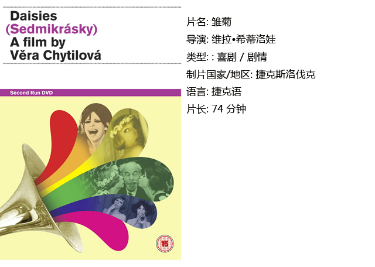
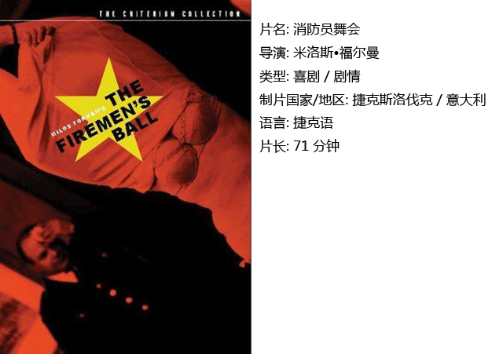
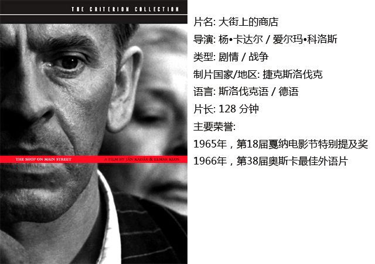

# ＜独立影像＞第十九期：给现实一记耳光

**摘要：在一个强权横行，风声鹤唳的时代，我们到底应该进行消极的不合作，还是“不做黎明不叫的公鸡”，趁热打铁，投机取巧？很多时候，我们卑微得无力抵抗，甚至会被无情碾碎，只因我们有着最基本的人性与悲悯。而那些高高在上的人，总是假装慈悲，他们有着最冠冕堂皇的理由：为了国家；他们喝高了还会叫嚣着：“他们没有酒，他们很穷；我们有钱，而且会越来越有钱！”** 

# 第十九期：给现实一记耳光

## 影评人 / 黄楚涵（武汉大学）

 

二十世纪五十年代末期，东欧经济发展趋于稳健，许多国家的政府进一步开放艺术自由，实行电影小组制度，由此产生了广泛的文化复兴。其中，捷克电影新浪潮在1963至1967年发展到了顶峰。1968年1月，革新派掌控捷共，鼓励言论自由甚至还提出多党执政的可能性，改革呼声不断，人民批评共产党政府、要求工人自我管理……此即“布拉格之春”。这一政治运动对文化事业产生了巨大的影响，但瞬息即逝。1969年春，苏联入侵捷克，保守派中止改革，推行高压政策。布拉格之春中社会批判的影片全部被禁，独立制作的小组模式被废除，恢复了集中管理，要求贯彻社会主义现实主义的创作。顷刻间摧毁了新浪潮运动，许多导演被迫远走他乡。

时至今日，再度回望那些在夹缝中生存下来的新浪潮电影，我们可以发现它们都有着无与伦比的创新技术和深厚内涵。接下来要介绍的三部电影并不能涵盖所有优秀的捷克新浪潮电影及电影风格，但它们一定是其中的佼佼者。 一、 雏菊

看完整部电影，你的眼睛可能被不断更换的滤镜颜色亮花了眼，最后呆呆地盯着那片模糊的废墟上打出的一行字——“献给所有精神生活完全一团混乱的人”；你可能也会觉得，自己的某一部分被这场疯狂难懂的行为艺术给改变了。

导演维拉•希蒂洛娃自嘲说这部电影是“粗俗与滑稽的哲学文献”。其实她的意思是粗俗与滑稽只是表象，剥开达达主义的外壳，你看到的是最严肃的命题。“既然这个世界已经如此糟糕，我们何不让它变得更坏。”两位女主角心里装着雏菊和原野，却难以变成虚伪的圣女。她们在餐厅捣蛋，勾引老男人，骗吃骗喝，偷钱，在自己的房间大搞破坏……有人称之为“向上的堕落”。你或许无法理解，或许无法认同，但这就是她们选择的抵抗方式，用一切反传统、反规则的方式去抵抗机器、男权、无聊，和越来越糟糕的世界。

在那个没有电脑技术的时代，无从得知这些夸张而才华横溢的画面处理技术从何而来。这些在今天看来依然无比先锋的手法让人目瞪口呆：场景的切换，画面的颜色天马行空……但细细分析，诡异的影像之下依然有一条精巧的逻辑。

据说这部电影被批判的原因是因为“浪费太多食物”，这具有社会主义特色的吝啬与愚蠢让人实在是捧腹不已。布拉格之春被强权粉碎之后，导演一直被禁止工作到70年代中期，其中的悲哀、愤怒与废墟中的人性光辉早就可以在她这部杰作中窥见全貌了。 

二、消防员舞会 

人们可能对米洛斯•福尔曼后来在好莱坞的作品更为熟悉，《飞越疯人院》、《莫扎特传》等等都受到了奥斯卡的肯定。但实际上，福尔曼到了美国之后，在一个较为宽松的环境和更为成熟的体制下，电影风格也变了许多。 本片是他离开捷克前的最后一部作品，政治色彩比前两部新浪潮代表作《黑彼得》与《金发女郎之恋》浓重许多。这是一部举重若轻的讽刺喜剧，格局虽小，深度不减。

这是一场为欢送身患重病的老局长举办的舞会，各种怪事层出不穷：灭火器无法灭火、奖品莫名其妙地一件件消失、只能找到几个相貌平庸的消防小姐为局长颁奖，莫名其妙发生了火灾，消防员却往大火上铲雪……我们还可以看到消防员委员会的高层都是一群办事笨拙效率低下的蠢蛋。

短短一个小时，导演就勾勒出社会主义的真实模样——匮乏与虚伪。在一个不切实际的社会理想光环下，真实的生活匮乏物质、匮乏效率、匮乏性，甚至匮乏一个心灵的家园。虽然电影给出了人希望的理由——人性不会泯灭。但那句让“党的总书记和共和国总统”安东宁•诺沃提尼勃然大怒的经典台词：“荣誉比正直重要！“又使人不禁浮想联翩。一个恶体制，一群为了一层脸皮而选择不断欺骗的无能官僚，一个文化贫瘠、道德沦丧的社会，放在今天，依然是一记响亮的巴掌。 

三、大街上的商店 

相比起前两部的超现实，这部电影偏向一种平铺直叙的写实，但仍不缺讽刺与唏嘘。

电影背景设置在1942年，纳粹入侵捷克斯洛伐克之时。与人们想象中的场景不同，恐惧隐藏在日常生活的表面之下，前半部分导演甚至用一些喜剧的元素来消解观者对即将到来的灾难的紧张情绪。镜头冷静旁观了这样一个时代背景下小人物的命运，以影射当时的欧洲与捷克。平凡的木匠从纳粹军官妹夫那里接手了一家犹太老人开的商店，老太太耳聋且生活凄苦，出于善心和亲犹好友的规劝，他瞒着老人做她的助手，欺骗自己虚荣的妻子，告诉她自己当上了店主，并赚了很多钱。然而，纳粹的猖狂气焰逐渐吞噬这个平静的小镇，小人物的内心在同情心与屈服的恐惧之间摇摆，最终，他与老人在狭小的商店里产生了巨大的冲突……

在一个强权横行，风声鹤唳的时代，我们到底应该进行消极的不合作，还是“不做黎明不叫的公鸡”，趁热打铁，投机取巧？很多时候，我们卑微得无力抵抗，甚至会被无情碾碎，只因我们有着最基本的人性与悲悯。而那些高高在上的人，总是假装慈悲，他们有着最冠冕堂皇的理由：为了国家；他们喝高了还会叫嚣着：“他们没有酒，他们很穷；我们有钱，而且会越来越有钱！”

尽管杨•卡达尔和爱尔玛•科洛斯的合作拍片生涯远在新浪潮诞生前便已经开始，但他们依旧因为在五六十年代的几部批判性和革新性的作品被认定为这个运动中的一股中坚力量。影片中，他们依然给出了希望：主角的梦境中，出现了象征纯洁自由的白蝴蝶，在阳光灿烂的日子里，他与老人穿着最漂亮的衣服，走在充满宽恕、平静的林荫大道上，纳粹好大喜功的纪念碑，最终只是消失不见的愚蠢的巴别塔。 

 

### **【如何下载】~@_@?~**

**请加入独立影像流动分享群，在群共享中下载本期所推荐的独立电影！**

**流动群群号：187213480(新群)****入群请注意以下几点哦：**

1.流动群专供北斗读者下载本栏目所推荐的资源，验证身份时请注明“北斗读者”。

2.当期资源自发布后14天内可以下载，到期后工作人员将手动删除以上传后续资源，请注意时间。

3.此群采取流动制，群满员时，完成下载后请自动退群，以便他人入群下载。（但是请注意：只有当群满员时才需要各位流动，现在则无需退群，需要大家流动时会另行通知。）

关于**独立电影**和**DNEY**请参见[<独立影像>第一期：初识独立影像（上）](/?p=11506)，其中的**广告**也要记得看哦！

 

（采编：黄楚涵；责编：黄希敏）

 
