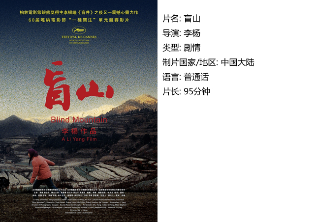
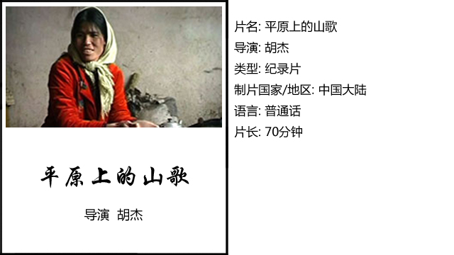
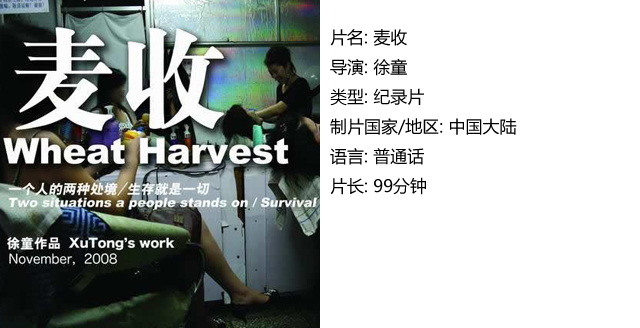
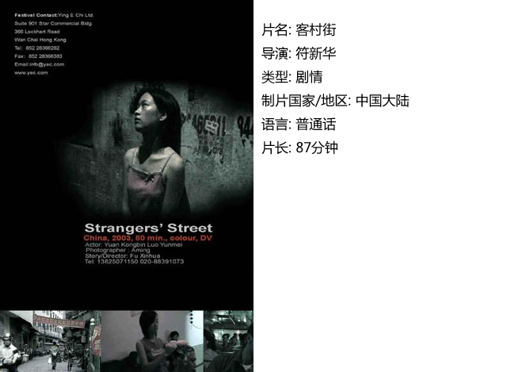

# ＜独立影像＞第十二期：她无此意，奈何卑微

**原本是和你我一样的大学生，梦里还是对未来的憧憬，醒来却发现已是冰火二重天，只是某个不开化的乡村的一个老农民的性奴了。当这个世界上，本应成为我们最受赞誉的母亲，在某种程度上却只是性的工具，这是不是女性的悲哀？往前走一步，贵为人妻，在丈夫的呵护下，是孩子的母亲，每个母亲的都是高贵的、伟大的。而退后一步，在买家眼里只是床上的工具，没有尊严，没有自由。**  

# 第十二期：她无此意，奈何卑微

## 影评人 / 于婷（ciae）

若你是白雪梅，我不想问你你会怎么办？我只想问你，你会怎么想？若是落到那步田地，你会是何种想法？

原本是和你我一样的大学生，梦里还是对未来的憧憬，醒来却发现已是冰火二重天，只是某个不开化的乡村的一个老农民的性奴了。当这个世界上，本应成为我们最受赞誉的母亲，在某种程度上却只是性的工具，这是不是女性的悲哀？往前走一步，贵为人妻，在丈夫的呵护下，是孩子的母亲，每个母亲的都是高贵的、伟大的。而退后一步，在买家眼里只是床上的工具，没有尊严，没有自由。

这些似乎就是集合在女性身上的种种。我们不能否认，若是论性别差异，男性比女性更为强壮，无论是在母系社会还是如今。自然属性上，女性都是弱势的，更何况是纠缠到性的时候。那些荷尔蒙和体力的较量中，我想谁是胜者，一目了然。

洛阳性奴案，很多人对其态度是哀其不幸，怒其不争，而我想问的是，若你是那四位女性，你会做何选择？或许很多人和我说，运用智慧的力量，逃出魔窟，不能迫于其淫威，要反抗。我想，说出这话的人，定不会是一个推己及人的人——因为，他忽略了她们实际的条件。

这个是一位前辈和我说的——若是你不加思考就对他人的生活下定论，那唯一能证明的就是你根本没去考虑他们的生活，你只看到了他们的错误，看到他们的弯路，却未曾考虑他们为何走到那一步？你只看到她们今日的悲哀，却未曾料想，若不是现下此种悲哀，或许会是一种更大的悲哀？她们今日的生存状态，在你看来极其卑微，可昨日她们未必就是卑贱之人。更何况，卑微的在这个世界上生存本身就是一种挣扎。有时，那种在尊严和无尊严边界上的挣扎，比那些在上层奋斗更为艰难。更可况这种挣扎，有多少人能给出哪怕一瞥的理解呢？

在我们这样的国度，因为地域和经济的差异，贩卖妇女的案件大有愈演愈烈之势，而每每看到电视上被解救的妇女那已经麻木没有泪水的脸庞，我更多的是默然无语。因一时轻信落入虎穴，因为家人牟利，因为朋友欺骗……不幸之人各有各的不幸。因为弱势，所以难以自救；因为性别，所以买卖有需求；因为社会群体差异，难以寻求他人的帮助；更是因为文化问题，她们被贩卖后不仅肉体上饱受摧残，精神上的折磨更甚。而因我们的传统文化之故，被解救后她们如何生活？生活和原来完全脱节，我们如何去理解她们的无助，对她们的下半生，我们还会以一颗平常心看待吗？这就仅仅因为她们是女性，便不幸遭遇了这一切……

对于沦为性工作者（原谅我用这个词语，而不用*女一词）的年轻女性。我想起幼时，叔叔抱我经过本地一条街几位小姐招呼我们时，叔叔那一脸愤怒，并且抱我疾走的样子。那时给我的印象她们不是好人，年龄越大我对她们多了一层认识，或许有些时候她们也只是做出自己的选择。我们看重尊严和名誉，她们看重金钱和面子，我们开始就被教育尊严是最重要的，要凭借自己的努力来得到自己梦想的生活。我们接受教育并凭借受到的教育我们过着我们习以为常的生活，而她们呢？出生在贫寒之家，父母无力支持她们去读书，身无长技，又要生存，更甚者还要扶持贫困的家庭，除了卖自己，还有什么方法用更快的方法获得钱，获得那些所谓梦想的生活呢？

并不是她们天生就注定要卖的，也不是出生就是从事这个行业的，都是一步一步走来的，或许有人责备她们，都是她们自己选择的。可是，我想问，若是你，每每在别人鄙视的眼光里贫穷悲哀的生存，是不是也想通过某种方式改变呢？若是你，周围村庄的女性伙伴通过这一行家里都改建楼房了，其家长也在炫耀家里的富裕，你的父母还住在小土房里，父亲卧床不起无钱就医，你能怎么选择呢？

被贩卖是因为就是弱者，沦为性工作者，是自愿的吗？只是她们按照她们受到的教育做出的选择而已，社会给她们什么样的条件，她们就在什么条件下成长，社会给予她们什么教育，她们就学会了什么。当社会教给她们虚荣，就学会了虚荣，当社会教给了无奈，就学会了无奈的选择，当社会不伸以援手，她们只能卑微的生活。在某一定意义上，她们都是被迫的，即便自己选择也是被迫选择的，这就是卑微女性的卑微生活，社会啊，唉。

#### 一、盲山

白雪梅一觉醒来，已经明白不再会有大学生的生活了，被面善的赵姐拐卖到了举目无亲的小农村，沦为了性奴。

要逃跑，似乎是不可能，因为封闭的乡村，无人相助，一个弱女子，能怎么做呢？坚持逃离还是了此一生?

若是你是白雪梅，在这种绝境，会想些什么，又会做些什么呢？

#### 二、平原上的山歌

小佳被人从云南拐卖到了山东某农村，那年她仅有十七岁，却成了某个男人的妻子。她一直梦想回到自己的故乡——云南，十年后她终于回到了故乡，可是她却又选择回到丈夫身边。唱了一下午的山歌之后，她如何做出了这样的选择？她的苦楚和无助又有谁可以理解——或许只有歌声吧。

#### 三、麦收

麦收时节，她回到了家，她是个普通的农家女儿；而回到城市里所谓的工作岗位上，她只是个妓者，两种情景，两种生活，两种人格，两种不同之间，她的内心在想些什么？

在两种生活之间来回挣扎的人，她们也有自己的苦楚和感触啊，可是这个社会又会给她们多少机会呢？或许有些人的生活只是压抑的挣扎。

就如同那阴雨连绵的麦收天，纠结啊……

#### 四、客村街

声讯男和发廊女之间是友谊？还是爱情？相同的生存背景才会有那种相互之间的了解。

这个社会上，或许真正的理解和友情更多是在相同境况下的人身上发生的。是的，声讯男和发廊女都很卑微，卑微到甚至消失后，都不会在那条街上留下些什么，连一点印痕都没有。

 

### **【如何下载】~@_@?~**

**请加入独立影像流动分享群，在群共享中下载本期所推荐的独立电影！**

**流动群群号：94075202 ****入群请注意以下几点哦：**

1.流动群专供北斗读者下载本栏目所推荐的资源，验证身份时请注明“北斗读者”。

2.当期资源自发布后14天内可以下载，到期后工作人员将手动删除以上传后续资源，请注意时间。

3.此群采取流动制，群满员时，完成下载后请自动退群，以便他人入群下载。（但是请注意：只有当群满员时才需要各位流动，现在则无需退群，需要大家流动时会另行通知。）

**DNEY****新人群群号：152511792******

注：DNEY新人群为DNEY独立影像官方交流群，非流动制。DNEY同时为流动群和新人群提供资源，但新人群资源并不一定与本栏目同步。

关于**独立电影**和**DNEY**请参见[<独立影像>第一期：初识独立影像（上）](/?p=11506)，其中的**广告**也要记得看哦！

 

（采编：黄希敏；责编：黄希敏）
