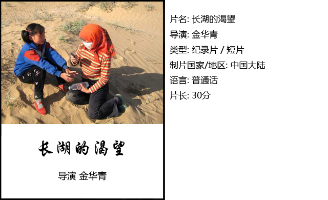
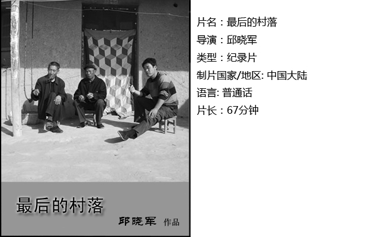
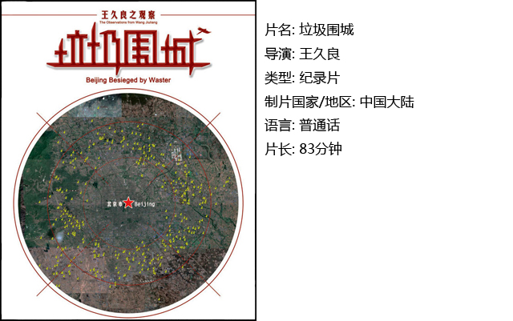
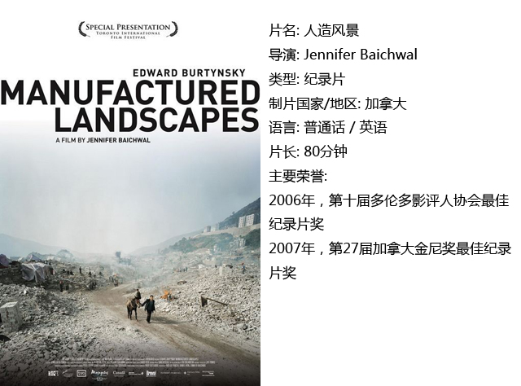

# ＜独立影像＞第十五期：消逝的净土，破碎的根

**光鲜的城市也少不了新陈代谢的产物，垃圾经过简单的处理，有时是人工的分类，便来到城外被掩埋，这是政府现在想到的处理垃圾的唯一办法。壮观的垃圾孤独地躺在土地上，河中央，甚至形成了漂浮的草原，在雾蒙蒙的天空下，仿佛世间最苍凉的叹息。拾荒者们在这里用手、钳子、锄头和钉耙寻找他们的“首都梦”；动物被赶到这里进食，这儿是它们的肥美的草原；乌鸦成群地在垃圾山上停留，好似希区柯克的《群鸟》，控诉着人类对自然的破坏，警告他们后果自负。**  

# 第十五期：消逝的净土，破碎的根

## 影评人 / 黄楚涵（武汉大学）

 

中国工业化五十年，近三十年的改革开放使其全面加速，我们享受着进步的同时却发现可能失去的更多。人们总是对一块处女地一拥而入，像强盗一样掠夺完所有再拍拍手走向下一个。

一块又一块的净土消失了，一些人的生存受到威胁，此时才想起要“可持续发展”、“坚持贯彻科学发展观”……然而，这样的口号在耳边反复被唠叨着，成为更加空泛的口号。提出口号的人、听惯口号的人也更加的麻木不仁。最后，那些环境难民们，面临家园的消逝，成了一片片浮萍，没了根，不知何去何从。

我的一位老师曾经说他一直在思考一件事，就是改革开放使我们成为了怎样的人。我想，我们需要思考的不仅仅是人，还有人类的生存环境、人与自然以及与历史的延续的联系。纵使我们有宏伟的建筑、高耸的大厦，能够在机器平滑快速运转中拥有先进便捷的生活，没有了小鸟啾啾，花草树木，没有了根基与灵魂，那也是虚假速朽的繁荣。

是时候好好反省因为自私与自傲而犯下的错误了。

#### 一、长湖的渴望

“大海里有什么？我想象不出来。”

“那里应该有很多东西吧，兔子啊什么的，老鼠啊，刺猬啊，鸟啊……”

这是纪录片《长湖的渴望》中孩子们的一段对话。

长湖曾经是湖，是沙漠中的绿洲，导演并没有明指沙漠化的原因，只是用字幕打出真实得震撼人心的数字与事实，拍摄下眼前的漫漫黄沙和孤零零的灌木，在大背景下截取了冬冬一家人的生活片段，记录家庭的困苦、内部的矛盾与在搬迁和留守之间的抉择。他们是在恶劣环境中挣扎的小人物，无奈地承受环境恶化的后果，而长湖的渴望，仅仅是孩子课本上的“春回大地，万物复苏，柳绿花红，莺歌燕舞”。

#### 二、最后的村落

煌辉村的青土湖同长湖一样，都属于甘肃省民勤县。在这“最后的村落”中，只剩下一家人在坚守，他们说自己是生态难民，但依然难离故土。

导演邱晓军走访了原煌辉村的几户居民，摄像机静静地立在那里，倾听他们琐碎的对话——唠叨着生活怎样得艰辛，新居蔡旗新村不如以前的家，政策和他们的生计有着很多矛盾。有人无奈，思忖着何时再搬回去；留守的人不舍童年那芦苇、水鸭子的美好时光，能勉强维持生活就“畅快了”；还有人心中仍有希望，认为“人进沙退”，只要人们愿意留下，采取有效的措施，与风沙搏斗，他们的家园便不会消失，就像他们种下的向日葵田，可以顽强地向阳生长。

与此同时，从对话里断断续续透露出政府的一些作为，如果他们依然为了政绩剥削这些受苦的人们，仅仅是一部纪录片和少数人的关注能够真正帮助到他们吗？

#### 三、垃圾围城

从西北的大漠走到看似生机勃勃的首都，景观不同了，却是另一种触目人心。

导演王久良在2008到2010年间走遍北京城外将近五百个垃圾填埋场，拍摄下将近10,000张照片，60小时的录像，他在卫星图上用黄色的点代表这些填埋场，图片上的北京显然已经被垃圾包围了。

光鲜的城市也少不了新陈代谢的产物，垃圾经过简单的处理，有时是人工的分类，便来到城外被掩埋，这是政府现在想到的处理垃圾的唯一办法。壮观的垃圾孤独地躺在土地上，河中央，甚至形成了漂浮的草原，在雾蒙蒙的天空下，仿佛世间最苍凉的叹息。拾荒者们在这里用手、钳子、锄头和钉耙寻找他们的“首都梦”；动物被赶到这里进食，这儿是它们的肥美的草原；乌鸦成群地在垃圾山上停留，好似希区柯克的《群鸟》，控诉着人类对自然的破坏，警告他们后果自负。

然而这个巨大的工地发展的脚步永不停歇，垃圾扩张的脚步亦不停歇。人们甚至在垃圾场边建起高楼，准备与自己制造的肮脏混乱为伍。他们似乎并不关心眼前的土地与水源遭受毒害。这是无奈，还是无知？

#### 四、人造风景

如果说《垃圾围城》是对工业的一点进行纵深解剖，那么《人造风景》记录的就是一个横截面上的一条条伤痕。

导演Jennifer Baichwal与工业摄影师Edward Burtynsky共同完成了这部纪录片。他们走过了福建的工厂、回收工业垃圾的乡村、三峡大坝、天津煤矿基地，还有上海的富裕人家与穷人弄堂。导演动态的录像与摄影师静态的照片结合，中间穿插着Burtynsky的拍摄过程，在TED的演讲，适当地增加了拍摄者的观点，还有照片展览的情况，那些仔细看着照片的观者似乎与我分享着同样的心境。

钢筋水泥的森林与废墟，庞大复杂的工业器械，熟练操作的廉价工人，被迫毁掉自己房屋的居民，刺耳的音乐仿佛金属的哀鸣……我似乎看到了50年前安东尼奥尼在《红色沙漠》中所拍摄的各式各样的工业怪物、烟尘污染，以及渺小的人物异化的行为。

正如Burtynsky所说，这没有对错。他们不是为了告诉我们对错，只是通过展示现实来引人深思——我们是否愿意为了不断地前进而永远地离开青山绿水，活在自己制造出来却最终无法控制的“人造风景”中？

 

### **【如何下载】~@_@?~**

**请加入独立影像流动分享群，在群共享中下载本期所推荐的独立电影！**

**流动群群号：94075202 ****入群请注意以下几点哦：**

1.流动群专供北斗读者下载本栏目所推荐的资源，验证身份时请注明“北斗读者”。

2.当期资源自发布后14天内可以下载，到期后工作人员将手动删除以上传后续资源，请注意时间。

3.此群采取流动制，群满员时，完成下载后请自动退群，以便他人入群下载。（但是请注意：只有当群满员时才需要各位流动，现在则无需退群，需要大家流动时会另行通知。）

  

关于**独立电影**和**DNEY**请参见[<独立影像>第一期：初识独立影像（上）](/?p=11506)，其中的**广告**也要记得看哦！

 

（采编：黄希敏；责编：黄希敏）

 
