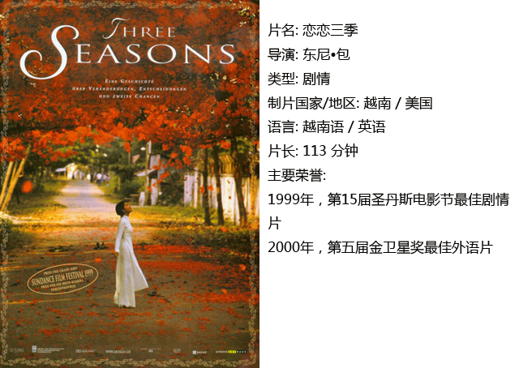
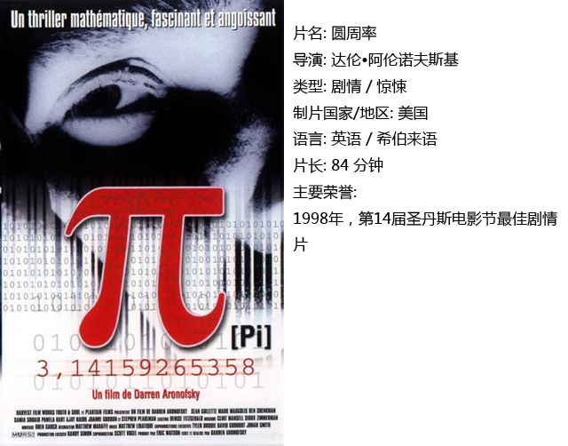
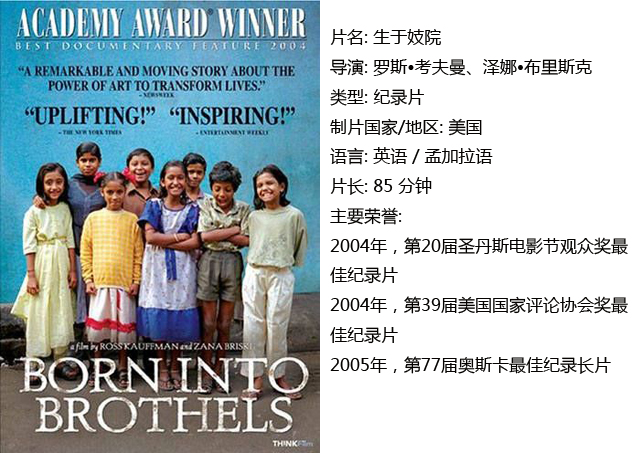

# ＜独立影像＞第十八期：圣丹斯面孔

**这部电影更大的社会意义在于，正因为这段记录，美国诞生了一个叫做“Kids with Cameras”的公益组织，专门帮助那些和影片中的孩子们有类似命运的孩子。由此，电影作为媒介从展示、剖析真实向切实改善弱势群体的境况大大地迈了一步。**  

# 第十八期：圣丹斯面孔

## 影评人 / 赵恺（黑龙江科技学院）

 

从圣丹斯的尴尬说起：1969年，好莱坞八大电影公司之一的二十世纪福克斯发行了一部西部片《Butch Cassidy and the Sundance Kid（虎豹小霸王）》，以其幽默潇洒的风格轰动一时。十五年后，饰演“sundance kid”的罗伯特雷德福一手创办了“圣丹斯电影节（sundance film festival）”。至此以后，每年1月18日到28日，美国犹他州的帕克城都会举行一场电影的盛会。颇具讽刺意味的是，电影节的诞生却是为了鼓励独立电影人创作，抵制好莱坞大制片厂的体制及其僵化的类型片。

虽然资金问题对独立电影人限制较大，电影也缺少制作、发行的渠道，但由于参展的独立电影没有旧制片体制的束缚，常常能够创造出独树一帜的手法与风格。因此，相较于好莱坞，圣丹斯电影具有更强的包容性。

如今，经过20多年的发展，圣丹斯电影节如今已经成为北美乃至全世界最大的独立电影节和独立电影交易市场,创造了诸多独立电影的商业奇迹。不少从这里崛起的电影人如今已是好莱坞炙手可热的大腕和奥斯卡的座上宾，所以从某种程度上来看，圣丹斯电影节是从小众通向主流的一块跳板。但正是由于好莱坞不断伸来的橄榄枝，也让近年来的圣丹斯电影节受到一些诟病。

不管怎么说，圣丹斯电影节的参展电影进一步的丰富了电影市场，这是它对电影世界的重大贡献。对于初出茅庐的电影人来说，这里是他们开启电影事业最好的起点；对于好莱坞来说，圣丹斯电影节是最好的后备力量；对于电影这一门艺术来说，圣丹斯电影极大地延伸了艺术的表现形式和内涵。下面推荐三部圣丹斯获奖电影，这三部电影风格迥异，恰是圣丹斯多元性中的三张不同面孔。

#### 一、恋恋三季

这部电影给人这样一种感受：眼前就总像蒙着一层薄纱，朦朦胧胧的看到白丝绸包裹着女性婀娜的身姿款款走来。扯掉薄纱揉揉眼睛，又能看到那场战争给人们带来的深重的创伤。

故事聚焦在三组人身上，采莲的少女和患绝症的诗人、三轮车夫和他所暗恋的妓女、在越南寻找女儿的美国人和贫困的小贩。“莲花”蜻蜓点水般的出现，巧妙地串联起了这三组人物。导演用平行交叉的叙事手段讲了这三个打动人心的故事，每个人物的故事都心酸却不悲苦，每个故事的结束都给人一种充满希望的感觉。

本片导演东尼包和著名越南导演陈英雄一样，是美裔越南人，这部电影是他的处女作。越南电影产量很低并且多为与欧美的合拍片，这部《恋恋三季》就是越南与美国的合拍片。

#### 二、圆周率

许多人可能对《黑天鹅》优雅与黑暗并存的风格十分熟悉。实际上，早在1998年，初出茅庐的达伦阿伦诺夫斯基就凭《圆周率》这部风格晦涩怪异的黑白片在圣丹斯一鸣惊人。

主角是个孤僻的数学天才，他相信万物皆可由数字解释，期望通过研究股票市场找到一个最终的规律。在饱受药物依赖、各种幻觉的折磨的同时，还与犹太教的信徒、想利用他的才能赚钱的商人有着剪不断理还乱的关系。

超现实的隐喻、精神分裂、孤独、偏执、绝望、疯狂，这部处女作充满着导演的个性符号，许多场景凌厉的剪辑甚至可以窥见后来的巅峰之作《梦之安魂曲》的影子。关于宇宙是否有一个永恒的规律，所有事物是否都是一串数字的外壳，相信每个人都有不同的看法，或许未来的科技可以对这个终极命题做出解答。而从来不是理性主义者的我还是相信，在一个混沌的世界里，人内心复杂的感受是永远无法用数字解释的。正如主角的老师所说的：“古代日本人认为棋盘就是一个缩小的世界，当它是空的时候，简洁而有序，然而下棋的时候，可能性是无限的，不会有两盘棋是一样的……所以棋盘其实体现了，无穷复杂的世界。”

#### 三、生于妓院

这部纪录片用粗粝的镜头和独特的视角呈现出加尔各答红灯区孩子们的生活状况。电影开始展现的是红灯区脏乱差的环境，生活在这里的孩子们的未来是灰暗无望的。但当一位摄影师介入这群孩子的生活之后，一切开始改变。她教孩子们学习摄影，用这些孩子们的作品举办影展筹集资金，并为这些孩子争取上学的机会，让这些孩子们的命运渐渐摆脱了贫穷和肮脏。

因为导演就是片中的摄影师，这部纪录片可以归类为梅索斯兄弟开创的“直接电影”这一类型。纪录片的创作者直接参与到了影片的真实中并且影响到了被拍摄者，二者之间产生的化学反应也成为影片的一部分，因此这部影片有非常强的感染力。

另外，这部电影更大的社会意义在于，正因为这段记录，美国诞生了一个叫做“Kids with Cameras”的公益组织，专门帮助那些和影片中的孩子们有类似命运的孩子。由此，电影作为媒介从展示、剖析真实向切实改善弱势群体的境况大大地迈了一步。

 

### **【如何下载】~@_@?~**

**请加入独立影像流动分享群，在群共享中下载本期所推荐的独立电影！**

**流动群群号：187213480(新群)****入群请注意以下几点哦：**

1.流动群专供北斗读者下载本栏目所推荐的资源，验证身份时请注明“北斗读者”。

2.当期资源自发布后14天内可以下载，到期后工作人员将手动删除以上传后续资源，请注意时间。

3.此群采取流动制，群满员时，完成下载后请自动退群，以便他人入群下载。（但是请注意：只有当群满员时才需要各位流动，现在则无需退群，需要大家流动时会另行通知。）

关于**独立电影**和**DNEY**请参见[<独立影像>第一期：初识独立影像（上）](/?p=11506)，其中的**广告**也要记得看哦！

 

（采编：黄楚涵；责编：黄希敏）

 
