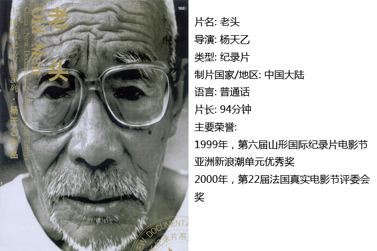
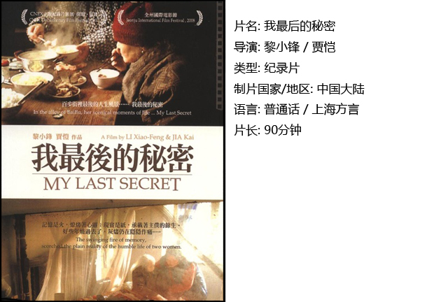
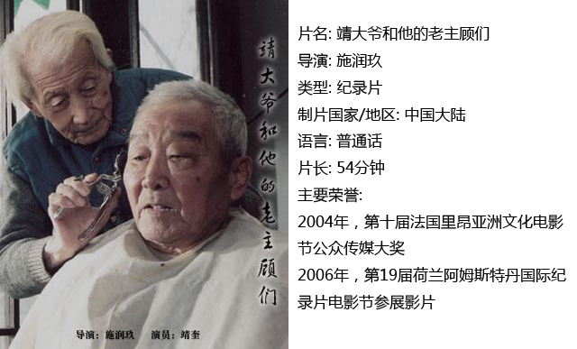

# ＜独立影像＞第十六期：最后一缕夕阳

**如果说每个人的衰老都是不可停止或者逆转的，那么人们都会在老年人的身上看到自己的未来。几度浮沉，华年已逝，生命走到了末端，人生的起起落落沉淀了下来，如同平静的潭水，不起波澜，却倒映出世界的影子。**  

# 第十六期：最后一缕夕阳

## 影评人 / 马特（北京师范大学珠海分校）

 

如果说每个人的衰老都是不可停止或者逆转的，那么人们都会在老年人的身上看到自己的未来。几度浮沉，华年已逝，生命走到了末端，人生的起起落落沉淀了下来，如同平静的潭水，不起波澜，却倒映出世界的影子。

无论在何种文化中，老年人都被当作经验与智慧的象征，在信息依靠口口相传的年代，年长是一种荣誉。然而在当代这个急躁的信息化时期，人们已经没有多少耐心去聆听那些温和的诉说与指引。人们迫不及待地获取结果，想知道“是什么”，而不愿去领会老人描述的“为什么”。这恐怕是一种无奈，而这种无奈在电影中会被表现的更加深刻，我们通过《老头》、《我最后的秘密》和《靖大爷和他的老主顾们》三部电影，可以去慢慢领会导演想要表现的那种淡淡的哀伤，那种夕阳无可奈何落去的凄美。

一、老头

电影之所以能引起观众心中的共鸣，是因为它会表现普通人的故事，我们身边的故事，或者我们眼中的故事。这部电影通过旁观者的视角平静地描述了一群北京平凡老年人的日常生活。平淡，非常的平淡，然而这却是影片表达出来的特有的魅力，因为这就是我们身边人的生活。作为一位女导演的第一部作品，从拍摄手法上来说还略显生涩，但是导演对于影片节奏的把握和对于气氛的渲染却非常精准。值得一提的是在描写死亡的时候，在老人濒死前的时刻，那种让人窒息的压抑感之后，却是死亡降临的解脱。导演正是通过对这样一个宁静、略带伤感却还有丝丝温情的死亡的描述，给我们一个

无奈与失落之后，却还有安慰的故事。

二、我最后的秘密

如果说人最大的智慧在于如何安排自己的死亡，那么无疑这部影片正式促使每个人不得不进行这样的思考。死亡对于每个老人来说都是无法不去考虑的事情，然后在这种对于死亡的考量中，也让老人与周围的人产生了一种微妙的关系。

在这部影片里，导演给我们呈现的是一个不平凡经历的老人，如何在死前为人们展现她毕生总结的智慧的。她早已看穿了一些亲人的虚伪，也把和保姆之间的那种情感升华为了一种惺惺相惜。恐怕也正是因为如此，这部电影没有落到好人好报这样俗套的情节上，而是给人们带来一种新的思绪，一种超越金钱，甚至超越情感的东西。

作为一部拍摄时间跨度长达七年的作品，这部电影本身就带着对人性的反复的思索。

三、靖大爷和他的老主顾们

一位老人为其他的老人剃头，再一位一位送走他们，这种亲身体会生命终结的过程是极其震撼的，在这种对于死亡的平和中，不仅仅是勇气，更多的是一种对生命的感悟。对于剧中的老剃头匠来说，剃头已经不仅仅是一种生意，更多的是一种仪式，平静甚至是欣慰地送走熟悉的人到世界的另一端，任何仪式感最后体现的都是对于人的尊重和对自然规律的敬畏。在这个过程中，老剃头匠不仅仅是在送走别人，也是在送走自己。

人们常说人生如戏，走到最后一步，就是真的入戏了。

 

### **【如何下载】~@_@?~**

**请加入独立影像流动分享群，在群共享中下载本期所推荐的独立电影！**

**流动群群号：187213480(新群) ****入群请注意以下几点哦：**

1.流动群专供北斗读者下载本栏目所推荐的资源，验证身份时请注明“北斗读者”。

2.当期资源自发布后14天内可以下载，到期后工作人员将手动删除以上传后续资源，请注意时间。

3.此群采取流动制，群满员时，完成下载后请自动退群，以便他人入群下载。（但是请注意：只有当群满员时才需要各位流动，现在则无需退群，需要大家流动时会另行通知。）

  

关于**独立电影**和**DNEY**请参见[<独立影像>第一期：初识独立影像（上）](/?p=11506)，其中的**广告**也要记得看哦！

 

（采编：黄希敏；责编：黄希敏）

 
