# ＜独立影像＞第十四期：我在马赛捡回一部纪录片

**一个不服输老头的独角戏。他不服人、不服社会、不服历史、不服体制、不服命理、不服周遭的一切，甚至不服自己。历史与现实的威逼下，每一次的韧性处境，与他每一次的勇敢担当。**  

# 第十四期：我在马赛捡回一部纪录片

## 导演 / 单佐龙（同济大学）

  编者：本文记叙了导演本人在法国马赛与法国剪辑师Axelle合作，对电影《借我一生》进行后期剪辑时的感悟。由于版权原因，本栏目并不提供电影下载而是提供在线观看。 在线观看方式： 

1.进入豆瓣DNEY小站 http://site.douban.com/135954/room/1171858/”；

2. 在社区首页标注「喜欢」，获得参与社区互动的权限；

3. 在“On-line 体验馆”中参与投票，投票项目至少选择「想看」；

4. 等待社区管理员发送密码至你的豆邮；

5. 点击“On-line 体验馆”下方“I'm watching”条目下电影《借我一生》的链接，之后输入视频密码即可实现影片在线观看。

如有疑问请在独立影像流动分享群（群号94075202，验证为“北斗读者”）向管理员咨询。 另外，如果在DNEY豆瓣小站《借我一生》版块写影评或观后感，就有机会免费获得导演亲笔签名DVD，免费的哦亲！ 

#### 导演简介：

单佐龙，24岁，同济大学纪录片硕士在读。

杭州亚洲青年电影节（HAFF）节目策划。

2011年入围第61届柏林国际电影节第9届天才训练营。

2010年《大众DV》杂志“鼓舞2010”DV年度人物，获得2010罗中立奖学金。

创作纪录片《借我一生》、《虹桥弄》曾获上海电视节MIDA导演计划优胜提案奖、北京大学生电影节短片竞赛单元评委会特别奖以及东京国际录影节佳作奖等，并入围维也纳国际电影节、意大利罗马亚洲电影节、贝加莫国际电影会议、汉诺威国际青年电影节以及台湾华语电影论坛等国内外影展并作为荷兰Movies That Matter电影节闭幕电影。

纪录片项目《陌上桑》入选柏林国际电影节天才训练营纪录片工作站（Doc Station）与欧洲纪录片联盟发起的CB国际纪录片跨界工作坊。

#### 正文：

凌晨一点。

楼下又扫过去一辆车，整个房间都被震得像要塌下来一般。

关灭桔黄色的灯，踩着离壳响的螺旋楼梯，锁上沉重得几乎快要把我推倒的门，穿过电车清脆的铃音，我徒步在马赛街头，脑海里仍然满占着看了一天的素材。

**缘起**

2011年2月18日—3月5日，我受MIDA导演计划的资助，到法国马赛进行了我的纪录片《借我一生》的后期剪辑工作，主要是制作一个国际版本。这是上海文广新闻传媒集团纪实频道与法国ICTV SOLFERINO公司联合制片的“上海故事”项目的其中一部。

这两周时间我与法国剪辑师Axelle的合作令我受益颇多。她本人对电影和剪辑的理解促成了我对“剪辑”的重新认识，让我真正地“捡”回了一部纪录片。

**剪辑师的角色**

在正式开始剪辑之前，Axelle非常认真并明确地给我仔细说明了剪辑师之于纪录片本身和导演两者的关系。

她说，剪辑师很多时候都是一个更为冷静的角色，她对即将投入剪辑的这部影片首先是没有丝毫的感情的，也许导演已经成为了纪录片的一部分，但是剪辑师永远都只能是那个出跳在外围的角色。剪辑师事实上扮演着类似于这部纪录片另外一个冷眼旁观的“导演”角色，客观地熬制着这部片子。

剪辑师是用来帮助导演说出他想说的故事的那个人，但是故事能被“逼出”到什么程度，还是不确定的因素。导演期望得到的成片形态和最终能够剪辑出来的成片形态也是两回事，这其中的差异程度取决于影片素材中导演本身的控制力，导演与剪辑师的沟通有效度等等多种因素。

她还说到，事实上，一批素材所对应的那部片子就在那边，在成片出来之前，我们只是不知道他确切所在的位置，而我们所要做的工作，就是通过剪辑去准确地“投掷”到那部片子，必须不偏不倚正好找到那个唯一的仅有的生长点。

另外，我们的工作又全都是基于导演与剪辑师的有效合作的，我们始终是一条心的，就像孤岛寻宝，我们之间必须拿出十二分的信任给对方，坦诚地交流心底的意见。在与剪辑师的合作中当然也免不了一些摩擦，处在工作状态中的剪辑师情绪不太好。好几次Axelle都几乎与我在某几个段落甚至只是细节的剪辑上吵起来，也有好几次深夜，她因为没有剪辑头绪而必须外出到酒吧喝一杯酒才能上来继续工作。

**学会克制**

学会克制，或许是这次我在Axelle身上学到的最有用的一个剪辑圭臬。

“克制”不仅仅是针对于剪辑而言的，更是对纪录片导演本身对故事的控制和把握的忠告。不会“克制”的作者是很可怕的，我们看一部纪录片，在很多时候，或许重要的不再是影片的内容了，而是内容背后的掩藏着的那颗看世界的心。

当我们在处理主人公郑晋康生病躺在床上的那一段落的时候，有一个从高处俯拍的镜头，这是一个在国内初剪版中遗留下来的镜头，老头将一双手穿插着放在胸前，艰难地喘息，让人看起来似乎已经永远睡去了。Axelle开始觉得这是一个非常棒的结束这个段落的镜头，但当我们完成剪辑的时候，她突然对我说，不，我们不能用这个镜头，因为整个段落都很悲伤，我们的观众已经可以理解这种悲伤了，我们不再需要再去强调这种悲伤的氛围，仅此足够了。在这整个段落的处理上，在初剪版中只有那一个俯拍的镜头，表明老头生病了，意义有断层。在法国版中，我们用了多组他睡下又起身，起身又睡下的镜头，在这种“辗转反侧”的难受中我们贴合了郑老头口述文革期间狱中生活的那段日子，使得这个段落终于得以成形。

[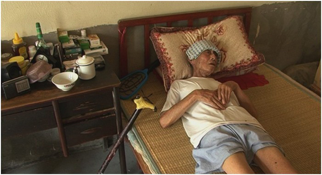](134c454a-5875-40c8-8e19-e27d56f1875d.jpg)

（初剪版）

[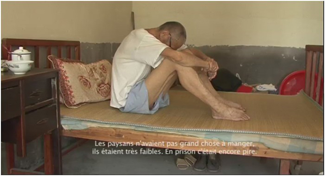](fe4d90fe-d84b-41c8-8716-7517c213940e.jpg)

[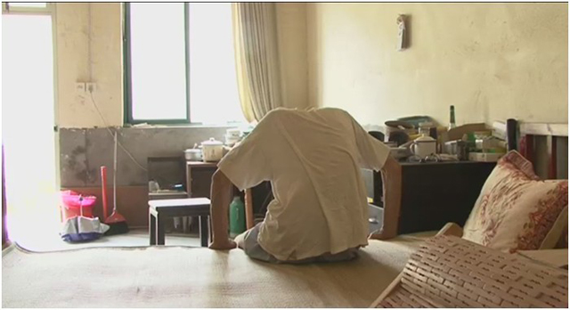](03c2644b-c564-4ea4-b7d7-99c3f1ec26cd.jpg)

[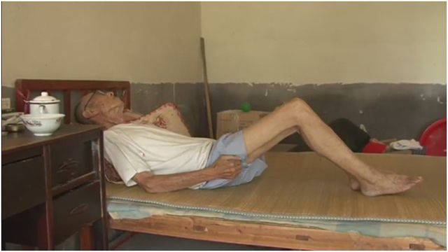](811be483-1502-4808-beb7-dff3fbdef0ce.jpg)

[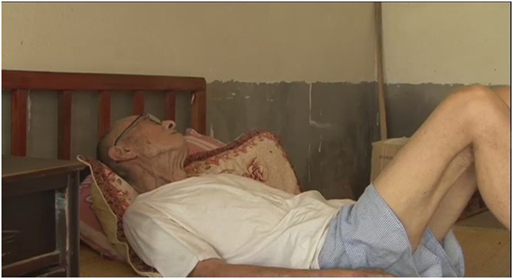](f8f86c81-3221-49eb-a5a3-1c3fd707f638.jpg)

（法国版）

而在另一个段落中，老头在台风天的午后睡觉，起身撒尿，然后继续睡去。初剪版有一个透过电扇拍摄老头撒尿的镜头，处理得比较精准和有意味，我们都觉得很好，但后来Axelle依然忍痛割爱将它删掉了，她说，这么安静的午后，就让他睡着吧，别去吵醒他。目的是保持一个稳定安静而缓慢的节奏。

[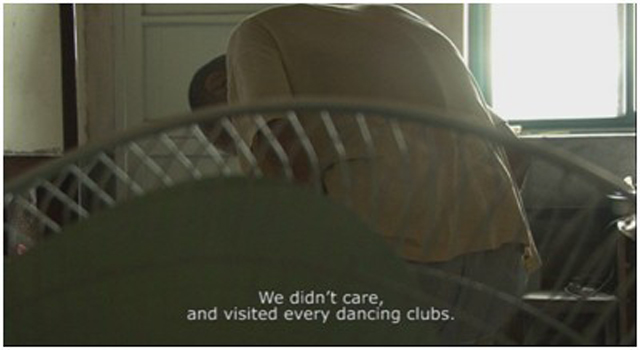](bf1301dd-7d6d-41e7-874b-83184d62dcab.jpg)

（初剪版）

[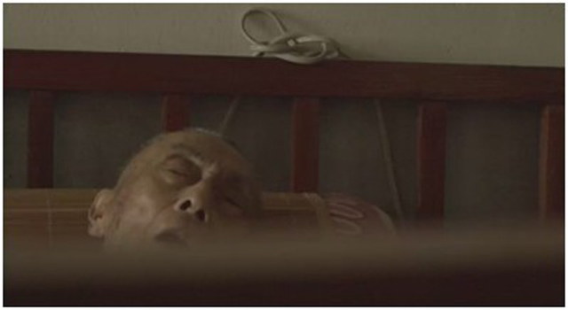](c71bed6a-4dbd-4e59-9761-8d6023782492.jpg)

（法国版）

影片初剪版的结尾是这样安排的，冬日的老头坐在床头，哼唱着《三轮车上的小姐》，近景别，清晰的脸部轮廓和情绪，随着音乐的结束而结束。Axelle认为这个段落相当凄美，但或许我们应该在歌曲上来两句的时候便“戛然而止”，直接结束全片，她说，这个时候我们必须克制，迅速地结尾，请相信我一次，这绝对是最完美的结尾，留恋音乐不是我们的旨归，这样的处理或许给人更多的停留空间。

[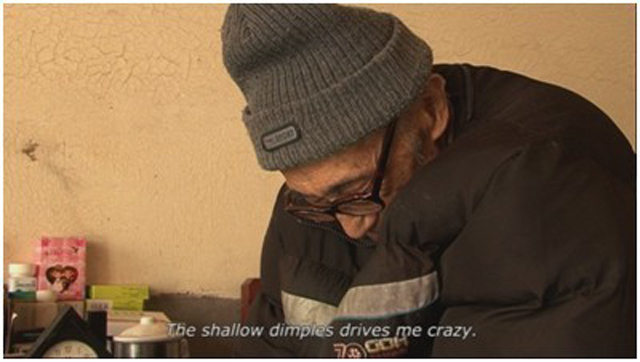](ced07e83-3e4a-4d1a-92d9-e6cc97ca2646.jpg)

（初剪版）

[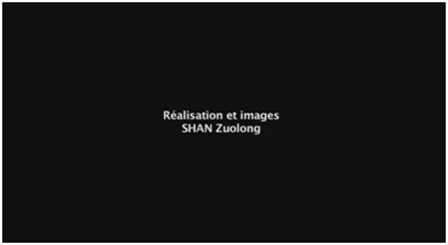](1a83117d-52ad-4b0c-8c8d-5be86d4f7786.jpg)

（法国版）

#### 在废料中挖掘意义

《借我一生》，讲的是一个老头一生的经历，大段的口述是少不来的。Axelle一开始就严肃地告诉我，我们这次剪辑最大的难点是如何找到合适而有力的口述段落，并必须为之寻找到最为匹配的画面，也就是意义如何在剪辑中生成？我们在剪辑之初一度很担心素材中无法找到足够合适的画面。

但是结果表明，她甚至在原本已经被我弃为废料的素材中，挖掘出了非常有用的段落，并且把他用到了恰到好处的口述中。Axelle对画面的敏感令我吃惊。

在我的素材中，有一段老头出门在养老院里理发的段落，我只是认为这个段落的画面拍得还行，但是并不觉得有什么意义，因而在我的初剪当中，这个段落自然被剔除了出去。当Axelle在我的素材中看到这个段落的时候，她忙着叫我翻译这段他们的对话，在这批素材上停留了许久，她的直觉就是这个段落也许会有用。Axelle最终决定将老头在文革中被第二次关进监狱的经历贴在里这里，我们试着剪辑了下，影像本身具备的那种力量瞬间打动了我们，就是需要这种场域！没错了，找对了，因而这个段落就这么出来了。

[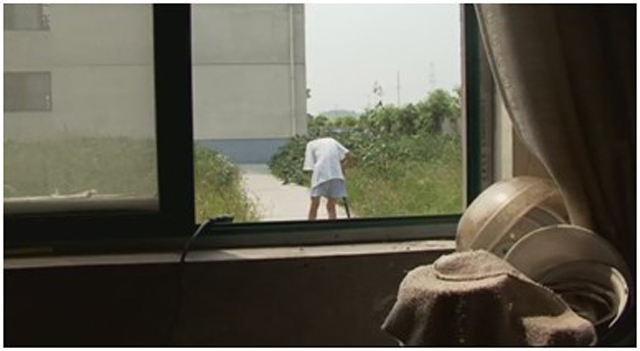](215aaa00-58f1-485a-bb54-5e6ae1894a4a.jpg)

[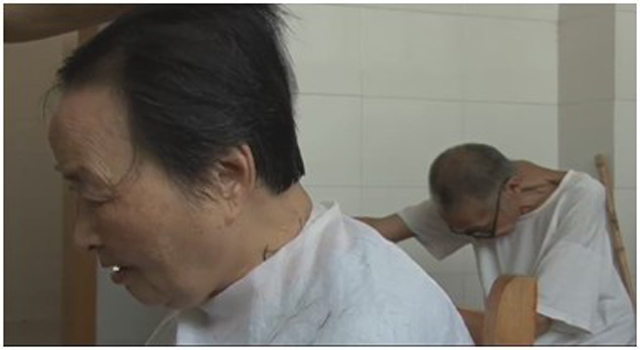](e3490419-c070-4d35-8b02-3e487e8c4c2b.jpg)

[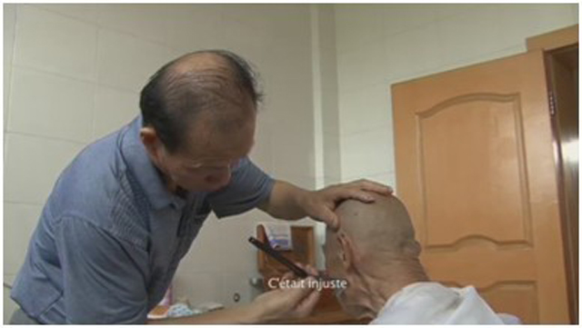](a1d0b8b6-550f-4d08-a11e-400ae5175bc2.jpg)

[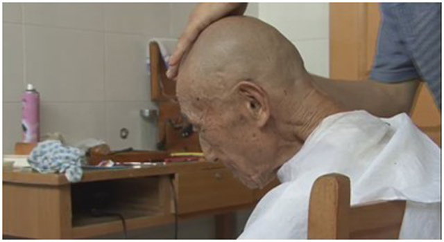](a0bfd34b-fc29-4c30-85d8-25d7bf3edb2c.jpg)

[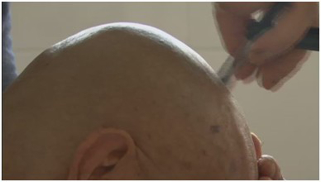](052fb8df-c30e-4df7-9a6b-5b8de91a5d28.jpg)

[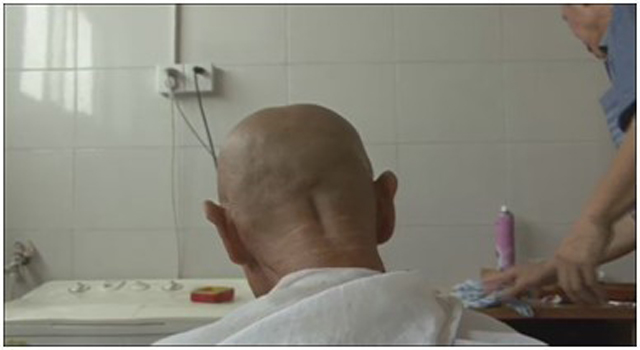](a3872b1a-13e3-4eaf-915d-dbd9e556b91a.jpg)

（法国版剃头段落）

另一个段落，是老头上桥的长镜头。在初剪版中，我把它接在老头盛夏出门看望老友后回返回的段落中，并贴上了他讲述青年时代与别人争抢第一个女朋友而招惹是非，葬送家产的故事。古桥高达十多米，跨过去对老头来说不是易事。这同时也应该是他生活中的一个重要符号。剪辑师告诉我当她第一眼在初剪版中看到它的时候就觉得应该作为开头，但是当我们将他设为开头的时候，发现能量全无，无法形成到我们所要的意义。然后我们尝试着为他贴口述，但是贴来贴去，总还是觉得没有感情，这反而变成了一个冷漠而没有情绪的段落。我和剪辑师达成一致的意见是，这是一个需要被“孤立”的镜头，我们不应该让口述来打扰他，在这里老头是背对着我们的，他的情绪是远离我们而被散落在环境中的，我们应该让观众安静地看着他走完这一路，对，感觉终于对了。于是，我们沿用了这个剪辑方案。

[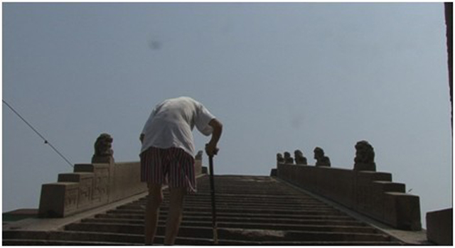](39ce27b8-4077-4d2a-adc2-8876daf16e2f.jpg)

还有一个段落是老头在房间里跳舞，这是我在拍摄中故意导演的一段，尽管我觉得老头佝偻着的舞姿很迷人，但在我的初剪辑版中，我毫不客气地将它切除了，因为我觉得这个段落无法和整个片子形成力量的均衡，用不进去。但是当Axelle看到的时候，她对着正在跳舞的老头笑了好久，她说太棒了，必须得用。于是，我们就尝试着剪辑这个段落，做过乐队的Axelle竟然将我独立拍摄的三段跳舞段落剪辑成了一个相对完整的段落。接下去，我们打算在里面加进一些口述，比如讲老上海的富足和玩乐等等，但是和前一个例子一样，我们发现情绪点被打破了，之后我们继续达成一致的意见，我们需要让老头尽情地跳舞，不要去“打扰”他，跳舞是很累的，而我们的观众也肯定想专心地看这么一位老克勒跳一段舞吧。这个段落也就这么被剪辑了出来。

[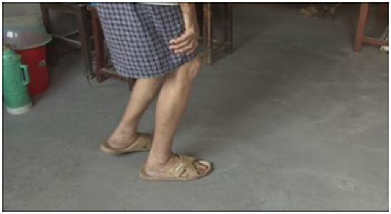](58d7fd6b-0575-411d-a3fd-fa40213db662.jpg)

[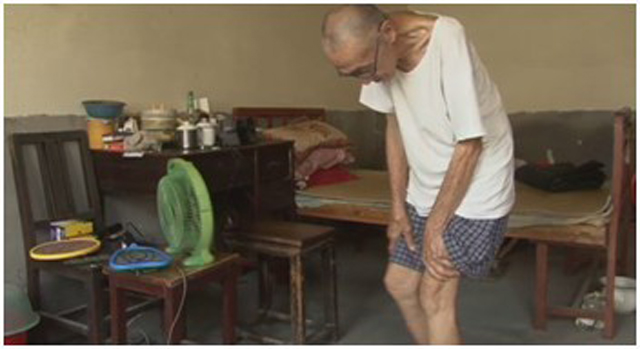](dbdccb78-8e82-442e-9590-423cb301573a.jpg)

（法国版跳舞段落）

很多时候，就如Axelle给我讲的那样，片子就活生生地在那里呢！但是他必须在被尝试过各种方案后才有“可能”浮出水面，与我们见面。我们无法看到他的存在，只是能够隐约地感知，而剪辑就是帮助我们去准确地找到那种感知。

**寻找最为合理的结构平衡**

Axelle有一个很好的比喻，她说一部片子就好比是一个有呼吸运气的人，我们需要运动也要睡觉，有激烈也有安静，有封闭也有外露，我们需要有节奏地呼吸这个世界的空气。

在剪辑的过程中，Axelle总是在有意识地提醒我，好吧，老头刚刚讲述完一个悲伤的故事，那么接下来，是不是应该让他来跳段舞呢？哦，跳舞很累啊，那接下来是不是得休息下了呢？好像在室内待得太久了，现在是不是需要出去走一走呢？Axelle总在帮助我平衡这些组成一部影片结构的场域，比如室内与室外，采访口述与日常生活，白天与黑夜，晴天与雨天等等。而具体的口述细节上，老头说的每句话中间空余多少时间也是需要考量的，留有一些必要的重复与口误都是很有必要的。在《借我一生》的剪辑中，我们还将素材中所有的昆虫素材全部翻找出来剪辑到了片中，将昆虫的生命感与老头的命运形成关联，有了新的意义。而这些电影语言上的处理技巧，却是我在初剪版中没有把握好的。

结构上的平衡，也可以说是学会“克制”的一个方面。

[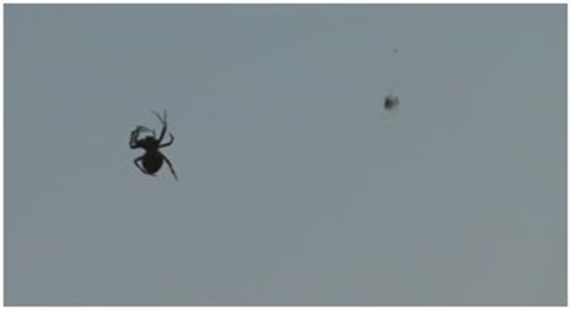](9b9e02a9-6d37-4b2b-a2f1-faf350922bd3.jpg)

[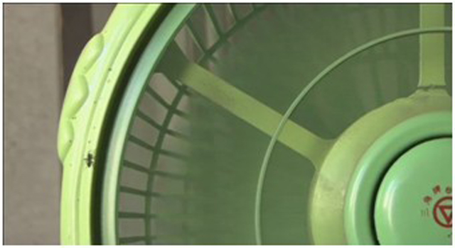](b15a0a5b-1ddc-4d2b-aaaa-3b51fd8d40b5.jpg)

[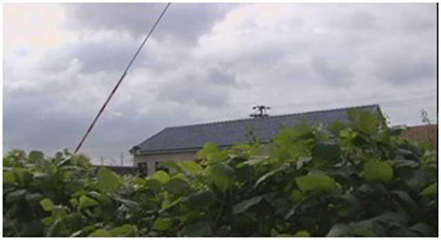](1b585843-cb13-4d59-af24-949ddf9a7d1d.jpg)

[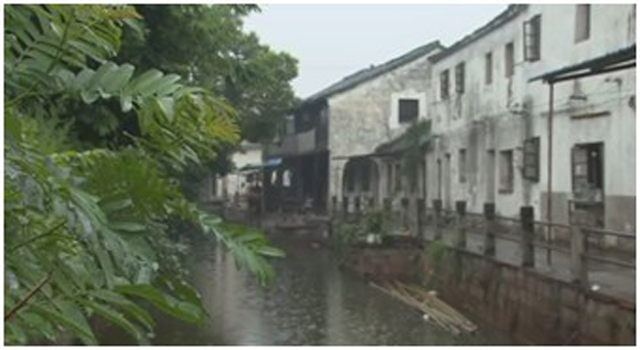](cfe1025b-245e-441e-93cc-adf20d7380e1.jpg)

 **超越语言的沟通**

谈到与Axelle的合作，感触最为深刻的是，尽管英语都不是我们的母语，而且我们俩的英语都不算太好，但这却没有造成剪辑交流上的障碍。电影语言本身在这里显而易见地成为我们沟通的首要语言。

有一个细节，好几次，我与她都不知道该用什么英语单词来形容一个动作或是情绪，于是我们分头转过头去，我用google中文翻英文，她用google法语翻英语，当我们再次转过头共同喊出那个英语单词的时候，发现竟是如此默契，每每说的都是同一个单词。而更多的时候，我们互相只需要用简单的一些英语单词，就能明白对方的意思，并能够现实地将这种理解几乎没有信息损耗地体现在片中。

当我差不多完成了《借我一生》的剪辑工作回到中国后，Axelle给我发来了一封电子邮件，说了她女儿的一个小故事。因为Axelle那几天每天晚上都要在家里加班修改《借我一生》，而多次改到了老头哼着老歌《夜上海》跳着舞的段落，她的女儿竟会不知不觉地和着老头一起哼唱这首歌，尽管她根本不能理解歌曲的内容，甚至每晚睡觉的时候，女儿都会缠着妈妈再给她哼唱一遍这首跨越半个地球另一国度的，在本国都已经逝去了将近一个世纪的残歌。

我在马赛捡回一部纪录片，一部被我丢在心里太久的片。

 

### **【如何下载】~@_@?~**

**请加入独立影像流动分享群，在群共享中下载本期所推荐的独立电影！**

**流动群群号：94075202 ****入群请注意以下几点哦：**

1.流动群专供北斗读者下载本栏目所推荐的资源，验证身份时请注明“北斗读者”。

2.当期资源自发布后14天内可以下载，到期后工作人员将手动删除以上传后续资源，请注意时间。

3.此群采取流动制，群满员时，完成下载后请自动退群，以便他人入群下载。（但是请注意：只有当群满员时才需要各位流动，现在则无需退群，需要大家流动时会另行通知。）

  

关于**独立电影**和**DNEY**请参见[<独立影像>第一期：初识独立影像（上）](/?p=11506)，其中的**广告**也要记得看哦！

 

（采编：黄希敏；责编：黄希敏）

 
