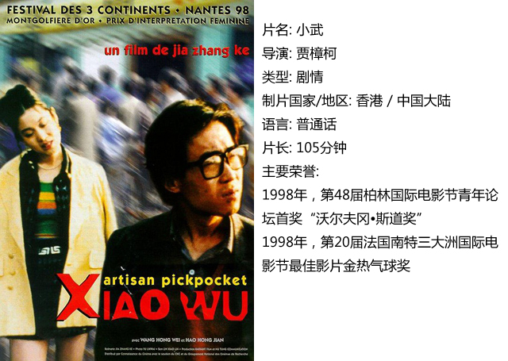
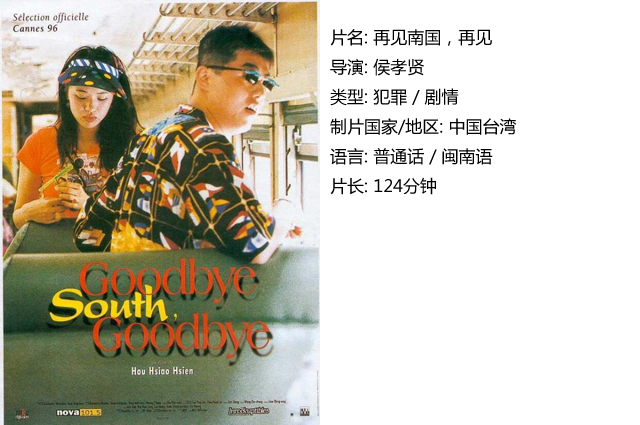
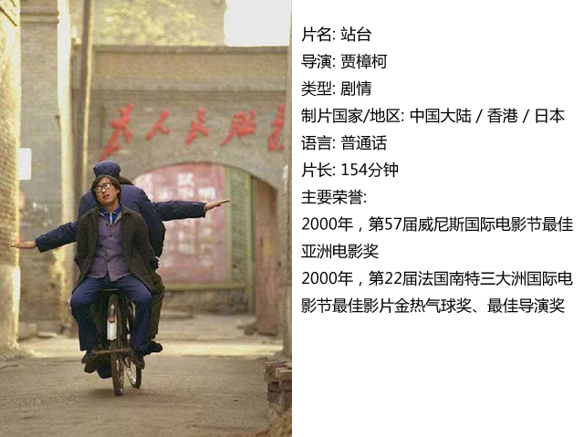

# ＜独立影像＞第十期：窗式电影下的故乡

**侯孝贤与贾樟柯的电影在其导演手法与演员调度镜头设置与演员表演上与其他电影相比有着迥异的特点。两位导演的作品通过极其真实的长镜头连续拍摄与演员真实的表演来让观众像通过看窗外风景一样来观赏电影中人物的生活。从而让观众像看着真实的，就真切发生在窗外的的生活一样来感受电影中人物生活意义的传达。而电影《再见南国，再见》与《小武》代表性地展现了两人这种独一无二的电影风格。**  

**<****独立影像>第十期：窗式电影下的故乡**

## **影评人 / 张家骏（上海大学）******

 

#### 编者：

本文来源于张家骏同学的学年论文，原题为“侯孝贤与贾樟柯的窗式电影研究——透过分析比较《再见南国，再见》与《小武》”。除了《再见南国，再见》与《小武》之外编者又为读者增加了另外两部电影《站台》与《任逍遥》，这两部电影与《小武》即“贾樟柯故乡三部曲”。《站台》与《任逍遥》的介绍可自行查找……

#### 张家骏：

##### 序言

贾樟柯被称作“亚洲电影闪电般的光芒”。他是第六代导演中目前为止在国际影坛上斩获最多的人。他从山西小城走出来，一路走向世界。

侯孝贤，作为台湾新电影浪潮的领军人物。用独特的电影语言纪录描绘了一幅幅台湾风情画。生动，真实，教人过目不忘。

贾樟柯1998年的影片《小武》和侯孝贤1996年的影片《再见南国，再见》这两部影片都通过极其独特的，强劲有力的真实的形态，引起国际社会的关注。我们在两部影片中不仅看到了活生生的充满能量的人物也在其中看到了两位导演对电影这个本诞生于西方的迷影戏剧世界非常个人化作者化的介入方式。而这种形态的电影在日本导演小津安二郎之后就甚少见到了。这两部电影打动的不是本地的电影工业，他们真正击中的，令人感觉生疼的，可能是所有在制作着电影的影人们的心。下面我想从镜头，表演，意义三个方面来分析比较这两部电影。

##### 第一章 镜头

侯孝贤导演的电影以长镜头著称，贾樟柯也是。在他们的制造的影像世界中，你很少会凑到角色的胸部以上的地方来观察他们。很多时候，我们能看到他们和他们所处的空间的大部分。中景，中远景是他们构筑自己影像空间的尺寸。在影片《小武》中作者使用了大量的长镜头来伴随主人公小武穿越烟尘迷蒙的山西小城。手持的，摇摇晃晃的，仿佛你自己走在主人公的身后，亦或你自己就是主人公。然后你开始察觉到熟悉亲切的空间在视觉上展开。虽然从来没有在那里生活过，但是这个小城的一切通过一个固定在那里的长镜头，来来往往不在意摄影机的人们，穿梭的自行车构成真实而令人感觉亲切的世界。而我们的主人公在其间穿梭生活着。与以往为我们所熟悉的大studio制作电影迥异的是，导演并不用特写与近景来限制观众所能观察的区域。而是非常“大方”更多地用中远景来展现时空与人物的全貌，观众则可以自由地选择自己的目光所向。

《小武》的摄影师余力为，也是贾樟柯之后一直使用的御用摄影师。香港人，跑去比利时学摄影。在比利时求学的过程中，老师教导他一定要学会怎么拍纪录片才拍得好剧情片。贾樟柯在香港参加电影节认识他之后，两人开始合作。在拍《小武》的时候，贾樟柯对摄影的态度则是“无为而治”，但可能是两人之前深入的交流与默契，余力为纪实平和却饱含韵味的镜头风格与贾樟柯的故乡故事一拍即合。在影片中，我们看到一条条有时候甚显极端的long take，却正是余力为从欧洲带回的摄影理念与贾樟柯个人电影创作哲学的完美融合。

而这部作品从“气质”上与小津安二郎的电影也与他的“徒弟”侯孝贤的作品一脉相承。

侯孝贤，1996年，《再见南国，再见》。同样的纪录故乡“南国”的故事。整部电影，镜头大部分时间保持在齐腰的高度。安静。少移动。缓慢的摇，伴随着缓慢的前移是唯一的动作。故事的主人公本是过惯了打打杀杀生活的黑道大哥。而他带着总是吊儿郎当的小弟和他的女友像照顾着两个自己的孩子。他渴求相对安宁的生活，希望能够尽到做儿子的责任，作为家族长子的责任。在南国的艳阳下，他骑着摩托车疾驰，心向着上海的生意，试图逃离这里，和南国说再见。全片的镜头与《小武》相似，沉着而冷静。大量的中焦段镜头使用。观众在整个观影过程中完全释放自己的视点。像透过一扇窗户一样，在中焦构成的相对“广阔”的世界中自由地观察。片中有两次令人印象深刻的跟车镜头。一次是绿色滤镜下的世界。长时间的行驶，穿越过城市，搬家。另外一段则是当主人公和两个年轻人骑着摩托车的时候，镜头正面跟着他们，看着他们意气风发地驾驶，甚至还有对话发生在两台摩托车之间。真实，同时又让人产生会不会是梦境的错觉。

纵观两部电影的镜头设计，可以说“形神”相似。但又不绝对一致。两位导演和他们的摄影都在其中融入了不一样的属于他们自己的元素。就像侯孝贤对绿色滤镜这一段的处理。但是他们的共同点是都不常用近距离拍摄，而是刻意地与被摄者保持距离。让主人公后退到环境里，用镜头为他们钩织他们看上去宽广的现实舞台。而美术设计在其中也完成了出色的工作。而这样的镜头设计往往自然而然地让观众感觉不到荧幕的存在。好像自己在面对一扇窗一样，直视窗外的真实世界，感受生活真实而有热度的拥抱。

##### 第二章 人物，故事

《小武》的主人公小武是一个游手好闲的小偷，在贾樟柯的家乡，山西汾阳。他是一个充满能量和生命力的人物。他以自己的“手艺”为豪。却也自知自己是不被社会所接纳的异类。他游走在这个小城的角角落落，寻找着自己生活的意义。

贾樟柯在影片中对这一切事件与角色使用的展现方式是客观的。很少显露出自己的主观感受。对于这个角色来说，观众能感受到导演对他的无奈与痛惜。这个角色很好地诠释了中国社会在现代化进程中所表露出来的矛盾。

令人印象深刻的一场是影片的最后，警察带着小武走在街道上，途中因为有事将小武拷在了路边电线杆的钢索上，我们比较罕有地在影片中看到近景的非常不舒服的主人公。接着一个全景展现了他周围的人群。我们看到他们带着凑热闹的心情围观着。

在这部影片中，这些始终围观始终存在在影片背景中的人物们可以说是这部影片的主角之一。他们代表着这个社会的“大多数”自然而然地存在。但与王宏伟饰演的主人公相比，他们倒是缺少了点生命力与能量。

再回头看看《再见南国，再见》 一个落寞的黑道大哥带着小弟和他的女朋友。在台湾嘉义和城市之间辗转。影片没有线性的叙事。而是片段记忆般地展现了他们的生活状态。这也缘起侯孝贤导演从前在电影节上看到这部片子的几个演员处在一起的状态，从而得到灵感作出这部电影。大哥总是在保护着小弟。同时教导他变成熟，做事懂规矩。自己却也深陷在游戏规则的泥潭中无法自拔。在做好“工作”之余，他还必须要做好一个好儿子。去看看父亲，看看自己的家，帮忙家里人搬家等等。我们惊奇地发现，侯孝贤导演在这部影片中切入的视角非常不一般。普通的黑帮题材电影，无非是以打打杀杀作为卖点。但是这部片子确实一点血腥紧张的桥段都没有。而是转而把这些黑社会人士还原到生活中去。他们在生活中的一举一动无异于常人。令人印象深刻的一场戏是在嘉义的赌坊里，有人触怒了扁头，喊他绰号，他掀开桌子起身要打架，整场戏一镜到底。，只有缓慢的推进，直到冲突爆发，演员节奏控制到位，一气呵成，如此逼真，让观众瞠目。

##### 第三章 主题

《再见南国，再见》90年代的台湾，整个的竟然只是一派混混噩噩的乡土风物，除了霓虹灯多了几个，人的生存状态竟无大的改变——一群在黑帮和小生意人生活圈里折腾的人，始终无法找到属于自己的生存空 间，各种渠道传来的都是坏消息，亲情的辐射圈则早已将他们排斥，他们的讨生活的历程就是一个不断被拒绝的过程，也许唯一值得亲近的只有身上的纹身了，君不 见两个处境糟透了的混混，谈到各自的纹身，似乎一切烦闷已不复存在，这就让我尤其觉得悲哀！

本片的作为个体的人物，他们的面 容是模糊的，但作为一个群体，他们的生活却无从漠视，所以我觉得，侯孝贤想说的也许是一种台湾乡土生活的崩溃过程，任何的个人都是无意义的，当这个群体注 定被抛弃，被遗忘的时候，我们也许该审视我们自己的生活意义了，而此刻，你才会明白，侯孝贤的长镜头，其实多少含有一分挽留之意！火车不仅仅作为一台时光 机去引领我们回到从前，更成为城市/工业文明的凶器，参与了对乡土台湾的谋杀。我们看到，影片中的诸多人物都处在无聊、茫然的状态中，所面临的也都是些现 实性的问题，去哪里做生意、欠钱怎么还、如何从政府征收用地中获利更多、政治与地方势力的争斗等，这些正是传统农业文明土崩瓦解前的征兆。青年一代们完全 是古惑仔、新新人类的模样，中年一代们在为生活烦恼忧愁，而年纪更大一点则忙着巩固自己的黑帮势力或参与政治游戏。嘉义这个台中的城市恰好处在台湾北部和 台南的中间，也是处在现代工业文明和传统农业文明的夹缝中，人们想要冲出这困境（去上海、去沈阳做生意），却再一次遭遇“国道封闭”。所以侯在片中安排 了诸多车上的场面，火车、轿车、摩托车，每个人在台湾这辆既传统又现代的车上麻木而不知所终。片中有一个段落印象颇深，那是阿扁去讨债而被堂兄和伯父摁倒在地并烤上手铐，小麻花在一边又叫又跳。这些在屋外景深处发生，而屋内近景处，垂暮 的老人在黑暗中默不作声，冷漠的注视着这一切。这个长镜头为我们搭建了一幕台湾现实的舞台，传统的失语、体制的暴力、新人类的幼稚与无奈，都在这舞台上得以呈现。

而《小武》讲的这个贾樟柯家乡的关于一个小偷的故事，则是完全聚焦到当今中国社会变化过程中产生的诡异的，令人匪夷所思的矛盾。我们看到了一个活生生的充满能量的年轻人，同时也是罪犯，他在街头游走，只是永远找不到自己的价值，也没办法在别人眼里找到自己的价值。

两位导演都在自己的故乡找到了纪录的对象，也想尽办法还原最真实的一面，关于那些人物，关于这片土地。

##### 结语

侯孝贤与贾樟柯各自在自己的影像世界里缔造了非凡而瑰丽的故事。而这些非凡脱俗的故事却是用结结实实的真实来编织的。从镜头到故事到对演员的调度及表演。我们就好象搬来一把小凳子，端坐在窗前，看着窗外四季变幻，人生如梦。他们继承或可以说某种程度上创造的新语言与电影形式告诉了我，原来电影还有这种拍法。原来故事，还有这样的讲法。诚如侯孝贤的“老师”小津安二郎导演墓碑所书“无”，可能不添加太多人工调味的菜才最能保证营养吧。

 

### **【如何下载】~@_@?~**

**请加入独立影像流动分享群，在群共享中下载本期所推荐的独立电影！**

**流动群群号：94075202 ****入群请注意以下几点哦：**

1.流动群专供北斗读者下载本栏目所推荐的资源，验证身份时请注明“北斗读者”。

2.当期资源自发布后14天内可以下载，到期后工作人员将手动删除以上传后续资源，请注意时间。

3.此群采取流动制，群满员时，完成下载后请自动退群，以便他人入群下载。（但是请注意：只有当群满员时才需要各位流动，现在则无需退群，需要大家流动时会另行通知。）

**DNEY****新人群群号：152511792******

注：DNEY新人群为DNEY独立影像官方交流群，非流动制。DNEY同时为流动群和新人群提供资源，但新人群资源并不一定与本栏目同步。

关于**独立电影**和**DNEY**请参见[<独立影像>第一期：初识独立影像（上）](/?p=11506)，其中的**广告**也要记得看哦！

 

（采编：黄希敏；责编：黄希敏）

 
