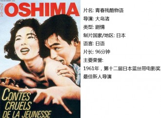
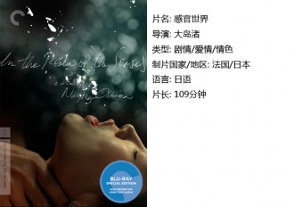
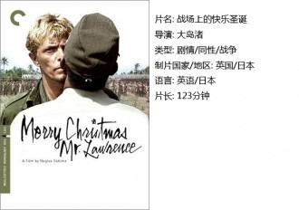

# ＜独立影像＞第四十一期：一生的残酷青春——纪念大岛渚

有的人物，人们似乎已经习惯了他们作为一个符号存在于书中，人们从不敢轻视他们的成就，每每把他们的名字提及在嘴边，以熟知他们的作品作为荣耀。而当有一天，突然听说他们去世的消息，才知道这个人并不是活在历史中，而是一直在世，和我们一个时代。

大岛渚，这位息影14年的导演，当获知他刚刚去世的消息时，我才发觉原来这个教科书里的人物竟然一直在世，只是淡出人们的视线而已。我们评价这位导演的作品，总是无法离开他所在的那个时代，那个激昂变幻的六七十年代，那个充满了叛逆、审视与批判的时代里，是可以孕育出大岛渚这样的导演的。无论从反体制思想的《青春残酷物语》到抗议美日安保条约的《日本的夜与雾》，再到众所周知的《感官世界》，这位导演始终不肯走到主流当中来，甚至刻意与传统的电影界保持着距离。

大岛渚对社会政治的批判没有沦为僵硬的宣传片，至今让人牢记他作品的是因为他片中一个个有血有肉角色。从试图用学运改造社会的学生，到底层的边缘黑帮，和纯粹用性来反抗社会体制的云雨男女，大岛渚的出发点始终是当年热血的年轻人，试图变革，试图反抗，对社会政治及文明的提出自己质疑。

** ** **一、 ****青春残酷物语** 

这是大岛渚的第二部作品。在这部作品中，导演表达了一种情怀。电影讲述了这样一些人：他们还不懂什么是完整的人生，这个世界还没有完全向他们打开，还有太多太多的没有去经历。他们保留着原始而尖锐的冲动。他们有反抗，可是不知道这种反抗有时候是徒劳。他们往往被时代所刺痛，自己却浑然不知。 而这部电影就是在残酷地表达这种成长中的蜕变。

电影中姐姐那一代人，寄希望于社会的改良和民主，力图通过创造一个好的社会环境来实现个人的幸福和爱情，但最后革命在社会的压力下失败了，爱情也在家庭的压力下破产了。这似乎是一种历史的必然，雨果的《93年》里面就表达过这样的结果——无论是革命者还是反革命者，都不会因为革命和社会改造本身而获得自我生活的快乐，他们只会不断地负心，不断地沉沦。妹妹这一代人没有任何梦想，不知道要往哪里去，迷惘而绝望，只能通过放纵个人情感和欲望来对抗这个社会，一切都以满足欲望的快乐原则为准。而这种放纵也没有得到真正自由的释放，社会总会有有形无形的边界在约束着个人，将个人可怜巴巴的幻想折磨得体无完肤。

故事的结尾也异常的冷漠：两具冰冷的尸体。也许所有的青春故事，都是残酷的吧。

有青春的人对待世界好残酷，世界对待青春的人亦都好残酷。

 **二、感官世界** 

对于这部以重口味著称的电影来说，似乎再去讨论那些血腥和色情的画面已经意义不大了，甚至在我们现在这些早已浸淫重口味电影多年的人看来，这部电影充其量也不过是一个历史地位的牌坊而已。然而一位大师级的导演绝不会只为了刺激观众眼球而拍一部片子。

我们忽视了一个事实，这部片子不是幻想出来的，而是根据真实案件改编的，而大岛渚本人就是法学专业出身，所以他更能去还原一个案件的真相，而电影所表现出的，则是从凶手和被害人的角度来看待整个案件。导演用一种日本民族特有的对于死亡的态度去解读这部作品，那就是性爱、情感乃至死亡究竟在人的世界中占据着怎样的位置，为何生死就一定要比情感和性爱更重要呢？

对于战后的一代日本人来说，软弱和虚伪无疑交织在情感中，而这恰恰是大岛渚抨击的，他不赞同卑微地活着，而鼓励人们去追求自己的快乐乃至理想，即使是失去生命。在美国占领之下的日本年轻一代需要的是勇气与追求。

而相比之下，如果只看到刺激眼球的色情和血腥，就太低估导演了。

 **三、 ****战场上的快乐圣诞** 

这部影片的演员实在是过于光鲜，以至于人们看到这部片子记住的往往是演员而不是导演，英国著名摇滚歌手戴维•鲍伊是其中的主演之一，而与他演对手戏的则是日本著名音乐家坂本龙一。在影片中，那时还很年轻的北野武也饰演了一个主要角色，北野武在影片中虽饰演一个凶神恶煞的日本军官，但还是掩饰不住他稍显稚嫩的青春本色，这也与他日后所导演的那些冷峻甚至乖僻的电影有了鲜明的对比，看出一个人在岁月中经历了什么。比影片本身更令人沉迷的是这部电影的原声音乐。其中的一曲，由坂本龙一和原“日本”乐队主唱戴维•西尔维恩合作的那首《禁色》，更是有着夺人心魄的销魂魅力。

我无意再去如很多影评家一样解读无数次地去重复这部片子里关于人性、东西方文化冲突以及同性恋的内容，因为这种解读本身已经是非常多见的，而影评人赋予这部片子的意义也许超出了导演本身的预期。对于大岛渚这位把热情与专注投身于电影事业的导演来说，他对于电影的把控可能未必停留在只是讲一个隐喻深刻的故事，他也许只是为了给观众一个思考的启发，那就是我们的人性会因为战争而改变吗？如果会，那么主人公身上那种压抑的情感又是如何保留下来的呢？战争压抑人的情感，前提是人本身有着没有被泯灭的情感保留了下来。如果战争没有改变人性，那么战争的罪恶又是从何而来的呢？

 【如何下载】  **请加入独立影像流动分享群，在群邮件中下载本期所推荐的独立电影！** **1.****请加2****群238699763****，入群请注意以下几点哦：** 2.流动群专供北斗读者下载本栏目所推荐的资源，验证身份时请注明“**北斗读者**”。 3.当期资源自发布后14天内可以下载，到期后工作人员将手动删除以上传后续资源，请注意时间。 

关于**独立电影**和**DNEY**请参见[<独立影像>第一期：初识独立影像（上）](/?p=11506)，其中的**广告**也要记得看哦！

（采编：黄楚涵；责编：黄楚涵）
