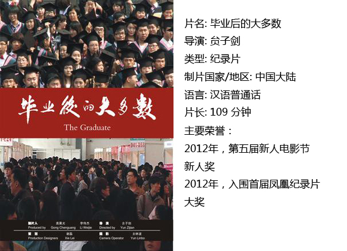

# ＜独立影像＞第四十七期：It Was a Dream

All the leaves are brown And the sky is gray I’ve been for a walk On a winter’s day I’d be safe and warm If I was in L.A. California dreaming...... 

The Mamas and the Papas的“California Dreaming”诞生于1966年。那时，“美国梦”越吹越大，后来，这首曲子成了香港的背景音乐：《重庆森林》中王菲隐喻般哼过旋律摇过身子，摇滚嬉皮的曲风与沉郁婉转的表达，再然后就是眼前的甘霖、席向军、安磊们了。

影片以结束开始，一开始就是所谓的“人生”。小时候被问及人生理想，舔舔指头上的冰淇淋摆摆手，理直气壮说出自己糕点师的职业规划。20年后同样的问题，谁都要沉吟一下，他可能会告诉你“没想好”，但大概没有人说“去流浪”。毕业照是裁纸刀轰隆推倒象牙塔。学士服中的每个人都是标标准准的“国家栋梁”，回过头则是现实劈头盖脸的飞镖。

除去片头片尾的群像，中间便是几组平行人物的记录。日本NHK在2010年同样拍过关于毕业大学生工作状况的纪录片，名为“蚁族之歌——上海求职旅馆里的年轻人”。NHK的纪录片建立在坚实的数据基础之上，“今年中国大学生毕业人数为630万人，加上正在找工作的人，求职的年轻人总数共为800万”，跟踪的是两个毕业生找工作的完整过程。相比之下，本片中间部分没有高潮没有转折，从不给人希望，镜头从一个人晃到另一个人，诉说的是同一个故事，生活并没有本质的不同。通常而言，影片大概会对样本有对比有典型地选取，而这部片子一直把情绪压到最低，用近乎与生活平行的节奏叙述——从甘霖、席向军、安磊和他的同学们、何先菊、李晓云，到刘加秀和妻子。然而，正是这样一步步的堆砌才让片子显得更慑人心魄，因为从来没有救世主，因为生活的白板与无奈才是影片的正题，因为每一个人是自己又是群像。

采访式的记录让电影与新闻有一种混淆感，“自然”或许才是纪录片最需要关照的问题。什么是“自然”？是指客观去呈现影片的内容吗？那从这个意义而言是不是要尽量避免“电影感”，消解编剧、导演、摄像师甚至镜头与技巧？记录片要的难道不就是大妈裹脚布一般苍白质朴的真实生活？而——摄影师的参与，提问者问题的出现，主人公在屏幕里看着观众“为什么要拍我”，会不会更直接与坦率的“自然”？认真的观众最不买账的大概就是讨巧与捷径，老老实实说事情才最经得起推敲叩问，再炫的情节技巧也是荧幕上的，能摸到观者心坎的哪怕一个镜头一句话才能算是好样的。这恰是独立纪录片导演最擅长的，从一开始就没想要取悦谁，拍摄的目的就是诉说，从来不怕局限，不怕笑话，不怕说不到点子上，愣头青的冲劲让好多大腕儿也欣羡。这样的潇洒本身就是魅力是优势。想要的结果并不是看看就扔掉精致柜台成列的“娱乐消费品”。客观说来，整部片子相当粗糙，对10分41秒开始高玉龙与她男朋友吃饭的镜头被裁掉了不止一半没有交代；虽然镜头不算晃，全自然光的拍摄自然导致细节的缺失……如此看来，槽点倒是不少。但是，这样的表达让人想到“作者电影”——一部电影最基本的就是导演的强烈意图，强烈的企图心几乎是片子成功的基础：先要取悦自己才能取悦别人，评价如何是后来的事情。导演尊重观众，一味死磕镜头、布光、演员、故事或许是一种手段，而最基本的大概是拍摄时的诚意、有光芒的眼。有诚意的作品都会赢得尊重。

就像央视拿着话筒去满大街找幸福一般，这种关于人生大基调的叩问往往得不到至少是满意的答案——“回家”、“去深圳”、“先玩”。纪录片总归是对问题的探寻，好像解方程式一般，无解也是一个答案。“因为他没有方向了”。片子很明显，只想提出问题并没有寻找答案的企图。对社会、对制度、对毕业生自身，任何一方的指责都有，所谓“彼此彼此”，五十步笑一百步罢了。

镜头最后抛回到找工作的人群中噤声观察，张望的脸孔上既没有写着“希望”，也无所谓“不满”，几个近景拼凑着惨淡直白的现实。观者的心沉没到底，平淡的、普通的、无所适从的，又或者无所谓的。人才市场原来像极了菜场，人们在简历上标注自己的卖点然后称斤论两。突然觉得好不甘心，四年本科三年硕士再来博士与后，大学并没有教会学生生涯与人生的平衡计较，谁也没有资格论是非。而我们，没有比猪肉更高贵。

 【如何观看】 请关注【摘星星® 青年沙龙】在全国各大城市（目前已有西安、上海、武汉、成都、厦门、杭州、重庆、北京等城市）的线下放映活动~ [http://site.douban.com/177837/room/2069615/](http://site.douban.com/177837/room/2069615/) 请加入独立电影交流群，一同探讨你的观影感受！~ 请加群187213480，验证身份时请注明“北斗读者”。 

 关于独立电影和DNEY请参见[<独立影像>第一期：初识独立影像（上）](/?p=11506)，其中的广告也要记得看哦！    （编辑：白丹；责编：黄楚涵）
