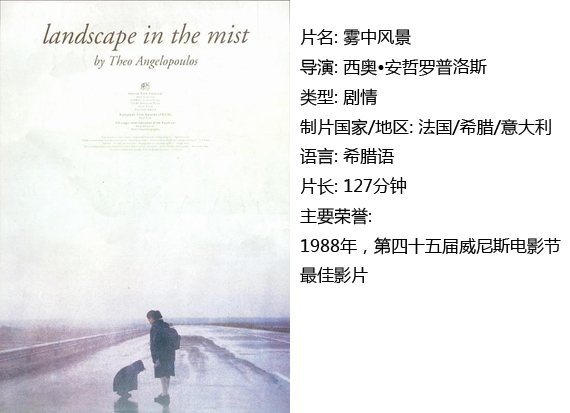
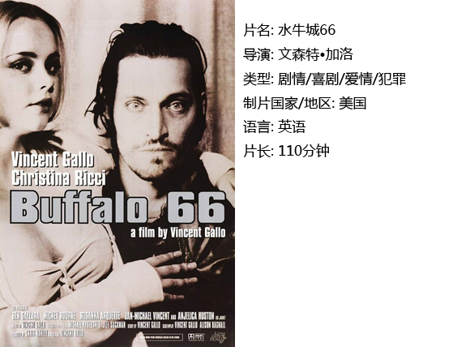
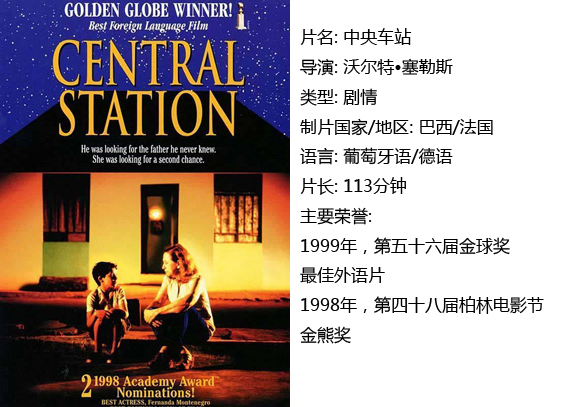

# ＜独立影像＞第四十三期：用尽一生力气，只为回到故土  ——论Nostalgia

如果人生纯属辛劳，人就会 仰天而问：难道我 所求太多以至无法生存？ 

“起初有些混沌，然后便有了光。 光和暗渐渐分离，便有了白天和黑夜。……”“这则故事从来没有说完过！”

在电影《雾中风景》的开头，导演安哲罗普洛斯便以“从来讲不完的圣经故事”，抛出了一个永恒的命题——人类终将栖居何处。

电影中不出现的父亲形象，便似创造了人类却不管保其命运的造物主，将纯洁的孩童弃离于世间。电影主人公姐姐乌拉和弟弟亚历山大对寻父的执着，隐喻着一种人类——尤其是在现代性之中迷失后共有的痛苦情感：Nostalgia，乡愁。

Nostalgia最初源自一位瑞士军医对部队中一种结合了水土不服与思乡病的症状的命名。到如今，它已然成为社会学研究的一个经典命题，其内涵，也早已不局限于物理上的“想家”，更是被引申到时间和心理上，成为传统与现代的文明冲突下，人们的主要应对方式。并且，在这种情感中，因为对于审美的强大吸纳能力，而在各种艺术形式中频繁展现，催生出共鸣。

 是的。只要良善 和纯真尚与人心相伴，他就会欣喜地拿神性 来度测自己。神莫测而不可知？ 神湛若青天？ 我宁愿相信后者。这是人的尺规。 

1998年柏林金熊奖获奖影片《中央车站》，是最好的表现乡愁的影片。影片选择一位信件代写人作为主角，她也同时担当了穿起乡愁的各个维度的线索者。

首先是物理上的乡愁，那些面对代笔写信人朵拉的无数陌生脸孔，或急切、或欣喜、或苦楚，无一不显现着对故乡亲人的思念。

“我怀念在故乡涌斯江边，捡几块白色鹅卵石，以便在夜里用它们擦出微型闪电。等五通桥的太阳西下，望着菩提寺山上的天空，想象未来那条没完没了的路，在这条路上，一切怀有梦想的人们，正在被卷入时代的大漩涡。我知道在牛华镇需要有痛哭的地方，一定有人痛哭，我知道在竹根滩需要有愤怒的地方，一定有人愤怒。我知道在大河坝的草地上，每个晴朗夜晚都可以看到众多星星，其中一颗就是我们自己。它低低垂首，无语安详，把光芒洒落在五通桥的每一座桥，每一匹山，每一条河，每一个人身上。”

这段话，出自知名自由撰稿人宋石男，这样的文字，但凡中学毕业的人，都能形形色色地写出或深或浅的许多来。

过去，故乡是村庄、麦地；如今，就算是拥挤的城市中香港笼民那样的住宿条件，也一样会成为远游者思念的对象。

宾德在评价荷尔德林的诗作《故乡吟》时提到：“……只有处于我与世界的具体的交互关涉中，故乡才能获得其本真含义。因此，归乡者的安全感在诗中呈现为一种被环绕和被拥抱感，一种亲切的联系和信赖。”

因此患有肢体接触障碍的著名Geek Sheldon Cooper在遭遇重大心理挫折后要求Amy拥抱他，《水牛城66》中的男主人公Billy同样常常显露抱膝蹲坐的姿态。乡愁也由此，从物理的联结，上升到了心理的联结，在这里，乡愁的诉求是安全感和归属感，其产生根源也展现为：存在的焦虑、爱的焦虑。

《水牛城66》主角Billy具有相对复杂的性格，脾气略微暴躁，有轻微的言辞强迫症，然而心地善良孝顺，在入狱的五年中计划好每一年往家中寄的书信，为安抚父母绞尽脑汁编造各种谎言。其矛盾性格的由来，随着剧情的发展，得到了解答——他经历了不被爱的童年。他有着自私自利的父母，母亲甚至说出“我恨Billy因为他害我错过一场水牛队的比赛，那是水牛队30年来唯一一次得冠军”这样的话，完全无视儿子的感受。

成长在这样环境中的Billy对家具有复杂的情感，一方面他依赖这个物理上的家，一方面他在此得不到足够的爱，另一方面他仍然努力取悦这个他视为“家”的事物。

而除了“故乡”，还有一种“乡”叫“温柔乡”。Billy未曾在初始的家中获得的东西，诸如爱护、尊重、包容，在温柔乡中一一获得弥补。在这个意义上，Billy在影片中的整个历程，同样可以看作一次寻乡过程。一向被视为屌丝的他，却在美丽少女蕾拉眼中十分“NICE”，人之初，无所谓善恶，重在环境如何激发，只因“真、善、美”本非空中云彩，而是同样需要一个家园才能落地生根、抽枝发芽。

《中央车站》之中，也对这种人性意义上的寻乡有过表达。女主人公朵拉在前半部都基本表现为一个虚伪、狡诈、丑陋的形象，直到她晕倒在火灯节之中。宗教对灵魂的净化，有一种强制的作用，这种作用与朵拉业已形成的生存法则，产生了强烈的对立冲突。她内心的善与恶此刻都已涌起，最终灵魂在上帝和魔鬼的搏斗中无法支撑……

朵拉的救赎，体现在苍老世故的她，也终于被自己仅存的天真击败，倒在温软孩童的怀中，善的一面此刻获得了家园。之后的她，更是换上连衣裙，抹上口红，完成了个人的回归。

 人充满劳绩，但还 诗意的安居于这块大地之上。我真想证明， 就连璀璨的星空也不比人纯洁， 人被称作神明的形象。 

除此，乡愁还有另几个维度。时间上，故乡象征着童年时光。童年的经验对日后人格有重要影响，而很多人一生在童年中汲取财富。《中央车站》的朵拉与男孩约书亚的组合，暗示了这种回顾。朵拉絮絮叨叨地对约书亚说起自己的酒鬼父亲与痛苦的童年，同样将她从麻木的人生中唤醒。她对约书亚说“你肯定会把我忘了”，也将她从沉寂的人生中唤醒。

片末，朵拉在大巴士上给约书亚写信，她写道，我思念我的父亲，我思念着一切。此刻屏幕前的我泪流满面。影片也终于从空间上的“乡愁”转折到了时间上的，对于整个人生过往的“乡愁”。

人们无法留住时间，能留住的只有经历过的、真正重要的回忆。只能如此。

安哲罗普洛斯则在《雾中风景》里，超越个人经验，更多表达对整个人类走向的疑问。“上帝死了”以后，导演借剧中戏班演员之口表达了世象的繁乱：战争、纳粹……20世纪初的种种，都将人类推至一个现代性的深渊。基督教义不再能够掌控世人，人类犹如离开伊甸的夏娃，在迷途中失去贞洁。

安哲罗普洛斯更多在影片中表达追问，比如亚历山大问英俊的奥列斯特斯“你做什么”时，他回答“我负责让人们捧腹大笑”。这不是一个职业的名称，却更溯源地回答了亚历山大的问题。之后的巨型手指、迷雾、道路、生命之树等种种诗化意向，都表达了哲学意义上的追问。安氏在采访中说，曾打算让姐弟消失在迷雾中，可是自己的女儿看剧本后哭了，他才将之改了。可见，我们总是屈从着最纯洁者的意志。

从故乡来，回故乡去。对于人类的使命，我自无从解答，我想能做的唯有生生不息，而已。唯当你在我之中时，寻得生之故乡。

而那位来自德国的父亲，我只因着恰好的“德国之魂”，引入荷尔德林的诗歌。

 大地之上可有尺规？ 绝无。 ——荷尔德林《人，诗意的栖居》 

 【如何下载】  **请加入独立影像流动分享群，在群邮件中下载本期所推荐的独立电影！** **1.****请加****群**187213480******，入群请注意以下几点哦：** 2.流动群专供北斗读者下载本栏目所推荐的资源，验证身份时请注明“**北斗读者**”。 3.当期资源自发布后14天内可以下载，到期后工作人员将手动删除以上传后续资源，请注意时间。   

关于**独立电影**和**DNEY**请参见[<独立影像>第一期：初识独立影像（上）](/?p=11506)，其中的**广告**也要记得看哦！

（采编：黄楚涵；责编：黄楚涵）
