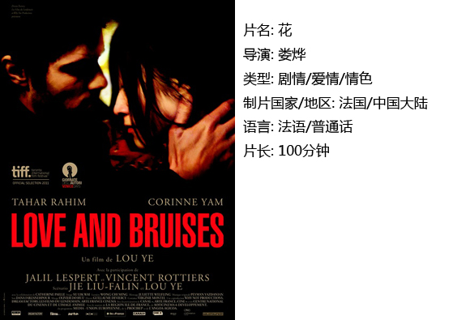
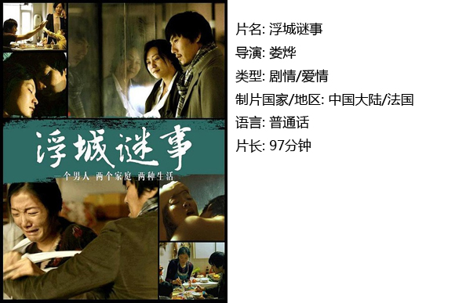

# ＜独立影像＞第四十二期：如果你也欣赏娄烨

观赏不同风格的电影就像品尝不同口味的巧克力。独立电影不同于我们平常吃到的那些经典口味，它是通过导演不断地思考和探索，精心调制出来的别具一格的味道。这些口味不一定适合每一个观影者，有的人尝到意想不到又正合心意的韵味，有的人却难以下咽。对于我来说，娄烨导演的作品是诸多独立电影中最为特别的，也是最和我心意的。

娄烨是第六代导演的领军人物，他的电影在国际上获得过不少奖项。娄烨似乎很喜欢在作品中突出两性之间的情感和本能。他将女性的情绪和身体质感拍得淋漓尽致。他以女性视角细腻的窥探混乱中的爱与痛，让观众自己去思考两性情感中的对与错。其作品用另类、非主流和不落俗套来形容再贴切不过了——每一部影片都是特别的，绝不会在一部电影中看到前一部的影子；其作品需要有耐心、心平气和的去欣赏才能品出作品的真谛，才能理解欣赏的价值；其作品总喜欢在片尾留下悬念，所要表达的东西也就随着不同的人、不同的想法得出不同的诠释；其作品追求生存还原，自觉摈弃民族和个人神话，挣脱历史文化的挟裹，将人从重重符号中释放出来，展露出生命的真实状态。

和其他独立电影导演一样，娄烨作品的口碑是两极分化的。一部分人认为娄烨的影片废话太多，床戏太多，并且有很多晃动的镜头，看完整部影片都不知所云。但是，另一部分人觉得他的作品表达出了生活的真实状态，就如同我们每天都会说很多废话。两性之间的本能行为造就了下一代，使人类得以延续。每个人的记忆里都会藏着许多看似不那么重要的小细节，比如一个陌生男人的回眸，一棵普通的树，一条车水马龙的路。它们停留在记忆的角落里，清楚又模糊，就像一幕幕晃动的镜头。我们每天带着目标和原则活着，有时匆忙，有时悠闲。甚至我们自己也不懂为什么要这样生活，到底怎样做才是对的。是为了理想放弃友情？是为了物质生活放弃精神生活？……其实，没有哪样是绝对正确的，我们只是每天为了快乐而开心，为了悲伤而难过。我们只是希望每天做自己想做的事情。这就是生活－－没有一个唯一的真理，只有每个人不同的价值观。娄烨的作品就像真实的生活，不会出现绝对的正方反方，它是客观的。如同一条坐标轴，有正，零，负，而娄烨的作品所代表的就是零。观影者可以在看完影片后根据自己的生活，自己的原则，自己的价值观得出不同的见解，而影片始终都确立在一个客观的立场上。

** ** **一、花** 

《花》是娄烨在国内被禁后的第一部作品。他以局外人的视觉，旁观中国文艺女青年的精神面貌。影片又名《母狗》、《婊子》，其实所要表达的意思基本上是一样的，但我认为《花》更为适宜。‘花’既是片中女主角的名字，同时也有花心滥情的意思。影片女主角花，可以说她滥情，也可以说她追求内心真正想要的精神生活。花是迷茫的，她不知道自己最终想和哪个男人在一起，每天做什么工作。她厌倦了那个在巴黎的留学男生，表面像是镀着一层金，却自私小气，抑郁沉闷，爱发脾气。她瞧不起那个在北京的中国男人，像个生活的奴仆，乏味单调，追求的仅是稳定的工作，平淡的婚姻。她对采访知识分子的翻译工作毫不关心，即使身在北京心却还想着一个法国男人。花周旋于几个男人中间，和他们做爱，而影片至始至终都没有表达清楚花到底真正喜欢的是谁，或许花自己也不知道。片中以阴暗的天气作为背景，拍摄了大量人物表情的细节和女主角跟不同男人的性爱镜头，折射出女主角花内心的迷惘和烦乱，以及对纷繁复杂生活的失望。或许这个中国文艺女青年花想要的，仅仅只是内心世界的简单生活，每天跟着自己的心走。

 **二、浮城谜事******

有人说由娄烨导演的，于2012年上映的《浮城谜事》是与《花》对应的另一个版本，而我认为两部影片从根源上来说是有很大区别的。《花》是一个未婚女子游离于几个男子之间的故事，而《浮城谜事》是一个已婚男人游离于几个女人之间的故事。花的行为是无意的，不带社会道德破坏性的，而《浮城谜事》男主角的行为多少是对社会有负面影响的。 本片有很多身体细部的大特写：伤痕、皱纹、黑痣，以及死者蚊子身上的伤口。导演很会运用大背景渲染影片的气氛，本片很好的体现了这一特点。首尾两组长镜头，前者在一镜之内转换了天气，从雨天转为阴天。后者在一镜之内转换了日夜，从黑夜转为白天。影片最后出现了阳光灿烂的晴天，而我们的内心却依然一片阴霾 。

 

  【如何下载】  **请加入独立影像流动分享群，在群邮件中下载本期所推荐的独立电影！** **1.****请加2****群238699763****，入群请注意以下几点哦：** 2.流动群专供北斗读者下载本栏目所推荐的资源，验证身份时请注明“**北斗读者**”。 3.当期资源自发布后14天内可以下载，到期后工作人员将手动删除以上传后续资源，请注意时间。 

关于**独立电影**和**DNEY**请参见[<独立影像>第一期：初识独立影像（上）](/?p=11506)，其中的**广告**也要记得看哦！
