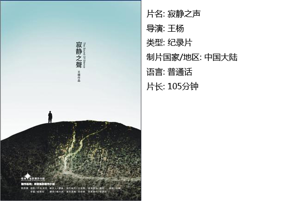

# ＜独立影像＞第四十五期：谁也不用给我一个美好时代

我们走在大路上，我们在漫无目的的行走。

我们对着无尽的夜深吸一口气，你就朝我吼。

在浓烟滚滚的生产车间呆了16年，我们的脑袋被传送带送到一个一个穿着光鲜的镀金机器人面前，被定时定量地安装零件。由同一根传送带送出去的我们，虽终于见天日，却他妈无法适应这个社会。

不要和我们谈什么理想，造飞机火箭当科学家都是我们的理想，谁他妈没有个理想。我们身无分文，我们灰头土脸地在摩天大楼堆积的城市边缘挣扎，就为了那几个钱，谁他妈的有钱还谈理想。

《寂静之声》讲述的便是几个大学生毕业生追求理想的故事。晃动不稳的镜头悄无声息地闯入生活，我们的眼睛聚焦之处是我们自己。因为他们就是我们，只是在别处。我们出身卑微，我们想混个出人头地，我们努力学习，毕了业出了社会，还是没混出个人样，可我们不愿回家，因为回家太丢人。

闫毛总是抱怨教育上的投资没有得到回报。在这个貌似在计较钱的抱怨中深层次传达的是我们的期望与现实的不对等。而很显然这个期望不是我们自己给自己的，于是我们自己成了这个不合理教育机制的替罪羊和受害者。我们读了万卷书，却承受不住外界现实的打击，我们只是这个社会中的小角色，我们品性良好，我们向社会要求的不多，可为什么失败的老是我们？是不是我们的心态上到底不成熟。就像闫毛说的“现在和文化大革命差不多，思想上承受的压力差不多。”

刘思辰追求的是自由，但殊不知任何自由都是相对的。在生我们养我们的这片土地上，无数个林昭式人物告诉我们“任何一个反体制的知识分子，都会付出沉重的代价。”草民们不断据理力争的话语空间不断被体制所啃噬，有多少个人要的是真正的成就而拒绝真正自由的生活呢？

没有考上研的张晓宇最后进了律师事务所，对着镜头他沉默了许久后述说在他自我实现过程中的一些思考，考研不成考公务员，考不上就是不甘心，不甘心的到底是什么？考研到底是为了什么？片中的三个人谁也没个答案。也许这永远是一个恶性循环。他反复说历史是被阉割的，可是我们知道了这些又有什么用。我们除了打嘴炮，还能做什么？我们那些为人民做贡献的雄心壮志现在被抛到了哪一个被注射器针头、避孕套、卫生巾堆满的垃圾处理场。于是有人会耻笑你自己点背还怨社会，于是你转念一想，我们的命运不以我们的意志为转移，那么我们就认命吧。再怎么激进又能换几口饭吃呢？于是我们终于明白，约束我们的不是道德也不是理性，而是意义。宿命论根本他妈的不是什么真理。

世界这么黑，那美好在哪里？再回首自己的爱情，也只有一边怀念过去一边怀想未来。接近尾声，两个年轻人回到了自己的家乡，回到了自己高中打篮球的操场，回到了小时候父亲拉着手传道、授业、解惑之地。站在寸草不生的荒野上，只能空一句悲叹：“莫等闲，白了少年头。”

The Sound Of Silence，这个名字让我想起在地铁上见到的那对聋哑夫妻，他们发不出声音，却很明显在争执，让我印象深刻的是他们不停挥舞的手臂以及大汗淋漓的脸庞。黑暗中，我们的作为，我们的挣扎，终究得不到让我们哑口无言的世界。 毛爷爷说：“这个世界是我们的也是你们的，但归根结底是属于你们的。”于是我们怀抱着这个“归根结底”去找出路了，我们去北漂了，我们考研了，我们考公务员了，我们去招聘市场了，我们自己创业了，我们被屈就了，只为混一口饭吃。你这个时候再和我说起这个世界到底是不是我们的，我会老泪纵横。

__

 【如何观看】 请关注【摘星星® 青年沙龙】在全国各大城市（目前已有西安、上海、武汉、成都、厦门、杭州、重庆、北京等城市）的线下放映活动~ [http://site.douban.com/177837/room/2069615/](http://site.douban.com/177837/room/2069615/) 请加入独立电影交流群，一同探讨你的观影感受！~ 请加群187213480，验证身份时请注明“北斗读者”。 

 关于独立电影和DNEY请参见[<独立影像>第一期：初识独立影像（上）](/?p=11506)，其中的广告也要记得看哦！   

（采编：黄楚涵；责编：黄楚涵）
