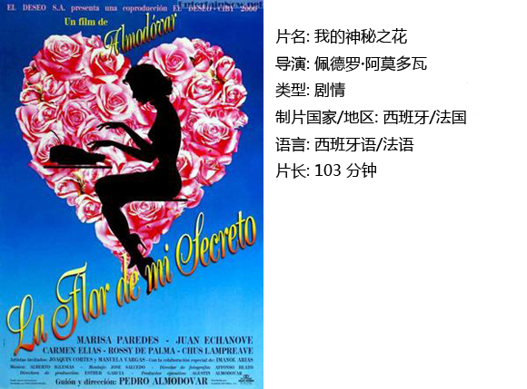
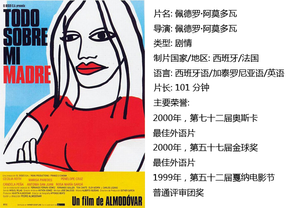
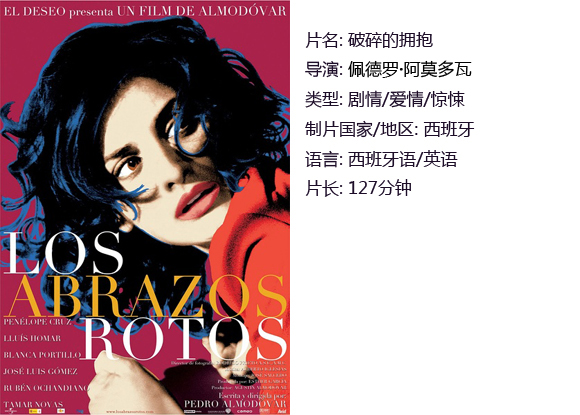

# ＜独立影像＞第四十六期：以女人的名义

爱使女人温柔，痛让女人坚强。那么，生活就不能再伤害你分毫。

有人说他将一切匪夷所思的故事拍的合情合理。他是阿莫多瓦。无论何时你提起他的电影，似乎你就是在谈论一种刺眼而又夸张的格调，一种非同寻常的大于等于强烈的冲击和美感。

但我不想附议。诸行无常。所谓风格，所谓阿莫多瓦式，都是影迷的期待罢了。根据自己对阿莫多瓦电影最初的印象或媒体舆论导向，认为不怪诞不诡谲就是“他一向擅长使用的猛烈情感的药方失灵了。”

他只是拍了电影。而那些电影里的主人公总是女人。正如导演本人所说：我不是厌恶男人，只是他们在我心中并非核心。

况且，他的那些故事里。也并不总是离奇。

**一、我的神秘之花**

像极了一个中规中矩的故事。

她叫Leo。中年，女作家，写着玫瑰般浪漫的爱情小说。在事业和情感的圈里，陀螺一样地转着。

生活的灰暗让她渐渐写不出粉红色的故事。当一个女人对自己的婚姻与爱情开始感到不安和疑惑时，一切旁的都为那一叶所障。她意识不到丈夫主动打电话到女友家中这样有些怪异的巧合，她看不到别的男人真诚的友善示好。她渴望，她等候，即将回家的丈夫。可是从一进家门两人僵硬甚至拙笨的深吻开始，剧情就不在“设计”的轨道里。果不其然，一盘放凉了的海鲜饭也足以成为导火索，一发不可收拾。

究竟是对丈夫的爱太深，还是放不下那个叫婚姻的东西。

你是否也揣着一个看不见说不明的秘密，遮遮掩掩，恍恍惚惚。小心翼翼却还是把它丢了。你以为你失去了全世界，其实是你忘记了你自己。

我们太容易把过去捧在手心，不听在自己的声音。你舍不得的也许是他，也许是他作为回忆曾经在你生活里出现过的那一部分。要走的人留不住，要去的情挽不回，恋曲结束是按不下回放键的。

于是我们走，走，走。有的人走了很久，还没有遇到新的人，郁郁寡欢，恨自己当初没能挽回。而有的人走着走着被阳光点亮，很快遇到了新鲜的色彩。女编辑对Leo说过：读者读我们的书是想忘掉生活中的悲哀，幻想到一个更好的世界，哪怕是虚构的也好。

观众也是一样的道理。

但愿她给了你这样的幻想，一个粉红色的梦。

**二、关于我母亲的一切**

我该如何告诉儿子，他的父亲成了一个女人。

这样的情节在别人的电影宣传中一定会跳出来，显得惊乍。而给后面附上阿莫多瓦的名字，变不足为奇了。打破常规正是他的常规之一。

这是一个几乎清一色女班的故事。年幼或年老，成功或颓靡，绝决或迷茫，坚强或柔弱，就像一部百科全书。母亲是阿莫多瓦的创作源泉和精神之光。他说自己“一生都离不开母亲。不管年龄增长得多么快，经历了多少光怪陆离的奇人奇事，当遇到困难时，有那么一瞬间还是会想到母亲。” 而故事里的少年Esteban，却在一开始就被车祸夺去生命，永远离开了他的母亲。

唯一精神的寄托归零，母亲该当何去何从。她默默地背负失子之痛，毕竟生活仍要继续。她决定去找孩子的父亲Lola，也好代儿子完成曾经的愿望。昔日心爱的男人如今竟然成了她认不出的模样。悲哀和绝望愈发猖狂，黯淡的生活是否还有更深的谷底？

女性常是柔弱的代名词。可是在阿莫多瓦的故事里，女人扛住天。无论遇上怎样的艰难，总有办法慢慢走出阴霾，找寻到属于自己新的寄托。

关于母亲的一切，是爱，是坚强，是宽容。曾经陪伴他很多年，又将伴随新的生命成长。故事的最后，一个小孩健康地来到这个世界，并且延续了哥哥的名字。

他叫Esteban。

**三、破碎的拥抱**

这是一部戏中戏。

你在影片一开始看到的那个男人，就是将要讲故事的人。

一个讨好的开场，不用太费力便会把你的眼光吸引过去。你会在心里暗暗问，这个男人是谁。失明，中年，仍拥有十足魅力。暂时你能知道的只有他的名字：Harry Caine。

跳出来字幕将时间退回1992年，这个美得不可方物的女人Lena出现了。两个时空平行向前推进，一个是盲人作家，一个是婀娜多姿的俏秘书。

情节在X先生的突然到访后出现转机。机缘巧合，作了老板情人的Lena去参加演员面试，而那部戏的导演正是Mateo---十四年前的Harry。男导演与女演员，或是男主人和女佣人的戏码，在影视剧作里从来就不少见。一见倾心，意乱情迷，随之而来的怀疑、妒忌、报复、意外、煎熬……他们离开是非之地马德里，只求片刻宁静，看似甜蜜的二人世界里处处埋着未知的恐慌。她触景伤情，看电影也看到落泪。最终导演做出决定，却不料被一场变故改写。

幸运是他，十多年后依然能跟街上牵来的漂亮姑娘你侬我侬；幸运是她，她对世界的最后印象---是他唇的味道。

浓情蜜意然而短暂。短暂，且永恒。拥抱破碎，却完整。男人失去爱情，仍能生存；女人没有爱情，便不是真正的完整。

有别译名为：情人的情人。管他情人或是爱人，“一霎真情，不能说那是假的。爱情永恒，不能说只有那一刹。”而当年那部未完成的电影呢，你还记得吗。

好在，他仍然怀念她。

【如何下载】~@_@?~

请加入独立影像流动分享群，在群邮件中下载本期所推荐的独立电影！

1．请加群187213480，入群请注意以下几点哦：

2.流动群专供北斗读者下载本栏目所推荐的资源，验证身份时请注明“北斗读者”。

3.当期资源自发布后14天内可以下载，到期后工作人员将手动删除以上传后续资源，请注意时间。

关于独立电影和DNEY请参见[<独立影像>第一期：初识独立影像（上）](/?p=11506)，其中的广告也要记得看哦！ （采编：白丹；责编：黄楚涵）

