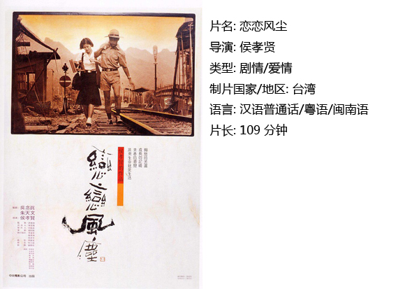
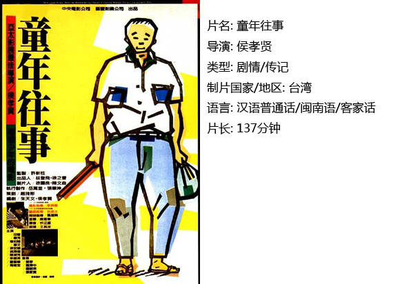
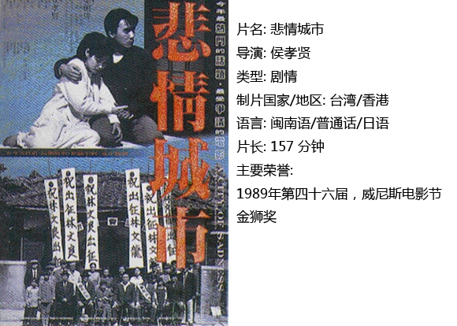

# ＜独立影像＞第四十四期：光影诗人侯孝贤

**一、风尘诗篇**

1970年代末到1980年代初，香港的新浪潮中涌现出许鞍华、徐克这样的导演，接着台湾出现了新电影，侯孝贤、杨德昌开始为人耳熟能详,再接着大陆又出现了第五代，陈凯歌、田壮壮和张艺谋进入大陆观影者的视线。也就是那几年，两岸三地的中国电影全部气象一新。

在这华语电影新浪潮的澜涛中，我喜欢侯孝贤远甚于喜欢张艺谋与陈凯歌。张艺谋、陈凯歌拍电影是要说话，而侯孝贤拍电影是因为有话要说；张艺谋、陈凯歌是说教表演，把自己当成民族历史的代言人，而侯孝贤是自述、记录、对生活静思。

如果说张艺谋、陈凯歌的电影是“青春呓语”、“少年诗行”，那么侯孝贤的电影则是“风尘诗篇”。

“风尘”比喻纷乱社会，旅途劳顿或漂泊江湖的境况。侯孝贤的电影对原意有所扩张：指接近原生态的人生世俗风景：劳累、纷乱、漂泊、叹息和温暖、宁静、驿站、赏玩。导演以大段的长镜头、空镜头、固定机位拍摄以及慢节奏营造出对风尘世界的冷眼静观。变之前台湾电影所趋从的好莱坞全知全能的上帝视野为旁观者视野。《童年往事》、《悲情城市》架构庞大，视野辽阔，贯串了日据时期、白色恐怖、二、二八,充满了“台湾经验”、“大陆情结”和“寻根文化”。然而，《童年往事》没有把童年往事、青春记忆、家族生息当成政治历史的填充物或演绎符号，而是把台湾往昔历史作为人物家庭故事的一个若隐若现的的背景；《悲情城市》也绝非台湾政治历史的官方文书，而是一部描写台湾人如何在那样剧烈变动的政治历史背景下活下去的风尘历史记忆。太阳旗也好，青天白日旗也罢，只不过是城市暂时的装饰；那传统史书中的煌煌巨影，赫赫声威，常常不过是大地的匆匆过客。所以，庙堂、官府、政客、军阀等等常规的城市历史的主宰统统被导演省略，留下的只是大地稚子和城市平民的啼哭、呢喃、歌唱、叫骂、抗辩、挣扎，还有人的尊严。在《悲情城市》中，政治是第三位的，历史也只是第二位，第一位的是平民百姓的风尘人生——这才是文化与艺术的永恒主题。

“诗篇”是意境。编剧朱天文说：“侯孝贤基本是个抒情诗人而不是说故事的人，他的电影的特质也在于此，是抒情的，而非叙事和戏剧。”侯孝贤电影当然不是诗，依然是故事。不过，它们都不是通常的戏剧式或小说式的故事，而是散文式的风尘人生景观。导演用“诗情陈述”，即“并不着力与铺排一般的戏剧冲突、情节偶合，也不醉心于创造一种紧张、刺激、动人心魄的画面效果，而是致力于一种诗情的追求”。“他的影片诗学，是‘天人合一’、‘自然天成’的气韵，是‘山川俯绣户，明月近雕梁’和‘羚羊挂角，无迹可求’的修辞风格。” 创作的原动力往往就是一种情绪，构思时用情绪去渲染，拍摄时抓情绪，剪辑时卡住情绪且遵循的是诗歌语言的规则，如“枯藤、老树、昏鸦，小桥、流水、人家，古道、西风、瘦马，夕阳西下，断肠人在天涯”这些片段没有必然的逻辑关联，但却有诗性联系。侯孝贤认为：“电影的某个片刻是凝结的然后放大加强”。《悲情城市》中的文清一家静静等待全家福照时的瞬间定格、《恋恋风尘》中阿远一家坐在门口长达10秒的静止，《海上花》更是像老式转轮投影在一幕幕画面中生硬切换，看似停顿割裂。导演认为悲伤的事情总是很平静，拍摄时他总是让摄影机一步一步往后退——尽量远，造成一种自觉与不自觉中的疏离，让观众在这种中国山水画的留白意境里体悟恍兮惚兮光阴流逝，不知不觉斗转星移，生生死死岁月流淌。如《童年往事》以一种悲伤而温馨的诗意讲述个一去不复返的故事，影片远远超出了表面的对童年往事的温柔敦厚且哀而不伤的回忆的意义，而是对充满生生死死的人世光阴的且喜且悲却无怨无怒的禅悟感叹。

**二、咖啡时光**

2003年，侯孝贤应日本电影公司之邀拍摄了纪念小津安二郎诞辰一百周年的《咖啡时光》。侯孝贤开始了他的新世纪都市徜徉，同时也开启了新影片之旅。影片的镜语和主题也有了一种新变化。

其实早在1996年的《南国再见，南国》中，侯孝贤就打破了以固定镜位和大块长镜头静观风尘人生的习惯风格，使电影镜头变得动感十足。如果说在《好男好女》中的镜头尚“动得很慢，有点生疏，有点羞涩，有时又有些莫名其妙”，那么在《南国》中，我们看到了更加迅速、大胆和准确娴熟的镜头移动。《南国》影片最大的突破，还在于这一次作者似乎再也不能保持静观态度，忍不住自己的心动，要表现“世界毁灭”的愤懑和失望。从对成长的少年作有距离的人生观察，变为直接展示他们的情感追求、欲望发泄和心态质变，成长的挫伤被推向了故事。

影片《咖啡时光》不是讲述一个爱情故事，而是淡彩描绘一片现代人徜徉东京都市的独特人生风景。影片想效仿小津安二郎对家庭叛逃，却少了一份侯孝贤式从容悠然，叙事上显出了较为严重的窘迫和疏漏。如果不看有关的文字介绍，观众恐怕很难明白主人公阳子到底是什么人、在做什么事，更不知道她成天东奔西走徜徉在东京街头到底所为何来。如果不看介绍，想象力不足的观众则很有可能把这部影片当成一部东京某电车或地铁公司的广告宣传片。影片最后那段有关“这个故事”的旁白说明，不仅突兀，而且虚玄，既不像侯孝贤，更不像小津，让人目瞪口呆。

侯孝贤说他从小就喜欢待在咖啡馆里消磨时光观察人世百态。当台湾与咖啡馆相连很容易诗人联想到台湾电影《第36个故事》进而浮现出一系列台湾小清新电影《蓝色大门》、《渺渺》、《听说》、《海角七号》、《那些年》等。在这些被冠以“清新”的长镜头、非叙事、淳朴清醒、体现地域的小格局表达方式里我们看到了侯式光影。有人说：“他最珍贵的地方是把台湾环境当做创作主题”。以前的台湾电影、电视里，台语的地位很低，只用于一些很下阶层的人物，作为笑料，供人取乐。侯孝贤电影广泛使用台语，融入台湾氛围，找到台湾电影艺术“local”的新方向。他对电影艺术的革新和对艺术电影的执着冲泡了台湾小清新电影的第一杯咖啡。

**三、艺术电影的困惑**

台湾电影新浪潮的三位代表：侯孝贤、杨德昌和蔡明亮均被认为是票房毒药，台湾电影投资商避之不及。杨德昌与侯孝贤的《青梅竹马》上映四天后尴尬下档，被杨德昌称为台湾三十年来最好的电影的《童年往事》，有人连30秒钟都看不下去，蔡明亮常常要亲自在街边兜售影卷。

的确，《悲情城市》各种嘈杂的方言，《海上花》用及全篇的固定长镜头，《童年往事》中碎屑的故事，侯孝贤的表达方式常常像暮年人吧唧嘴边清浓痰的含混不清的碎碎叨叨，让很多人觉得不好看。但是，评价一部影片的好坏前提是你懂它，侯孝贤说“我的电影追求的就是local的异文化”。他认为“艺术电影年轻，负担小、要敢于做怪”。他独立自我“ 台湾没有一个投资商给我投钱，我的资金来自日本和法国。我拍的片子谁爱看就看，无所谓，会看的人知道。”因此他无需讨好观众“电影就是摄影机对着事物，你要怎么表达完全随你自由”。他让《悲情城市》中让男主不能言语，大多影片交流都是无声的，在《最好的时光》里安排大一段默片来考验观众对影片的艺术体悟。

对于侯孝贤来说文化不是一个抽象理性的体系而是普通人具体、朴素生活的休戚悲欢，电影不是技术和商业工场运作而是“自然法则之下人们的活动”，发觉风尘的价值和美正是他电影的基本特色。侯孝贤有很强的电影语言表达，但不是指涉向外的理性概念，不是特技、大投资，而是蕴含于气韵生动的作品意境本身和内涵。他说：“技巧是最不可靠的东西，它用得光，而且很多人都在用，真正可以凭藉的是思想和内容，内容不假外求，完全来自生活。生活是瞬息万变的，只要你不断地吸收营养，加以消化，就能产生新的东西。”但是，被西方电影工业快节奏、强情节惯坏了的观众，习惯了西方电影的叙述，不喜欢意境和抒情，很难清空自我进入一个导演营造出来的世界，进入导演的喜怒哀乐。没有人有时间为了5分钟就能讲完的故事用两个小时去酝酿感情。西式是戏剧传统，中式是戏曲传统。电影是西方戏剧的延伸，从古希腊悲剧开始，之后的弗洛伊德理论又丰富了演员表达，有传统有发展。而中国戏剧1000多年到现在演的剧目就没变过，表达是脸谱式的抽象的，最重要的是唱腔，是传统诗的抒情言志。“从来西方文学传统的最高境界不在诗，在悲剧。中国文学道统的精髓则在诗。诗是以反映无限时间空间的流变，对照着人在之中存在的事实。诗不以救赎化解，而是终生无止的绵绵咏叹、沉思与默念……”这是侯孝贤电影创作的目标走向，是侯孝贤电影风格的常态特征，也正是为什么人们总是喜欢把侯孝贤电影当成“东方电影”及其诗学传承的代表人物。因此，侯孝贤的最伟大之处在于为电影这西方发明的艺术找到了与中国文化嫁接的方式的之法。

  

【如何下载】~@_@?~ 请加入独立影像流动分享群，在群邮件中下载本期所推荐的独立电影！ 1．请加群187213480，入群请注意以下几点哦： 2.流动群专供北斗读者下载本栏目所推荐的资源，验证身份时请注明“北斗读者”。 3.当期资源自发布后14天内可以下载，到期后工作人员将手动删除以上传后续资源，请注意时间。

关于独立电影和DNEY请参见[<独立影像>第一期：初识独立影像（上）](/?p=11506)，其中的广告也要记得看哦！

（采编：黄楚涵；责编：黄楚涵）
