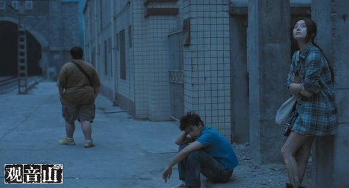
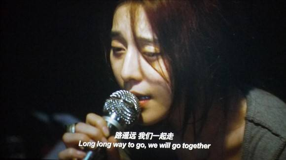
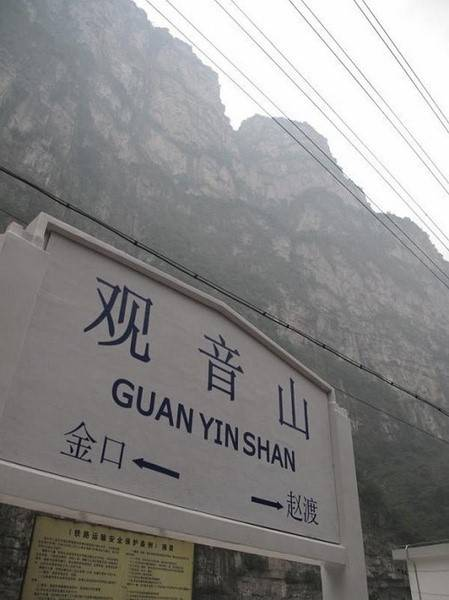

# ＜玉衡＞ 国家这么大，我们算什么？人生这么短，青春算什么？——评《观音山》

**“影片里我最喜欢丁波的一句台词。那是一次他们扒火车漫游，在观音山站下车后准备搭返程的火车回去。一列火车吞云吐雾气定神闲地开过，丝毫未有为这三个年轻人作一丝停留的迹象。在谩骂诅咒抱怨后，丁波说：“我们搭下一班回去好了。”青春没有下一班，如果这该死的火车熟视无睹飞速离去，即便冒着葬身轮下碾为炮灰的风险，我们也得扒上去。”**

### 

### 

#  国家这么大，我们算什么？

#  人生这么短，青春算什么？

#  ——评《观音山》

## 文 / 夏著维（安庆师范学院）

** ** **“那青春的绝望，对我已成遥远的回声。”** ** ****——北岛** ** ** 一直到前些日子，赫尔曼·黑塞才阴差阳错地闯入我的阅读视野。[《在轮下》](http://www.douban.com/subject/2165084)这本薄薄的带有自传性的小说，描摹的时代已与今日相距有余百年，但想必每一个经历过高考的“幸存者”，如有机会读到这部十一万字的中篇，心有余悸者和万般庆幸者，不知哪一类会更居主流。但他们的共性在于，没有谁会在迈过这段湿滑险恶的高考独木桥后，探头朝桥下望去，向坠入桥下的“不幸者”投上哪怕怜悯的一瞥。我们常见的，是不断沾沾自喜顾影自怜地一遍遍复述想当年过桥的高超技艺和无损自身光辉的些许打滑。小说里毛尔布隆修道院的院长语重心长地告诫“交友不慎”的好学生汉斯：“加把劲啊，否则你就被抛到轮下了。”跟《观音山》里丁波不善言辞的扳道工父亲所说的“考不上大学，你还能干什么！？”，内在逻辑就是一句话——“面对呼啸而至的时代车轮，我们必须加速奔跑，它可以轻易地将每一个落伍的个体远远抛下，甚至碾作尘土，且不偿命。” 

### 

### 

电影《观音山》中的三个年轻人（酒吧歌手南风，摩的司机丁波，胖子肥皂）便被这般划分成了同一类失败者——高考落榜生。他们的生活，用韩寒在《青春》一文中的话来说，“方圆几百公里内，连个现实的励志故事都没有。”其中作为唯一一个从县城来的南风，更是在大城市突仄的间隙里漂着。影片一开始展示南风谋生的那间酒吧，和你走在北京后海一带所感受的气氛惊人一致——青春的气息被对物质的欲望所沾染殆尽。由此带来的欲求不满从而滋生的暴力也就顺理成章。丁波打的第一次架，便是为了给南风出头；同样的，南风像《无间道》里的傻强把啤酒瓶掼向自己的脑袋，不过是在替肥皂讨个公道。好勇斗狠是青春的专属徽章，像丁波仅仅在必要时戴在身上，而南风则是钉在里皮肉里，血肉模糊遍体鳞伤。 李玉作为从所谓“地下”浮出水面的新一代导演，在这部志在公映的新片里，汲取了前作《苹果》的“教训”，不再直指那些被我们习以为常的怪象，代之以浮光掠影的蜻蜓点水，但仍有几圈涟漪——丁波的同行被城管没收了吃饭的家伙苦苦哀求却被视若无睹；三人租住的民房因为铁路沿线改建面临拆迁，从而引出了新房东、昔日的京剧团演员常月琴。 

### 

### 

故事自此离《十七岁的单车》对青春躁动不安的一再复调渐行渐远，而是偏向了《我们俩》由误解到沟通造就弥合两代关系的温情路线。常月琴是个老年丧子的独身女人，爱好和职业是传统的京剧；南风是驻唱歌手，丁波则是几年前丧母。在两代人差异造成的隔阂上过多着墨，容易意外产生喜剧效果。李玉在这里表现出了国内导演罕见的控制力，某些台词和情节固然会让你会心一笑（肥皂担负了几乎所有的这项任务），但不显得突兀和分散故事的情感和主线，反倒能够引起部分观众对表象下的思考——究竟是传统本身出了问题？还是我们被全球化浪潮裹挟而不自知的一代人就没有试着去理解传统？ 

### 

### 

影片里涉及这一思考有个很关键的场景：当南风一啤酒瓶下去后满头是血，周围的混混们爆发出是“Fuck”“Shit”这样的英文粗口。而这些东游西逛的无业青年们用以打发时光的，是滑板拳击街舞这样的舶来亚文化。传统敌不过自发的选择，可且慢，究其原因是传统自身所致吗？影片中后段很不“和谐”插入了5.12地震当时现场拍摄的视频：前一秒若无其事，后一秒山摇地动。当常月琴和三个年轻人行进在地震造成的瓦砾废墟中，镜头克制地随着他们的视线缓缓移步。这里的镜头语言没有批判、没有控诉，但到了被震塌的观音庙，里面的佛像支离破碎之时，这个隐喻也就很好辨认了：我们和传统之间不可弥合的鸿沟，是被以“革命”名义随之而来的一场8.0级的大地震造成的。重建观音庙，就是我们和被陌生化和妖魔化的传统，更是我们从何而来的“过去”握手言和的表示。 

### 

### 

而具体到影片中出现的人物，都在试图走出这一步——南风用近乎自残的方式（灌凉白开似的灌白酒）让父亲痛哭流涕不再酗酒；丁波向父亲问清了那个压抑它许久也是致使他高考落榜原因的问题（母亲去世的当年，不在身边的父亲去了哪里），得到了一个颇为心酸的回答(求爷爷告奶奶到处借医药费)；常月琴终于同意把儿子出车祸的那辆车送去维修，开回来一副焕然一新的模样。三条路径殊途汇为一路：既是修葺山上的观音庙，亦是重建心灵的观音山。 

### 

### 

这看上去像是个温情脉脉的结束，和广电的弘扬社会主义道德似乎还有所契合。可最后，在和庙里的和尚一席长谈后，自杀过一次被南风三人救回的常月琴，却在山头微笑挥手致意后，转身坠入山崖。开始看到这一幕，我也有几分不解和突兀之感。可等到观影当下的情绪冷却后，忆起片中之前那些片段，只能说这是李玉对常月琴结局的最好处理。“孤独不是永远的，在一起才是。”要实践这句话，却要付出穿越死亡幽谷的代价，于另一个世界找寻。唏嘘之余，想起了李海鹏在《罡风吹散了热爱》一文中的句子：“我们匮乏一种令人心安的事物，有时人们叫它信念，有时则称之为人类之爱。”当你看到片中丁波把两箱啤酒搬到一个高档小区正在举行的派对时，门开后充斥其间的都是和他年龄仿佛的青年，而他们纵情豪饮，丁波却只能拿到区区40元的运费，还要付出被派对的女主人揩油的代价；南风回乡和昔日的同学K歌，唱至中途痛哭失声，收到的安慰是：“城市这么大，我们算什么？”底下的英文字幕将后半句翻译成“Who cares about us”，这是无奈的呐喊，更是自嘲的控诉。他们仨最享受的娱乐方式，是扒上一列火车，穿行于隧道之间，明与暗，光和影，更是生与死。南风和丁波躺在铁轨上直至火车靠近才匆忙挑起逃离，一旁的肥皂带着被吓破胆的表情凶神恶煞地对他们破口大骂。我们的青春除了世所共有的迷惘、叛逆、躁动之外，唯独多了一样不该有的东西，那便是恐惧。我们怕的不是这一只或那一只老虎，而是不能拥有免于恐惧的自由。 

### 

影片里我最喜欢丁波的一句台词。那是一次他们扒火车漫游，在观音山站下车后准备搭返程的火车回去。一列火车吞云吐雾气定神闲地开过，丝毫未有为这三个年轻人作一丝停留的迹象。在谩骂诅咒抱怨后，丁波说：“我们搭下一班回去好了。”青春没有下一班，如果这该死的火车熟视无睹飞速离去，即便冒着葬身轮下碾为炮灰的风险，我们也得扒上去。 

### 

（责编 刘一舟）

### 

### 
