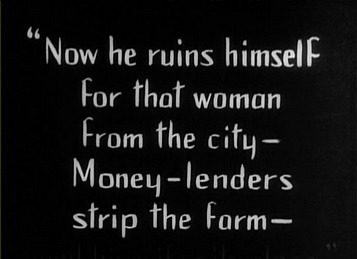
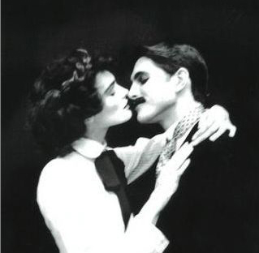

# ＜玉衡＞2011年的默片——《The Artist》

**这只是童话吧。一部有关“默片时代”到“有声电影”过渡的浪漫喜剧。我们每每评论一部电影时都在乎两个方面——现实意义和美学价值。我想，The Artist就该是深具美学价值的那一类佳片了** 

# 2011年的默片

# ——《The Artist》

## 文/侯弋飏（纽约州立大学）

 

这次纽约电影节，我只看了一部电影，《The Artist》。法国电影，法国班底，拍的是美国故事。讲述默片时代的男明星遭遇有声电影的挑战以至发生的种种趣事并最终收获了爱情。

《The Artist》是一部有趣的电影。这是一部喜剧，一部散发着难以言喻迷人魅力的喜剧。导演精彩熟练地动用电影的一切元素——剪辑、字幕、音效——尤其是音效。演员天才地表演更为之添彩。尽管并非鸿篇巨制，亦非主旋律或大愁思，但艺术性和观赏性绝佳的《The Artist》牢牢抓住了观众。

维恩斯坦果然是业界老狐狸——从当年操作《恋爱中的莎士比亚》《低俗小说》《心灵捕手》到《指环王》，要说推销电影，押宝艺术片，哈维维恩斯坦可说是好莱坞少有的天才之一。《The Artist》更是符合他的口味。不温不火的题材，犹如“莎士比亚”或“心灵捕手”，小制作班底，黑马姿态，题材创新，这些都是奥斯卡评委喜欢的。在我看来，奥斯卡向来都是美国众多电影节中较保守的，这也更为《The Artist》加分。我不得不相信，这部法国小制作必然也是今年奥斯卡的一匹黑马，夺奖热门了。

电影说实话中规中矩。喜剧包裹下的悲剧内核，最后阳光积极的结尾。

演员的表演毋庸在影评里赘述。

我唯一想和观众介绍的、也是电影唯一亮点的故事和音效的配合。

音效在这部电影里起到了神来之笔的作用。更因为电影就是有关默片时代的好莱坞，音效的运用更见底蕴，也更为狂放不羁——整部电影模仿当年好莱坞膜片风格，没什么台词。只有字幕，和古典交响乐演奏。

其实一部电影剔除台词——或者说是演员开口说话，导演的叙事会难上加难。毕竟台词是很好地帮助故事发展的良药——再烂的导演，镜头毫无逻辑，观众都看不明白的时候，我们还能靠演员的台词了解剧情走向。但是，没了台词——我的意思是演员们不出声了，那我们则就真的是返璞归真了，真的是看默片了。

所以说默片难拍——1、演员难演；2、镜头不能多。

1好理解，对演员的肢体表现力要求高；

2则是说，导演蒙太奇花里胡哨地一大堆，把演员的表演彻底分解开了，观众只会更迷糊。

所以，我们在《The Artist》里看到了更多的是跟着演员走的摄影机，而非演员按照摄影机的机位走。这样演员自大程度地自由，解放了表演的束缚，肢体语言的魅力淋漓尽致地体现，让我们有了观看舞台剧的感觉——这也就达到了导演的目的——因为通过主观性非常强地插入音效、安排音乐，我们已经不把故事当一回事儿了——我的意思是，我们并非像观看当代好莱坞商业片那样追求对故事、对角色的代入感，因为这种真实感、这种代入感已经被导演打破了。导演随心所欲地控制声音，已经暴露了他对整部电影的掌控，观众无法感觉故事的真实性。所以这也给了演员表演的空间。我把电影看做是一部有关默片的“童话”。演员的表演就是要最大程度地突出戏剧性。

那么说到了音效。

整部电影的剧情最有趣的地方也是因为音效。

男主角是默片时代的明星，影片前半部分，他正当红的时候，交响乐、吹拉弹唱——属于默片时代的音乐被广泛运用（注意，演员们都不出声儿）。接下类，与他相恋的一位女演员逐渐走红，并成为了电影公司“talkies”的当家花旦。“talkies”就是当年对首次出现的有声电影的昵称。与自己相恋的女人更是自己的竞争对手——多么浪漫，却也多么老套啊——依稀让我想到了汤姆克鲁斯和梅格瑞恩的那部《电子情书》。但剧情老套没问题，毕竟讲的是1930年代的故事，而且电影表现手法如此地独特。

音效起到了推波助澜的作用。与真正当年默片追求音效推进故事发展不同，这部当代电影使用默片的形式，其中的音效也就不仅仅是推动故事发展了——音效甚至在电影中算是取而代之所有人物的第一主角。影评中的所有笑料都围绕着音效发生，以至于我们能清楚地感受到“音效”仿佛一个人物的存在——电影中的戏剧冲突因他而起，他惹怒了男主角，俘虏了女主角，而真正重要的是，他取悦了观众。

好莱坞有一条金科玉律：切不可让观众发现摄影机的存在——这也就是为什么很少有导演让演员真正对着镜头说话（当然，你可以举出伍迪艾伦和其他导演的例子。这无可厚非，但要在一部商业片，一部努力让观众入戏的电影中，让观众发现摄影机的存在，则是灾难性的。）

可是例外地，《The Artist》的导演努力让观众意识到摄影机的存在——本来演员的表演就极具戏剧性，更何况导演人为地对声音的调度，更让观众有“出戏”的感觉。但读者们莫不要认为这种“出戏”感有损影片——正是这种“出戏”感，更让观众感觉到一种“类戏剧”的观赏感受。而什么是“类戏剧”？当年最早的默片即是“类戏剧”！所以，导演兜了一个大圈子，却真真实实地返璞归真到了“默片”，此不失为导演用现代电影语言营造默片观感的神来之笔。

重新回到故事上。在春风得意之时，老板劝他出演有声电影。他拒绝了，面对压力。先前一以贯之的交响乐不见了——男演员在化妆间照镜子，喝了口水把杯子放下。杯子碰到桌子发出了声音——这是电影第一次着重地表现现实中的声音——男演员面临着残酷的现实了。

男明星遇到了新崛起的能开口说话的女演员的挑战。事业和婚姻的双重打击——男明星的妻子说：I am unhappy. Why don't you talk? Talk with me!

Why don't you talk?

这是妻子在质问对家庭不闻不问的男明星，也是观众在质问不愿演有声电影的他。

“说话”在这里逐渐变成了一个象征概念。开口意味着进步和革新，缄默则代表了守旧。但电影并没有强加谴责缄默，而是用了委婉地方式允许老艺术家活在自己的世界里——电影到最后，男明星也没有演有声电影，但他则因为跳舞而重新找回了快乐。 我鄙视这种折中的做法。电影并没有真正说清楚男明星为何不愿意演有声电影，也没有说清楚为何他愿意跳着舞重回银幕。

这只是童话吧。一部有关“默片时代”到“有声电影”过渡的浪漫喜剧。我们每每评论一部电影时都在乎两个方面——现实意义和美学价值。我想，The Artist就该是深具美学价值的那一类佳片了！

电影制作精良，古韵悠长，表演精湛，故事生动。散场后，各位主创登台，但我已无意留席了，唯一的亮点是看到了男主角——今年戛纳影帝获得者。

 

（采编：尹桑；责编：尹桑）

 
