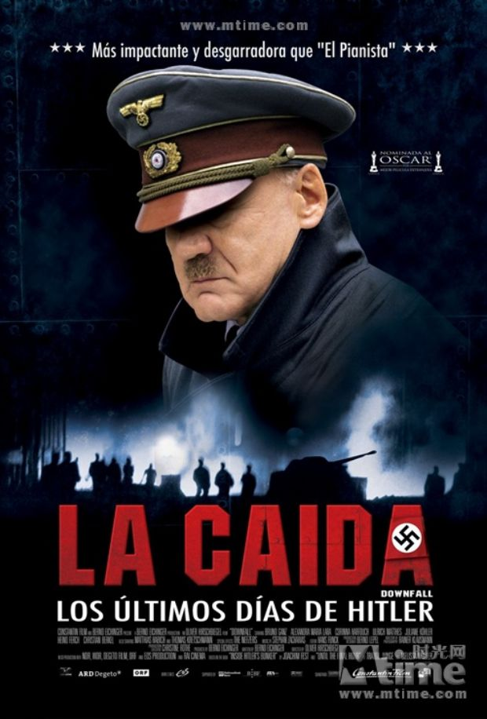
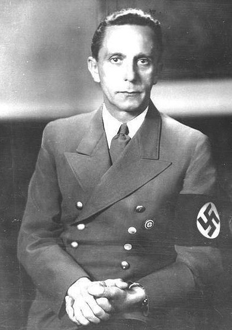
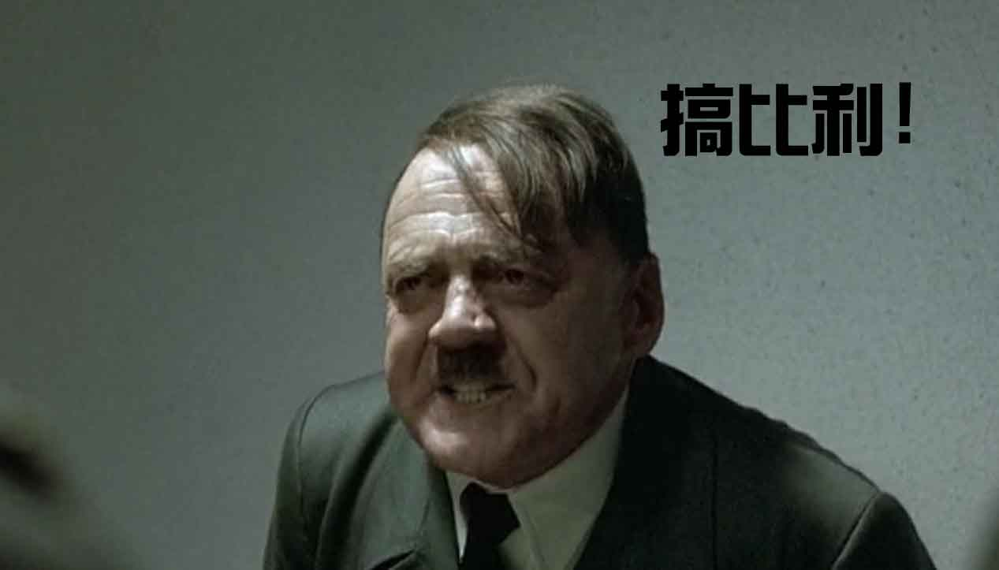

# ＜玉衡＞Der Untergang 帝国的毁灭

**法西斯的邪恶不仅仅只是某个人，某个集团的邪恶，恰恰相反，邪恶存在于我们每一个人的身上，每一个人无形中都是纳粹，二战是一场人类在特定时间特定地点所爆发出来的，有的被发现，有的被掩饰的集体罪恶，都不可饶恕。帝国在1945年4月30日宣告陷落。而其实所有的人手都不干净，我们都是纳粹的一份子。希特勒是恶魔，我们都是。**  

# Der Untergang

# 帝国的毁灭

## 文/孔德罡（南京师范大学）

 

《帝国陷落》的视角，再也不是主流价值话语中邪恶轴心大快人心全民欢腾的穷途末路，而是一个文明的堡垒在废墟和火焰中湮灭殆尽的古典悲剧。就像罗马。就像大明王朝。是沦陷，是无可奈何花落去，是被历史车轮所碾压，伸出手来触不到未来的哀婉。

这些情绪是不应该在一部描述纳粹的最终毁灭的电影中出现的，六百万犹太人的累累白骨白纸黑字的无声控诉，纳粹发动的战争带来的千万伤亡冤魂摇摆，你希特勒，你纳粹做出的事情就是一个不可饶恕的恶魔所为，于是你本人，也就是不能翻身的恶魔，沦为一个符号，苍白的邪恶标志，没有动机，没有灵魂，只有邪恶。

纳粹在美学上始终有一种超越伦理的吸引力。美是可以不道德的，拥有着罪恶的自由，美和道德完全可以陌路而行，一切道德的评判终究将是对于某种美的扼杀。西方艺术史总绕不过纳粹艺术的章节，纳粹分子们精心创制的仪式，符号，美术，建筑，电影，服装都是美学史上令人难以忘怀的里程碑。你或许会因为骨子里的邪恶而敬而远之，但你之所以不敢接近这些的根本原因，不过是因为它们实在是难以抗拒的诱惑，是迷醉而动人的恶之花。

谁也不能因为纳粹有过滔天罪行而去否认：在里芬斯塔尔的《意志的胜利》中被忠实展现的纽伦堡大集会，是人类文明所举办过的最完美最恢弘最有力量的盛典；希特勒那句“要让德意志的孩子们看到军服就想加入军队”，又创造了人类军事史上最为迷人的制服诱惑；而建筑天才施佩尔和希特勒共同构建的未来柏林，也荟萃着人类对于城市建设的最高理想，诸如此类。看着纳粹的陷落，作为一个难以体验犹太人哀怨的外来人，就宛如亲眼凝视着美的消逝，伟大沦为低贱，辉煌刹那毁灭。

于是罪恶感弥漫着每一个看着《帝国陷落》的人心中，我们反复在潜意识中告诉自己这个腐朽邪恶的帝国的灭亡是罪有应得，但却实在不能放弃对于那些在地堡中等待末日的人最深沉的敬意和怜悯。或许，信仰就是有这样超越善恶和伦理的力量，哪怕这信仰是多么邪恶多么反人类，真正奉行这样的信仰并为此宁愿付出生命的人，无论如何都值得尊敬。有一些人类普遍认同的观念与所谓的价值观无关，日寇也会对于奋勇抵抗他们而牺牲的中国军人鸣枪示敬，而我们也终究会怜悯那些为了纳粹而殉国的将领，并对于背叛的希姆莱，戈林，费德莱因投以鄙视的目光。他们是为了自己的信仰和祖国而死，这是他们的选择。

有时候我们在追求解放，开拓新世代的过程中，将对于“人”的发现，将人性总是奉为圭臬。于是在冠冕堂皇的大旗之下，“人性”就像“理性”一样，成为一尊不可撼动不可质疑的神像。实际上，这和压抑人性的过度限制没有本质的区别，只是从一个极端滑落到了另一个极端。如果戈培尔夫人真正发自内心地热爱国家社会主义，真的坚信没有国家社会主义就没有未来，自己的孩子不能在没有国家社会主义的国家中生活，自己杀死他们是为了他们好的话，她亲手杀死自己的六个孩子的看似丧尽天良的行为就不是泯灭人性，而恰巧就是一种母性。人性不是一种标准，而是可以被信仰所改变的，人性不存在善恶，需要的只是评判。就像当年崇祯皇帝一刀冲着自己的女儿挥将过去，那是人性在特殊情境下的一种异化。

我们不说那些毅然决然自杀的将领们，尽管他们没有任何犹豫的枪声总是令人数次心魂震颤，我要说的，是电影中三对相约自杀殉国的男女。希特勒和他的爱娃，戈培尔夫妇和那对童子军情侣。我永远对于这样的场景没有抵抗力。在我看来，无论是为了多么荒谬的理由，无论这些行为显得多么愚蠢，只要这一对璧人彼此清楚自己在做些什么，心心相印共同放弃生命，那是多么凄美而不可辩驳的选择。希特勒最后的岁月是孤独而可怜的，这个所谓的独裁者在生命中的最后十二天，不过是一个孤立无援丧失希望的老人而已，在自身的绝望和幻想所构建的癫狂泥沼中万劫不复。在所有的将领都不再视他为神，甚至有些人都开始背叛，四面楚歌的炮声笼盖柏林的时候，还有一个女人愿意和他一起去死，尽管爱娃永远也无法了解自己爱人的本质究竟如何。他们4月29日结婚，4月30日双双自杀，被人抛弃的元首在生命旅途的最后，还是有了一个永恒的伴侣，有一个女人始终追随着他，直到终结。

而那对童子军和戈培尔夫妇，更是向我们展现了在信仰驱动下的行径，女性所独有的感性掌控力。这两对自杀的男女在殉国的过程中，本该是主导地位的男性却站在了服从的一方，女性毅然成为了语境中的主导者。这两个女人表现出的，是比他们的爱人更为深刻的信仰，对于死亡的深沉蔑视和毫不恐惧。她们都举起双手，等待着他们的男人扣动扳机，然后带着无尚的幸福和满足倒在血泊之中，独留另一方再拿起刚刚杀死自己心爱的人的手枪，再将自己的生命击碎。然后他们死在一起，为了共同的信仰，也为了他们之间的爱。

最后我们看见荣格夫人骑着自行车逃了出来，然后又看到已经垂垂老矣的荣格夫人对于自己过去的忏悔。可是我始终不理解她的忏悔。她什么也没有做错，虽然她没有做出有益于世界的好事，但是仅仅一个希特勒的私人打字员，又为何必须背上这些纵贯一生的罪恶包袱呢。如果一个人仅仅因为没有做好事就被谴责就被认为有罪，那么这个新时代又和纳粹有什么样的区别可言。然后我查阅了史料。真实世界里的荣格夫人没有那么容易就逃出了柏林。她被苏联军队逮捕，居然以“纳粹高级官员”的身份被关押监禁，然后惨遭苏军数次的强奸。强迫这样一个可怜的受害者在电影的末尾以加害者的身份去忏悔所谓的罪恶，和纳粹屠杀犹太人一样残忍。六百万犹太人死不瞑目，我相信2002年去世的荣格夫人也同样如此。

我不经意间再次想起了那个时代没有国别包括欧美的排犹浪潮，想起大清洗和卡廷惨案，甚至想起那北美大陆上几乎被屠杀殆尽的印第安原住民。原谅我，我无法对于面前这一地狱般的末日之城柏林投以任何天理昭彰的快感，我看到的只是一个辉煌而美丽的梦想被击垮的全过程，我只看到了那些人儿被投入了漫山遍野的恶魔地狱。

希特勒，纳粹他们可以作为恶魔的代名词，这是语境和符号的权利，但是他们本身，却绝不仅仅是非人的恶魔而已。就像戈培尔所说的，“是德国人民选择了我们，让我们掌握了权力，那么他们自然要为他们当初的选择付出代价。”这固然是纳粹党徒的狡辩，但是也时不时提醒着我们，法西斯的邪恶不仅仅只是某个人，某个集团的邪恶，恰恰相反，邪恶存在于我们每一个人的身上，每一个人无形中都是纳粹，二战是一场人类在特定时间特定地点所爆发出来的，有的被发现，有的被掩饰的集体罪恶，都不可饶恕。

帝国在1945年4月30日宣告陷落。而其实所有的人手都不干净，我们都是纳粹的一份子。希特勒是恶魔，我们都是。

 

（采编：张希；责编：黄理罡）

 
