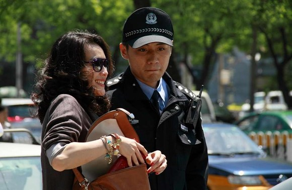
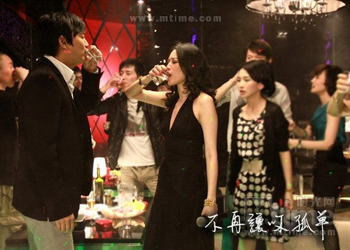
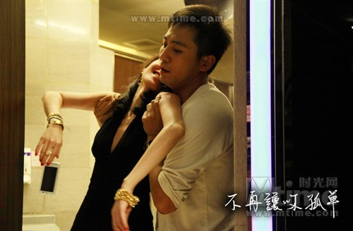

# ＜玉衡＞“孤单不是永远的，在一起才是”——评《不再让你孤单》

**人性之复杂不是好坏二字可以囊括，爱情亦如斯。那些肉欲、小心眼、嫉妒、怀疑、算计同样也是爱情的一部分，如果刻意回避，那就成了《山楂树之恋》。正因为有“转网风波”在先，《志明与春娇》最后余文乐那句“有些事不是非得一个晚上做完，我们又不赶时间”才会确凿无疑地打动每对现实中渴慕爱情的人。本片里，最后走在一起的佩如和镇东，彼此实践了“路遥远，我们一起走”的承诺。** ** **

# “孤单不是永远的，在一起才是”

# ——评《不再让你孤单》

## 文/夏著维（安庆师范学院）

 **“那时我们在街边的暮色里，现在我们在一间把自己打扮成东南亚或者西班牙风格的酒吧里，孤独是永远不变的。”——李海鹏《罡风吹散了热爱》** 

刘烨演过许多北京背景的角色，《无人驾驶》中，在三里屯Village内的喷泉下热吻过高圆圆便是他。于是当他在这部《不再让你孤单》里自报家门姓方名镇东时，不知可曾触及二十二年前，那个负笈京城的大学生蓝宇恋人捍东的名讳。 在电影的前半部分，刘伟强对刘烨饰演的片警方镇东的塑造，不知是我的错觉抑或别的什么，恍惚间仿若穿越回了王正方《北京故事》发生的年代。那个 时候“步调未若现时急切，人心也不似现时浇薄”（慧远语），王小波在《京片子与民族自信心》一文中不无怀念地描述当时北京饭馆里“在粗话词汇量方面不亚于 门头沟老矿工”的女服务员——“骂人的小姐虽然粗鲁，人却不坏，既诚实又正直，不会看人下菜碟，专拍有钱人马屁——这倒不是谬奖。八十年代初的北京小姐， 就是洛克菲勒冒犯到她，也是照骂不误：‘别以为有几个臭钱就能在我这儿起腻，惹急了我他妈的拿大嘴巴子贴你！’断断不会见了港客就骨髓发酥非要嫁他不可 ——除非是领导上交待了任务，要把他争取过来。” 可能刘导也是为了说服观众，把方警官的家安在了北海公园永安寺附近的一座四合院内，且三两镜头侧面烘托了邻里之间的相互关照。此外，不时强调镇 东经济上的拮据（晚上唱歌提前退场只因不愿多花钱在交通费上）。这两者并行对我而言多少有点啼笑皆非的矛盾感，记得一次在帝都步行途经一家四合院房产中 介，LED屏幕上的标价高到足以让人咋舌。香港电影人北上神州，误读也在所难免，较这个真实无必要。不过究其背后的文化潜意识，倒颇有几分玩味之处。 

、

影片中，舒淇扮演的“港女”李佩如前来帝都打拼，惯用手段却是陪酒做小三。而只是和她在KTV男厕所偶遇的北京警察刘烨，却也不计较她这一身份 （影片里镇东对佩如说漏了嘴后立刻向她保证“我是警察，警察最会保密了”），还随叫随到任劳任怨不求回报甘心付出（把那么值钱的四合院卖了借钱给她开房产 中介公司，想想《无人驾驶》里陈建斌的下场吧）。容我过度诠释一下，这恐怕是有些港人对大陆一厢情愿寄予的希望。被殖民的历史无论怎么说，多少也和做小三 一样，依附于一个强大的客体混口饭吃，多少谈不上光彩，说严重点，这或许是香港的“原罪”，至少是期望被解开的心结。李佩如最后是钱债情偿，方镇东也是欣 然纳之，好一副中港一家亲的和谐画卷！ 

如果本片仅仅是停留在这个档次，估计我光顾着心疼那二十五的电影票钱了——片中刘烨对二十七块的车费还念念不忘呢。之所以还在写这个东西，多少 还是觉得曾拍出过《无间道》的刘伟强，在洞悉人性基础上所塑造的男女主角——尤其是舒淇的角色——还是很有层次和深度的。她拜金物质，也野心膨胀：“你以 为女人爬上爬下最后都爬到男人的床上？”更有一般人毋庸讳言的阴暗面，如酒后在胡同里恶狠狠地说：“连一个哑巴都有人爱，为什么我没有！？”对刘烨角色也 有利用的成分，如开业遭到物业阻拦时喊镇东来，用她的话：“我让你这个警察过来，是让他们滚的！”《鲁豫有约》中刘烨就评价舒淇说：“我也合作过很多女明 星，就感觉他们在塑造人物时，尤其是演到这个人的缺点，会有意无意往模棱两可的演，让观众觉得不是很坏。我非常讨厌这样。舒淇就不。”人性之复杂不是好坏二字可以囊括，爱情亦如斯。那些肉欲、小心眼、嫉妒、怀疑、算计同样也是爱情的一部分，如果刻意回避，那就成了《山楂树之恋》。正因为有“转网风波”在先，《志明与春娇》最后余文乐那句“有些事不是非得一个晚上做完，我们又不赶时间”才会确凿无疑地打动每对现实中渴慕爱情的人。本片里，最后走在一起的佩如和镇东，彼此实践了“路遥远，我们一起走”的承诺。 相濡以沫偕手终老，孤单不再爱情长存。 How about U?  

（采编：谷 卿；责编：黄理罡）

