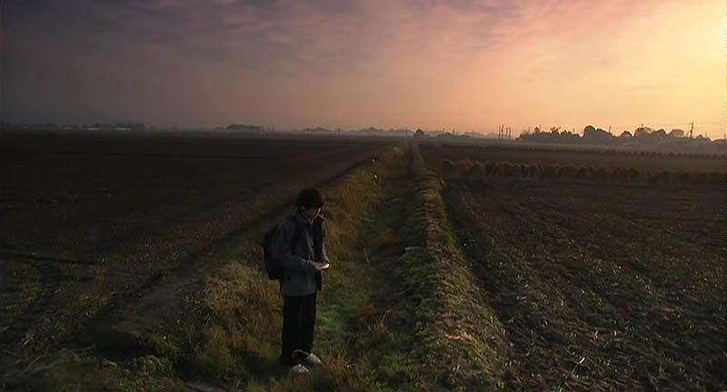
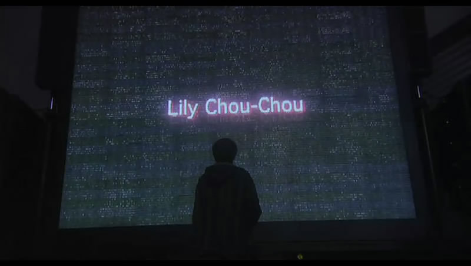

# ＜玉衡＞《关于莉莉周的一切》：在天籁之声中凋谢的青春

 **因为这是一个躁动的年代，无处安放的正是不羁的心灵。星野的变化虽然令人费解，但实质上却是源于无处排遣的寂寞，当一种人生得不到认可时选择另外的道路就成了必然，他对莉莉周音乐的痴迷恰恰是其心灵上无人共鸣的最佳注脚。**  

# 《关于莉莉周的一切》：

# 在天籁之声中凋谢的青春

## 文/ 昨夜西风（山西大学）

 

这不是一部“好看”的电影，同时这又是一部耐看的电影。冗长的篇幅和缓慢的节奏以及被字幕不断割裂开来的情节会让很多人感到困惑和乏味，但它却诗意地反映了不可捉摸的青春以及发生在青春里的那些猝不及防的事件。岩井俊二的这部作品中充满了突然，片中所有事件的发生都毫无前兆令人措手不及，或许这就是不羁青春的特征，美丽残忍并充满了变数。

《关于莉莉周的一切》是一部色彩艳丽的影片，碧绿的稻田、湛蓝的天空、白色的衣衫和鲜红的火车座椅，然而在这五彩缤纷的美丽世界里发生的却是残忍的故事，更残忍的是故事发生在本来充满朝气的几个少年身上。这种现实和人生的强烈反差，首先在影片的色彩上得到了忠实的贯彻。特别是到了影片最后，灰蒙蒙的背景下是灰蒙蒙的人群，杀人者和被杀人者都笼罩在灰蒙蒙色调中，美丽的现实被打破之后，倒下的青春、淌血的青春和被刺痛的青春都变得毫无光彩。

在一次冲绳旅游之后，少年星野的性情发生了巨大的变化，由此而导致了这个关于青春的故事发生了惨烈的变化。当一个品学兼优的学生从正常途径不能得到认可时，行为方式发生改变也在情理之中，冲绳之旅不是星野性情变化的根源但却是一个转折，旅途中的死亡事件对星野的影响却是惨痛的。尽管如此，影片关于星野的变化仍然显得十分突兀，但是这种突兀看上去倒正像影片所刻意追求的，它如一把锋利的匕首划破了静谧安闲的生活，也成为影片前后不同基调的分水岭；而作为星野修介曾经最要好的朋友莲见雄一在影片最后成为杀人凶手，和此前他任人欺凌的懦弱表现判若两人，实际上是星野逐渐摧毁了他的精神世界，最后在莉莉周演唱会发生的事情不过是长久积郁之后的爆发；津田被迫向成人提供性服务之后，在毫无征兆的情况下选择了自杀，而久野被强暴之后却令人意外地把自己剃成光头，表情平静地出现在学校。这四个少年男女身上发生的事情在事先都没有任何预兆，那种突如其来的变化在晃动的镜头下在悦耳的音乐中有一种真实的凌厉。

莲见、久野、津田的命运表面看起来是因为星野的变化而引起的，实际上包括星野在内，都受害于现代社会人际交流上的种种弊端，即使在网络出现之前复杂的价值取向和多变的世界观已经让人眼花缭乱了，在网络出现之后这种因严重脱离现实的虚拟而引起的人精神世界的混乱更成为严重的社会问题。作为处于青春期的少年男女首当其中成为受害者，因为这是一个躁动的年代，无处安放的正是不羁的心灵。星野的变化虽然令人费解，但实质上却是源于无处排遣的寂寞，当一种人生得不到认可时选择另外的道路就成了必然，他对莉莉周音乐的痴迷恰恰是其心灵上无人共鸣的最佳注脚。当破坏成为星野展示实力的唯一途径时，莲见、久野和津田的命运已经成为定局，只是岩井俊二让这三个人物的结局表现得同样不可捉摸，正是暗合了混乱迷惘的青春原色。

有想法的导演总是很喜欢风格化的拍摄手法，关于本片，手提摄影机的放肆使用可谓最大特点，在让人不适的同时，却极好地配合了影片的题旨，晃动的镜头和残缺的画面，实际上正映照了青春年少的不可捉摸和不健全的人格特征。而色彩和配乐又让岩井俊二的作品充满了诗情画意，即便是这样一些残忍的事件也被赋予了某种神秘空灵的色彩，这其中飘渺动人的歌声是影片的另一大特色。日本音乐人小林武史为《关于莉莉周的一切》的所作的配乐极好地烘托了影片的氛围，让这些关于青春和时代的故事在残忍中美丽着。

 

**（采编：安镜轩；责编：陈锴）**
