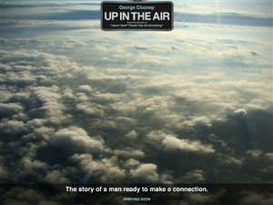

# ＜玉衡＞《在云端》：别样的风景

**就像片中那个毕业于名校康奈尔大学的青年女职员Natalie，她的愿望无非是找个喜欢动物、能够有着和善的微笑的男人，结婚生子，以免孤独老去，但她理想的恋爱突然被终结，Ryan那句犹如当头棒喝的“Finally you will die alone”使她更加无措，这时，我们更应该倾向于哪一种意见和态度呢？其实，不同价值观的碰撞一直在影片中出现，即使是在一个人的思维过程和生命历程中，也不可能一直为一种价值观所完全掌握和操控。我们不断碰壁、不断失败，其实这也是我们在不断地了解和体悟人生。**

### 

### 

# 《在云端》：别样的风景

### 

## 文/谷卿（暨南大学）

### 

### 

有人说Jason Reitman的作品大多是以残酷为主题的，包括这部又被称为“寡佬/型男飞行日记”的《在云端》。影片从一开头就不断地展示那些在被告知失去岗位的消息后所产生的各种反应和各表情，而事件与影片的主角Ryan则以一种颇为机械的言行在处理这些裁员事务，同时过着看似丰富多彩、华丽光鲜，实则年复一年、一成不变的无趣的日子。这种高强度的却如温水煮蛙一般的生活确有一种残酷的意味，但并非了无生机。纵观整部影片，其实它很好地体现了真实生活中的那种忽明忽暗、忽高忽低的本质特征，轻松而又沉重、优雅而又俗媚、快慰而又悲伤，而我们的生活恰恰就是如此难以捉摸——不论你脚踏实地还是身处云端。

“孤独”始终作为一个生活状态和情感状态的标签牢牢地贴在Ryan的身上，在很多人看来，孤独是一种潇洒，当然也有很大一部分人认为选择孤独是非正常的生活方式。Ryan却有着自己的看法，这在他同自己的准妹夫的交流中表达得特别充分，可是这次沟通显得非常奇怪：Ryan以一个独身主义者的身份去劝说别人尽快迎接婚姻、享受婚姻带来的幸福，事实上他并没有这样的成见；然后当妹夫丢掉包袱牵起爱人的手时，却带来了Ryan的改变。他终于鼓起勇气去找Alex见面，对即将开始一段美好的感情充满希冀；然而2当他来到Alex家的门前，看见前来开门的Alex身后的孩子的身影、听见屋内Alex丈夫询问何人来访的声音时，我们仿佛也听到了花瓶碎裂之声。确实，Jason Reitman的残酷，就以这样的方式突然地袭击了我们。

有意思的是，Ryan的飞行里程在他无精打采、几乎一蹶不振之时达到了一千万英里，当这个他期盼已久的数值与时刻终于来到的时候，他似乎已经没有了兴奋和快感。此时，那位犹如圣诞老人般的机长坐在他身旁，问他想说些什么，Ryan想了想后摇摇头：“我已经忘记了”。其实，这种忘记相当于刷新，在Ryan “忘记”的时候，他开始接触到生活的真意，人生就是一段不知终点也不知里程的旅途，在这个漫长的旅途中，或许会出现惊喜、失望、欢乐、惆怅、兴奋、忧伤，或许会出现很多Alex所说的“插曲”，这些插曲有可能很长也很真实，但它们总是插曲，终归是作为一个偶然和片段而存在；人生的意义在于不断地完成这一个个有限的“一千万英里”、不断地忘记当初预想的达到这一个个“一千万英里”后想说的话语，也许我们有真正属于自己的感情，但我们更有真正属于自己的生活。

我们似乎应该特别注意到影片中的两件事物，一是Ryan的背包，他在演讲中不断地以这个背包为主要道具，描述和阐释着自己清空背包、轻松上路的理论和理想，这犹如佛家所说的“放下便是”；另一个则是妹妹和妹夫的合照像板，妹妹要求他每到一处都要用像板放在当地的著名景点或建筑的前面留影纪念，相当于他们真的来过。这两件事物或言符号与它们各自背后的意义形成了巨大的张力，一个要求少、要求无，一个要求有、要求多，一个是放下、清空，一个是拿起、填满，那究竟哪一种才是我们应有的生活态度和理念呢？就像片中那个毕业于名校康奈尔大学的青年女职员Natalie，她的愿望无非是找个喜欢动物、能够有着和善的微笑的男人，结婚生子，以免孤独老去，但她理想的恋爱突然被终结，Ryan那句犹如当头棒喝的“Finally you will die alone”使她更加无措，这时，我们更应该倾向于哪一种意见和态度呢？其实，不同价值观的碰撞一直在影片中出现，即使是在一个人的思维过程和生命历程中，也不可能一直为一种价值观所完全掌握和操控。我们不断碰壁、不断失败，其实这也是我们在不断地了解和体悟人生。

在影片的最后，再度成为独身者的Ryan还是选择了重新上路——频繁地奔走于各地似乎才是真正属于他的生活。是的，选择一直行走在云端也是一种不错的生活方式，飞累了，偶尔在云端歇歇脚，或许你还能看到那些平常看不到的别样的风景。

### 

### 

（采编：安镜轩 责编：黄理罡）

### 

### 
