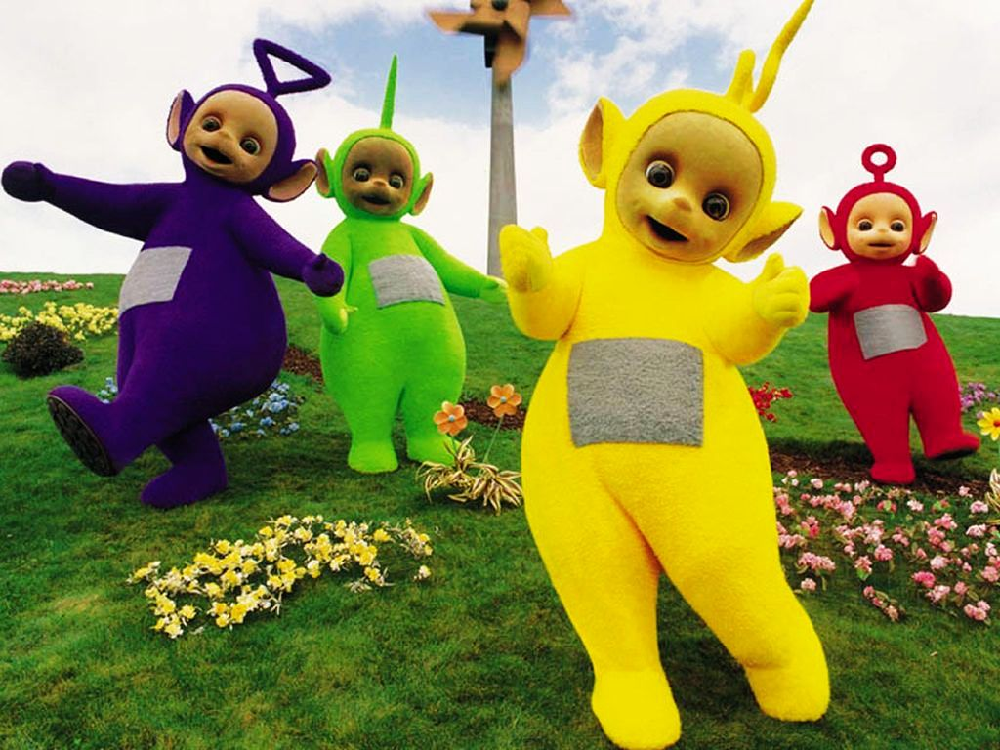
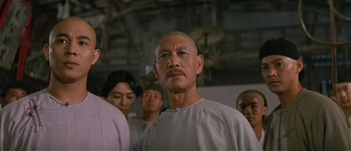

# ＜玉衡＞《武侠》：这不是一个雷人的决定

**“风格先行”一直都是武侠片的基本特征，这是这类影片的特性决定的，武侠片若没有一个异于现实世界的风格就很难立足。而自从《卧虎藏龙》开始，中国武侠电影一直都在外在包装上进行尝试，特别是来自影像风格上的不断强化，成为这一时期武侠片的一个特点。**  

#  《武侠》：这不是一个雷人的决定

## 文/ 昨夜西风（山西大学）

就从影片那个所谓“雷人”的结尾谈起。教主正在大施淫威的时候被雷劈死了，这个带有无厘头色彩的结局首先会让人一愣，然后大概就会忍俊不禁。第一，教主王羽被雷劈死的几率很小很小，但概率小不等于不存在，而徐百九在他头上脚下插入的针起到引雷的作用也有一定的科学根据，所以大教主被雷劈了是可能的；二，假设大教主不是被雷劈死，那么最后只能有两种结局：其一教主突然善心大发，放了刘金喜一马。但看过电影目睹了老家伙的残忍无情之后，我们会清楚，这比他被雷劈的概率更低。另外一个结果就是他被刘金喜干掉，以最后刘金喜奄奄一息的状态能否做到这点很成问题，就算做到了，那么这样一个结局又和过往大多数武侠片甚至好莱坞动作片的结局有什么区别？一部结局尽在观众掌握中的类型片的价值肯定是大打折扣的；三，大教主死了，在正义力量无法将他终结的关键时刻被老天收了，从道德、宿命去看都符合中国人的传统观念，这种带有教化意味的故事概念一直都是文学影视的主流，这从全世界的电影中能得到证实；四，作为一部商业电影，《武侠》的这个结局其实是在意料之外又在情理之中，它为观众提供了娱乐化的另一种可能，这便是这个“雷人”结局的价值所在。调侃这部电影很容易，这主要取决于观影者的个人感受。但是如果从摄影、声效、节奏、动作设计甚至表演等技术角度去看，我相信很少有人能令人信服地贬低本片。所以，大部分争议还是集中在了《武侠》故事内容的合理性和它到底算不算是“武侠片”的问题之上。

这的确是一部“风格先行”的电影，但这又是一部为中国武侠片的新发展提供了新思路的影片，个人以为这倒不是陈可辛在搞怪，实在是在传统武侠电影日益式微情况下的无奈之举，因为以往那般“单纯”的武侠片早已失去了吸引力，《黄飞鸿》系列的盛况很难重现。

#### 

#### 

陈可辛说他的《武侠》是“风格先行”，我倒以为“风格先行”本来一直就是中国武侠片的一个特征。回顾历史上的武侠片，其故事模式大部分都趋于简单粗糙，甚至是僵化机械，但为什么我们很久以来一直认可这种模式？是因为“武侠”本来就是中国人特有的一种理想化的世界状态，换言之，这种世界状态是和真实世界有一定差距的。正因为如此，中国人包括很多西方人才会对武侠世界中的武打轻功、快意恩仇和奇异诡谲产生浓厚的兴趣，也就是说在很大程度上看武侠片看得并非故事内容本身，而恰恰是其外在形式。所以武侠片从一诞生起就决定了它必须是“风格先行”的，无论是早期的邵氏影片还是新时代的《卧虎藏龙》、《英雄》、《剑雨》等，都是先架构起一个超越于现实的环境才能进行故事。于是，我们回头再看陈可辛的《武侠》的创作出发点，无论是所谓的“科学武侠”、“微观武侠”还是“医学武侠”，都是力图创造一种引人注目的形式，都是为了让“武打”这一武侠片的基础表现形式更有看头。有很多人认为《武侠》不能算是“武侠”，特别是传统港片的爱好者更是这样，可一个残酷的现实是，传统模式的武侠片大多数人都不再感兴趣了，观众的口味在变化。正因为这不断变化的市场需求，才让李安的《卧虎藏龙》得到了奥斯卡的肯定，张艺谋的《英雄》取得了票房上的成功。历史地去看，中国武侠片一直都在进行“风格先行”的变化，当年张彻、胡金铨、徐克都在推动这种变化，李安、张艺谋、陈可辛等“非武侠专业”的导演也在推动这种变化。近年来出现的武侠片都存在口碑两极分化严重的现象，也在一定程度上反映了中国武侠电影在求变求生存中遇到的认可难题。

陈可辛的这部《武侠》的“微观”、“医学”和“科学”等概念的提出，的确为武侠片的“武打”带来了某种革命性的变化，但是这种变化似乎是不能复制的，任何导演的下一部武侠电影中，和“微观”、“医学”、“科学”有关的武打设计必然会流于俗套。《武侠》在内容上真正值得探讨的是它内容涵盖的广泛性和武侠外延的拓展性上。

一开始徐百九对刘金喜的过往穷究不止，坚持将之绳之于法，以至于影片的主题变成了对法律的探讨，而“武侠”几乎成为了一种点缀。片中关于法律和人性的一些讨论很有思想性，从法律的角度讲，一个人犯了法必须接受制裁，无论他内心懊悔到了何种程度。联系现实，我们可以得知药家鑫杀人之后一定很后悔，但这不能成为他逃避制裁的理由。刘金喜可以说已经成为一个没有侵略性的“好人”了，但他毕竟残忍地杀过人，徐百九对他的追究没有任何问题。在现实中，药家鑫的结局是没有任何讨论余地的，他必须去偿命。而电影的好处在于，它可以人为设计一种情景，它可以设计出刘金喜和妻儿的天伦之乐，设计出他的为善乡里，设计出他的见义勇为，可以设计得让观众对他充满同情，让人人都希望徐百九可以既往不咎。因为在电影中，刘金喜显然已经变成一个对社会有用的人，他活在世上对社会和家庭的意义远远比让他坐牢和杀头更大，更何况到了最后，为了维护家庭和村庄的安危，刘金喜不惜和邪教教众以命相搏。断臂的惨烈和决绝更是让观众坚决地站到了刘金喜的一边。那么刘金喜真的无害了吗？徐百九说他不相信人性，我也不相信人性。社会的和谐靠人性来维持显然是不现实的，刘金喜可以十年做好人，但未必能终生不再伤及无辜，真正能控制刘金喜的终归还是法律，所以法治社会一直是我们想要追求而不可得的理想，至少中国目前的社会现实让人未免失望。当然，这些已经不是《武侠》所准备探讨的问题，但是徐百九的话可以引发这样的感想。而和徐百九的秉公执法截然相反的其他“政府人员”无疑已经走出了电影，活生生地出现在了我们的社会中。所以《武侠》无意中（或者是有意）为“武侠片”的种类提供了新发展方向，既然金庸的武侠可以是“讲政治”的武侠，那么银幕上的武侠则可以在“法律武侠”中进行合理取舍。毕竟在今天，江湖仇杀、家国恩怨、置身世外已经不是时代主题，武侠片何不另辟蹊径？世界是变化的，“武侠”二字的含义是可以有变化的，那么既然如此，“武侠片”究竟是什么样的，谁能定死？

#### 

#### 

但是影片最后秉公执法的徐百九还是站到了刘金喜的一边，参加到了阻击邪教的战斗中。当然，这和他维护正义的信念是不矛盾的，或者我们可以说他抓住了矛盾的主要方面。当此之时，和一个曾经杀过人但想改过自新的杀人犯一起阻挡危害更大的邪教显然是当务之急。其实到了这一步，《武侠》才真正走回了“传统武侠”的路子上，即为了下层民众的安危，习武之人担当起除暴安良的责任。除此之外，《武侠》显然在复制香港电影中经常出现的那种“双雄争斗”模式，即有由于阶层立场不同所导致的敌对矛盾，又有超越法律让道德和情感升华的惺惺相惜，这种模式当以吴宇森的《喋血双雄》最具代表性，而师从张彻的吴宇森的很多电影其实本身都有“武侠”的成分。由此可以看出，其实从根本上看陈可辛的《武侠》走得并不太远，只是在形式和内容上进行了丰富，增加了很多具有观赏性和思辨性的东西，于是这部名为“武侠”的影片成为了一部包含了悬疑、推理、惊悚等类型元素的电影。如此，《武侠》是否是“正宗武侠”已经不再重要，重要的是它能否为观众接受。徐百九和刘金喜都是两个有激烈内心斗争的人物，徐白九的同情心一直在和自己为之服务的法律的严肃性进行抗争，而刘金喜则一直和自己罪恶的过去进行斗争。这几乎已经成了这种“双雄”电影固定的模式，只是显然片中两人的心路历程的展示尚不够舒服力，这就造成了在徐百九和刘金喜的人物结构对接上的略显生硬，但在这样一部具有实验性质的电影中，这一缺陷是可以被接受的。

“风格先行”一直都是武侠片的基本特征，这是这类影片的特性决定的，武侠片若没有一个异于现实世界的风格就很难立足。而自从《卧虎藏龙》开始，中国武侠电影一直都在外在包装上进行尝试，特别是来自影像风格上的不断强化，成为这一时期武侠片的一个特点。张艺谋的《英雄》、徐克的《狄仁杰之通天帝国》、乌尔善的《刀见笑》无不在形式上追求新和异，乃至未免呈现形式过分大于内容的兆头，可这几乎是武侠片难以克服的一个缺点。而《武侠》的不同之处在于，没有过分营造影像上的先声夺人，而是试图利用西方电影理念给武侠片注入新的东西，同时也想让武侠片包含更多的故事内容，在这一方面做得比较好的还有去年吴宇森监制苏照彬执导的《剑雨》。例如两部电影中都出现了关于佛法理论的情节，都想让“武侠”的内容更加生活化，更贴近现实。让我们的“江湖”更现实，让我们的“武侠”更生动，这恐怕是中国武侠片将来的一个发展趋势。所以，《武侠》的创作并非一个雷人的决定，而是一种积极的尝试。

 

（采编：安镜轩；责编：陈锴）
