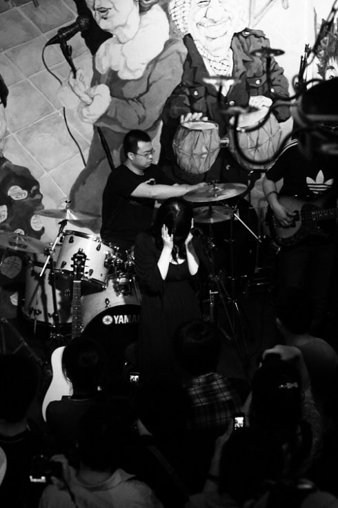
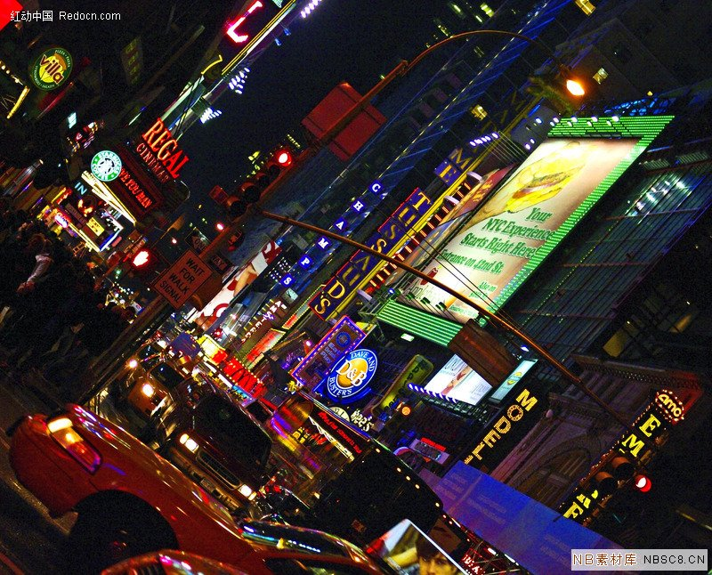

# ＜玉衡＞《活得像个笑话》——异端的孤独

**他们不知道，这个时常穿着睡衣来向他们买菜的女人，和舞台上那个撕声裂肺的摇滚女歌手、和传说中非常“厉害”的女记者，有任何联系。他们从来没听说过幸福大街，也没看过什么南方某某周刊。在这个国家，每一端的人与人之间，就像隔了一个宇宙那么遥远。**

# 《活得像个笑话》

# ——异端的孤独

## 文/覃仙球（国立政治大学）

<一>

洪晃说：“我特别喜欢吴虹飞的《黄缎子：活得象个笑话》。终于有一个不正经的女作家，敢用女性视角的幽默去讲黄笑话。过去这种缎子都是男人织的。”

彭浩翔导演说，吴虹飞的黄段子该全是她个人经历，就是因为身边色鬼太多，无暇作正事。最后，她

想通了，直接把情色对话写下来，就成了正事。只能说，飞，算你狠。

这是阿飞的第十三本书。在整个清华的校史里，十年出了十三本书和三张摇滚唱片的毕业生，她是唯一。还有半张唱片躺在抽屉里，用她的话说，她在等待更令人惊喜的作品。 

她原本应该骄傲，嚣张，不可一世，画着摇滚歌手显而易见的大烟熏妆，喷一个妖媚的烟圈招摇过市，然而她偏偏选择了锦衣夜行。

许多人都不知道阿飞这些年在做些什么。

几年前，徐克的电影《女人不坏》，桂纶美扮演的摇滚歌手加女作家，和幻想中的男人恋爱。有点像阿飞。

听她音乐的人，很大一部分不知道她潜入媒体行业，战战兢兢地写了八年的人物稿。而在杂志上看过她文章的人，也有很大一部分不知道，她就是那个独立做了十二年乐队，出了三张专辑的幸福大街女主唱。

“经常有人以为是同名。兴奋地对我说：我知道一个唱摇滚的女人也叫吴虹飞！他们不知道那就是我。”阿飞有些得意地笑起来。

乐迷们觉得她懒惰。幸福大街的演出实在是少得可怜，整个2011他们在北京只做了两次小场地演出。11月11日他们会为这个一百年一次的光棍节纪念陀斯妥耶夫斯基、苍井空的生日。当然，也是阿飞的生日。乐队巡演的次数更是凤毛麟角。许多小城市的乐迷，十年里结了婚，生了孩子，孩子甚至都可以唱《小龙房间里的鱼》了，还是未能如愿看到幸福大街的现场。

她的书迷们也觉得她懒惰。当年在万国马桶、榕树下看她的文字长大的孩子，等她的新小说、新诗、新随笔，而阿飞就像受到惊吓的鸵鸟一般，埋首潜心于人物写作之中，写了上百万字的人物稿。

那是她的饭碗，乐队坚持下去的经济来源。她那些阴郁的，诡异的，粗砺的，男女主角动辄莫名其妙死掉的“哥特式的小说”，也许无法大卖。文化公司对她的书心存疑虑。

她不够精致，也不够傲慢，颐指气使，在单位都“擦着墙角走路”。鸵鸟的性格，这个喧嚣的大时代会渐渐将她湮没，遗忘掉。

“艾未未曾经说，你怎么不傲慢啊，不牛逼些啊？我说，我怕太傲慢了，会影响我的伟大吖！其实他说得对，我就是一点也不牛逼。关键是，我真的不知道要那么牛逼究竟有啥用。我每天在电影院里看烂片，什么也不想，有时静静地就哭了——我就觉得那样挺好的。”她在新书《黄缎子》里如此说道。

她的忧伤总是这样轻快地，不易察觉地，像香烟一样不动声色地散开了，渐渐看不见，但你还能闻见它的味道。

<二>

少部分文艺青年也许还记得幸福大街的来历。它来自于隐秘，无望的爱情。

1999年，清华大学的理工科学生阿飞遇上那个著名的吉他手小龙时，幸福大街其实已经在黑暗中孕育。之后幸福大街乐队横空出世。阿飞挟持她所能制造的所有庞大噪音，满腹心事地，暗藏杀机地冒出来，像一把锋利的匕首。匕首上沾着温热鲜红的少女之血。

幸福大街第一次上台表演，任性乖戾的音乐如闪电划过夜空，而主唱宛如童声、表情丰富的尖利唱腔，浓重的文学气质，独一无二的音乐风格，令人震凛，得到了崔健、窦唯、何勇、舌头乐队、周云蓬、废墟等音乐人的高度认同。

幸福大街，得以成为“一种音乐”。

此后，阿飞在应接不暇的生活漩涡中耿耿存活着，做焚烧垃圾的实验，写论文，读研，做兼职，演出，写作，恋爱，失恋，考托福，毕业，一气呵成。

作家格非刚进入清华任教，便积极约见了她，鼓励她专心写作，成为作家。然而她义无反顾地在心里回绝了。她要当一名白领。她的理想是赚钱养家，最后成为一名中产阶级的家庭妇女。2002年一毕业，她就屁滚尿流进入了一家出版社从事校对工作，月薪一千二；2003年，她成为京城某报纸的创刊记者之一；2004年，成为南方某周刊的创刊伊始记者。她在这个杂志里，一呆就是七年。她不是一个会经营职业的人，每次都从头开始。

2004年，在工作和生活的夹缝中，幸福大街第一张专辑《小龙房间里的鱼》磕磕碰碰地发行了。它如昙花一现，并未引起大多数人的注意，而它独一无二，桀骜不驯，热烈和冰冷，残酷和温柔的气质，使得诸多专业人士惊为天人，成为中国摇滚音乐史上必不可少的一张专辑。

著名音乐评论家[李皖](http://rrurl.cn/079YpM)如此评论“幸福大街”的第一张唱片：“她用祭礼般的仪式把自己升到了接近天空的那个高度。”

对于阿飞来说，这张唱片，是对自己无望爱情的祭奠。

时隔四年，2008年春天，幸福大街发行了第二张专辑《胭脂》。这张专辑里，仍然专心地唱着爱情：南方式的、温婉的、湿润的、经久不衰的爱情。阿飞用甜腻柔美的嗓音，纯粹女性的表达方式，与这个冷酷的，专横的时代对抗。

她相信这是宿命。而她的音乐和文字，全部与宿命、爱情相关。除此之外，无他。

<三>

有天晚上，和阿飞一起走在车流滚滚的三环边，阿飞突然指着前边一团黑暗的昆仑饭店说：“那是我采访海岩的地方。”

而后她又指着马路对面灯火辉煌的亮马餐厅说：“在北京这么多年，我从来没有去过那里吃饭。”

她当然会一直记得那些苒苒的时光，那是她生命中最有光彩的岁月。她才气冲天，而贫困潦倒。站在舞台上她是这个中庸国度里最意气风发的摇滚女歌手。而她终究没有成为一名彻底的艺术家，在内心大声嚎叫之后，她扑进一个又一个新生的传媒体系里，收起身上所有桀骜、锋芒，诚惶诚恐地跑遍京城做采访，写稿，待人接物，与同事笨拙而尽力地相处。

十年过去了，出了九本小说随笔集，四本人物访谈录，《这个世界好些了吗》《娱乐至死》《名流》《听我讲话要小心》，受访者皆为有头有脸的重量级人物：沈昌文，马晓春，王朔，周有光，黄永玉，余华，窦唯、崔健、洪晃、海岩……

宁财神如此评价她的文字：“她的幽默感，是女作家中少见的。她的感性与敏锐，是作家中少见的。她对待世事与感情的执着和痴迷，是认识字儿的人中少见的。”

她的同窗兼好友翩若曾经给她写过一篇类似书评的文章，里面讲到：“她的不落窠臼与语出惊人始终可以让人忘记不掉她的。她总可以用各种方法让人记住。无论你对她喜欢还是憎恨，你终不可以漠视她，她要执拗地想办法给你留下她想留下的东西。”

白岩松和马晓春九段亲自为她的书写序，对她大加赞誉。

吊诡的是，这几年的稿子时常发不出来，不讨喜。在这个物价飞涨的城市，她活得心惊肉跳。她感到自己的才华和生命力渐渐变得淡薄，终于黯然失落地离开了眼看就会终身不被辞退的单位，在借住的房子里，仍然奋力地、默默地写着稿，改用不为人知的笔名。

那座位于高层的房子，到了冬天，紧闭的窗户会非常神秘地透进冷风。

偶尔她会煲一锅汤，招待前来看望她的朋友们。多是乐手，和一些默默无闻的小女生。她在早晨蓬头垢面地下楼，在菜市场买新鲜的，持之以恒涨价的排骨、玉米、胡萝卜、猪肉、芹菜、西红柿、鸡蛋、苦瓜、空心菜，有时候会忘了拿找回来的钱。菜市场的小贩都跟她很熟，笑眯眯地看着这个矮个子的迷迷糊糊的女人，吆喝她回去拿钱。

他们不知道，这个时常穿着睡衣来向他们买菜的女人，和舞台上那个撕声裂肺的摇滚女歌手、和传说中非常“厉害”的女记者，有任何联系。他们从来没听说过幸福大街，也没看过什么南方某某周刊。在这个国家，每一端的人与人之间，就像隔了一个宇宙那么遥远。

作为一名典型的爱慕虚荣的妇女，阿飞最大的爱好之一是购买裙子。“大概从2000年交男朋友后，就很喜欢买裙子。可能是小的时候裙子太少了，整个高中几乎不穿裙子，后来有了点钱，经常买裙子……现在裙子大概有100多条了吧。但是我其实穿来穿去就那么几条。”她的朋友知道她这个爱好，会给她寄来许多裙子。

而作为一名非典型的妇女，阿飞另一个爱好是嘲笑自己。她在深夜里异常勤奋地写博客，短短几年间写了上千篇博客，在几百万字的博客里，她时常丧心病狂地、惨无人道地挖苦自己。比如“当年娄烨拍《颐和园》，要拍80年代大家读诗的情形。换衣服时，许多群众演员排着队领80年代的旧衣服。轮到我时，副导演一边麻利地发衣服，一边对我说：你！不用换了。”

又比如“我屁股之大，有物证。一日我们在屋中突然发现一条硕大无比的，好象是男人穿的短裤，经过仔细鉴定，大家普遍认为是我的。”庸俗得令人忧伤。

她废物利用，把这些自毁形象的文字，织成了一大块金光闪闪的黄缎子，放进自己的书里，卖钱用以糊口，排练录唱片，买漂亮裙子，买日渐成为刚性消费的护肤品。

她另外一个最大的爱好是男人。据说她每隔2年都会恋爱一次。每爱上一个男人，症状稍轻的，她会为他写一篇小说；严重一些的，她会为他办一场演出，或者做一次巡演；最严重的，只好为他做一张唱片。

她这辈子的大部分智力和精力，都花在恋爱上了。用了六年的诺基亚手机，只能存两百条电话，她坚持不换，因为害怕丢失小龙发给她的每一条短信。后来手机终于坏了，无法接听，她换了一部新的诺基亚，旧的放在床头的抽屉里。

她为每一段不得善终的爱情伤透了脑筋，失眠，焦虑，记忆力开始衰退，时常记不起朋友的名字，害怕与陌生人接触。从单位和爱情之中败退的受挫感令她有如惊弓之鸟。她有一年冬天傻呼呼地带着央音的小提琴手要为“失去的爱情”去卖唱，赚个几百块钱款待朋友，结果在王府井地下通道被警察带走，审问一番，她说，“麻烦你帮我找回我前男友”，大家顿时都觉得非常欢乐。

这些年她一直是孤独的。

知晓人情，却不真的很合群。做记者八年，她曾经被某足球评论员秽语辱骂，09年做昆明少女案，又被新闻官员指名批“做假新闻”。而她坚持在大凉山做的彝族爱滋孤儿的报道，据白岩松说，温家宝都去了。她这样非理性，却又这样理性，几乎没在工作上出过差错。

她的朋友之中，最有名望的莫过于艾未未了。她与艾未未结识之初，他尚是鲜有人知的艺术家，待他名声日盛，攀附他的人越来越多时，她与艾未未的交情愈加淡如水。她只是因为他请她吃了7年饭而记得这份友谊。

5月13日，为艾未未声援的演出，已经被硬生生拦腰截断。如果11月11日的只关乎爱情的演出，真的因为所谓“意识形态问题”而被取缔，那确实是这个国家和音乐的悲哀。

她的摇滚同行都拿奖了，她的同事都晋升了。2011年11月，幸福大街第三张唱片《再不相爱就老了》，获得了“华语金曲奖”的四项提名。当年轻人成长，新潮流出现，阿飞痛彻肺腑的摇滚乐已经不算先锋。而音乐洗去铅华，态度更为朴实，则是每个真正音乐人必走的路。为难的是，女性倘若生活在不宽容的社会里，不具备乖巧的性格，就不易活。一个不成为强势的人，只能忍受嘲笑和贫瘠。无论是作为女性，还是作为个人，她都面容模糊，声音尖利。如她出版第一本小说里所说：我不诱惑你，也不感动你。

她无法谴责这个世界，只好退回自己的书桌前，深深地，自嘲。

这是她身为这个典型的男权社会中孤独的异端，仅存的权利。

（采编：宋晓慧 责编：黄理罡）

