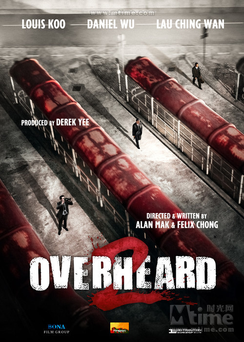

# ＜玉衡＞《窃听风云2》：你的命，锦哥操盘

**身为地主会的老大，挑挑眉头就能引发金融海啸的同哥，会叫一个手下“锦哥”？在过往的香港电影里，你见过哪一个老大这么干过？导演在用这种方式暗示我们：这个锦哥不一般！当然，如果同哥管他叫“涛哥”的话你也许能品出点滋味来，但是，如此明显的暗示过不了审滴哟！**  

# 《窃听风云2》：你的命，锦哥操盘

## 文 / 朱睿（山东财经）

 

**写此文仅仅是想告诉你，我有多喜欢扯淡。照例提醒一句：剧透，慎入。**

俗话说得好，内行看门道，外行看热闹。牛B的《窃听风云2》一上档，N多人惊呼：真正的港片回来了balabala……看到这样的评论，我忍不住齿冷：你们啊！naïve!sometime too simple！球，不是这么踢～滴！电影，不是这么看～滴！且让我来告诉你们《窃听风云2》里藏着的惊天大秘！

#### 锦哥，真正的老大

谁是《窃听风云2》里最大的反派BOSS？很多人会不假思索地说出来：同哥！如果你的答案也是同哥，那我遗憾地告诉你，这部电影你白看了。事实上，当曾江扮演的同哥说出“锦哥”二字来的时候，你就应该知道谁才是真正的老大。

看到这里有人要说了：泄特！锦哥不过是同哥的头号手下，什么时候成了老大了？关于这一点请参考《古惑仔之只手遮天》，山鸡重回洪兴，老大让他从小弟做起，跟着包皮混，包皮积威之下喊了声“鸡哥”，山鸡羞射地说：“这怎么好意思呢，你叫我小鸡好了！”——幸好那时还没流行卖萌，否则陈小春会自称“小鸡鸡”。这告诉我们一个道理，辈份是非常重要的！身为地主会的老大，挑挑眉头就能引发金融海啸的同哥，会叫一个手下“锦哥”？在过往的香港电影里，你见过哪一个老大这么干过？导演在用这种方式暗示我们：这个锦哥不一般！当然，如果同哥管他叫“涛哥”的话你也许能品出点滋味来，但是，如此明显的暗示过不了审滴哟！

所以，锦哥才是真正的幕后BOSS，这一点，知道的人没有几个。同哥是知道的，所以他一直叫他“锦哥”，而地主会的所有人都被蒙在鼓里，这一点在地主会的大佬们带罗敏生去同哥的豪宅时说的那句话里就可以看出来：“这是阿锦，他的兄弟会送你老婆回家！”一个被老大称为X哥的人，你们这些小弟居然看不出来，还管人家叫阿X，真是死都不知道怎么死的！

事实上，锦哥潜伏已经很久了，你没有发现他很眼熟吗？在《无间道》里，正是他把马上要关上的电梯门打开，黄Sir才没有逃出生天。那时他叫“丧标”，注意，这才是小弟应该有的称呼，然而，即使是他用了这么大众化的小弟名字，陈永仁还是不敢把他的名字写出来，最后只写了个“镖”字，想想看，名字能成为敏感词的，除了伏地魔和“吡——”，还能有谁？

值得注意的是，锦哥仅仅是个代称。跟在同哥身边的锦哥，不一定是锦哥，他也许只是锦哥的代言人。关于这一点，可以参考刘青云主演的《暗花》，刘青云仅仅是个执行人。幕后的人，正是“十几年没有回过澳门的老头子”——洪先生，即红先生。

#### 谁是同谋？

整部电影，就是一个局，当大反转的结局出现的时候，所有人都以为这是司马念祖设的局，事实上，这是涛哥，不，对不起，锦哥设的局。

我知道你们不信。表面上看来，阿祖把窃听器植入体内这一点非常牛B，但事实上这是老梗了！记得《窃听风云2》的导演以前拍过什么吗？《无间道》啊！当年黄Sir就问陈永仁：“植入体内的你要不要？”你以为这真是笑话啊？《电锯惊魂4》里，竖锯大人都把录音机植入体内了，一个小小的窃听器，何足道哉？

而且，最要命的是，这恰恰是整部电影最大的BUG，按照导演给我们的信息，锦哥是个无所不能的手下，一个牛B的反窃听高手。几个人被阿祖胁迫录音以指证同哥，是他发现的；阿祖的行踪，也是他发现的……一个这么牛B的反窃听高手，会在不确定阿祖身上有没有窃听装置的前提下就带他去见同哥？拿机器稍微一扫瞄就发现阿祖植入体内的窃听器了有木有！

而且，阿祖被锦哥活捉也是一大疑点：阿祖跟何智强说：“千万别让我亲眼看到你逮捕我！”他早就料到自己一定会被同哥活捉，而且一定会死，会以尸体的方式出来在何智强面前。然而这里面有一个非常大的问题：同哥什么时候抓住自己，如果在自己没有布好局前就被抓了怎么办？如果他派出来的是草包永远抓不住自己怎么办？为什么就偏偏不早不晚，就在他想被抓住的时候，锦哥就出来在自己面前了呢？

此外，阿祖的经费又是从哪里来的？他的军用窃听器及装置又是从哪里来的？尽管阿祖有从军经历，但这些东西，是随随便便的人可以拿得到的吗？

福尔摩斯告诉我们，当所有合理的答案都被排除之后，那个看上去最不合理的答案，就是最终的答案。所以，一切证据都指向同一个人：锦哥！他与阿祖有着千丝万缕的联系。

#### 不合理的合理与合理的不合理

行文至此，你会发现，我没有提到古天乐扮演的何智强，也没有提到刘青云扮演的罗敏生。你觉得他们是来打酱油的吗？错！

先看何智强。

何智强出现的时候，向罗敏生自报家门：“我是保安科反恐队的！”而黄奕扮演的郭丽萍一口道破真相：“就是97年前的政治部！”保安科这个名字，看过《无间道》的都不陌生，黎明扮演的杨锦荣就是保安科的，来头相当不小。其实，保安科只是个习惯性称呼，你要是去香港警务处的网站查询，你会发现现在根本没有保安科这东东，有的是保安部，。《无间道3》里，刘德华跑去黎明的办公室安摄像头，镜头里就出现了“保安部”字样，其职务是：负责多项与保安有关的事宜，包括保护显要人物、防范及对付恐怖活动，以及统筹保安工作。而在香港回归之前，政治部的职务内容是：搜集情报的工作，以及调查一些政治团体涉及的政治活动，外国在港进行政治活动的团体等。掌握这些团体或组织的人员名单、活动情况、经费来源等资料，以及负责跟踪、追踪，甚至做卧底的工作，亦负起保护来港重要人物（如各国政要、高级行政人员及外交人员等）的责任，还负责内部保安工作，包括防止和侦查颠覆和间谍活动等。当时的情况是，只是政治部插手的案子，别的警员一听就知道没自己什么事了。

顺便说一句，政治部的英文名是：Special Branch，所以，它有一个令人闻风丧胆的简称：SB！

通过保安科和政治部的对比，你就可以看出，这个部门相当难进，而且继承了政治部的神秘与玩政治。比如杨锦荣抓了台湾毒贩送给内地公安。用黄Sir的话说就是：“你们保安科秘密最多！”所以，何智强绝非等闲之辈，而他出现在此案中，也绝对不是反恐这么简单。

再说罗敏生。

这个角色由刘青云来演，完全就是冲着当年的《大时代》来的。玩股票的方展博二世。表面上来看，罗敏生是一个有点窝囊的角色，开始被地主会耍着玩，然后被阿祖耍着玩，无论在谁面前，他都抬不起头来。但事实上，玩经济不像玩警匪那么刀光剑影，罗敏生这个角色，古井无波的表面现象底下，是深不可测的内幕。

地主会是《窃2》最大的噱头，借胡枫扮演的司马祥之口，这个神秘的组织被揭开一角。司马祥说，1973年股灾，是他们兄弟五人力挽狂澜，拯救了整个香港股市，然后地主会急转直下，成为香港金融界的土匪。“表面上是捍卫香港经济，实际上是强抢豪夺，只准赢不准输！”民族英雄突然成了土匪？这合理吗？更令人可疑的是时间，如果地主会从1973年开始成为金融霸王，那么他们玩转香港长达近40年。但接下来司马祥说了这样一句话：“这十年来，我做错了很多事。”意思是十年之前，他的所作所为，是对得起良心的。请注意说话的时间背景，当时罗敏生被司马祥看中纳入地主会受其帮助大胜，黄奕扮演的郭丽萍有句台词：“几天后雷曼公司破产了。”众所周知，这是2008年，那么，上推十年，恰恰是1998年，香港回归之后。

于是一个大秘密揭开，97之后，地主会被同哥控制，成为敛财工具，司马祥迫于形势，不得不违心合作。而同哥背后站着的，恰恰是我们上文所说的锦哥。司马祥不甘心成为这一势力的敛财工具，出局之时保罗敏生入局。之后在狱中惨遭杀害。

至此，主角全齐，谁的命，谁操盘？

#### 锦哥毒设相思局 三子正照风月鉴

所以我们不妨还原一下这个局的始末。97之后，锦哥与同哥一起控制地主会，以捍卫香港经济之名大发横财，钱财流向锦哥的利益集团，挡路的司马祥被他们联手做掉。然而，锦哥发现同哥已经渐渐失去控制，他甚至已经背着自己插手中东与车臣，卧榻之侧，岂容他人酣睡？这是锦哥所不能容忍的。于是锦哥开始密谋除掉同哥。然而同哥与地主会根深蒂固，金融这东西更是牵一发而动全身。想静悄悄做掉并不容易。

于是，锦哥找到了阿祖，告诉阿祖，同哥是害死他父亲的凶手，而从阿祖数次口吐鲜血可以知道，阿祖时日无多，即使不被同哥打死，也会病死，所以不如拼死设局，让同哥打死自己，然后将证据送给警方，从而正大光明为父报仇。

然而，阿祖不愧是司马祥的儿子，他早已洞悉锦哥的阴谋。但干掉同哥是多年夙愿，于是将计就计虚与委蛇。然而，他不甘心就这样被利用，便找到了父亲当年的盟友——罗敏生。锦哥不是想做掉同哥吗，那么他们可以从中让锦哥吐一点钱出来。所以，布局陷害同哥，这是锦哥所知道的，但他万万没有料到阿祖和罗敏生来这一手。这再次证明了锦哥所在的利益集团的致命弱点：玩政治玩人，是高手中的高手，但玩经济，永远是外行中的外行。捞钱可以，但搞建设，对不起，没这能力也没这心情。

当锦哥发现这一切的时候，他开始疯狂反扑，这时阿祖与罗敏生找到了又一个盟友——何智强。可以肯定的是，这个局早就开始设了，因为何智强亲手把因炒股失败的妻子送进了监狱，这是一个苦肉计，首先可以借此与金融界划清界限甚至以敌视金融的面貌出现。其次，妻子出狱之后，故意以“去证券交易所取回自己应得的东西”之名，把自己当肉票送给阿祖，使得何智强“被逼为阿祖做事”显得名正言顺。

后面的事你们都知道了，利用这一事件，大量资金流向罗敏生控制的基金会，而何智强既帮助他们完成这一计划，又亲手拿到同哥的犯罪证据，同时，锦哥也失去了对地主会的控制，一石数鸟。

失去地主会的金融市场，将不再有横征暴敛之人，锦哥的集团大受损失。而以罗敏生为主的人，可以大打经济战，以已之上驷对彼之下驷，借机积蓄力量。但是，锦哥绝对不会甘心，一个地主会倒下去，他们会培养下一个地主会。同时，他们仍然拥有对整个香港的实际控制权。另一场布局，即将开始————

 

（采编：黄理罡；责编：黄理罡）

 
