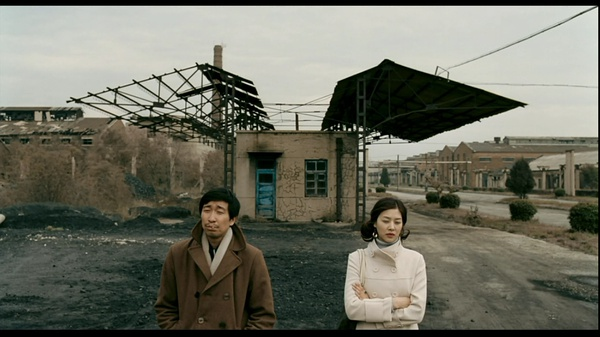
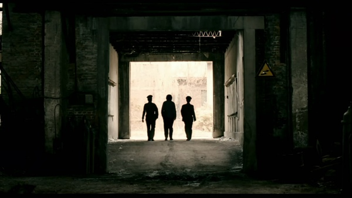
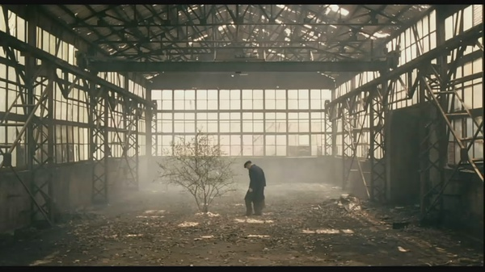

# ＜玉衡＞《钢的琴》：一个时代的挽歌

**造好了钢琴，放弃了女儿，目睹了烟囱被炸掉，然后和另外一个女人结婚，陈桂林又开始了另外一段生活。所有该告别的终将说再见，所有挽留不住的终将离去。影片以另外一种淡然而光明的结局，告诉观众，这就是生活，有时不以人的意志为转移。但是曾经代表着社会中坚力量的陈桂林们依然有办法也必须有办法生活下去。**  

# 《钢的琴》：一个时代的挽歌

## 文/昨夜西风（西北大学）

 

每一首动人的吟唱都会勾起一次难忘的回忆，每一种质朴的怀旧总会唤起一个群体的哀思。《钢的琴》是关于小人物的光荣和梦想的故事，它用高雅的语言述说着生活的琐事，以魔幻的色彩追缅着逝去的荣耀，当“钢的琴”出厂的时候，我们看到的还是一幅关于繁华隐忍谢幕的残卷，一首关于激情燃烧岁月的挽歌。

所以，与其说《钢的琴》是一个讲述“造琴”的小人物励志故事，倒不如说它是对于中国一个特定时代结束的告别和怀念。透过一群卑微的底层工人阶级的言行，你可以看到他们对于中国社会民生跌宕起伏万象多端的淡定和泰然处之，看到他们对于中国政治经济风云变化狂飙突进的无奈和自我解构。令人愉快并哀伤的是，影片正面描写的并非这些，但是真正想要告诉你的就是这些，以小见大，见微知著，这正是《钢的琴》所以闪亮的地方，它用一种黑色的幽默讲述着并不幽默的中国故事。而且，重要的是，它是真正关于中国老百姓的故事。

陈桂林，一个曾经的无上光荣的工人阶级，一个失去组织依托的底层劳动人民，一个依然有朴素梦想的技术工人，一个孩子的父亲，一个失去老婆的男人，一个有一群“狐朋狗友”的小人物，他是中国社会转型期最具代表性的人物缩影。在他的身上，集中反映了热情如火的重工业时代中国工人的一些突出特点：技术过硬、踏实勤劳、生活拮据、粗野豪放甚至世俗狡黠。这些特点曾经在半个世纪中，成为国家经济建设的精神基石，也是这些特点在改革浪潮席卷而来之时，让他们一度感到茫然无助和无所适从。他们很现实，几十年甘之如饴地围绕着某个重工业据点，辛劳工作、娶妻生子，繁衍后代；他们又很不现实，经常回味着为时代所不容的过去，并做着与自己实力不相称的春梦，这却也是他们顽强生存的精神源泉。若时光倒流数十年，他们或许是你的父亲，或许是我的父亲，用一种蚍蜉撼树的执着诠释着一个平凡而动人的字眼：生活。

电影开篇，陈桂林和妻子讨论离婚事宜，背景却是破败坍塌的厂房，预示着主人公婚姻的变故，和中国社会原有的价值观念的倾覆息息相关。当陈桂林和他的乐队为一位死者奏响了忧伤的苏联歌曲《三驾马车》时，对于往日辉煌的眷恋和怀念跃然眼前。值得注意的是，电影中，多次出现前苏联的一些著名歌曲，甚至还有一名曾经留学苏联的老工程师，这一切让我们隐约看到《钢的琴》故事发生地东北这个昔日重工业基地的前尘旧事，进而你可以联想到整个中国的那些激情岁月和疮痍时刻。中国工业的起步是离不开苏联的帮助的，尽管后来由于政治纷争，中苏彻底决裂，但苏联对中国的影响延宕久远，中国工业的“苏联影子”根深蒂固，时至今日，在中国依然能随处找到苏联的痕迹。上世纪90年代初，苏联代表的集权式社会主义模式轰然倒下，而在中国的改革开放也进入了质变的阶段，中国人的价值观念随之发生了颠覆式的改变。以陈桂林妻子的新欢、那个靠贩卖假药发家的幕后情人为代表的“新思潮新势力”，凭借物质力量的摧枯拉朽，无情地冲毁了陈桂林所代表的淳朴踏实默默奉献的老一代劳动者的精神家园。影片处处可见的“苏联痕迹”实际上就是表达陈桂林这一群体对旧日时光的无限眷念，对于他们这一代而言，苏联模式是美好的，因为作为产业工人的他们在昔日可谓英雄有用武之地，在粗大笨重但泛着金属光泽的时代里，有着属于他们的春天。

显然，在时代变革的狂澜面前，陈桂林等人又显得卑微和无助，他们靠什么来捍卫自己精神家园？无力可借，无处可遁，无计可施，无枝可依。于是，我们看到了一群小有才艺的“工人阶级”为谋生计组成的小乐队，在街头巷尾，吹奏代表着昔日辉煌的歌；于是，我们看到大刘在“妻管严”的窘境下经营着自己的“杀猪产业”；于是，我们看到胖头为了二十元的赌债不顾尊严地躲避着三个妇女的追缴；于是，我们看到季哥俨然以老大的派头，在旧工厂里干着一些并不阳光的勾当；于是，我们看到“快手”依靠往日在工厂练就的手艺，落寞地生活在昔日的阴影中；于是，我们看到淑娴这个女性在男人的世界里，以男人的方式开拓着属于自己的生存空间，而豪放的背后却流露着些许无奈。所有的荣耀，都源于他们的工人阶级身份，所有的落寞，都因为他们曾经引以为傲的身份在改革浪潮中被彻底尘封。

陈桂林和妻子争夺对女儿的抚养权除了天然的亲情使然，还有着他对自己尊严和能力的捍卫，“陈桂林们”对于“造琴”的执着不仅仅是出于友情，还有着他们对于自己光荣传统的追抚和对现实污染的抵抗。落魄的贵族，潦倒困顿，依然不肯丢弃代表家族荣耀的族徽，卸甲的将军，在赋闲寂寥之时，时常回味着铁马冰河的昂扬。《钢的琴》中的这群小人物，同样有着引以为傲的过去，属于他们的时代已经残酷地结束，但没有人愿意心甘情愿地退出舞台中央。过去的辉煌代表着他们的力量，一种与生俱来的“根”的情节让他们无法欣然接受现实命运的安排。对于代表往昔产业辉煌的两根大烟囱，他们都依依不舍，怎么能甘心在物质享受和娱乐消费面前节节败退？于是，陈桂林对于女儿小元的培养成为他们关注的焦点，“造琴”成为一种心照不宣的约定，成为唤醒他们心中沉睡已久的激情的契机，成为他们捍卫自己尊严，争夺表演舞台的一次奋争。于是，一个关于婚姻解体和子女争夺的寻常故事，变成一群失意的工人绽放激情重振光荣的魔幻舞蹈。他们以一种颠覆常态和逻辑的方式进行了一次重归梦想的集体行动。

有生命的地方就有爱情，陈桂林的爱情是一种实用主义式的爱情，生活的艰难和理想的困顿，早已不容他有任何非分之想。但这样的爱情恰恰是最真实的，最符合陈桂林和淑娴身份的。婚约对于他们真真正正地成为了一种仪式，找一个女人过日子，嫁一个男人做依靠，是一种最质朴最实际的行为。所以，陈桂林、淑娴、王抗美之间，对于彼此的暧昧和苟且都安之若素心照不宣，即使发生龃龉，也不会影响到各自之间的情分，一码归一码始终是他们行事的标准，如果你在那种环境中生活过，就会明白那是一种真实的生活情态。所有阳春白雪的宣讲，在这里都如草纸一样一文不值，他们要的是实实在在的生活。

《钢的琴》其实是一出彻底的生活悲剧，片中的每一个人物都代表一种失落和无奈，所有的结果都不是最初的梦想，包括那家本不该出现的“钢的琴”。但是，用微笑和自嘲的方式讲述出来的不幸，则处处透露着生活的禅机，本片就是如此，所以它哀而不伤，笑而不谄。片中人物都以最淡定最从容的方式处理着种种尴尬的遭遇，如偷琴失败后，陈桂林那一曲近乎魔幻和诗化的钢琴曲，将小人物的悲催化解在无尽的冬夜中，让人久久回味。

或许，我们希望的是陈桂林造出了“钢琴”，完成了对女儿的承诺，夺回了抚养权，击败了妻子和假药大款所代表的道德堕落，获得了最终的精神胜利。这样的结局或许更令人愉悦和振奋，但它往往不是生活的真实面，尽管我们是如此地希望它成为现实。生活的本来面目，有时就是处处透着一种残酷和无奈，努力了未必能得到想要的结果。可是，人的内心深处始终有一些东西，它不以实际结果为考量标准，它最珍贵和闪光的时候就是它被展示的过程，它可以是人格的尊严，可以是往昔的荣耀，甚至可以仅仅是倔强的血性。“钢的琴”并没有完成“陈桂林们”的所有的心愿，但是它告诉这个抛弃了他们的新世界，他们有过光荣以及他们为什么会有光荣。

造好了钢琴，放弃了女儿，目睹了烟囱被炸掉，然后和另外一个女人结婚，陈桂林又开始了另外一段生活。所有该告别的终将说再见，所有挽留不住的终将离去。影片以另外一种淡然而光明的结局，告诉观众，这就是生活，有时不以人的意志为转移。但是曾经代表着社会中坚力量的陈桂林们依然有办法也必须有办法生活下去。

导演张猛来自东北，他的上一部电影《耳朵大有福》同样关注的是改革带来的新旧交替时代里，城市小人物的挣扎和呐喊。在他的两部作品中，都有着一种对往日的深深眷恋，而眷恋之中往往有着无声的批判。《钢的琴》有如一曲时代的挽歌，于其中可以听到一种警示，或许，对于这个物质上狂飙突进，精神上日渐倾颓的社会，不无裨益。

 

（采编：安镜轩；责编：安镜轩）

 
