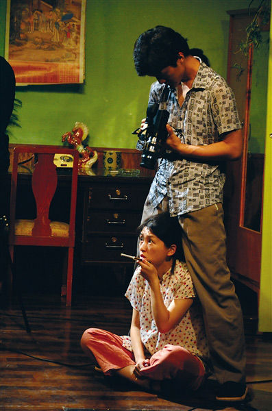
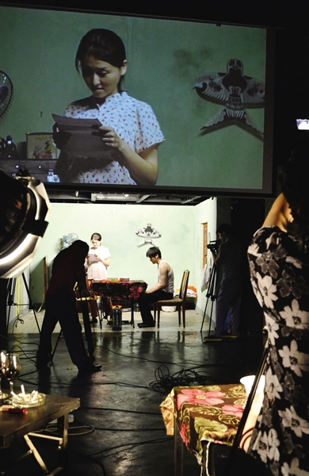

# ＜玉衡＞《雷雨2.0》：把现实主义摔在地上

**2.0时代的到来终于告别了统一信息发布中心的模式，更加注重交互作用，人们既是信息内容的浏览者，也是信息内容的制者，“全民微博”，信息来源无法再被垄断，“现实”的呈现更加容易，然而信息纷杂带来了选择多样，却也使得人们更难接近“现实”，“是”和“非”都无法相信，几乎陷入虚无主义。**  

# 《雷雨2.0》：把现实主义摔在地上

## 文/刘莐（北京大学）

 

一直觉得现实主义戏剧有着不可抗拒的魅力，每遇思想深刻的好戏，都会沉迷进舞台上的故事，仿佛进入了那个世界。而这样的戏，是编剧创造出来的，导演的任务，就是最大程度上真实地还原编剧的世界。为此，北京人艺营造的现实主义方式就是“体验生活”，才有了我们看到的那么多佳话：童超为了演好庞太监亲自拜访晚清的太监，黄宗洛为了演好松二爷每日穿着长衫提笼架鸟，前些日子众多老演员为了排《甲子园》又来到了西山老人院……假如新排了一版《茶馆》，看过的观众的评价一定是“谁谁谁演得‘像’王利发”、“谁谁谁演得‘不像’秦二爷”这样的语句，因为观众通过剧本就可以找到一个完整的答案，观剧只是检验这个答案的过程；没看过的观众则是跟随者编导设计的节奏与内容，感受和接受这种思想罢了，故事结束，观演便结束。

可是，为什么是“现实主义”？为什么中国戏剧在上一个百年中为什么要以现实主义的主流形式呈现？观众大多不想这个问题，因为现实主义戏剧的就是不想让观众思考故事以外的问题——表演内容少，一切以编剧为核心。看完戏，观众的评论基本围绕剧情和其所体现的思想展开，对导演和演员的评价，完全取决于他们使用的表现方式是否恰当并充分表现了观众心中的那个“中心思想”。为什么？

所有艺术的发展都是这个道理——产生的初期，功用性占主导，比如中国最初的文学都是表、赋、诏这样的应用文，只不过它写的好，所以我们当它是文学，而诗歌等文体形式出现，使得文学走上自觉，才是文学形成的标志；绘画也如此，起初都是为了记录影像，所以都是追求“像”的现实主义艺术，直到照相机发明，取代绘画的记录功能，画家们才开始画自己“心中的画”和“想象中的画”，美术史因此从走向了印象派、野兽派、未来派这些现代艺术。戏剧更是这个道理——中国早期戏剧基本流传于青年学生和革命群体中，主要起到革命宣传的作用，功能性明显且单一；而之后的以北京人艺为中心的现实主义传统，是50年代向苏联莫斯科剧院的斯坦尼体系学习并建构发展起来的，那时候，戏剧这种真人舞台表演的形式，虽然向北京市民售票开放，却仍然无法改变作为政治宣传的手段。这种宣传中，为了让最广大人民能够看懂，从而接受戏剧创作者希望展现的观点，便只能采取最具真实性的、最具生活化的现实主义形式。

这样来看，我们心中存在已久并扎根很深的现实主义传统，不过只是为达成一个目的而必须呈现出的模样，不是戏剧艺术“自觉性”的体现，而是其“功能性”的体现。直到八九十年代，随着政治性的弱化和自觉意识的增强，一些觉醒的创作者才意识到这一点，浅浅地去探索戏剧“本来的面貌”，这才有了大导，有了牟森，有了孟京辉，有了越来越多的艺术家进入这个领域，用一出出实验戏剧对这个问题进行回答。

《雷雨2.0》，正是王翀给出的答案；更恰当地说，他没有直接回答，而是给出了解题思路——把现实主义特征最明显的人艺经典戏剧《雷雨》解构，摔碎在观众面前，告诉你，现实主义是假的；而这个答案本身，又向观众展现了戏剧的另一种可能。

所以，每当我走进《雷雨2.0》排练场的时候，就觉得舞台上充满了各种各样现实主义的碎片——观众看到的不再是完整的有统一中心思想的现实主义话剧，而是凌乱的摄像机、屏幕、无节奏奔跑的演员、破碎的布景，甚至凌乱得分不清演出区域和工作区域的舞台分割，一块儿一块儿、一截一截。《雷雨2.0》的目的是为了打破现实主义对观众观戏心理的“统一规制”，还原给观众一个真实的无限可能，所以，只要拆解现实主义就够了——解构是手段，不是目的，并不用把它揉成粉末，因此，不用去问“为什么不解构得再彻底一些”，观众依然能在舞台上找到现实主义的一只胳膊或者一只腿——比如剧中人物虽然不断移动着位置奔跑变幻，却总在各个场景中表演着那些现实主义的情节；比如那些取自曹禺《雷雨》中的台词，虽然是东一句西一句零碎地拼在一起，却在讲一个完整的、能被理解的故事；比如在影像呈现到高潮的时刻，演员站立一排，走出影像，绝望地爬上箱子和柜子搭起的高阁，演出了象征意味极强的现实主义……这都是拆解现实主义之后留下的结果。

可二十一世纪,2.0时代的“现实主义”不再是由“戏剧宣传”这样古老的即时演出模式呈现，而是通过可复制可传播的镜头媒介完成，各种各样的媒介滚动输出信息，向人们展现“现实”——这种现实，也是破碎的，海量的，不像剧场中的观众那样必须强行接收演出呈现者试图输入的信息，而是需要经过人脑筛选，加工整合才能拼凑出人们对于“现实”的答案。然而，镜头媒介下的“现实主义”更加具有选择性和诱导性，只需要稍稍转换拍摄角度，便可诠释出不同的含义，给观众不一样的“现实”。在这种情况下，人们知道信息的选择性和片面性，便会尽可能多地浏览和拼凑——盲人摸象，多摸一些部位也能大概知道大象的样子；可是一旦信息来源被权力所控制，形成信息垄断，就又回到传统的“戏剧宣传”模式，走向集权主义。2.0时代的到来终于告别了统一信息发布中心的模式，更加注重交互作用，人们既是信息内容的浏览者，也是信息内容的制造者，“全民微博”，信息来源无法再被垄断，“现实”的呈现更加容易，然而信息纷杂带来了选择多样，却也使得人们更难接近“现实”，“是”和“非”都无法相信，几乎陷入虚无主义。

所以，在《雷雨2.0》中，“雷雨”解构了传统戏剧中的“现实主义”，“2.0”了解构了现在社会的“现实主义”——导演采用摄像机实时拍摄，通过对焦、借位、剪辑等电影手法，成功地拍出了我们整日看到的媒介中的“真实”情景，满场摄像机的调度，又让观众清楚地知道这“真实”是虚假的。舞台上方的屏幕影像，在建构的同时被解构，将当代“现实主义”的目的彻底摔碎在舞台上。

这两种解构方式都是通过导演语言实现的，没有像传统戏剧那样依赖编剧创作的文本。正如这两天演后谈观众频繁问到的：“你为什么拿《雷雨》开刀，换一个行不行？”答案当然是肯定的——做《茶馆》，做《骆驼祥子》，都可以解构现实主义，但《雷雨》是中国话剧艺术走向成熟的标志，家喻户晓；而且，从编剧角度看，这戏中的人物关系是一个“表格式”写法——如果把剧中人物列成横竖两排，整个戏可以填在这个表格里，每两个人物、每一组人物依次交织，排列组合；不仅出场次序，人物语言背后蕴含的情感也是如此——每两个、每一组人物都有不同的矛盾冲突，堆叠地非常整齐，一个压一个，人物关系和人物情感之间的矛盾像数学公式一样井然有序，织起一张密不透风的大网，沉重地压在剧中人物上空。解不开，唯有一场雷雨和悲剧的到来才能斩断。

这种绝望，在《雷雨2.0》中被诠释成了一个男权社会中女性的处境的尴尬，无论是处于社会上层的富有女性，还是位于底层的，终归沦落成男性规则的牺牲品。这个话题在所有后现代思想的讨论中，都占有重要地位，具有现实意义，现代社会发展的一个突出体现就是女权运动的发展引发的妇女解放，女性有了和男性等同的获得社会地位的机会，却由于先天性征差异，无法真正实现平等，陷入一个更加尴尬的处境——不但要以孱弱的身体在社会上和男人一样打拼，还要承担原本的家庭责任去相夫教子，等于是解放后却负担更加沉重了——演出的时候，每当我看到宫哲扮演的“四凤”一步一步向堆砌不牢、有些晃动的箱子柜子上攀爬的时候，就会感动于女性在社会中的艰辛与绝望；旁边站成一排的人们却在那里一动不动地看着，仿佛是男性制定的规则整齐地排列着，又好像规则之下的看客冷漠地旁观着，还好像同样处于这个规则之下的受害者无奈地绝望着……故事中的性关系只是一个比喻，这种基于生命之大限引发的绝望和悲剧，正像卢梭所言的“枷锁”，束缚着这个世界苦难的人群，是任何人无能为力的，唯一的告别途径只有“雷雨”那样的死亡，才能从中解脱。

曹禺先生不喜欢《雷雨》，说它“太像戏了”，几乎不看这出戏的排练和演出，因为他用编剧的语言已经把这个剧中世界建立得太圆满了。而《雷雨2.0》却用导演的语言建起里原先编剧的世界，王翀说“颠覆”，我觉得更应该理解成是“解构”和“重建”。曹禺的《雷雨》注定是中国话剧史上的一座高峰，《雷雨2.0》没有顺着这座山峰往上爬，而是另建了一条走向新高峰的路。人们曾经很相信的“现实主义就该是戏剧的模样”被打破了，究竟什么才是戏剧的真实样子？舞台上一堆凌乱的摄影机算不算戏剧？……你不知道，我不知道，人艺不知道，王翀也不知道。但我们都在探索，我们不但去探索“什么是戏剧”，还可以从反面排除“什么不是戏剧”，无论发现了哪个，都意味着这一块儿牌子上将会写下此路“通”或“不通”，指引或者提示着后人。为此，《雷雨2.0》所做的探索和努力，一定是有价值的——我们，携手同行。

《雷雨2.0》票务信息：http://www.damai.cn/ticket_38953.html

 

（采编：徐海星 责编：徐海星）

 
