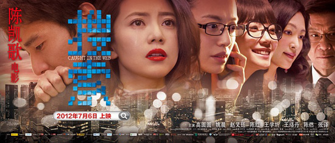
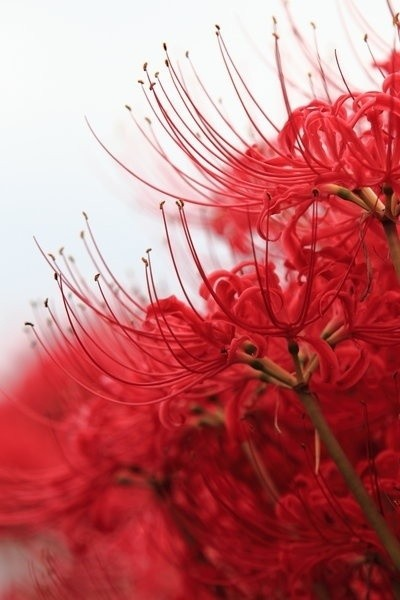

# ＜玉衡＞一个半吊子媒体人关于《搜索》的断想

**回想《搜索》三个瞬间印象至深：高圆圆扮三十年代大明星令人无法呼吸的美；姚晨在电脑前发现叶和男友的恋情催肝裂胆的惊愕；但最震撼的还是王珞丹在片尾的蜕变和逆袭，仿佛一夜之间从萝莉成长为御姐，犀利异常，势不可挡。也许每个媒体人生命中都有过这样的瞬间，美若蜜糖，毒若砒霜，又随着沉重的现实生活，渐行渐远，纠缠撕扯，或凤凰涅槃，或羽化登仙。**  

# 一个半吊子媒体人关于《搜索》的断想

## 文/郭凌鹤（中国传媒大学）

 

一周前看了《搜索》。走出影院，低头不语，一直沉浸在剧情里出不来。一起观影的啤酒行业就职的姑娘问我：妞儿啊，你咋啦？我说：菇凉，想象一下你看了一部电影，是关于啤酒厂怎么倒闭的，会不会觉得很悲催？

兔死狐悲，物伤其类，《搜索》看完，我就是这种感觉。

### 职业肌无力

我很想为《搜索》写点什么，但回到北京之后，立刻又陷入了媒体工作的焦灼抑郁中不能脱身。直到这几天，有个自称社会新闻记者的姑娘，在微博上联系我，说想做一期关于房屋黑中介的调查。我在电话里和她聊了几句，问：你是不是实习生？她说是啊，你怎么知道？我笑，说，你的语气和问问题的方式能听出来；还有，只有实习生才会做这种费力不讨好的选题啊。

电话那头的姑娘大倒苦水：是啊，是啊。我联络到一些曾经被黑中介暴打过的人，可他们要不直接拒绝，要不就不愿意多谈。

放下电话，忽生悲凉和惭愧。面对同行的采访，我却只能思虑再三，如履薄冰。手中有黑中介的视频证据，我却一直考虑要不要给她——中介手中有我的手机和各种私人信息，他们也能看出来视频是哪里的房客拍的，如果他们骚扰、报复，我又如何自处？

归根结底，是我对自己所处的行业都充满了无力感。曝光了又有什么用？“有关部门”依然不能从根本上解决问题，黑中介依然会横行霸道，如我当初一般缺乏经验的无知北漂，仍然会贪恋便宜上当受骗。也许短暂的曝光会给这些无辜的房客提个醒，然后转瞬被忘记。如果我因为这条新闻惹了麻烦，谁又来保护我呢？难道我也要威胁黑中介：我是做媒体的，你不怕？他们必然会狞笑着说：那你曝吧，我们不怕。

这种语境下，我不敢奢谈“公民意识”更不敢奢谈媒介伦理。所浮现出来的，只有作为女性的自保意识。我承认，我怂。

#### 天朝媒体人悖论

天朝媒体人的生活永远充满悖论。你以为自己铁肩担道义妙手著文章，在央级媒体国家大刊上播片发稿，每天奢谈民主自由真理人权，一转头依旧面对着没有北京户口的伤，没有公积金的痛，凌晨四点穿着睡衣满脸油光丧尸一般赶稿。你以为自己有机缘见识社会名流精英大咖就可以跻身他们的阶层，其实人家日理万机懒得搭理你，回答言简意赅统统词不达意，回头你还得对着二手资料抓狂苦憋一篇大咖本人永远不屑于看的东西。你以为自己soho上班随性自由，独立思考才思泉涌，其实电话微信24小时都要为领导待命，假若大领导说你做的东西不够洋气，二领导说你的东西不够接地气，成型的片子可能会在七改八改中变成一堆废柴，而一个XX大的宣传任务下来，你呕心沥血做好的东西可能一夜暴毙。

当然，作为媒体人最大的悖论是：你常常要说违心的话。即使你不想说假话，真话也要隐忍不说。最核心的既得利益者是铜墙铁壁，你可能无法撼动甚至无法触及，于是有时候，你得逮着那些不软不硬却能直击社会痛处的新闻点，以小见大，触类旁通，如果你有本事把它导演成一场社会集体的大反思和大讨论更牛逼。

这就是陈若兮的生存现状，她压抑，有功成名就的强烈欲望。而媒体的本性恰恰嗜血，看到戏剧性和冲突性的东西就兴奋异常。这种压抑和嗜血共同作用起来具有破坏力。她在叶蓝秋事件中表现出来的非理性也就顺理成章。

#### 新闻的原罪

有人说陈若兮的错误在于违背了新闻的“求真”原则，在“墨镜姐”事件引发争议后，不但没有给当事人解释机会，反而为了吸引点击率进一步炒作。

类似的案例在现实中其实数不胜数。去年的深圳的“八毛门”事件，“孩子便秘，在A医院要花十万元做手术，在B医院花了八毛钱”的新闻一经爆出，患者纷纷对医院展开血泪控诉，却很少有人关注后续：最终经过诊断，孩子的确是患上了比较严重的肠道疾病，并最终通过手术治愈——对于医院乃至整个医疗行业的负面影响也无法消除。

5月的鲁若晴事件，烟花妹妹在微博上质疑作业本借鲁若晴炒作，《鲁中晨报》煞有介事地去医院调查，得出结论《鲁若晴：请不要透支我们的同情！》，引发一片哗然，网友谩骂不止。尽管后来查证鲁若晴确有其人，不负责的账号和媒体也受到惩戒，对鲁若晴这样一个绝症病人的伤害却无法弥合。——不知道凯歌在拍《搜索》时，是不是已经预料到现实中会有和叶蓝秋如此相似的剧情上演。

我想这是新闻的原罪。为了赶截稿期，为了抢独家，为了爆料吸引眼球，断章取义、指鹿为马有时是故意，有时是不得已而为之。

而更大的原罪是新闻工作者高高在上的道德优越感和审视感吧。

“小熊牵着大熊走”事件主角小熊姑娘曾经抱怨，采访她的媒体预设立场，她质疑媒体为什么不能好好地听听真相，还原一个真实的故事。

我不得不感叹小熊姑娘真是太理想化了。媒体怎么可能不主题先行、不预设立场呢？这样一家媒体的精气神儿不就散了么？你难道不知道媒体其实写的是命题作文吗？难道不知道记者和采访对象其实是种甲方乙方的关系吗？

调查性的报道我没有发言权。但人物专访、社会新闻，甚至是以故事性、全景性展示见长的特稿，基本都要给人物划一个框框。它必须紧扣一种主题：真善美，假恶丑，时代的牺牲品，政治的宠儿……于是记者和编导在采访时，常常像陈若兮一样，拼命地把采访对象往自己想要的主题上引导，一旦和自己的预设契合，就如获至宝。

我是中文和戏文的杂糅，做媒体乃半路出家，缺乏新闻素养，无法咄咄逼人无法直指人心。大概我母爱泛滥，即使采访小人流氓，也总会生出”他也有自己的缘由和不易之处”之念，采访常因此走神。

一个朋友讲过，他做社会新闻时，有次带着摄影队伍去曝光假蜂蜜，冲进小作坊，对着正在造假蜂蜜的母子正义凛然地喊：“你知道你们违法吗？”那对母子惊惶不已，连连乞求。后来，他才知道，他们是孤儿寡母，找不到别的工作，只能以此谋生。“他们也是没办法，他们也愚昧，不知道这玩意儿到底有什么危害。”朋友说，承受不了这种经常戳人伤痛的纠结感，后来就尽量不做负面报道，“还是做正面报道吧，皆大欢喜的事儿。”

另一位朋友也曾讲过一个故事：家乡的某企业准备上市，却被某媒体报了负面，上市失败。企业老板约了做报道的记者一起吃饭，席间，他哭了，说：我们上市不容易。

道德优越感和审视感常常会让人高高在上，而不能平视眼前的生命。职业有时也不容人去思量一篇报道可能会对别人的命运带来什么影响。众生皆有罪，新闻亦有原罪吧。

#### 真相常流失于涕泪交加之中

陈若兮让我想起了赵普。一直以来对这个人的观感并不好。当年地震他边播新闻边流泪，被网友大赞“新闻人的良心”，我心想这和表演帝有什么区别呀？和倪萍奶奶有什么区别呀？真要说新闻人的良心，那还是学学人家杜宪吧。

今年赵普又云山雾罩地爆出了老酸奶事件。起初我也曾经被一片义愤填膺所裹挟，觉得赵普惊爆内幕还真是挺牛逼的。冷静下来想想，如同21世纪那个喜欢死磕的女记者王思璟所言，作为媒体人，使用“内幕很可怕，不细说”这种故弄玄虚的说法，不负责任，且观感非常差，跟“不转不是中国人”一个级别。没说清楚是哪家企业，一棒子打翻一船人，也许带来的是对整个行业的毁灭性打击。

赵普事件至今还是罗生门。有人说他是把央视压下去的报道爆出来了，也有人说他是把央视正在做的调查新闻提前泄密。如果是后者，那赵普就属于严重违反职业道德。总之无论如何，赵普后来那一句“洛阳亲友如相问，一片冰心在玉壶”让人闻到了浓浓的矫情味道，把自己包装成一苦大仇深的英雄这事儿让人觉得有点不爷们。

陈若兮同学和赵普一样愤青。面对社会道德失衡和不公正，义愤填膺；面对黑恶势力的挑战乃至推倒，坚贞不屈——这大概就是杨佳琪们所理解的“新闻理想”吧？可你怎么知道，义愤不是和义和团一脉相承呢？怎么知道，当义愤者从在野大屌丝变成了在朝白富美，就不会摇身一变成了太平天国和李自成呢？

义愤本身是一种可疑的情感，把义愤和私愤结合起来就更是大忌，所以陈若兮最终是被自己玩死的。她不是为了新闻理想头破血流，只能说她是为了职业理想头破血流——这个职业理想，和欲望、掌控欲、野心有关，和公平正义真相无关。

#### 穿越虚荣之门

我一直在想，是什么吸引着很多媒体人一直在坚持下去。也许是那种参与时代进程和亲临现场的刺激感，也许是能和许多牛人面对面倾谈的宝贵机会，也许是能够走南闯北增长见识练就一番高谈阔论，也许是能够探索某个事件内在规律和真相的成就感，也许就是上文提到的那种义愤感和社会责任感，也许是比上不足比下有余的报酬……总而言之，真正能够和这个行业内在共鸣的人，一定是需要生命丰富的体验和强烈的存在感的。

但后来我告诉自己，一定要克服以上种种因素带来的虚荣感。有时这种虚荣感会用一种文艺的方式来表述，比如“进入某个人的生命”。渐渐地我开始讨厌这种文艺腔。其实大部分媒体人，根本没有进入采访对象的生命，即使你跟随他三四天，和他同食同宿，你仍然是个陌生人。你甚至不如一个推销员、一个商务合作伙伴更深入地进入他的生命，因为那是真刀真枪的人性过招，而不是彼此带了温情面具的旅途陌生人交谈。

记者和采访对象交往总是带着任务的。片中陈若兮和莫小渝酒醉交心时，镜头的角度让我觉得她手中握着录音笔——这是工作的真相，即便称兄道弟，她所说的每一句话依然可以成为呈堂证供。但导演最终没有如此处理，大概是他不想把一切呈现得很邪恶。

有时候想想，我不知道自己在这个行业里能坚持多久。曾经满足虚荣心的种种，如今并不能和健康的损耗收支相抵。可怕的是我写东西也开始带上了职业病——比如，习惯性地使用小标题。语言风格一会儿公知一会儿五毛，说着说着就开始端起来。也许不久的将来，我会患上失语症。

回想《搜索》三个瞬间印象至深：高圆圆扮三十年代大明星令人无法呼吸的美；姚晨在电脑前发现叶和男友的恋情催肝裂胆的惊愕；但最震撼的还是王珞丹在片尾的蜕变和逆袭，仿佛一夜之间从萝莉成长为御姐，犀利异常，势不可挡。也许每个媒体人生命中都有过这样的瞬间，美若蜜糖，毒若砒霜，又随着沉重的现实生活，渐行渐远，纠缠撕扯，或凤凰涅槃，或羽化登仙。

 

（采编：徐海星 责编：徐海星）

 
