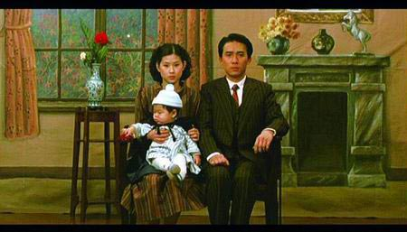

# ＜玉衡＞一代人的堂吉诃德

**老大被当地流氓枪杀、老三成为了废人，唯一能够陪伴在林家老爷子身旁的，只剩下当年最没有希望的老四林文清了，这无疑是这个世界的造物主在戏耍我们的明证。不要改变我，你把你自己当世界中心，我就拿你当个屁，要生要死全由我一念之间，就像想要成为真正的骑士而踏上征途的堂吉诃德一样，最后了还是告老还乡成了疯子。**

# 一代人的堂吉诃德

## 文/李润龙（山东艺术学院）

 

《悲情城市》是侯孝贤在1989年上映的一部作品。内容讲的是1945年日本无条件投降后台湾光复，基隆一户林姓人家眼见也要过上好日子，但人算不如天算，林家大小波折从此不断。“二·二八”事件发生后，家中的四兄弟更是只剩下老老实实开有一家照相馆的聋哑人老四林文清。然而悲剧并没到此终止，因为和进步人士有联系，林文清也没能逃脱被逮捕的命运。到此，林家男子只剩林文清和吴宽美的幼儿——他尚呆在襁褓中咿呀咿呀地学语。（以上摘自豆瓣。）

侯孝贤和杨德昌在我看来是台湾电影的两座珠穆朗玛。如果说杨德昌喜欢拍时代中的人如何去适应的话，那么侯孝贤的电影则略微偏重于人试图去打破时代的牵绊，试图去改变看上去已经被确定的命运。《悲情城市》绝对是这么一部作品。

林家四兄弟如果看做一个整体的话，那么自从幼年开始就是不幸的。老四林文清八岁因玩闹时从树上跌下导致双耳渐渐失聪。战争开始之时，老二去了南洋当军医，老三则参军。战争结束之后，老二就此失踪，老三则精神失常。而随着影片的进展，老大被当地流氓枪杀、老三成为了废人，唯一能够陪伴在林家老爷子身旁的，只剩下当年最没有希望的老四林文清了，这无疑是这个世界的造物主在戏耍我们的明证。不要改变我，你把你自己当世界中心，我就拿你当个屁，要生要死全由我一念之间，就像想要成为真正的骑士而踏上征途的堂吉诃德一样，最后了还是告老还乡成了疯子。同样，四兄弟里面想要改变这个世界、或者想要影响世界的都没什么好结果了，老二深入南洋不知处，老大本来做一个安分守己的黑白两道走得开的人，平时也是霸气有余但是一直还算和善，却因为一次生气而暴揍流氓的时候被一枪打死。老三参军回来成了疯子，好了之后老老实实当自己的少爷就完了，还非得想着按照不法渠道挣大钱，上帝想了想：算了，这货就算是好了也不干正事，还是接着疯了吧；老四也是，老老实实的照相师不干，飞去资助什么革命，到头来被抓走，剩下孤儿寡母。而老四这个人物则是一系列悲剧中的大悲剧，上天剥夺了他的听说能力，按理说他就可以做一个时代的旁观者，不听不看不闻不问不说，独自地置身事外就算了，可是老天就不，非要你也成为历史的一部分，上天就是这么的无情无意无理取闹。你想不当殉道者想要老老实实就这么下去？没门。

说到四兄弟，准确地说是三兄弟的表演真的是太棒了。陈松勇高捷梁朝伟三家伙都是实打实的拿奖范，饰演老大的陈松勇还拿到了那年的金马影帝，高捷日后也是一帆风顺，在台湾影视界有着自己的一片天地，电眼蜀黍梁朝伟还用说么？除此之外，看片尾字幕的时候发现，这片子里人才满地啊，除了几个演员外，还有饰演老头子的李天禄、担任幕后制作的还有台湾戏剧界大拿赖声川，编剧吴念真和朱天文等等等等。

侯孝贤跟杨德昌这俩大师一直喜欢把摄像机就这么摆在那，管你什么商业片的四秒钟观众视觉疲劳，老子就一个镜头三五分钟的在那拍。把蒙太奇基本舍弃，拿电影当戏剧，完全依靠剧本、故事来吸引观众。这个倒是不错，只是实在不喜欢这样的电影，个人总是觉得电影是应该有着一定丰富数量的蒙太奇来丰富观众感官刺激的。额，不过人各有志……随意伐。

值得一提的是，片中导致林家彻底分离崩塌的，就是当年闹得沸沸扬扬的二二八事件，凡是提及这一话题的影片，在台湾都是各种禁忌。但是在1988年蒋经国去世开了党禁报禁之后，社会文化方面算是迎来了一个颇为开放的时代，侯孝贤本来打算拍三兄弟的下一代，但在得知文化上面的禁忌都消除了之后，立马决定着手去拍经历二二八的那一代。因为影片的贴近生活，真实反映了当时社会人的种种。也使得影片受到了大量的好评，也取得了非常棒的票房成绩。然后，就在影片上映的那年，那个自誉为中华正统的国家，开始了一段让吃肉的吃草的时期。

 

（采编：徐海星 ；责编：黄理罡）

 
