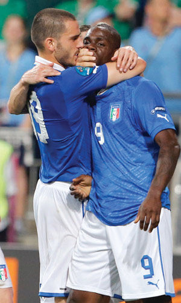
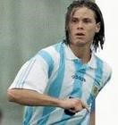
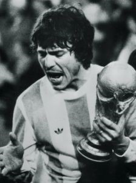
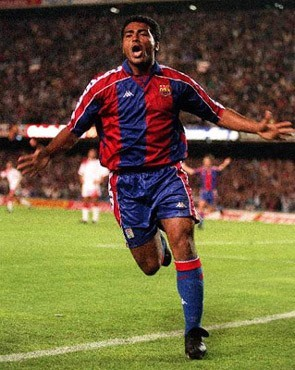
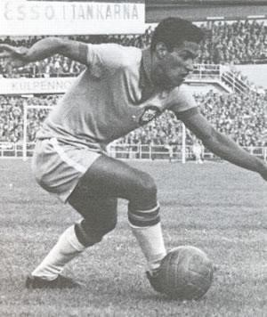
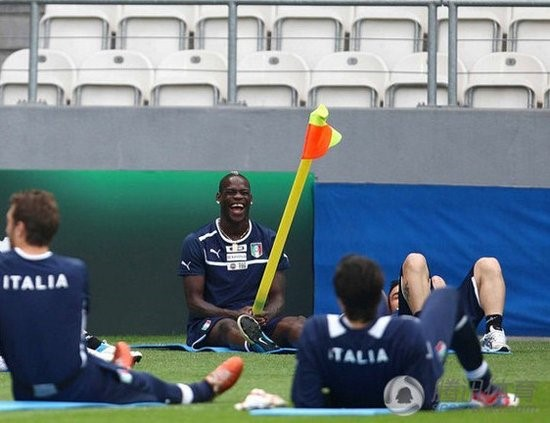

# ＜玉衡＞不想要标题——只为足球而正名

**没那么多事得圆满、皆大欢喜，不可一世如雪山冰峰之人必然会有你没我：这样的故事才是故事，这样的人生才有回味，这样的足球才带感——别给我窝在一起假面谄笑和稀泥，都他娘的凌冽直接点。**  

# 不想要标题

### ——只为足球而正名

## 申宝（安徽工业大学）

 

我同学身体壮、长得帅、有点小钱、肤色性感、品性纯良、幽默风趣……几年前我很怀疑我下面，一度认为我不举，很是担忧。

我问他：“你怎么样，可管？”

他当时指着桌子，神情自得傲慢：“硬起来的时候敲桌子嘭嘭响……”

那时我跟他都刚毕业不久，对于未来有诸多幻想，满脑子都是对未来的憧憬，虽说现实阴霾密布。青春就像根朝天开枪的阳具，白日春梦比精液粘稠。

未几许，没几年，考公的考公，残喘的残喘，三十未满暮气凝目，生存、繁衍、责任、孤独、说到底是骨子里的懦弱，人生渐行渐退退到看似安全的旮旯角落睁眼闭眼祈求人生安稳晃悠完。他没搞设计也没干营销最后谋了份安稳行当，为党国做牛马；我不再幻想写小说，不再奢望转行、转行，转身、转身一直转悠到用兴趣赚钱，按住心中的骄气低三下四跪舔上司、跪舔客户、跪舔那些给我一粥一饭不让我饿死的“施主”安心当个搬砖狗。哦，骚年们，你那根敲在桌上嘭嘭响的傻逼劲去哪了？去哪了？去哪了？去哪了？

 ……这是分割线，下面的内容跟如上无任何必要的联系，看懂看不懂请便，献吻请便，想骂也请便…… 

巴神侧勾爆射，完美的内射。巴神high完张口就要骂：妈了个逼的，谁骂老子黑鬼，谁笑老子脑残，谁半夜爬起来就为看老子笑话……妈了个逼的。队友赶紧捂住巴神的嘴——巴神的世界我们不懂，保护好巴神，莫被凡渣践踏。

我爱这个巴洛特利，这才是我心中的球员，这才是我看球的理由。

雷东多为了留住长发问候了主教练帕萨雷拉的全家——莫用强权要挟我，莫用莫须有的纪律要挟我，老子不会屈服你无理的淫威。雷东多无缘法兰西，从此告别的国家队。阿根廷也在最强大的时期告别了金杯。

史上最优雅的球员——雷东多

还是那个帕萨雷拉。年轻的时候这货是个三场比赛就能进一个球的中后卫——没错，他是中后卫。这个一辈子必须当队长，脑浆里都崩着独裁戾气的混账：前锋搞不定时他就冲上去射门，队员在场上犹豫胆怯他破口就骂，对方前锋敢生吃过他那么那家伙可能再也别想踢球……这是特里、罗伊·基恩之前的畜生，这是个最飙血的高乔。1978年世界杯这混蛋是阿根廷队长，那支阿根廷根本就是一群喝高了的亡命徒，靠着野蛮霸道甚至无赖强夺世界杯。

关于帕萨雷拉有两则趣事。1978年世界杯最佳射手，阿根廷的锋神肯佩斯这么说：“1978年世界杯夺冠那一刻我根本没有碰到奖杯，虽说决赛我进两球战胜荷兰。夺冠后帕萨雷拉死死地抱住金杯搂在怀里，谁都不能碰一下……这才是我们的队长，是他蛮横地带领阿根廷拿到冠军。”1986年世界杯比拉尔多任命马拉多纳当队长，然后帕萨雷拉一怒宣布退出国家队，那届冠军也就跟他无缘。帕萨雷拉与马拉多纳、帕萨雷拉与雷东多，这是绝世枭雄之间的无奈。没那么多事得圆满、皆大欢喜，不可一世如雪山冰峰之人必然会有你没我：这样的故事才是故事，这样的人生才有回味，这样的足球才带感——别给我窝在一起假面谄笑和稀泥，都他娘的凌冽直接点。

这就是帕萨雷拉

贝利这货老了玩起优雅庄重，语重心长地指导罗马里奥：“孩子，我是过来人，你应该这般、那般、这般、那般……我是为你好。”

罗马里奥直接回应他：“你他妈给我闭嘴！

大赛在即罗马里奥向主教练克鲁伊夫请假回国过狂欢节，克鲁伊夫被他的话惊到，很厌烦地回答进皇马三球再跟我谈价钱。结果他真进了皇马三个，然后踢完球不打招呼就飞回巴西。

贝利是巴西足球的图腾，过去是、现在是、未来也是。他是巴西足球最好的象征：天赋过人、优雅鬼魅、逢人就笑、和蔼嬉皮。他的足球是权贵最好的玩物：坐在包厢里搂着名模、叼着雪茄、点一口波尔多红酒，看贝利——突然不可思议一下下：搂着小婊子感受一下小刺激。罗马里奥点明了让他闭嘴。

巴西足球史上最顽强的天才，小儿麻痹症患者加林查未满六十贫困酗酒而死——当他死了，巴西人、巴西政府才想到自己还有过这样一个天才。“哦，加林查……他死了。”两腿长度相差十几公分，一支脚不踩着高跟站不稳的残疾人肆虐过整个世界——世界杯历史上只有两个人完全靠一己之力拿到过世界杯，一个是1986马拉多纳，另一个是1962“小鸟”加林查。贝利？shit，看看他身边队友都有谁，他不过是被捧起来的戏子。

你能看出他两条腿扭曲不，残疾人过掉全世界的后卫

当满世界都是卡卡时，那几年我最讨厌巴西队。卡卡连同那支球队就像块油腻的巧克力，甜得让人反胃。在权贵面前，在钱面前都是孙子，还是那个罗马里奥：让贝利闭嘴，藐视教练克鲁伊夫却用进球让他无从抓狂。罗马里奥毕生被放逐，他本可以成为旷世偶像，本可以赚得仓爆，可他就是没法去服从——要么乖乖让他随意发挥，要么老子就走。

…… 

这届欧洲杯就像滤掉酒精的啤酒，每每半夜起来每每被那群人催眠。现在的足球太老实、太实在、太“合算”。西班牙领先后溜法国队，博斯克这个老奸佞憋不住阴笑，最合算、最实际的赢球，我已经给西班牙定性——控球型意大利。我98年开始看球，从那时一直到08年每次西班牙都是冲动鲁莽杀来，每次都被对手暗算喝着眼泪滚回家，直到2008年上帝看不下去了战胜意大利修得正果。就像最早到伊比利亚传教的教士保罗——最执着的苦行僧，最纯正的天主教。我爱那时的西班牙：在日耳曼人、盎格鲁撒克逊人用冷静、理性经营把持的欧洲，地中海的出口会吹来一缕大西洋的暖风，欧洲杯没有南美球队，艺术写意全靠伊比利亚双雄透点气。楞冲冲的西班牙、楞冲冲的葡萄牙，这般变成了控球型意大利、矮骡子切尔西。潇洒与冒险随着国家的经济被赤字给吃掉。

到现在，只有巴神了，只剩这个小混球。巴神训练时把角旗杆插在裆部，瞬间组装长杆加农炮。巴神笑得比罂粟还灿烂。队友当时没人敢搭理他也没人知道怎么搭理他——这个无语的外星人，他发病的时候比罂粟还毒，面对单刀还能思考人生，毒瘤啊！

巴神的世界……

凡渣，你们忙得钻营赴会哪顾得上思考人生，你们一生也踢不出巴神的凌空侧勾，更不敢当着摄影机话筒冒着被禁赛的危险骂那些凡渣。

巴神的世界你们永远不懂，精明的都老了你们，巴神他还可以悠闲地思考人生顺带硬起阳具敲砸一颗颗生锈的脑袋嘭嘭响。

这个世界越发理性、和谐（除了某朝），但性情没了。足球还在踢，不过依然昏昏欲睡。

完了，洗洗睡。

 编者注：本文副标题为编者所拟。  

（采编：黄理罡；责编：黄理罡）

 
