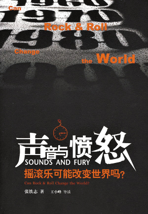
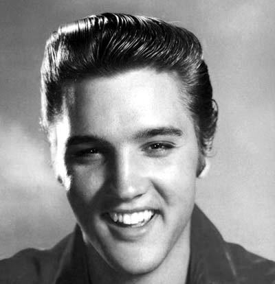

# ＜玉衡＞与摇滚有关的日子——读《声音与愤怒》

**音乐，通常被誉为“人类与上帝对话的语言”。在今天这场对话中，这片土地的音乐却遗憾地缺席了，它并未救赎我们的灵魂与生命，甚至使人们迷失在纷扰的情欲中，成为逃离社会的捷径。所幸当下，在人们面对音乐只有艺术性和娱乐性的“本能反应”时，《声音与愤怒》为我们还原真实的摇滚，重回历史现场，展开对音乐的重新认识与另类想象，我们也不妨借助此书开始漫长奇异的摇滚旅程。**

# 与摇滚有关的日子

# ——读《声音与愤怒》

## 文/修思1984（江西教育学院）

毕业赋闲的几日，打开电视机，到处红歌阵阵，千姿百媚 ，“飞入寻常百姓家”。不免心悸，“侧耳不闻问诗书”，于文字丛中，觅寻晨钟暮鼓。因缘际会，从朋友处借得张铁志的《声音与愤怒》一书，翻阅几段，如遇佳偶，即不忍掩卷释手，惊叹于作者的独特观察视角和另类音乐叙事。一天的时间，就把它啃完了。每个热爱音乐的人，都不妨手执一卷此书。这是一本为摇滚立传的书，作者为我们介绍了一部从六十年代到九十年代的波澜壮阔的欧美摇滚成长和演变史。

关于“摇滚乐”，内地的许多人一知半解，常常会把它与色情、颓废和堕落联系到一起。对它的了解，也仅仅限于重金属、吉他、电子乐、怪异发型这些窠臼的符号，把它当做一项时髦的消费品，或规避唾弃，或趋之若鹜。通读《声音与愤怒》，就会发现诸类对摇滚乐的偏见和误会，大概是音乐史和文化传播史上的一桩最大的“冤案”。

摇滚何以蒙受不白之冤？任何一桩外来文化事物在与本土化联姻，开花结果的过程中，我们都需要端视两者原来的文化基因与社会面貌。就从红歌说起，自上个世纪四十年代末以降，前三十年，各色政治运动在大陆风起云涌，连绵不绝。最高权力的谕旨自上而下地侵入社会的每一寸肌肤，音乐自然也不能幸免，诚恳地接受权力的政治改造，“以人民群众喜闻乐见的形式”为广大工农兵服务。京剧的再改造和八个样板戏的长期垄断，即是那个时代最严肃又最荒诞的一幕——这些我们可以从章诒和女士的《伶人往事》中一窥衣角。那个时代，一切都泛政治化，任何逃离或避开政治的举动，都是危险的，会被视为“异类”，甚至被斥为“异端”，是走资本主义道路。

而进入改革开放时期，人们对往日的运动心有余悸，以致又走入另一个极端。物欲横流，纸醉金迷，只有政治是最丑陋的，远离政治是所有人最有智慧的选择，一切都被去政治化。放眼当下的各大音乐排行榜，观察一下人们随身携带的各类音乐播放器，似乎我们拥有全世界最多的情和爱。每天被这些音乐裹挟，几乎会获得和看新闻联播一样的奇异效果——我们生活在一个最美好的时代和国度。

音乐，通常被誉为“人类与上帝对话的语言”。在今天这场对话中，这片土地的音乐却遗憾地缺席了，它并未救赎我们的灵魂与生命，甚至使人们迷失在纷扰的情欲中，成为逃离社会的捷径。所幸当下，在人们面对音乐只有艺术性和娱乐性的“本能反应”时，《声音与愤怒》为我们还原真实的摇滚，重回历史现场，展开对音乐的重新认识与另类想象，我们也不妨借助此书开始漫长奇异的摇滚旅程。

50年代中期，猫王（Elvis Pistols）缔造了“摇滚乐”这一音乐史上的奇葩，从他扭动臀部的那一刻开始，摇滚乐就成为历史上第一种关注年轻人生命处境而创造的音乐，试图表达或挑逗他们的欲望和不满，其本身就已超越了音乐的范畴，在审美意义之外，它被赋予了理想主义的气质。而摇滚乐在凤凰涅槃的成长中，荣耀与艰巨并存，更没有辜负这一伟大深刻的传统。

自六十年代以降，以黑人民权斗争为中心的人权运动激荡整个美洲大陆时，以反战为号角，从纽约到巴黎，从布拉格到东京，工人走上街头，学生走出教室，连成烽火之势，表达他们对不正义的愤怒与抗议。以滚石乐团和披头士为首的摇滚乐队，没有选择躲进音乐的世界，而是和工人、学生一起，用豪迈如钟温柔如风的音符抓住时代的想象力，加入人群的潮流，关注他们的命运，期望以摇滚终结资本主义世界所有的不公和罪恶。著名曲目有滚石乐团的Street Fighting Man和披头士的All You Need Is Love，一首首歌曲宛如一篇篇强有力的政治宣言。在这场摇滚的盛会中，他们真诚地相信进行社会革命必须要伴随着文化革命，而摇滚就是文化革命的先锋。在反战的巨大帷幕下，即使追随摇滚的嬉皮士们没有提出具体的政治或社会改革主张，但已经使摇滚迈出成熟的步伐，从最初的叛逆因子成长为时代的骄子，诚如张铁志先生所说：“他们对主流资本主义体制的意识形态和生活方式的挑战，本身就已构成一种激进的反抗姿态。”“做爱不作战”（Make love，not war）则是那个时代留下的最美的诗行。

步入七十年代，迎来华丽摇滚与朋克摇滚，以冲撞乐团为代表的乐队发出了他们时代的宣言：“谁人乐团和滚石乐团令人厌恶，因为他们已经不能给年轻人任何东西了。”尽管未免言过其实，但可以说代表了摇滚文化的趋势。后来的“红楔”、“四海一家”、“锐舞”等摇滚风格，基本都沿袭了这一命运。这一情形也被张铁志一语道破，值得深味：“当原来和青年文化紧密结合的摇滚乐完全被商业体制吸收、缺乏活力时，新的声音、新的音乐形态就会爆发出来。然后当这些音乐创造的英雄开始成为摇滚巨星，当更多唱片公司要搭上风潮列车，也必然注定了这种音乐的老化和死亡。历史于是不断轮回下去……”

然而，各个时期的乐团，从披头士到性手枪，再到斯普林斯廷和U2，却都一致传承着摇滚精神的薪火——理想主义、自由、公平。从反战、反饥饿、司法公正、废除死刑，到环保、反全球化等社会议题，摇滚乐从未离开现场，到处奔走呐喊，“他们的歌比任何一篇政治宣言都要能总结时代的精神，更能影响年轻人对政治的关注。”

尽管不能认同此书中作者对群众力量的渴望和对革命的张扬想象，因为如哈维尔所说“人类的理性总是有限的”，但摇滚乐人对社会议题的积极介入，使这些既享有高度商业成就，又能对时代进行严肃思考的艺人，深深地打下了知识分子“问政除弊”的烙印，让世人为之景仰。更让另一片大陆上的人们窥得洞外的风景，原来音乐不仅关乎“友情、爱情和家庭”，还有“正义、公平和批判”更值得我们重视。张铁志在书的后记中直言：“有些愤青从这本书爱上摇滚乐，有些乐迷开始认识并参与社会运动……”这大概就是传说中知识与宣传的力量，而本质上是摇滚精神的魅力所在。

在这场摇滚参与书写和介入历史的终极渴望中，“摇滚可能改变世界吗？”比利·布拉格说：“艺术家的角色不是要想出答案，而是敏锐地提出正确的问题，阅听人才是改变世界的主体。”这一点，摇滚无疑出色地做到了。从最早的Street Fighting Man被电台禁播，到最近2004年的中亚“街头革命”，政府劝当地知名摇滚乐队不要上街演出，以免观众受到煽动，他们恐惧的都是“阅听人改变世界的力量”。

回顾我们自己的土地，除了《勇气》、《青花瓷》、《我相信》这些反映琐细生活情节、触动人心的流行音乐，我们似乎还不曾见识自身之外的音乐想象和叙事，看不到广袤的社会生态和时代变革。虽然每年从音乐工厂出产庞大的音乐制作，但这仍是一个音乐匮乏的国度。这既是音乐的缺席，也是时代的尴尬。

不过暗屋推窗，细心的人们会发现，摇滚并没有抛弃这个时代。庆幸我们还有崔健、张楚、李志等这些在中国音乐史上摧枯拉朽的摇滚乐人们，从《红旗下的蛋》、《时代的晚上》，到《上帝保佑吃饱了饭的人们》、《孤独的人是可耻的》，再到《他们》、《人民不需要自由》，抒写了中国摇滚乐的一部长征史，把创作者和听众都从纷扰的情欲中拯救出来，关注更广袤的社会生态和时代变革。

摇滚乐可以改变世界，当然也可以改变中国。

（采编：麦静；责编：黄理罡）
