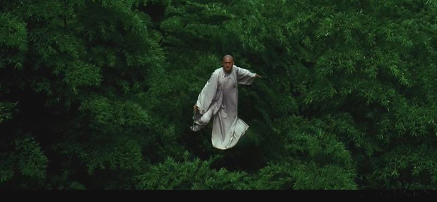

# ＜玉衡＞中国电影——生于细节，死于细节

** 拍《卧虎藏龙》时袁和平不断劝李安别用钢丝，会被外国人笑死。结果大家都知道了。竹林里那场空战至今回想起来仍让我蛋疼不已。国外报纸总拿这个揶揄大陆武侠片——“这飞来飞去能将死板和无动于衷的观众的童心唤醒”。**

# 中国电影——生于细节，死于细节

### 

## 文 / 方舟（江苏海事学院）

### 

最近朋友推荐了个高清电影网站，速度不错，画质也确实棒。于是一口气看了4、5部最近的国产电影，剑雨狄仁杰之类，一水的古装大片，在中国言论自由的两大表现就是：你有骂中国足球的自由和骂中国电影的自由。一口气看完，我也确实一肚子牢骚不吐不快。 令人尤其介怀的是这几部顶级制作的国产大片里竟然随处可见幻灯片式的镜头切换，一个正正经经的电影就因为这样的细节而显得业余和轻佻起来。每当注意到这些东西，我就从投入的观影中被一巴掌打醒，只好长叹一声，咿嘘唏，随便拉个正常美剧来就能在这些细节方面全灭大部分国产电影也。众所周知，中国电影普遍剧本孱弱的情况不是一天两天了。要卖座，靠的全是砸钱营销和话题炒作。这么些年从未见电影本身素质的真正蜕变。什么？你说剧本是一剧之本？对
