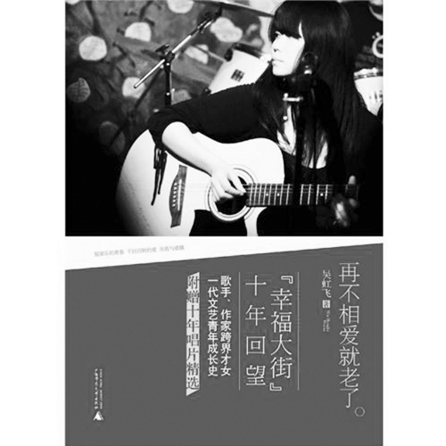
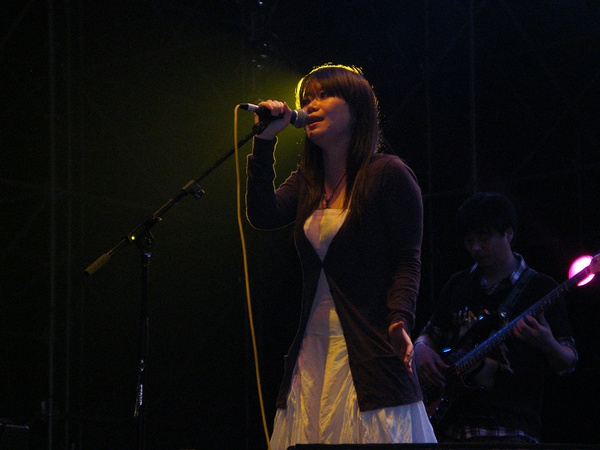

# ＜玉衡＞为了命名那路上扯淡的忧伤

**大家都惊叹于你的多重身份。你是一所让人仰望的高等学府毕业的高材生，是牛逼平面媒体的创刊记者之一，是作家，是面容模糊嗓音尖利的乐队女主唱。但是在我心里，你就是一个受到某种咒语而将终生赤脚奔跑于追逐爱的路上的姑娘。路上的荆棘不断刺破你的双脚，鲜血渗透进土壤，等到第二年春天，就会开出热烈的鲜花。**  

# 为了命名那路上扯淡的忧伤

## 文/ 江润琪（武汉大学）

 

亲爱的阿飞，终于决定为你写点什么的时候，我其实有点紧张。这样的紧张简直是不可理喻的，又不是写表白情书怀里揣个小兔子悄悄塞给他。事实上我想起你我就好像想起一个久违的笔友。仿佛在过去的日子里我们通了很多很多封信，彼此交换一些秘密一些孤独一些快乐。而现在，如同你说，我们见面吧。然后我犹豫了，之前的心满意足正在受到威胁。我特怕因为自己的笨拙把一些敝帚自珍的感情给糟蹋了因此宁肯保持沉默。但是既然终于下定决心去写，我就会好好地安排我们的第一次见面。我就假装你看见它们，咱们见字如面。是啊我甚至从没真正见过你。但这并不妨碍我了解你爱你。我珍藏着你的一张黑白照片。照片里的你，齐刘海儿，浓密直顺的长发。你眼睛真美，秋水就静卧于你的眸中，风一吹，就闪烁着光点。

阿飞，我了解你的过程让我想起16岁那年喜欢上一个叫做小莫的电台主播，我给她写了很多信，但都没有寄出去。仿佛只是一种自言自语，为了命名那些过分沉默的岁月里不可名状的忧伤。我也是从那个时候开始接触你的。第一次接触你还是通过音乐，《胭脂》。这一次接触像不经意触摸了一面宁静的湖，湖水就突然搅动起来，然后我看见一只美丽得让人伤心的水妖在湖底游来游去。《胭脂》里那首《春天》听到我指尖直泛着淡淡的青苔绿。彼时我仍生长在干燥明快的北方，关于南方，我知道得不多。歌声里，属于南方的潮湿的秘密如一种谶语与我未来的一段日子纠缠在一起。我惊讶而好奇究竟是怎样的女子可以以干净的嗓音唱出这样奇艳的哀伤。

再后来，我梦到一片浓密得看不到阳光的惨绿色森林，地上有很多很多野花生长纠缠在一起仿佛永无休止。你穿着大红的嫁衣，侧卧在一条河水边。神情忧伤又宁静，仿佛倾听着什么。然后不知怎么水就淹上来了，淹没了你。然后你就变成了一只黑色的蝴蝶。我不记得你是不是飞走了，或许这也不重要了。因为你早就绝望地唱过，有谁曾经真心真意爱上一只蝴蝶，有谁知道蝴蝶从来不能自由地飞翔。所有纯洁的忧伤，隐秘的情欲，乖戾的情绪，潮湿的爱情，像一阵沉淀在岁月深处狂风倏地卷起，热恋的人们从此坠入万劫不复的深渊。

对。爱情。怎么能够不说爱情。爱情是你的歌你的文你的心，永恒的悲观的主题。“一场恩宠，一场虚荣，一切不能从头来过。荒芜的岁月，那些等待，一低头的温柔。那些期盼、倔强和深深的绝望。昙花一现，不值一提的温存。再不相爱就老了”。

大家都惊叹于你的多重身份。你是一所让人仰望的高等学府毕业的高材生，是牛逼平面媒体的创刊记者之一，是作家，是面容模糊嗓音尖利的乐队女主唱。但是在我心里，你就是一个受到某种咒语而将终生赤脚奔跑于追逐爱的路上的姑娘。路上的荆棘不断刺破你的双脚，鲜血渗透进土壤，等到第二年春天，就会开出热烈的鲜花。

我已经记不清那些出现在文字中的男人。跟你通信激烈讨论永动机设计的黑脸小男生，你后悔分手时没让他买好多好多巧克力的小康，或者还有谁。而唯一让我念念不忘的，或许也是你执念最久的，就是曾经叱咤五道口的吉他英雄小龙吧。

我不知道究竟要多么大的勇气和怎样的一往情深能让你努力掩饰自己的内向，为了他眼光的短暂停留成为舞台上的艳情科学家。我同样不知道当很多很多年后，你在一个滂沱的雨夜和已经是一个小女儿的父亲的小龙再次相见时，你彼时的心情。

或许重逢恍若隔世，而激烈的爱留下的疤痕真实提醒着你曾如此用力活过。爱情如同隐秘的刺青刻于你的天赋之上。纵使从没见过你我仍敏感地于你所有的音乐与文字中嗅到它的气味，带着南方特有的潮湿的叹息。可是你不能停止奔跑，咒语还没有解除。唯有将爱变成一种不死的欲望，用身体用鲜血浇灌音乐，浇灌文字，让花开不败。

阿飞，其实我差一点见到你。今年十月份，得知你在神棍节那天北京有演出，为此我做了近二十年来最疯狂的决定之一，从武汉过去看你。可是要不说人算不如天算啊，10号晚上我在去武昌火车站的路上得知你的演出由于某些原因被迫取消了。我当时迟钝地不知道此时该有怎样的心情是比较正常的，于是大脑空白了很久很久结果我不仅没看成你的演出，也错过了你的新书签售，彻底没能见你一面。给你拿两袋麦丽素作为生日礼物的打算也没能实现，多少是有点遗憾的。

后来，我曾很多次幻想着那场未曾进行的演出。想你会不会穿一条美丽的长裙，坐在高高的凳子上低眉弹吉他时，海藻般的长发顺着脸颊滑下。灯光很暗，裙子几乎盖住你的脚，你在舞台上兀自歌唱，如一只妖娆忧伤的美人鱼，坐在海边礁岩上，为了一个无期的等待夜夜而歌。我想，就远远的看你。真的就这么远远看着你我就很满足了。当你唱起《一只想变成橘子的苹果》的时候我不才管周围人装不装正经，一定第一个跳起来陪你喊“帅哥哥帅哥哥路上走着个帅哥哥”。但我实在说不好自己会在哪一首歌响起时，突然神经质地哭得稀里哗啦。

可是阿飞，如果我告诉你，因为你未进行的演出让我遇见那个对的人，你会为我开心地笑起来吗。我或许真的透支了这辈子的好运，愿以半生的颠沛流离换取与他的相濡以沫。

事实上，我的爱情观亦是受到你文字的影响。那些年里，我怀着隐秘的残忍与无望，读你的《伊莲》，看叶凌飞在秋天走进小龙的房间，坐在他的床上，列举各种理由说服他和自己做爱，看你写这个世上还会有无数女子因爱死于心碎，永无停止。我感到你是爱得很缓慢的人，不肯轻易交付自己。可是一旦投入就是不分场合地奋不顾身，为此不断给自己的生活带来伤害乃至绝望，却又一次次随时准备以爱的名义粉身碎骨，在所不辞。

“有时想到唱片永远做不完，你知道我心里有多绝望，而2012又快到了，你甚至还不懂什么是爱情。”不怕，阿飞，不要怕。我亦是在那些糊涂又单薄的岁月里，成长为一个悲观主义者，但仍然无比热衷于深渊望见星空，在绝望中绝处逢生。我喜欢你的痴气，就是那种什么事情一旦决定就算撞到了墙也要拆了墙继续前进的痴气。你真该保持它。你这样的好姑娘一定要有个像样的人来爱，要知道这世界上大部分男人是配不上你的。可是，只要你还愿意偏执地在这个残缺的世界寻找完整的明天，一定可以找到那个爱你三天，你就有三天光明的人。一定可以。让我和他以我们的名义，为你祝福。

该结束了。真的该结束了。此刻我在异乡的深夜，像窥见了自己的梦。此刻我望着前面大段大段的胡言乱语，仍希望它真的只是梦，而自己从始自终都保持静默。我不知道我写下它们的意义所在，正如同我不知如果真的让我面对你，该说些什么好。只好以最无耻的名义——命名忧伤，勉强使自己完成又一次的扯淡。去他的忧伤。可是我觉得对你的爱不该是忧伤的，它们应该和你一样，纯洁而芬芳。我也觉得我面对这个恶心的世界不该只怀着忧伤。我其实很贪心，总觉得自己以后该和你一样，过一种将自己区别于街上路人甲乙丙的日子，靠着被现实打击得十分羸弱却异常顽强的理想主义与幻想，去做一些疯狂的事情以抵抗生活的庸常。你总说青春不过一场热病，你不特殊，如此不特殊。但你是否知道，当青春的光芒退去，你拒绝大病初愈后长成个不动声色的大人，就已经摆清态度，随时准备与这个操蛋的世界决裂。亲爱的阿飞，你在下个路口等我一下好不好。我已经站在门口，脱下鞋子，从此决心和你一同奔跑，目光如炬。

我只愿，只愿有一天，会有一个世界的春天，花开不败。

 

（采编：陈锴；责编：陈锴）

 
