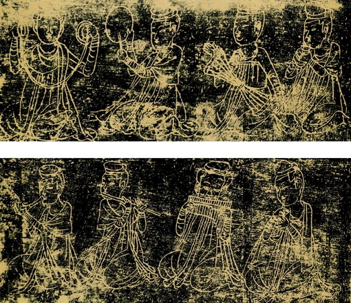
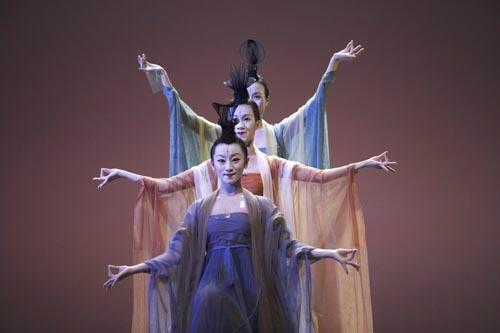

# ＜玉衡＞乐舞书画：礼乐文化的艺术精神

**我们欣赏一幅草书，在随着阅读单字的过程中，恰似在欣赏一出精妙的舞蹈表演，随着笔画的纵横起伏，更有一种音乐的旋律在跳跃。书论史上经常有这样形象的比喻，如说苏轼的字是“石压蛤蟆”，黄庭坚的字是“渔夫摇橹”，郑板桥的字是“乱石铺街”，康有为的字是“死蛇挂树”，这都是一种图像化的批评，而说沈曾植的字是“跳迪斯科”，则既有图画式的批评，又有乐舞意味的感受。**

### 

### 

# 乐舞书画：礼乐文化的艺术精神

### 

## 文/谷卿（暨南大学）

 在本文里，笔者将通过对乐舞书画这些具体的艺术门类的感知了解，来探讨和发现礼乐文化及其艺术精神的体现。 

### 

我们知道，中国古代农业文化的特点是由多个小的水系发展为大的水系，由于水系丰富而复杂，遂形成了极广的地域联系，但又没有能够深入内陆的海，航海条件不佳，故而容易长期处于一种比较封闭的状态。黄仁宇先生在《赫逊河畔谈中国历史》中认为，秦能够最终统一，确立集权体制，结束封建时代，其中中国水系和季风的特点是一个重要原因。众所周知，黄河通过黄土地带，黄土铺盖着华北几省的广大地区，土质松疏，黄河也因此夹带大量泥沙，随时有阻塞河床、冲破河堤、淹没人畜、损坏耕作物的可能，局部治理无济于事。世界主要河流夹带泥土大致在百分之四到五，南美的亚马逊河夏季能带砂百分之十二左右，然而我们的黄河夹砂量达百分之四十六，夏季其支流夹砂量更能高达百分之六十。在春秋时代，各小国在黄河附近筑堤也已经妨碍了彼此的安全，有些国家还恶意的将灾害加诸邻国，战国期间更以决溃敌国大堤作为一种战争手段，所以黄先生认为，“光是治水一事，中国之中央集权，已无法避免。”梁惠王对孟子说：“河内凶则移其民于河东，移其粟于河内；河东凶亦然。”迫于自然的压力而非社会原因，诸侯国拓展疆土、兼并他国。因此战国全面竞争之后，小国无法生存，故而有趋向整个统一的趋势。所以，中国的自然地理状况呼唤着一个大一统时代的到来，中国文化就在这种大环境下展开。钱穆先生认为，小区域文明易于达到顶点，很早就失去向前的刺激，易于过奢侈的生活；中国文化因为在贫瘠广大的地面产生，因此有不断延伸拓展的前途，而在其文化生长过程下，社会内部也始终保持着一种勤奋与朴素的美德，使其文化常有新的精力，不易腐化。所以欧洲文明史表现为一种“取代”，中国文明则表现为一种“发展”。当然，这种自然地理环境也是造成农业文明的无知封闭、盲目自大和近代以来逐渐落后衰败的重要因素。对于关于地理与文明的关系，大家可以读一读梁启超、钱穆、吕思勉的著作，顾准关于希腊的城邦文明与政治的论述也可以参考。 

### 

### 

刚才简单交代了一些需要交代的背景问题，接下来可以谈在这一文化共同体基础上形成的文化精神。其实，一切文化都是长期以来为了适应当时当地自然环境而形成的全民习惯，在农业文明为主的中国，文化表现为两大突出特征：第一是天人合一的世界观。由于农耕生活决定于自然条件，天地的意志影响到万事万物的成败生死，于是人们意图让一切事物尽量符合天命而获得长久与永生，《礼记》说：“人者，其天地之德、阴阳之交、鬼神之会、五行之秀气也。”“礼，必本于大一，分而为天地，转而为阴阳，变而为四时，列而为鬼神，其降曰命，其官于天也。”又说：“天秉阳，垂日星，地秉阴，窍于山川，播五行于四时，和而后月生也。是以三五而盈，三五而阙，五行之动，迭相竭也。五行、四时、十二月，还相为本也。五声，六律，十二管，还相为宫也。五味，六和，十二食，还相为质也。五色，六章，十二衣，还相为质也。”这就是典型的天人合一的观念。天人合一的大概念又衍生出两个子观念，即万物有灵和不同的文化形式间呈现为精神相通相融的状态，下文将会具体谈及。 

### 

 我们讲了第一点是天人合一的世界观，那么中国文化的第二大特征是忧患与和乐并存，忧患包括忧生和忧世。刚才谈到中国文化因为在贫瘠广大的地面产生，因此有不断延伸拓展的刺激，这种可持续发展就来自于一种危机意识和忧患意识，对于天命难测的焦虑、对于神秘事物的畏惧、对于今生来世担忧，在中国文化史和文学艺术史上不断重现、不断表现。《老子》说：“吾有大患，为吾有身；及吾无身，吾有何患。”正说明忧患意识在中国人特别是中国的士人与文人的心中是根深蒂固的，对生命无常的忧虑以外，还有对国家社会的忧虑，此处不必赘言。与忧患意识并存的，恰恰是和谐欢乐的乐感文化，它们的辩证存在并不矛盾，正是由于人们对不可知的世界充满了忧虑，一旦取得或大或小的胜利和成就，必然欢乐无比。我们看《山海经》中的神话传说，在人与天地鬼怪战斗的过程中和结束后，往往呈现出一种诗意的画面，最美丽的莫过于夸父逐日中的弃杖成林，它表现了中华文化心理结构内部的一种精神状态和希望。此外，农业文明的耕作劳动，让人们感知到自然力量的强大恐怖之外，也最能让人们体悟到自然之美，中国的诗天然地呈现出画的意味，而这个画正是自然的写照。自给自足的自然经济，让人们很容易产生恬静安详的快慰，孔子的政治理想实际上就是让所有人包括自己安居乐业，这在《侍坐》章中表现得非常突出，还有一次叶公问子路孔子是个什么样的人，子路不知道怎么回答，孔子批评子路：“汝奚不曰：其为人也，发愤忘食，乐以忘忧，不知老之将至云尔。”孟子也强调乐，特别把教育看成一件无比快乐的事，他说：“君子有三乐，而王天下不与存焉。父母俱存，兄弟无故，一乐也；仰不愧于天，俯不怍于人，二乐也；得天下英才而教育之，三乐也。”真正的儒家理想就是天下大乐，天下大乐恰恰是大治的一个重要体现。 

### 

谈了这么多，我们还是通过具体的乐舞书画来理解和体会这种文化精神。不管音乐的产生原因是什么，有一点可以肯定，它最初一定是与先民祭祀、狩猎、畜牧、耕种等生产生活有关的，甲骨文的“樂”没有中间的“白”，两边的“丝”与食物、谷穗有关，是一种谷物成熟的视觉形象，与它同音的“藥”的写法，也是和草木谷穗有关，而“丝”也是弹拨乐器的重要组成部分，所以“樂”也作为一种乐器象征符号，后来小篆“樂”中间有了“白”，表示的是一种弹拨工具。我们可以推断和想象，在一场丰收过后，喜悦的人们欢庆、跳跃、饱食，为了表达这种欢快，自然而然地舞动、歌唱，而乐器的产生也很可能就在此间。《礼记·乐记》说：“乐（yue）者乐（le）也。”这正说明了由快乐而产生有声音韵律的“乐”的内在理路。在先秦礼乐教化中，“乐者乐也”被进一步发挥，开始强调音乐的社会功用，乐作为一种教化手段与方式，参与到政治行为的过程中来。礼教是理念，乐教是具体形式。《荀子》言：“君子以钟鼓道志，以琴瑟乐心。动以干戚，饰以羽旄，从以磬管。故其清明象天，其广大象地，其俯仰周旋有似于四时。故乐行而志清，礼修而行成，耳目聪明，血气和平，移风易俗，天下皆宁，美善相乐。故曰：乐者乐也。君子乐得其道，小人乐得其欲，以道制欲，则乐而不乱；以欲忘道，则惑而不乐。故乐者，所以道乐也。”这就从对待乐的情感态度上对人们道德修养作出规范，这种礼乐精神已经完成了从原始的感性作乐到理性规范了。 

### 

我们再回到上古时代进行探讨，上古时代诗乐舞是一体的，关于乐舞的起源，学界有很多说法，比如劳动说、巫术说、恐惧说等等，我觉得不必严格区分，因为这些起源学说都是你中有我我中有你的，不存在一种绝对纯粹的起源方式。我们常说三代先秦的“国之大事，在祀与戎”，由于祭祀活动的重要地位，其礼仪性更有所增重，这时跳神的舞蹈、欢庆的音乐、如念经般的诗咒，必然归统为一，甚至我们要说的书画，也与之成为一体，比如纹身涂面、画符写咒，乐舞书画融合为一，这也证实了我们刚刚谈到天人合一时提及的“不同艺术形式间呈现为相通相融的状态。”毛诗序言：“诗者，志之所之也，在心为志，发言为诗，情动于中而形于言，言之不足，故嗟叹之，嗟叹之不足，故咏歌之，咏歌之不足，不知手之舞之、足之蹈之也。”文艺作为内心心理与情感的表达方式，必然存在一种联通互融的精神。 

### 

### 

那么书画同为一种平面空间艺术，则更有相通之处了，甚至本来就是一体的。赵孟頫诗言：“石如飞白木如籀，写竹还于八法通，若也有人能解此，方知书画本来同。”这就是我们常说的“书画同源”，这里的八法指的是书法中侧、勒、弩、趯、策、掠、啄、磔八种笔画的用笔方法，武术中也有八法，手、眼、身法、步，精神、气、力、功，书法也是一种体育形式。汉代的扬雄在《法言·问神》中说：“言，心声也；书，心画也”，这给我们传递了两个重要的信息，第一，书画同源；第二，书画都是内心情感的表达形式。我们追溯汉字的起源，会发现文字呈现出图形和符号的形态，先民最初以象形记事的图画文字来记录、交流，而这些图画文字则取法于山川、草木、鸟兽、星云等天地间一切自然事物，这种来自自然的艺术后来因为实用目的的不同而分化为绘画和书法，特别是隶定以后，书法独成为一种艺术门类，开始离象形越来越远，从反映转向了表现。同时，绘画的文人化也使得绘画向书法靠拢，绘画以一种绚烂之极复归平淡的态度回归简约，这种文人画技法上的简单虽然造成了绘画作品雷同性的增大，但却十分明显地昭示了书画同源同质的关系，我们看米芾的《珊瑚帖》，此作“珊瑚”二字犹大，墨迹最浓，帖中还画了一枝特大的珊瑚，简洁的勾勒，使它既像一枝珊瑚的图画，又有书法的韵味，我们现在已无法推测这样的处理是否有意，就书法形式本身而言，此帖的行为与作品呈现方式之间，可谓相得益彰，这已成为书法史或文人画史上历史性的艺术创新。 

### 

毋庸置疑，汉以前的篆书是与绘画有着不可分割的联系的，而汉以后草书的出现，却使得书法和乐舞之间的关系越来越密切。我们欣赏一幅草书，在随着阅读单字的过程中，恰似在欣赏一出精妙的舞蹈表演，随着笔画的纵横起伏，更有一种音乐的旋律在跳跃。书论史上经常有这样形象的比喻，如说苏轼的字是“石压蛤蟆”，黄庭坚的字是“渔夫摇橹”，郑板桥的字是“乱石铺街”，康有为的字是“死蛇挂树”，这都是一种图像化的批评，而说沈曾植的字是“跳迪斯科”，则既有图画式的批评，又有乐舞意味的感受。其实不仅书法在艺术形式上如此，而且书法的创作也关乎其它文艺的滋养，近代书家张之屏在《书法真诠》中说：“作字者，或诗、书、礼、乐，养其朴茂之美；或江山、风月，养其妙远之怀；或金石、图籍，发思古之幽情；或花鸟、禽鱼，养天机之清妙。果其胸有千秋，自尔森罗万象。凡精神之所蕴，皆毫翰之攸关者也，可不务乎。”书画艺术在本于自然的基础上自来自对情感的抒发摹写，乐舞艺术何尝不是如此呢？陈方既先生在《中国书法精神》中这样说：“书法不是绘画，却要求有绘画艺术的形象感；不是音乐，却要求有音乐艺术的乐律美；不是舞蹈，却要求有舞蹈艺术的姿致；不是建筑，却要求有建筑的严谨；不是诗，却要求有诗一般的意境；不是生命，却要求其有生命般的形质和神采；……。”恰恰也说明了乐舞书画的精神相通性。 

### 

乐舞书画的最高境界，也是中国文艺美学的最高理想，就是追求“无”中的“有”，“有”之外的“大有”。所谓“听有音之音者聋”，“大音希声，大象无形”。唐人成玄英言：“大音希声，故听之不闻；大象无形，故视之不见；道无不在，故充满天地二仪；大无不包，故囊括六极。”可见，有形有声不是真纯自然的高境界，而追求“言外之意”、“象外之致”、“无声之乐”才是艺术的要旨，也就是我们常说的韵。钱锺书先生曾从《永乐大典》中钩索出宋代范温谈“韵”的长文，他说，“吾国首拈‘韵’以通论书画诗文者，北宋范温其人也。”在这篇文字中，范温先是否定了“不俗之谓韵”和“潇洒之谓韵”的观点，继而提出了“有余意谓之韵”的论断。韵，从音员声，本义是和谐悦耳的声音，是一种音乐范畴的概念，但在晋代被用作为绘画批评的术语，而到了宋代，则移作诗词书法的品评，所谓宋人书法重韵，正是说技法不足而其字外之精神充盈，所以，乐舞书画本体形式的简单，并不妨碍内容精神的丰富，简单有时甚至是通向和连接丰富的唯一途径。这也就是道家说的“全之美”而非“偏之美”，这种整体美的境界是哲学上的境界具体发展到艺术上的境界，深深地影响着中国各类艺术形式的发展和中国艺术精神的形成，中国艺术文化也因此得以不断地散发出她无穷尽的魅力和生命力。 ** ** 注：本文曾发表于2011年3月9日《深圳商报》，有删节；原为作者在暨南大学理工学院的讲座文稿，此为完整版本。 

### 

### 

(责编：黄理罡)

### 

### 
