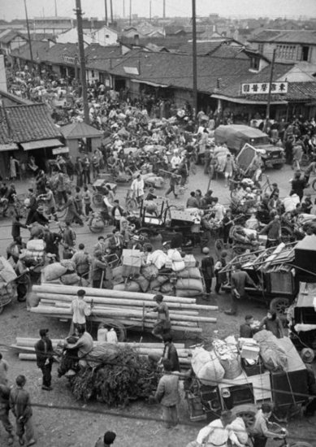

# ＜玉衡＞了解台湾的钥匙——观《1949大迁徙》

**二二八事件是影片前段的重点，也为观者奠定了一个基本的感受：个人命运在历史变迁中难以把握，充满无奈。这种命运无常，体现在各种普通人的身上。有被迫随着军队到台的士兵，有流亡学生，有国军部队的亲眷。他们都以为迁到台湾只是暂时的，过不了几年就会回到大陆，回到家乡。如果知道这一走就是几十年，也许很多人都会对登上横渡海峡的轮船感到犹豫吧。**  

# 了解台湾的钥匙——观《1949大迁徙》

## 文/王静姝（北京大学）

 

#### 一

1945年台湾光复之后，台湾本土社会精英对台湾建设的满怀憧憬，对祖国政权的热切期待，让人十分感动。正如影片所说，在那个时刻，在1945年，陈澄波，阮朝日等一批台籍青年的命运曾与国府的命运紧紧相扣。对台湾，对国民政府，1945年是一个契机，一个崭新的开始，铺展在面前的是多样的可能。至少，是充满希望的。日据时期，由于被殖民地位而不得实现政治地位的台湾社会精英，希望由此能够真正代表台湾的利益、建设台湾，能够发出自己的声音、台湾的声音。如果历史可以假设，对于国民政府，台湾的接管和治理，本是一个崭新的机会，一个向大陆和世界各国展现和重塑国民政府积极的政治形象的机会。不过历史没有那么简单，一个执政党自有其组织的惯性，不会因为来到另外一片土地就“改头换面，重新做人”。相反，政党的目标是保持它认定的自身特质的一贯性。

来到台湾的国民党，仍然是那个在大陆的国民党。这样看来，“二二八”事件国府的镇压行为，对台湾本土人士的迫害，在当时的台湾人看来也许是不可思议的，但回顾国府在大陆的统治，也就算不上特殊的行为了。首先，促成这次镇压的决策的是陈仪，国民政府的福建省主席，典型的国民党官僚。他以一贯的思维，将集会请愿者视为对政府的反叛，对于之后在全台湾发生的针对大陆人的袭击，更自然地认为是有预谋有组织地反叛国府在台的统治。他不会自觉地理解到，这种暴乱是台湾普通民众对一年多来国府统治不满的宣泄，而警察枪杀工人和请愿的群众则点燃了导火索，引爆了克制着的愤怒。因为，依据已经稳定的国府在大陆的统治，警察杀死请愿者的个别事件，如果不是早有反叛者的组织，似乎没有理由引起全台湾的暴乱。而最终决定派兵镇压的蒋介石，也应当有着与陈仪基本一致的逻辑。

二二八事件血腥的镇压，对于刚刚从日本殖民统治之下回归祖国的台湾人伤害之深，大概是难以描摹的。陈重光、宋裴如、阮朝日等被视为民意代表的台湾社会精英遭到清洗，使得国府在台的统治失去了基于合意而得到的依从，失去了被视为代表祖国和代表作为中国人的台湾人利益的政府的正当性。二二八事件以及之后几十年对此事的缄默，让台湾人在殖民统治之下感受到的那种被外来人压制的气氛重又回来。眷村居民感受到的竹篱围墙外似乎复杂而不友好的台湾社会，也大概由此产生。二二八事件当属国民党在台的重大政治失误。不知陈仪最终被枪毙的命运是否实际上与“二二八事件”中判断错误更为相关。相比之下，后来的台湾省主席陈诚在台湾实行的政策，要合宜得多。“三七五减租”、“入境管制”和发行新台币等政策，都有助于维持台湾经济社会的稳定。但这种实用层面的政策，并不能消磨去台湾人深埋内心的痛。而1949年国民政府彻底迁台之后，外省人对政治权利的垄断，也就延续和加深了隔膜。这可以从一个侧面表现出来：台湾高等学府向来以医科最为热门，因为台湾本省人在仕途上没有前途，也就不去报考政治法律类专业。这延续了日据时期的特点，也就一定程度上说明，台湾本省人的政治地位，并没有因为光复而比之前有很大改善。一位到北大交流的台湾法官告诉我说：“台湾当地民众亲日的倾向是相当明显的，这有多重原因，但是其中一点就是光复前后的心理落差。”在日据时期，中国人的确处于受压制地位，但这是普遍的，所有的中国人都是如此；但国民党统治之下就不是这样了，同样是中国人，外省人有着政治前途，本省人反而没有政治地位，这种比较造成的不平衡要严重得多。正如孟德斯鸠在《论法的精神》中论及不同制度下奴隶制的危险性：在政治集权的国家，自由人与奴隶于政治上没有什么区别，于是奴隶也就不觉得自己的地位特别悲惨；在政治自由的国度，自由人享受着尊严与权利，而奴隶什么也没有，他们就会因为比较而特别地愤怒，会起来反抗。

国府政治上的转变，是一个缓慢而带有一些偶然的的过程。为了得到美国的支持，台湾要树立东亚民主碉堡的形象，这是外力的推动。本省的自由人士长期的宣传与争取权利的斗争，也不容忽视。另外，蒋经国在其中起到的作用，是不应轻视的内部动力。在《我们台湾这些年》一书中，作者提到蒋经国说过一句话：“哪个执政党是永远执政的？”蒋经国作为在国民党内一个有威望的领导人有这样开通的观念，并及时付诸实践，是台湾政治一件幸事。

#### 二

二二八事件是影片前段的重点，也为观者奠定了一个基本的感受：个人命运在历史变迁中难以把握，充满无奈。这种命运无常，体现在各种普通人的身上。有被迫随着军队到台的士兵，有流亡学生，有国军部队的亲眷。他们都以为迁到台湾只是暂时的，过不了几年就会回到大陆，回到家乡。如果知道这一走就是几十年，也许很多人都会对登上横渡海峡的轮船感到犹豫吧。在对陈诚之子陈履安的访谈中，他对幼时来台没有带来玩具还记忆犹新。在台湾电影《泪王子》中，空军将领刘将军坚持不愿整理杂草丛生的庭院，认为这只不过是一个暂居之地，不值得精心布置；并一再说对于太太将上海的家具全部运到台湾的做法并不赞同。整个五十年代，从大陆迁台的人们都抱有这种想法，并没有把台湾当作定居之所。这种态度，也体现在国民政府对台湾的治理上，自然引起了台湾本省人的失望和不满。

大规模的强制的迁徙，总会留下深刻的影响。比如明朝洪武年间的山西移民“回望大槐树”，十几年前的三峡移民。1949年前后向台迁徙的结果，塑造了几十年来台湾社会基本情况、基本问题。不同阶层、不同身份的来台大陆人，自然而然地要对在台湾和大陆的生活对比，对原来生活的怀念多会把过去修饰得美好些，于是这批移民对台湾本身不免有不满与抵触的情绪。大概也是因为，在这场空前的离难中，过去富足显赫的没落潦倒了，过去平静安康的变得困顿起来。物质的匮乏、地位的失去，带给人精神上的失落甚至堕落，这是《花桥荣记》里的小人物；心有不甘的，又陷入逃避现实和对过往的追忆当中，这是《游园惊梦》中的太太们，是《永远的尹雪艳》里尹公馆柔软的沙发上夜夜沉迷的老主顾。台湾电影《童年往事》对这个主题表现得冷静而温和，里面男孩儿的奶奶每天想着的事情就是回大陆去。她走出家门，走出眷村，走到田野中去，想要找到去大陆的路，可又总是迷路了，被人力车夫送回来。这种如同迷路一般的迷茫和一刻也放不下的牵挂，应该是许多当年迁台的大陆人共同的体验。

#### 三

影片的第三部分，主要讲述了1948年到1949年间，蒋介石政府将二百万两黄金和两万箱故宫文物前往台湾的情况。纪录片《台北故宫》详细地介绍了文物运台的过程和抵达台湾后辗转多方的漫长经历。对于这件事情，我觉得并不好评价。这些国之重器去国离乡，颠沛流离，原来是战乱所致，与战乱中的个人一样，只能随波逐流。在当时的国府看来，将重要的文物运往台湾似乎应该是理所当然的事情。马衡先生反对将文物运往台湾，是从一个文物工作者的角度，一心要避免对文物的损坏，也希望这些物品回到它们本来归属的地方。其实，庄严先生何尝不是这样想的呢？虽然他支持了文物运台的工作，但也仍然盼望着有一天这些故宫文物能够回到北平。在访谈中，家人提到庄严先生临终前还一直念叨着：北平——北平——这种至死不忘的心愿是不能假装的。只是，一个人、一群人都不能改变历史造成的困难。

影片中也评论到，这批珍贵的国宝运往台湾，也有着明显的政治目的。如何在政权对峙，战乱四起时标志政权的正统性？用什么来代表中国？国府聪明地选择了故宫文物。这批珍贵的物件儿，似乎浓缩了上下千年、九州万里；保有了它们，就似乎是继承了中国的精神形象，一个政权也就有了国家的灵魂。今天，它们还静静地躺在台北故宫博物院和博物院后面的大山中。也许当年有人对国府运走了这批文物感到不甘甚至气愤，但是，也要看到这行为产生的积极效果。故宫文物是两岸血脉相连的重要明证。每一件来自北平，来自紫禁城里的宝贝都说明着台湾和台湾人的精神归属。一个国家，一个民族，不能仅仅靠法律和军事力量机械地绑在一起；它的长存，来自于代代相传的共同的自身认同。如果这些文物能通过它们博大精深而含蓄深沉的魅力，激发起每一个见过它们的台湾人对中华民族文化的热爱和归属，那么一笔丹青，胜过雄师百万，也就并不算是一个神话了。席勒说：“美育是人格的完善。”故宫文物的美，它们背后的悠悠历史，它们承载的辛酸苦乐，足以陶冶人格。而一个、一群具有中国式人格的人，又怎么会愿意永远地离开自己的祖国？在我看来，文物迁台，既是国府当年统一中国计划的一部分，也是这理想的现实遗存。情随事迁，谁能想到它们今天能起到这样的作用呢？我们不需要再去批判那段往事，相反，应该积极正面地宣传这批文物，让更多的人了解它们，懂得它们，维系其两岸的亲缘。即使当年迁台的老人逐渐故去，今日的台湾青年大多在岛上出生，只要这精神的血缘还在，就没有人能切断发自内心的归属。

#### 四

1949大迁徙要说短，也不短；要说长，也不长。这部纪录片较为全面地展现了这一重要的历史事件，人、物、事浑然一体，颇有史诗长卷的构架。但这样复杂的一段过往，在几个小时内是无论如何说不清道不完的。虽然只是挑选了典型的人物，但也还没有时间深入地探索他们在这段时间的经历；即使着重谈到了二二八事件，但回顾起来，也仍显单薄。1949年的迁徙，是了解台湾的一把钥匙，一个切入点。它的复杂和深刻的冲突性，值得通过各种形式深入地探讨。这些任务，当然不是一部几个小时的纪录片就能完成的。我很庆幸能在课堂上接触到这部影片，它带领我寻找深入台湾人灵魂的道路，让我发现自己以为的了解是那么不足。也让我认识到，实现统一，不能讲空口号，也不是肉食者谋之，而是大家的事，需要所有人切切实实而且真诚的努力。

 

（采编自投稿邮箱；责编：麦静）

 
