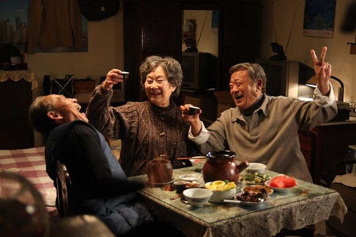
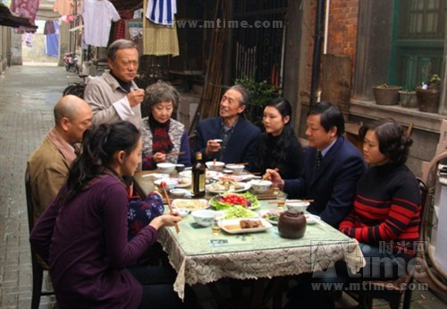
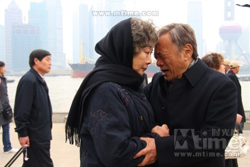

# ＜玉衡＞作坊里的毛毛雨

**秀娥老刘老陆围炉夜话，谈及民国三十八年（老陆立刻纠正是四九年）二月十四日国军大撤退那日的天气，刘燕生和秀娥一口咬定的凄风苦雨，在随部队解放上海的陆善国记忆里，却是艳阳高照。这大相径庭的“各自表述”，不由让我对所谓“历史客观性”付之苦笑。“国共”之间左右摇摆的秀娥，也只有唱起《天涯歌女》，一面是“恩情深”，一边是“一条心”，唯有唏嘘。**  

# 作坊里的毛毛雨

## 夏著维（安庆师范学院）

 

中学时期写作文，提及海峡两岸，时常不无炫耀地引述于右任先生临终所作的那首《国殇》——“葬我于高山之上兮，望我大陆；大陆不可见兮，只有痛哭。”乡情涌动北望神州，乡愁化作了一坯黄土，其间的悲凉和揪心，非亲历者实难感同身受。

王全安执导的《团圆》，于岁月浮沉荣辱兴衰的大江大海中，打捞出了一个故事：分隔两岸一甲子有余的当事人，夙愿得偿重逢相聚，可置身于拖长的阴影，终难逃历史的捉弄。银幕上呈现的是一个家庭三个个体的命运，折射出更多的呼喊和细语。它们曾被湮灭在历史的宏大叙事中，听者寥寥，述者亦无暇自顾。宛若沙滩上孩子们穷尽心力堆起的城堡，潮涨潮落归于无形。

电影的开篇，一封迟来多年的台湾来信宣告了赴台老兵刘燕生的归来。此类“陌生人来到新环境，搅乱既有的人际关系，暴露和平外表下矛盾”的叙事方法本身并无高超之处。难得王全安是个会讲故事的人，就此一点便和绝大多数国内导演拉开了极难逾越的差距。且看获知刘燕生即将造访之后，秀娥（刘燕生赴台前的妻子）一家预备饭菜这一场景，全家态度上的分野便表露无遗——大儿子对素昧谋面生父（刘燕生）的抵触，大女儿对母亲前夫（刘燕生）的不情不愿，二女婿的市侩，外孙女的无所谓……不一而足均刻画得精准熨帖。尤其是居委会主任一角的横空出世，在影厅里引发了一阵密集的笑声，集中在她煞有介事表明出让公共厨房体现了“党和政府”的两岸政策那一套官方话语的老调重弹。可一番笑罢，细究下来，又有哪个中国人的“家事”能挣脱“国事”的裹挟呢？当刘燕生搭乘的出租车驶进弄堂，镜头一度长久停留在一旁吹奏欢迎曲的鼓号队孩子脸上。欲语还休间，寓意便表露无遗。

随老兵返乡团抵沪的刘燕生，此番有个明确的目标：将发妻秀娥接回台湾，换得相守余年。不可避免，这一举动之于四九年后和秀娥已成事实婚姻，且育有两女的陆善国老人，显然失于公平。在我意料之外，身为解放上海时的副排长，陆善国对于昔日战场上你死我活敌人的刘燕生，非但没有百般阻扰，答应地极为爽快。和他当初为了迎娶身怀六甲且是国军家属的秀娥，不惜放弃一片光明的政治前途一样，没有半点犹豫。可这世间哪有如此顺遂简单皆大欢喜的事，虽说老陆凭着一家之长的威严弹压了子女的不满和抱怨，可整件事情却因两人当年结婚未领结婚证导致如今离婚协议的诸多不便，外加老陆突发的中风而搁置了下来。

拿传统的道德观念衡量，《团圆》这个故事里，除却那个生意经不离口在外一身腥的二女婿着实惹人厌外，其余的角色都不能定义成“坏人”。刘燕生客观上确实造成了秀娥家庭的“破裂”，可毕竟是基于秀娥的选择。此外他拿出自己所有的积蓄补偿老陆的恩情，虽然被二女婿讥为“连在青浦买栋砖瓦房都不够”；风烛残年的秀娥，为儿女操劳半生。“几十年只算是活着”。用她自己的话说：“和老陆几十年，有恩情；跟你刘叔叔一年，有感情。”为自己的幸福计，又有何错呢？而老陆更是无可指摘。节衣缩食了一辈子，为款待妻子的前夫，一百一只的大青蟹，一买就是两对；珍藏几十年的老酒，也给刘燕生畅饮，可谓是倾其所有。其外，他力排众议，置秀娥离去后自身由谁照顾的问题于度外，亦非常人所及，也印证了他酒后吐露的“一辈子都为别人考虑”；而刘燕生的生子，虽说对他不接纳不认同，但在自身尚未婚娶的条件下，并未收受刘燕生出于歉疚给他的一笔钱，反倒让他留作养老之用；大儿女有泼辣不讲理的一面，对父亲的孝心却属真挚……举凡所述，不由疑窦丛生：那究竟是谁该为这出悲剧负责呢？

电影行至后半段，有段耐人寻味的情节。秀娥老刘老陆围炉夜话，谈及民国三十八年（老陆立刻纠正是四九年）二月十四日国军大撤退那日的天气，刘燕生和秀娥一口咬定的凄风苦雨，在随部队解放上海的陆善国记忆里，却是艳阳高照。这大相径庭的“各自表述”，不由让我对所谓“历史客观性”付之苦笑。“国共”之间左右摇摆的秀娥，也只有唱起《天涯歌女》，一面是“恩情深”，一边是“一条心”，唯有唏嘘。

故事的最后，决定孤身返台的刘燕生，在临别的饭桌上跃跃欲试要拿出压箱底的保留曲目《毛毛雨》作为告别之时，上海的天空果真降下了雨，不过势如倾盆，让人始料未及。撷取众人躲雨一幕的构图，刘燕生的位置位于门外的屋檐之下，自始至终是秀娥家庭的“局外人”。倘若历史却如茨威格所言。是“上帝的神秘作坊”，从天而降的“毛毛雨”，未从可知将大到何种程度，让置身其间的人们，都无所适从。

当返乡团登上离去的游轮，不免联想到半个多世纪前那场撤退。但我得说，时代毕竟是不同了。秀娥的外孙女告诉她自己和将要赴美的男友结婚的消息时，得到的是她外婆忧心忡忡的劝诫：“说是去两年，说不定就不来了。”外孙女回嘴道：“反正不会比你等得长！”我忆起乔伊斯对历史的定义——“一场我想从其中脱身的噩梦”，那末，是时候醒来了罢？

8.13于单向街书店

9.10修改发布

 

（采编责编：黄理罡）

 
