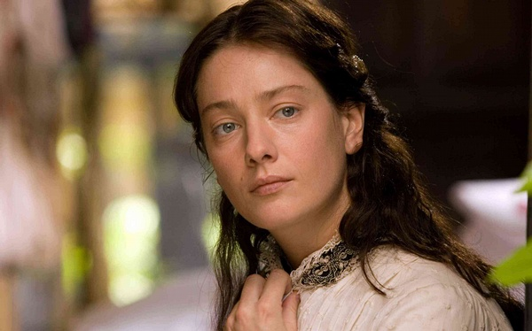

# ＜玉衡＞你会爱一个人多久—— 《霍乱时期的爱情》观后感

**我们通常可能连看清一个人本来样貌的机会都没有，就错失了这段感情。电影中菲尔米娜和乌尔比诺相伴一生的结论是，“该死！我不知道这是不是爱！”你们看，她用了一生的时间都没能知道自己真正爱的人是谁。**

** **

# 你会爱一个人多久

# ——《霍乱时期的爱情》观后感

## 文/刘妍（燕山大学）

 电影的好处就在于它可以将一个漫长的故事凝缩为两个小时的精华，并且把故事的前因后果，人物心理交代的清清楚楚，真是不容易。好在导演拍的很好，演员表演的很精彩。 电影叙述了这样一个故事：年轻的电报员阿里萨对富家小姐菲尔米娜一见钟情，他千方百计的接近菲尔米娜，并以情书的方式最终俘获了这位千金小姐的芳心，然而菲尔米娜的父亲，一位以卖驴起家的暴发户，对这段感情持非常激烈的反对态度，他威胁阿里萨如果不放弃对女儿的追求，就一枪打死他，但是阿里萨回答说：“没有比殉情更伟大的了。”在劝阻无效的情况下，他把女儿送到了偏远的乡村，想以此来阻断他们的交往。他成功了，一年之后，当菲尔米娜再次回到家乡见到对她朝思暮想的阿里萨时说的第一句话是：“在我见到你的这一刻，我才意识到我们之间发生的一切都只是幻想，这幻想蒙蔽了我的双眼，忘了吧！”菲尔米娜一句轻描淡写的“Forget it.”让阿里萨这颗情种一等就是半个多世纪。 

之后菲尔米娜嫁给了当地有名望，人也英俊潇洒的乌尔比诺医生，并和他相守了51年9个月零4天，乌尔比诺最终死于一只调皮的鹦鹉，他为了把它从树上捉下来摔死了。临死前，他对妻子说：“只有上帝知道，我有多爱你。”虽然菲尔米娜在影片的最后向阿里萨叙述说：“乌尔比诺是一个好丈夫，我想不到比他更好的人了，但是回首往事，我觉得我们的生活中痛苦艰难大过欢乐，许多无谓的争吵，许多难消的怒火……很难想象，一个人这么多年，在家庭纷争中挣扎，还怎么能快乐起来，该死！还不知道这到底是不是爱。”但可以确定的是乌尔比诺对菲尔米娜的爱丝毫不少于阿里萨五十多年的执着。当他知道阿里萨这个潜在情敌的存在之后，他找到为了配得上菲尔米娜的高贵身份已经成为富有而有地位的轮船公司经理人阿里萨，宣战似地向他表达他对妻子的爱：“我的妻子是我的精神支柱，没有她我一无是处，我爱我的妻子胜过一切，胜过世上所有人。”虽然，在他们五十多年的婚姻生活中，乌尔比诺也有过一次短暂的婚外恋，但最后他还是放弃了这段感情回归了家庭，影片中没有交代乌尔比诺此时的心理活动，只是说乌尔比诺对家庭的看法是他认为“婚姻最重要的不是幸福，而是安定。”但我以为，相比阿里萨一生600多个炮友和两段同年轻姑娘的爱情，这实在算不上什么。也许有人会说，如果阿里萨当初和菲尔米娜结合的话就不会有之后的这些风流情事。可是这种假设是不成立的，一个不存在的前提推出来的只能是不存在的结论。所以我们无从知道，如果菲尔米娜嫁给了阿里萨是不是更幸福。也不能知道阿里萨是不是比乌尔比诺更忠贞。 故事的结局是在经历了53年7个月零11个日日夜夜的漫长等待之后，阿里萨终于如常所愿的等到了一生最爱的人。像他片中所说的那样：“我的灵魂终于找到了归宿，我很高兴的发现，真正宽广无垠的是生命，而不是死亡。”两位七旬老人最终在阿里萨的轮船上结合并平静地死去。 基于这个故事，我想到关于爱情的两个问题。第一，什么是好的爱情。这是一个非常宽泛的话题。每个人对爱情的理解都不同。《圣经》里说：“爱是恒久忍耐，又有恩慈；爱是不嫉妒，爱是不自夸，不张狂，不做害羞的事，不求自己的益处，不轻易发怒，不计算人的恶，不喜欢不义，只喜欢真理；凡事包容，凡事相信，凡事盼望，凡事忍耐。” 算是比较的全面了，但不是爱情全部的样子。在我片面的理解中，好的爱情，首先要冒巨大的风险；好的爱情是两情相悦，一见钟情并且日久生情；好的爱情是你们不但在外貌上相互吸引，更重要的是你们的灵魂相互匹配。一见钟情的是爱情吗？是，但只是爱情的开始，远远不是全部。爱情需要一见钟情，但是一见钟情的不都是爱情。后者是前者的必要条件，而不是充分条件。他们之间是有之不必然，无之必不然的关系。影片中阿里萨对菲尔米娜的爱就是一见钟情式的爱。但马尔克斯创作的是有虚构情结的小说，我觉得他在小说中一是虚构了阿里萨对爱情的忠贞不渝——这种忠贞不渝指的是精神上的——以及，作者出于对女主角菲尔米娜的偏爱，而把她塑造成了一个几乎完美的女神。在现实生活中，我相信没有几个人会因为对某人一见钟情，而恪守一生的。当然不能否认的确有这样的存在，比如金岳霖之于林徽因，我没有看过关于他们感情的书籍，只是了解，金岳霖先生为了林徽因先生终生未娶。但这是一种特殊情况。 他的特别之处在于，其一，施爱者，无论是小说中的阿里萨还是现实生活中的金岳霖都属于世所罕有的骨灰级情种，也可以说是真正至情至性的人。爱情在这种人眼里就像阳光空气一样是不可或缺的。影片里阿里萨的叔叔谴责他把商务信件写得像情书一样情意绵绵，而阿里萨却回答说：“因为我需要爱情呀，我需要爱情。”是的，每个人都需要爱情，它是这世上最美好最值得期待也最有意义的事情，之一。但在这些骨灰级情种眼里，爱情不是之一，而是全部，类似的情种还包括《霸王别姬》里张国荣饰演的程蝶衣，“不疯魔，不成活”；《恋恋笔记本》里的雷恩·高斯林，《爱你就像爱生命》里的王小波和李银河，《一个陌生女人的来信》里的徐静蕾，等等，他们是真正为爱而生的人，没有爱，生活将会暗淡无光。 其二，被爱者，菲尔米娜或者是林徽因，是完美到女神一样的人物。无论是外在样貌，还是内在修养上，她们几乎都达到了完美的境界。菲尔米娜是剧中虚构的人物，所以她的完美可以理解。但是林徽因的完美却是非常难得的真实之美。无论是外貌，才情，气度，修养，品德都无可挑剔。这样的人是值得被人眷恋一生的。也只有像林徽因这样的美女兼才女有有资格让人苦守一生。只不过，金岳霖的不幸在于，他没有像剧中阿里萨那样等到了乌尔比诺的死，林徽因先他，更先梁思成一步去了，如果先走一步的是梁思成，那么金林倒是可以成就一段千古佳话。哈，就像小说里的结局。而且，不同于菲尔米娜对阿里萨爱情的游移不定，林徽因是明确表示过她也同样爱上了金岳霖的，只不过，彼时“罗敷已有夫”，只能“还君双明珠”了。 可是话说回来，现实生活中并没有几个林徽因，菲尔米娜，也没有几个金岳霖，阿里萨，我们是生活在世俗生活中的凡人，既不是女神，也不是情种，甚至，有些人连浪漫主义的想法都没有，或者有，却不能也不敢实施。爱情在现代人眼里变得越来越不纯洁，我们给爱情附加了诸如房子，车子，票子一类的与爱无关的条件，所以我们一旦见到，哪怕是电影小说里虚构的专一纯洁浪漫爱情都觉得震惊不已。但事实是，本来我们就该如此的。说起来，真是可悲。 由此我想到，普通人的爱情实际上是十分困难的。即使我们做不成女神，也不是情种，但我们依然需要爱情，依然需要一见钟情为开端的爱情。我之前所说的爱情需要冒巨大的风险，就在这里——你并不能确定一见钟情就是真正适合你的那个人，而且很多时候都不合适。有人说，一见钟情不就是喜欢这个人的外表吗，那不就是外貌协会吗！我说是，一见钟情就只是喜欢这个人的外表而已，就是肤浅的外貌协会。但是这有什么不对吗？如果一个人连外表都吸引不了你，你又怎么会有兴趣去了解他的内在呢。更无从谈爱了。但事情的麻烦和复杂就在这里，一个人光从外表上吸引你的确不靠谱，有很大的可能是这个人在外表之外没有更多的，更优秀的内在可供你挖掘欣赏了，这也正是一见钟情的风险之处。很多，很多时候，我们不能像小说电影里那样爱上一个一见钟情的女神式的人物。两个人的匹配程度很大一部分在于灵魂和谐程度，也就是日常所说的，志同道合，趣味相投，在智识和阅历上几乎处于同一层面，能够愉悦的交流分享并一起成长。如果我们把匹配度的区域设定在1到10，而两个人外表彼此吸引的难度系数是1，那么灵魂匹配的难度系数则是7，8的水平。剩下的匹配度还包括，教育水平，家庭观念，经济能力，宗教信仰，空间距离等等这些看似与爱情无关，实则也对爱情的发展起着决定作用的细节问题。而在这些细节问题上达成一致远比一见钟情要困难的多的多！所以两个人能够顺利相爱是一件非常，非常不容易的事。这种困难程度和爱情的美好程度成正比，爱有多美好，就有多艰难。 而且，更重要的是，你跟她在灵魂上是否契合只有通过长期的共同生活才能观察出来。但是，我们通常可能连看清一个人本来样貌的机会都没有，就错失了这段感情。电影中菲尔米娜和乌尔比诺相伴一生的结论是，“该死！我不知道这是不是爱！”你们看，她用了一生的时间都没能知道自己真正爱的人是谁。就连阿里萨，虽然他一直说“这五十多年来，我对你的誓言忠贞不二，我对你的爱万古长存。”我觉得这话扯的有点过了。如果爱情的含义只柏拉图意义上精神之恋的话，那倒是有可能。不，即使是柏拉图的精神恋爱，他也配不上说“忠贞不二”，那样的话，那个为他而死的少妇，女学生阿梅瑞卡和他又算什么呢？我并不怀疑他对菲尔米娜长达半个多世纪的爱，我只是说，你不能说他这种爱是专一的。而且，我认为，爱某一个特定的人是专一的，但爱情本身并不是“非如此不可”的。这就涉及到第二个问题：你会爱一个人多久？ 我的答案是，不会很久，如果那个人不爱我的话。上面说过，我的观点是好的爱情，必须是两情相悦的，单相思那是暗恋，而暗恋很大一部分来自幻想，不自觉的美化你暗恋的对象。就像菲尔米娜所说的，“当我看到你的那一刻，我才意识到，我们之间发生的只是幻觉，它蒙蔽了我的双眼。”不共患难、同生死，不在日常生活中消磨彼此的激情和幻想，如果对方没有自觉的完全向你敞开心扉，你根本无法了解一个人的本来面目。对于你不了解的东西无法说爱还是不爱。只能凭感觉。但我们都知道，感觉很多时候是靠不住的。 而且，我们爱上的往往是某一类人中的某一个，爱情中的“非如此不可”体现在，非某一类人不可，但不是“非他不可”。“非他不可”的情况只存在于在某一类人的集合中，只有“ta”一个元素。有谁能肯定的说这辈子只爱一个人？我反正是不能，不得不说，从小到大我喜欢过很多人。真正说过爱的只有一个，如今这爱已经不能继续下去了。但我相信以后还会遇到很多值得我喜欢，值得爱的人。他也是。只是考虑到爱情的艰难程度，“爱”这个字不能轻易说出口。喜欢就可以。而且，我不觉得喜欢一个人就要如何如何。喜欢介于一见钟情之后、日久生情之前的某一个阶段。这种感情有可能发展成电影里阿里萨那种“情不知所起，一往而深”的痴情，也可以在遇到下一个“一见钟情”之后莫名的消失，“情不知所起，亦不知所终”。即使是金岳霖，如果他能碰到一个和林徽因类似的女神级别的女子，我相信他一定不会再为了林苦守一生。但现实是，有林徽因那样美貌的已不算多，更何况要配得上她的才华，气度，思想，品格的人就更是世所罕有。而普通人的好处就在于，我们不必“孤高不胜寒”。 话说回来，虽然爱情如此艰难，但我仍坚定的相信，一定有和你无论是外表还是灵魂都非常适度的那个人出现。一切形式的爱、激情、和自由，是这世上最为美好，最让人向往的事物。为此付出多大的代价都不为过。在遇到之前，我们要做只是成为真正的自己，了解你是一个什么样的人，需要和什么样的人在一起，在等待的过程中不断地充实丰富自己，这样当你遇到和自己类似的某个人时，才不至于因为看不清他的样子，或者因为配不上他的优秀而错过。 至于那些不小心错过的，只能说还是缘分不够，这一次的错过，是为了下一次的遇见。所以，就随他去吧。 

（采编：黄理罡；责编：黄理罡）
