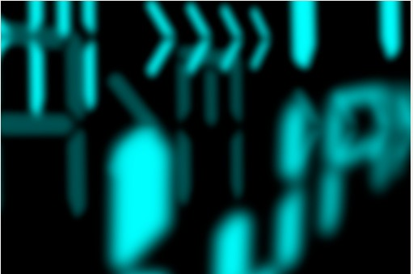

# ＜玉衡＞偏见、执着、岁月、情爱、几许模糊的美丽记忆——写在看过一千部电影之际

**人生便是你目前或者往昔所过的生活，将来依然会在你身上或者别人身上不断重演，绝无任何新鲜之处。然而，一样的痛苦、欢乐、叹息、念头，以及生活中大大小小无法言传或不屑一提的事情都会再度重现，甚至所有结局可能都是一样的。同样的月夜，同样的枯树，同样的剪影，同样的在这个时刻的我和你，这一切都会在时光的沙漏之中反复转动。在沙漏眼中，我们不过只是一粒沙子罢了。但在另一粒沙的眼中，我们又是那么的不同。**  

# 偏见、执着、岁月、情爱、几许模糊的美丽记忆

# ——写在看过一千部电影之际

## 文/彭萦（University of Michigan Ann Arbor）

 

“分手的导火索是什么？”

“一部电影。”

“啊？”

“那次我和她一起去看《盗梦空间》，我看得泪水在眼眶里打转，转过头去想从她的眼神中看到同样的感动，惊讶的发现她在黑暗中睡得酣畅，仰着头张大着嘴。散场后，我问她对电影的看法，她说不喜欢，没感觉。我忽然倍感失望，心生分手的念头。我感觉我像是徘徊在一个老妇人的梦中，而她却居住在一个明亮宽敞的大房间里。我们谁也无法理解谁......”

“你也太完美主义了，这种差异不是很美的吗？你不能指望另一个人的喜好和你完全一样。像我和我女友，如果十部电影中只有一部我们有共同的感悟，我会因此觉得珍贵。”

“可是，可是电影不仅仅是电影而已啊...村上说：‘我们的兴趣，都毫无办法难免混合着偏见、执着、岁月、情爱、几许模糊的美丽记忆--正如世间所谓兴趣这东西大多也是这样一般。’ ”

#### 宁愿活在虚幻中，不愿活在现实里。

在《理性、真理与历史》中，普特南提出了一个著名的假设，钵中之脑。如果我们的大脑都被放入一个盛有维持脑存活的营养液的大钵中，而脑的神经末梢连接在一台超级计算机上。我们在现实生活中所能感触到的一切都能被转化到这个虚拟世界来。你尝一口娇嫩的牛肉，看见一只飞舞的蜂鸟，听一曲巴赫的协奏曲，甚至是和恋人做一场爱，这一些感触都不过是超级计算机制造出来的集体幻觉，这样的钵中之脑是可能存在的吗？

普特南回答，这在物理上也许是可能的，但是在哲学上是不可能的。

但即便我们的大脑不是被放在一个钵中，靠营养液存活，而是真真切切实实在在的存在于我们自己的头盖骨下，靠我们的进食来维持运转呢？我们就能百分之百的肯定我们看见的、听见的、品尝的都是现实，而不是虚幻？

什么是现实？当我们判断一个意象是不是真实的时候，我们要参照另一个意象。因为另一个意象是真实的，所以这个也是真实的。但是，对那另一个意象是否真实的印证需要从其它的一个意象上得到，于是一个意象引致到另一个意象上，意象之间如锁链般环环相扣。一旦一个环扣忽然断裂，我们就惶恐的迷失了，不知道到底是环扣这边是现实还是环扣那边是现实。我们安稳的活在自认为的所谓现实之中，也许是因为我们目前所能探寻和感触到的环扣还是那么的有限？也许下一个环扣随时都会脱落...

当环扣在《穆赫兰道》里脱落的那一刻，现世生活的一切寻常与琐碎都变得那么捉摸不定和光怪陆离，但原本模糊不清奇形怪状的虚幻却回归成为让人唏嘘和哀恸的现实。《盗梦空间》里的妻子梅尔在环扣破裂的时候选择了这一头的现实，而丈夫道姆选择了那一头，他们谁都没有比谁更对一点或更错一些。

从某种意义上来说，我们期冀着环扣断裂的时刻，却又惧怕它。这才是最迷人的。

#### 我们以为自己会遇见很多人，可到最后发现不过就那么几个而已。

《日落之前》这部电影其实并没有什么情节，就是一个美国男人和一个法国女人在法国街头不停的走着，不停的说着，从书店Shakespeare & Company到咖啡馆，从公园到塞纳河上。可就在这些有限的场景里，一条条丝线从他们两人的话语中抽拉出来，交织成一个无限的意象空间。那个空间里有年少时的浪漫憧憬，有对平庸现实的不满抱怨，有对逝去时光的哀叹怀念。杰西额头那一道如枪伤般的皱纹和塞琳那一句“我只是找不到那种内心底和一个人相连的感觉”呈现出他们渐渐老去的疲惫和无奈。

“你说我们当时为什么没有互留电话号码？” “因为我们太年轻太愚蠢？我们总以为我们能遇到很多人，可到了后来发现，不过就那么几个而已。”

年轻的时候，我们总把一切都当成理所当然的，大肆挥霍一切。一个陌生人听你说话，一个朋友为了你特意安排一次聚会，一个恋人静静的等待你，一个亲人为你做点什么，这些似乎都没有什么大不了的。我们总是愚蠢的在很久之后才惊觉，原来和另一个人产生某种联结的时刻并不是时常出现的，真正能和另一个人共享那震撼无比、心醉神迷、雀跃不已的时刻很可能是极其稀少的。这个时候，我们才发现，那些弥足珍贵的人和时刻其实早已经遗留在那片天边的夕阳里，再也不可能回去了。

在这短暂的一生中，你能馈赠予另一个人的最珍贵也是最庄重的礼物其实就是时间而已。

《当哈利遇见莎莉》的结尾，新年前夜，哈利一个人在街头孤苦的漫游，忽然意识到，在过去的十年中，能和他共享时间的美好和残酷的其实只有莎莉一个人而已。他飞奔到莎莉面前，对她大声的说：我想了许久，结论是，我爱你......你也爱我怎么样？我爱你在71度时还能保持冷静；我爱带你出去吃三明治；我爱看你紧锁眉头看着我，好似我是个疯子；我爱与你共度的时光，我在我的衣服上依然能闻到你的香水味；我爱在我晚上入睡前，你是我最后一个交谈的人。那并是因为我寂寞，也不是因为现在是新年前夕。我之所以要来，是因为，当你知道，你要与某一个人共度余生的时候，你希望你的余生尽快开始。

### 

#### 幸福是永远失去和永远得不到的

在一个动画片中，一个男人死后升入天堂。他坐在一片彩云上弹奏他的竖琴，旁边是两位天使相陪。他一脸绝望的问：你们的意思是，我们就永远这样进行下去？

现实生活中和动画片里共同难题是：持续性的幸福倾向于瓦解幸福的本义。如果一直快乐，快乐是让人腻味的；如果一直痛苦，痛苦是让人难以忍受的。只有当痛苦和快乐如螺丝槽痕般交织往复向前延伸时，人们才能体会真正的幸福。

《情书》里博子念着逝去的男友无法释怀，对着雪山一遍遍的大喊“你好吗？我很好”；男藤井树在跌入悬崖死前依然念念不忘年少时喜欢过的那个少女，唱着和她有关的那首流行曲；女藤井树拿着道破一切秘密的图书卡又惊喜又哀伤，慌乱而羞涩地找寻围裙上的口袋...

《非常公寓》里麦克斯能抛下甜蜜的未婚妻只为寻找那曾经握在手中的一双红色高跟鞋；爱丽丝厌恶自己却又无法自拔，在化妆间的镜子前为了执念流下迷惘而痛苦泪水；那个如迷一般的女子丽莎也只能被命运一次又一次无情的戏弄，永远只能和纯美爱情擦肩而过。

爱情一旦达到目的，渴望随之削弱；欲望一旦得到满足，激情随之消逝。很多时候我真的相信，幸福就是永远得不到的和永远失去的。

#### 到了最后 我们都要让它走

《立春》里王彩玲说，每年春天以来，我的心里总是蠢蠢欲动的，觉得会有什么事要发生。但春天过去了，什么都没有发生，就觉得好像错过了什么似的。

面对强悍霸道且不可一世的生活，每个人都是瘦骨伶仃苍白无力的弱者。但我们每个人都最终学会了游戏规则，并自创出了一套应对策略。

《时时刻刻》里，伍尔夫选择与一块石头一同沉入河中，劳拉选择抛弃温柔的丈夫、可爱的儿子和看似完美安逸的生活，去另一个国家做一个图书馆管理员。《身为人母》的主妇莎拉要偷偷带着儿子私奔；声称要考司法考试的布拉德从未踏入图书馆一步，每夜坐在操场铁网边看着年轻人玩滑板；恋童癖的罗尼在患过精神病的脆弱女人的面前打手枪；因为误伤无辜而被辞职的警察夜夜在罗尼家门口用功放喇叭咒骂。《天气预报员》的戴维想理清父亲、前妻、儿子和女人的一个个繁杂难题，却总是事与愿违。《阿飞正传》里的阿飞最后也只能和那只没有脚所以一辈子只停留一次的飞鸟一样，永远安静的落在地上。

还是本杰明巴顿说得对--“你可以像疯狗那样对周围的一切愤愤不平。你可以诅咒命运。但是等到了最后一刻，你还是得平静的放手而去。”

### 

#### 我们喜欢看美丽的东西被毁灭

荷马告诉我们一个故事，奥德修斯的妻子涅罗珀在夫妻分离的那些年岁里，在家里为奥德修斯的父亲纺织寿衣。但每到晚上，她就把织好的部分全部拆掉。第二天重新再开始。这道出了人心的一个奥秘，当一件事情正要达成的时候，我们总是有将其毁灭的冲动。

在某种程度上人们刻意追求痛苦。因为痛苦者可以将痛苦作为自己与众不同的证明。

《烈火情人》里那个参议员爱上儿子的未婚妻。他为了爱情可以万劫不复在所不惜。最后呢？身败名裂的他用缓慢平淡的语气说，“我只再见过她一次，那是个意外。在飞机场，转机时。她没有看见我，她和皮特在一起，她手中抱着一个孩子。她和任何别的一个女人并没有什么不同。” 悲壮的音乐起。

如那篇影评说的： “追忆似水年华的普鲁斯特追忆描述爱情的消逝：我们听到她的名字不再感到肉体的痛苦，看到她的笔迹也不再发抖，我们不会为了在街上遇见她而改变我们的行程，情感现实逐渐地变成心理现实，成为我们的精神现状，冷漠和遗忘。但是，他笔锋一转，说，其实，当我们恋爱时，我们就预见到了日后的结局了，而正是这种预见让我们泪流满面。 时至今日，千帆过尽，能够使我们泪流满面的，不是爱情，是普鲁斯特。

#### 比戏剧更精彩的是生活

大段大段的平白日子逼迫人们在鸡飞狗跳的虚假热闹和荒凉孤苦的无病呻吟做出选择。我们耸耸肩，不屑的说，一天能发生什么呢？

两位奥斯卡金像奖导演和八万个来自世界各地的普通人告诉我们，“你错了”。2010年7月24日，来自世界各地的人们做自己的导演和演员，将这一天内的悲欢喜乐世间百态以“爱”和“恐惧”为题，用80000段长达4500小时的Youtube视频呈现在世界面前。这一天里有繁华的大都市和世界最高峰，有开着兰博基尼的富豪有街边的擦鞋童，有庆祝五十年结婚纪念日的夫妇有表白失败男孩，有把同性恋当疾病的黑人有给奶奶打电话的同性恋者，有第一次刮胡子的少年有在游行踩踏事件中死亡的人，有新生的长颈鹿有在战场前线的美国士兵。

在这《浮生一日》里，什么都有可能发生，什么都在发生。当泪水在我们眼眶里打转的时候，我们心中再一次浮现那句陈词滥调--生命是如此短暂，生活是那么美好。

人生便是你目前或者往昔所过的生活，将来依然会在你身上或者别人身上不断重演，绝无任何新鲜之处。然而，一样的痛苦、欢乐、叹息、念头，以及生活中大大小小无法言传或不屑一提的事情都会再度重现，甚至所有结局可能都是一样的。同样的月夜，同样的枯树，同样的剪影，同样的在这个时刻的我和你，这一切都会在时光的沙漏之中反复转动。在沙漏眼中，我们不过只是一粒沙子罢了。但在另一粒沙的眼中，我们又是那么的不同。

《浮生一日》的精彩毫不逊色于任何一部电影，因为，比戏剧更精彩的，永远是生活。让我们去爱，去等待，去流泪，去欢笑，去旅行，去相信，去表白，去述说，去憎恨，去恐惧... 永远不会太迟。

 

（采编：何凌昊；责编：尹桑）

 
