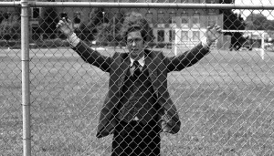
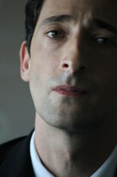

# ＜玉衡＞关于Henry

**一个人选择自杀是因为走投无路，但更多情况是其对自己处境的错误估量。自杀虽然看起来是种冲动的情绪，但若深入探究，其生活中所累积的种种也与累积出这次“冲动”有着千丝万缕的关系。在经过思索徘徊甚至是痛苦的每一天后，H得出的结论是顺着生命的自然发展，这种面对一切的勇气或者淡然来自内心所相信的“事情并不像你想象得那样”。**

 

# 关于Henry

## 文/伊明（沈阳化工大学）

 

 **【局外人•存在感】 **

影片开篇引用存在主义哲学家、文学家加缪《局外人》中的一句话——“我的灵魂与我之间的距离如此遥远，而我的存在却如此真实”。毫无疑问，这句话几乎可以阐明整部影片的情感基调——孤独感。 

影片是以伪纪录片的形式讲述了Henry的一些琐碎的背后却具有连贯性的故事。开始时是对他的面部特写，在昏暗的房间访谈进行——却没有采访者——更像是在与观影人之间的交流。这段台词有句是对第三人说“……我想我不需要什么”并下了逐客令，看上去是以便与采访人（或观影人）好好聊聊——事实上也表现出了他习惯拒绝别人，哪怕对方是出于热心。 

Henry与小说《局外人》主人公默尔索相似之处正是这种与世界的距离感。这种厌倦的姿态源自对生命本质的认识——正如小说中那句“活着就是生命的意义，感官的欲望才是我们每一天无法回避的事实”所言，在直观的感情前提下，掩饰变得无意义，感情也无需存在，因此H也好默尔索也好，都在看透了世界是台荒谬运转的机器后，自顾自地成了局外人。 

H的祖父说他从孩提起就总是把自己封闭起来。也就是说从童年期开始他便习惯独处，与自己交流——这种自我思考无疑是极度孤独的事情。在看透生命本质之后，他极力控制自己的情绪，并希望能有效地操控它——希望自己能成为一个空皮包。 

在课堂上H的皮包被学生摔到墙上，他面无表情地对那个挑衅的学生说“听着，那个包没有任何感觉，它是空的。我也没有提供你损害的某种感情。”这句话是他对自己的要求。他有记日志的习惯，将自己的痛苦全部倾倒在一本本笔记本里。并且希望外公写日志也可能是引导其对自己所犯罪行的救赎（关于他身世的真相他的母亲可能已经在临终遗留下的录音带里告知了他）；在送女学生Meredith日记本时也是之前说，若将痛苦写出来，就不再被其纠缠。这种情感的转移倾吐就是为了自己能达到“空皮包”的状态——空的，没有任何感觉。他没有发觉这种方式也是孤独的——因为人只有与他人交流时才会意识到自己并不是孤独的。抑或，他所需要的就是这样孤独的方式。 

可人毕竟不是皮包，他自己无法用这种记录的表象手段达到不为人事动容，不为孤独感烦恼的程度。所以他也采用一些外在手段去隔绝与世界的联系，比如不会去建立长久的关系——回避女教师的示好（原因之一是在童年失去最重要的女性——母亲死后的害怕失去其他亲密情感）；不断换学校以求不被束缚，以及不顾少女Erica苦苦哀求坚决将其送到孤儿院。 

尽管如此，他偶尔还是被情感失控折磨。在每一次的情感爆发——比如外公将自己反锁到卫生间后他痛骂护士后在公车上流泪，那时刻的他定是痛苦的。  **【身体•灵魂】**

“醒悟者，有识者说：‘我完全就是肉体，除此无他；灵魂仅仅是肉体中某种东西的名称罢了。’”——这在尼采看来是通往超人的桥梁。 

H认为自己把握不住自己的灵魂，因为情绪的失控。又由于这种灵魂与身体的脱节让他缺失存在感——“像一张揉皱的钞票，在社会上流动” 。 

所以在外公再一次将自己锁在洗手间和拥抱安慰Meredith时被误会之后的情感失控后随之而来的便是无法完全控制的情绪挫败感，与“身体厌倦灵魂”这样的结论。 

道德和灵魂都是人在生存中创造出来的，人的选择是自由的。（让•保罗•萨特） 

H像所有典型的存在主义者一样，认为自己可以理解他人，并尊重他人的选择。这一点在收留erica后，她在他家中进行性交易那部分情节中被充分体现。在他生活明确的规则里并没有道德约束女孩的选择，只是规定他的房子里不被允许这种行为。 

在将虐猫少年带到训导处的时候，镜头效果下的H好像是位悲天悯人的神明，在男孩说出“tapped，like the cat”时，他竟无言以对。 

存在主义也认为，除了人的生存之外没有天经地义的道德或体外的灵魂，道德和灵魂都是人在生存中创造出来的，人没有义务遵守某个道德标准或宗教信仰，人是有选择自由的。 

所以在他的思维中常常陷入矛盾。这一点矛盾是道德与自由之间的——一方面他认为道德并不该被强加于他人身上，另一方面他又认为教师本身需要对孩子进行后天的引导，帮助其了解生存世界的复杂性。（是对其孤独无人引导童年的弥补）  **【矛盾•信仰】 **

“刻意去相信谎言，即使你明知道它们是虚假的。从你们日常生活里举一个例子。要么是……我想要变得漂亮，变得快乐；我就需要整形，为了美貌；我需要保持身材，卓尔不群，穿着时尚。你们这一代年轻人，在当下——他们被这样告知，女人都是妓女，婊子，被排挤，殴打，欺辱，蒙羞的对象，这是一场24小时不间断的传销式精神屠戮！使得我们的后半生，都受这种错误观念的控制，它很强烈，蒙蔽我们的双眼，至死方休。所以，为了保护我们的头脑，阻止这种愚蠢的想法渗入进我们的思想进程中，我们要学会阅读，用以激活我们的想象力，耕耘它，提高我们的自我意识，我们的信仰体系。我们都需要这样的技巧，用以抵御，用以保有我们纯粹的精神世界。” 

这是一段非常精彩的台词，也是主人公对自己信仰系统的剖析。这个世界现存的观念被经过H自己的独立思考后才被吸收接纳，他的思想围墙对于那些被认为是谬误的想法坚不可摧。 

在小说《安娜•卡列宁娜》中有位叫列文的年轻人，也有着类似的精神体验——他时常为生活的本质困苦多年——“他就这样活着，他不知道，而且也看不出他有可能知道他是什么和他为什么活在世界上，而且他因为这种愚昧无知痛苦到那种地步，以至他简直怕他会自杀。” 这部电影里也存在着对自杀的探讨，摒弃指责或者赞誉，对其更多是尊重事实的客观阐述。 

即便坚定如他，也是经常陷入迷惘中。比如电影里第一次见到Erica时，他不顾她的献媚，径直绕过她走回家，她生气地扬声问道：“Where are you going？！”未落的话音中，直接切入的是下一个镜头——搭公车上班。每日几近重复的生活，但是他也在内心疑问，自己究竟是要去何方，为了什么。 

这样的迷惘会令人内心苦不堪言，无人能抗拒对自己的怀疑所产生的无助感。好在每一个努力渴望生存下来的人都找到了自己独特方式的解答。列文得出结论，也许人就是为了我们渴望的东西活着。而片中的H则也清楚地认识到哪怕不知道生存的缘由，但“习惯”会是解决那些暂时认为不堪忍受问题的好办法；顺其自然会成为是度过迷惑期的救生艇。  **【生存•死亡】**

H在车水马龙的街道上游荡，此时响起了他的独白“我从人群中逃走，就像你一样”——这里的你就是指在自己幼年时候自杀的母亲。母亲的自杀是因为不堪与祖父不伦的关系，这样的生活她无力承受下去，所以选择逃开。 

学校里有位教师死亡，其他教师声称“天知道他是怎么死的”，这位教师每天生活在自认为被学生奴役的世界，苦不堪言。他的电话录音里充满了怒骂与诅咒。他诅咒不受管教的学生与不可理喻的家长。这段结束后插入一段希特勒的演讲，与其语气竟然惊人相似。我想这里想表达的是这位教师也是拥有自己绝对极端人生信念的人。他的死亡有一种可能是自己结束的生命。 

比较明显的被讲述的是女学生Meredith的自杀。这个心思敏感的少女因为体型肥胖经常是同学甚至家长谩骂的对象。有一个情节是H在课上念他第一次上课时要求学生们写的文章——假定自己死亡的短文作业里，那个“no name”很大可能就是她的“……提供一切她想要的”——她的家境很不错，从穿戴细节到与父亲争执时候的卧室都能体现这点；文章里是用的父母的语气，几乎没有对女儿死去的悲伤，满满的是对她不知满足的指责和对她无法进入好学校的惋惜——父亲在刻薄她时提到现在努力搞不好还能上好学校——相信这已经是老生常谈了。 

加缪在他的存在主义哲学著作《西齐弗神话》开篇即指出，只有一个哲学问题是严肃的，那就是自杀。 

一个人选择自杀是因为走投无路，但更多情况是其对自己处境的错误估量。自杀虽然看起来是种冲动的情绪，但若深入探究，其生活中所累积的种种也与累积出这次“冲动”有着千丝万缕的关系。 

在经过思索徘徊甚至是痛苦的每一天后，H得出的结论是顺着生命的自然发展，这种面对一切的勇气或者淡然来自内心所相信的“事情并不像你想象得那样。”——因此也避免了信念似是而非，又被自己积非成是，绕开自杀这一发不可收拾的结局。 

这也是影片想告诉观影人的思想。  **【结局】**

Erica令H想到了自己的妈妈。与她第一次见面时候她在公车里性交易于老男人，索取报酬未果反而被打——这里能与母亲与祖父极大可能是被迫的不伦关系相对应。收留她后做HIV测试那天的购物场景中，不断地穿插儿时与母亲嬉闹的片段，这是影片中惟一一次不是关于母亲自杀当天相关的回忆。 

所以影片结尾H向她展开的怀抱，就不仅仅是向眼前这个小姑娘敞开心扉而已了。 

 P.S 这部影片还间或讨论了关于教育与女性社会地位等问题。总体来说，耐人寻味。  

（采编：许鹤立；责编：徐海星）

 
