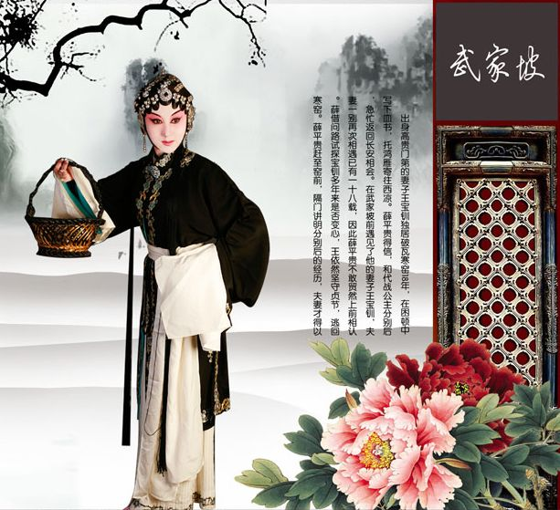
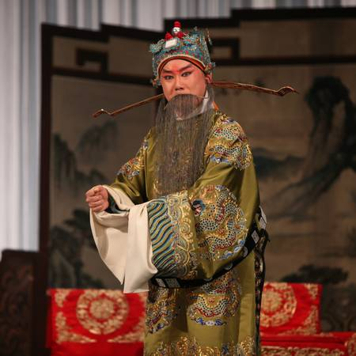
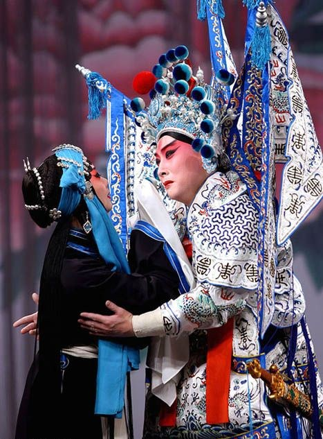
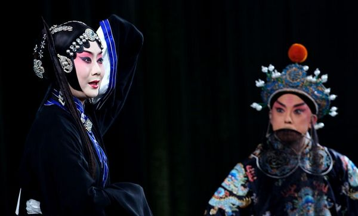
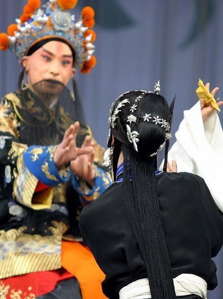
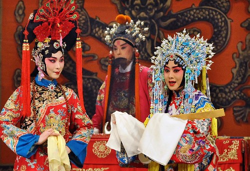

# ＜玉衡＞再会武家坡——难以忘怀的中国古典爱情

**我觉得，与其让我从一个男人的角度来评断一个为爱坚贞如斯的女人，不如抛却性别，仅仅以人的角度去理解、瞻仰这份情感。王宝钏虽是女人，仍旧是我的榜样。我不会因此期待、要求有一个女人对我如斯地情义两全，但若是我爱上了一个人，一定要拍着胸脯问问自己，我的所作所为，是不是有资格提及那个令我感动至深的王宝钏。**  

# 再会武家坡——难以忘怀的中国古典爱情

## 文/安期未（中央财经大学）

 

年少时，母亲为了让我多学习中国传统文化，带我拜师进了一家京戏班。虽然我学习的时间只有短短的三年，好歹也登过几次台，拿过一些奖，唱遍了哈尔滨各大剧院。与我同一辈进班的师兄弟大都是以唱样板戏的老生为先，而后根据各自的特质选择传统剧目的学习方向。我与一位姓孙的师兄因为长相清秀身段也好，比其他师兄弟都更早接触文武生与旦角。我在台上的第一次传统戏独唱，便是《武家坡》的片段《八月十五月光明》。

《武家坡》是老戏《红鬃烈马》的其中一折，不听戏的朋友也许并不熟悉。但说起这戏中的男女主角王宝钏与薛平贵，大多数中国人还是知道的。王宝钏苦守寒窑十八年，终于守到漂泊在外的夫君回乡团聚，这是很多人对这个故事的基本认识。由于不知前因后果，这段故事在民间引起的讨论始终褒贬不一。特别是建国后，王宝钏的形象从贞洁烈妇陡然变成了受封建社会礼教毒瘤迫害而虚度青春的受害妇女，其与薛平贵之间的故事也广泛地受到中国女性的批判。其实，批判的人大都不知道这十八年寒窑苦守背后的渊源，但只要看过《红鬃烈马》全出的人大都会明白，王宝钏十八年的辛苦与煎熬，远比批判者想象得更为沉重，但王宝钏这个女人本身，却比批判者们所以为的“受害者”的形象要刚强、坚毅、智慧得多。她是一位真正以爱情为信仰，而非是受缚于礼教的女人。

唐懿宗年间，太宰王允权倾朝野却膝下无子，只有三个女儿。长女金钏、次女银钏各自许配给当朝权贵苏龙、魏虎，只有三女宝钏因照料生病的母亲不肯出嫁。母亲卧病三年终于痊愈，懿宗有感于宝钏孝心，命后宫娘娘御赐其五彩绒线，缝制绣球一枚，二月二龙抬头之日在彩楼抛球招亲。消息一出，各路王孙贵胄纷纷上门求亲，期待在招亲的那天能得宝钏的青睐。王宝钏天生貌美，亦是聪慧非常。她见各路王孙不是痴迷功名利禄，就是只知吃喝玩乐，心中厌恶，始终找不到心仪的对象。就在招亲之日将至前几天，宝钏与丫鬟前往花园游玩途中遇见了进城投军的落魄青年薛平贵。薛平贵当时父母双亡，家道中落，衣不遮体、面黄肌瘦，却不改凛烈英姿，气质非凡。宝钏心中对他顿生好感，打算周济于他，言谈了几句便发现薛平贵人穷志不短，一心想要报效国家，更是芳心暗许，便邀薛平贵在彩楼招亲时前往接绣球。薛平贵得知宝钏是宰相千金，又是皇帝御赐绣球招亲，心中忐忑，自认为般配不起，但宝钏心意已决，两人就此约定。招亲之日，彩楼下人山人海，大都是王孙贵族，只有薛平贵一身寒酸，颇为显眼。王宝钏朝左右各自虚抛一下，引得人群朝左右哄抢之时，绣球不偏不倚抛到了中间的薛平贵手中。这便是《红鬃烈马》的头两折《花园赠金》与《彩楼配》。

看到这里便知道，王宝钏虽是大家闺秀，却不是不谙世事的普通小姐，她有自己的判断与主意，敢想敢做，更敢于担当。而后在《三击掌》这出中，王允得知薛平贵不过是穷困潦倒的寒门子弟，心下后悔，欲劝女儿退亲改嫁状元郎。两人从心平气和地交涉，逐渐转为针锋相对。从戏曲角度来说，《三击掌》是整出《红鬃烈马》中除《武家坡》外最为精彩的一折。宝钏的性情与聪慧，甚至略带毒舌的口才，在这一出中表现得淋漓尽致：

 **王允：尔大姐配苏龙户部执掌，你二姐配魏虎兵部侍郎，唯有尔失教训性情倔强，千金体配花郎（叫花子）你怎度时光？** **宝钏：老爹爹请息怒听儿细讲，儿命苦怎配得那状元才郎？父道那薛平贵是花郎模样，落魄人得了志比父还强。** **王允：薛平贵生来命运低，每日里在街头讨饭吃。破衣烂衫难遮体，遮住了肩头露出了膝。我的儿本是丞相女，就该配济世安邦定国的臣。** **宝钏：张良韩信与苏秦，俱都是安邦定国臣。韩信乞食于漂母，登台拜帅第一人。商鞅不中苏季子，在六国封相是人上人。** **王允：登台拜帅是韩信，未央宫斩得什么人？** **宝钏：未央宫斩得是韩信，难道说文官他就不丧身？（王允是文官）** 

几番较量，王允气得须发乱颤，坚决不肯退让。宝钏不满父亲嫌贫爱富失信于人，与其据理力争。两人越吵越凶，王允盛怒之下发下狠话，若宝钏不肯退婚，便褪下这一身宝衣凤冠，从此父女断情，宝钏再不是相府之人。宝钏性格刚烈，当即换了素衣，与父亲击掌三声为誓，从此不再踏入相府半步。临别前本想去拜别母亲，王允怒气冲冲地喝道：“堂前既无你的父，堂后焉有你的母？”宝钏眼泪一下，叹道：“罢，我不去了。”转身朝后堂三拜，掩泪而去。这一折戏，王宝钏是盛装登场，头戴珍珠凤冠，身着金丝宝衣，一身雍容贵气。而退场时，则是褪下衣冠，换上平民素衣，落魄而去。其情态也由从容淡定，转成了强掩悲伤的坚定。随身的丫鬟依依不舍，也让宝钏的义无反顾更添几分沉重。从此她便由相府千金，成了在郊外寒窑打柴挖菜、靠缝补浆洗为生的贫寒女，这种落差，不是一般人能够体会的，而这种决心，也不是一般人能想象的。

薛平贵知道宝钏为了自己放弃千金小姐的尊贵后，立誓要出人头地，让夫妻俩过上好日子。而后在《闹窑降马》一出，薛平贵初展不凡身手，降服了为祸楚江的食人妖马，献与天子，从而拜封殿前督抚。本来夫妻俩以为终于守得云开，不料王允不肯罢休，一心要杀死薛平贵夺回女儿，便上本奏请天子使薛平贵出征西凉平叛，暗自做下手脚封其为马前先行（先锋军卒长），并吩咐军中为正副元帅的两个女婿找机会将薛平贵杀死。平贵刚刚受封，便不得不远征西凉，回到寒窑与宝钏话别，两人慨叹命运多舛，有情人难以厮守。薛平贵初为官，房无一间地无一垄，连俸禄也没有拿到，只留下十担干柴老米八斗作为家用。他知道此去不知何时能返，王宝钏一介弱女子，仅靠这点柴米过不了日子，便痛心地吩咐说：

 **平贵：三姐切勿泪交流，丈夫言来听从头。十担干柴米八斗，你在寒窑度春秋。守得住来将我守，守不住来（长叹），三姐呀，守不住来你就把我丢。（即改嫁）** **宝钏：薛郎说话理太偏，为妻言来听从头。十担干柴米八斗，我在寒窑度春秋。守不住来也要守，饿死寒窑不回头。** 

这出《平贵别窑》，也是诸多传统剧目中非常看座的一幕。话别过后，薛平贵上马欲走，王宝钏拉着马鞍，口中送别，却怎样也松不开手。薛平贵长叹一声，撒开宝钏的手，纵马前行。宝钏哭倒在地，久久站不起来，而已奔出一阵的薛平贵却也忍不住掉过头来，在寒窑前来来回回，欲去难去。这惜别之间，已然误了点兵时辰。故而便有后边魏虎刁难薛平贵，险些将其杀害的《误卯三打》一出。

平贵出征后，在军中亦是颇多艰难，作为先锋不但征战沙场九死一生，还要提防苏龙、魏虎的暗算。王允修书于两位女婿，让他们务必在军中将薛平贵除掉。苏龙怜惜薛平贵是个人才，不忍杀害，魏虎却假借庆功之名灌醉薛平贵，将其捆缚于马上赶往敌阵，以达借刀杀人之目的。平贵被西凉军俘虏，王允得知后大喜不已，三番四次派人传话身在寒窑的宝钏，说薛平贵已然阵亡，父亲愿不计前嫌将女儿迎回改嫁。王宝钏虽不愿相信，却也大受打击，加上千金之体本不习惯为生计操劳，心力交猝之下病倒寒窑。王夫人得知女儿重病，心中不忍，私下前往寒窑探视。母女相会，皆是泪如泉涌。王夫人不忍女儿伤心，便告知薛平贵只是被俘，生死未明，但仍然力劝女儿回家养病。宝钏得知平贵未死，心下宽慰的同时也更为坚定。母亲拉着自己的衣袖，苦劝自己回府改嫁，宝钏见推脱不得，便诓母亲先行出门，随后即刻将寒窑之门反锁，靠在门上向母亲表达了自己宁死不渝的志气。王夫人无奈，只得大哭而去，宝钏亦在窑中哭泣。从此，王宝钏每天在武家坡前前后后剜野菜、拣碎柴，给附近的人家缝补洗衣换取一点食粮，在清苦与寂寞中坚定地等待丈夫回乡。

再说薛平贵被西凉俘虏，非但没有被杀，反而被西凉国代战公主看上其英勇与气节，欲招为驸马。平贵起初不从，但西凉国主允诺，若两国和亲，便臣服于唐王，免去征战杀戮，拯救一方百姓。平贵无奈下答应，与公主结亲，却日日思念爱妻宝钏。两国罢兵，薛平贵成了西凉驸马，却不敢反悔回乡，怕再引得兵燹战事。一来二去，十数年的时光过去了，从平贵出征别窑已然过了整十八年。西凉老国主驾崩，驸马平贵在西凉国履立奇功，人望备至，嗣业受封西凉国主。一日在院中惊见鸿雁泣血，口中衔有血书一封。拆开一看，竟是寒窑中的王宝钏借鸿雁传书，盼能寻得失踪多年的夫婿。平贵感叹自己出征至今十八载，该是时机回乡与妻子团聚，便寻机灌醉代战公主，盗出通关令，化妆潜回关内。潼关守兵不知其是何人，多有刁难，一来二去耽误时间，代战公主惊醒，发觉平贵潜逃后大怒，兴兵追赶至潼关下，欲破关抢人。薛平贵在关上三跪九叩，苦述自己的结发妻身在寒窑苦守十八载，终于感动代战公主，两人约定数事后，代战领兵而去，平贵亦得以安然回乡。

过了以上的《母女会》、《鸿雁修书》、《赶三关》三折戏，便到了全剧的重头《武家坡》。再回寒窑的薛平贵已非当年的英武少年，王宝钏更是早已被岁月折磨得形容憔悴。十八年的时光不见，夫妻相见已然认不出彼此。平贵不知宝钏贞洁与否，伪称自己是薛平贵之友，并谎称薛平贵在外是一浪荡子，吃喝嫖赌又玩忽职守，欠了自己的银钱，便让他来武家坡朝糟糠妻王宝钏讨要。王宝钏起初不信，但见薛平贵说得有模有样，不禁又恨又怒。薛平贵又谎称两人已签了字据，夫债妻还，要将王宝钏娶回家抵债。宝钏气得破口大骂，再次展现了其当年把父亲气得发抖的口才：

 **宝钏：指着西凉高声骂，无义的强盗骂几声。妻为你不把相府进，妻为你丧了父女情。却是儿夫将奴（我）卖，欺奴犹如欺了天！（即“负我太深”）** **平贵：腰中取出银一锭，用手放在地平川。这锭银，三两三，拿回去，把家安，买绫罗，买绸缎，打首饰，打花簪，做一对少年夫妻咱们过几年。** **宝钏：这锭银子我不要，与你娘做一个安家的钱！买白布，缝白衫，买白纸，糊白幡，做一个孝子的名儿在那天下传！** **平贵：是烈妇不该门前站，因何来到大道边？为君地起下这不良的意，一马双双往西凉川！** 

唱到此处，薛平贵假意要牵马将宝钏劫走，宝钏啐了一口，拾起地上沙土打中平贵双眼，转身奔回寒窑。薛平贵见妻子性子贞洁刚烈、言谈反应敏捷，一如当年，心中既感慨又欣慰，哈哈大笑，这才追上前去道出真相相认。宝钏不肯轻信，反锁寒窑门板，让平贵细说当年相识、分别的情景。薛平贵在门口将当年细节一一复述，并讲述自己在军中九死一生的经历，最后拿出鸿雁血书，跪在门前请妻子开门。窑中的宝钏听得分明，知道真的是阔别十八年的丈夫回转寒窑，一时间千头万绪，种种辛酸泛上心头。光阴似箭，门外的薛平贵已然是须发掺白，再看看水盆中自己的倒影，也早不复当年相府三小姐的美貌容光。开了窑门，夫妻俩静静坐下，千言万语不知该如何说起。良久，宝钏才开口问：“你这十八年来做得什么官？”平贵笑道：“多年不见，你不问我饥寒，反倒问我做得什么官？妻呀，莫非你是吃官穿官不成？”宝钏听了也笑：“你都不问我饥寒，我问你作甚？”平贵道：“诶，我临行之前，有安家度用。”宝钏反问：“什么安家度用？”“干柴十担，老米八斗。”宝钏听了，又笑又气，回敬道：“干柴十担，老米八斗，漫说是吃，就是数也数完了！”年少时那几近生离死别的场景，时隔十八年再提起，皆付笑谈。两人都是饱经风霜苦难，按现代人的思路，十八年后再聚首，应该是相拥流泪，互诉衷肠。然而真正历经沧桑之后的两颗心，在诸多大喜大悲之后终究回归平静，如真正的老夫老妻一般逗趣起来。薛平贵提及自己已然是西凉国主，宝钏不信，平贵便拿出藩王宝玉为证。宝钏见玉知道平贵所言不假，欢喜之余却跪了下来：

 **平贵：下跪何人？** **宝钏：王氏宝钏。** **平贵：所为何事？** **宝钏：前来讨封。** **平贵：哎呀，不封不封，武家坡前你骂得我好苦，我是不封你的。** **宝钏：武家坡前我不知是你。** **平贵：若知是我呢？** **宝钏：若知是你，还要多骂上几句！** **平贵：那越发地不封了。** **宝钏：你若不封，我便还要骂。** **平贵：不封不封！** **宝钏：当真不封？** **平贵：当真不封。** **宝钏：果然不封？** **平贵：果然不封。** **宝钏：不封便罢。（起身欲走）** **平贵：哎呀，且慢且慢，岂有不封之理！** 

一阵打趣之后，平贵向宝钏诉说了代战公主与自己的恩义和姻缘，但坚持要将宝钏封为正宫。两人在寒窑中感慨一番，久久不知眼前是梦是真，携手走出寒窑，乘马而去。

《红鬃烈马》的故事，其实到《武家坡》并没有完，但后边的三折《算粮》、《银空山》、《大登殿》，讲的是薛平贵杀回长安，与王允、魏虎等人算账，大战于银空山后正式登基为王，册封王宝钏与代战公主的故事，可以说只是给这个爱情故事一个中国式的完美收场，真正的高潮已然在《武家坡》结束。整出《红鬃烈马》共十三折，全部演下来要十个小时，所以大多数人不知王薛二人故事的前因后果与细节，也是很正常的事。至于故事细节，多年来亦有很多的改动。《红鬃烈马》本出自秦腔，后引入为京剧折子戏。光王薛二人的初会便有多个不同版本，民国后的简化版由薛平贵英雄救美变成了他饿昏在了相府花园中而与宝钏相见。（想也知道一落魄人怎么可能进得去相府花园又饿昏在里头不被发现，直到小姐来了才看见）武家坡前平贵戏妻的段子，也有很多重要的修改。原本并无平贵扯谎戏妻的情节，而是他远道而回，王宝钏不知十八年来平贵在外的艰辛，以为他是早已得了富贵忘了结发妻，故而闭门不见。薛平贵站在门口痛说自己多年的经历，终于说动爱妻开门相认。到了清末民国初期，薛平贵便变得“不正经”了起来，不但戏妻，更自言是试其贞洁，添加了“若是贞洁便相认，若是不贞，便将她杀死，回去见代战公主！”这样完全违背常理的台词。试想王宝钏是相府千金，若是真的心志有渝，早已回家改嫁，又怎会守在寒窑等你薛平贵回来“试贞”？而薛平贵赶三关越九州，一刻不停回家见妻子，正是知道妻子为自己苦守寒窑十八年的辛酸。若是拿妻子当个物件，不贞便杀，又何苦千辛万苦跑回来相认？建国后，这段台词被改成了“若是不贞，我上马便走”，但仍旧保留了戏妻的情节。在我看来，“戏妻”这个举动，虽然有些荒谬，但也仍旧说得通。十八年后再重逢，物换星移，沧海桑田，薛平贵不知该以何种的心态面貌出现在爱妻面前，故而耍个滑头，也算半个惊喜，以此来掩饰自己内心真正的不安，是可以理解的。但要说这只是单纯试验妻子忠贞与否，便把这人物想得狭隘了。

花了这许多篇幅将故事讲完了，其实不过是想让各位看官知道，王宝钏十八年来的付出，绝非只有等待而已。父女情断，凤凰落地，她敢于为爱做自己认为正确的事，并坚定地承受如此沉重的代价，这是何等令人感佩的情操。寒窑苦守，衣食无着，她坚强地挺了过来，无视有权势的父亲一次又一次的警告与召唤，这可不是仅仅屈服于“世俗操守”的女人就能做出来的壮举。她从来不是世俗的屈服者，反而正是世俗的反抗者、挑战者，她坚定着对爱的信仰，并最终获得了胜利——虽然崮中的艰难与代价，是很多人无可想象，也不敢承受的。

回想起来，我初次唱《武家坡》到今天，也有足足十八个年头了。小时候并不知这段爱情的伟大，多年后不断地去了解、重听重看重唱，才一点一滴地体味到其中的滋味。《红鬃烈马》除了秦腔、京戏之外，越剧、豫剧甚至歌仔戏中都有其故事。我自学歌仔戏，对比其与京戏的唱词，少了一些腔韵华丽，多了一份淳朴真诚，以另一种方式来感悟这段流传千古的爱情故事。我可坦言，薛平贵重情重义，为挚爱而沥血奔忙，但其妻有义于前，他算是个不忘本的好男人，不忘本是为人的本分，尚不值得大书特书。反观王宝钏，自始至终的刚毅与觉悟来自至死不渝的爱情信仰，在面对险阻与诱惑时从无动摇，这是何等的坚定、伟岸？我觉得，与其让我从一个男人的角度来评断一个为爱坚贞如斯的女人，不如抛却性别，仅仅以人的角度去理解、瞻仰这份情感。王宝钏虽是女人，仍旧是我的榜样。我不会因此期待、要求有一个女人对我如斯地情义两全，但若是我爱上了一个人，一定要拍着胸脯问问自己，我的所作所为，是不是有资格提及那个令我感动至深的王宝钏。

在西式爱情故事普及的今天，在生活压力沉重的当代，许多人已经习惯了拥吻，做爱，喝喝咖啡跳跳舞的恋爱方式，甚少有人还记得中国人自己的浪漫。我学习京戏时，中国的戏曲艺术早已开始走向没落，大多数人已不知其中的韵妙传奇，我却始终不能忘怀那时而铿锵、时而悠扬的唱腔下，时而翻腾、时而轻抚的水袖中，深藏的是对爱情怎样的坚定与向往。

**遥想那二月二龙抬头**

**梳洗穿戴上彩楼**

**公子王孙我不打**

**绣球偏打那平贵头**

**寒窑苦守十八春秋**

**如今如今，做了皇后**

（采编：董一儒；责编：应鹏华）

 
