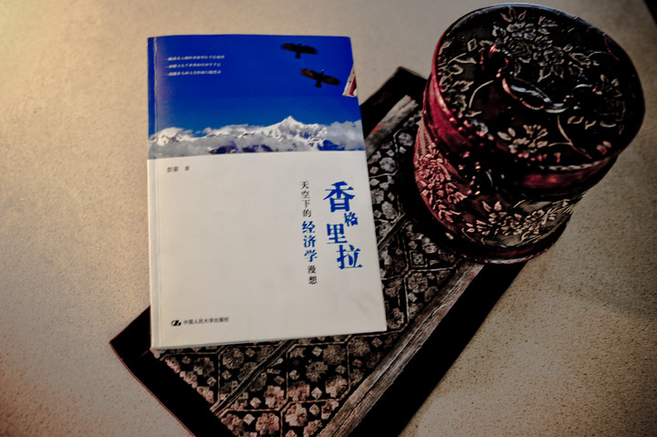
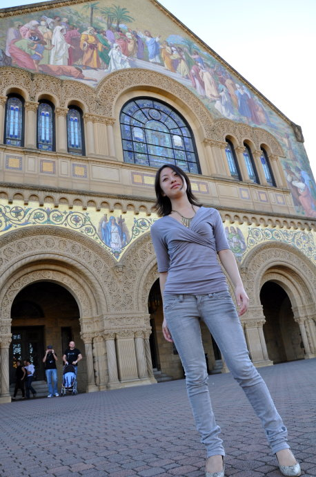

# ＜玉衡＞原来，经济学也可以如此浪漫

**经济学也可以浪漫，如果在不失严谨下能让我们看到虎跳峡的壮美、雪山的神圣、古城的厚重、旅人们千姿百态的性格和令人惊叹的经历。旅行也可以充满理性的思考，如果在灿烂的阳光下在吊脚楼阳台下喝着咖啡以一个个小故事揭示故事背后的经济学意义。**

### 

### 

# 原来，经济学也可以如此浪漫

### 

## 文/刘宇翔 （北斗撰稿人）

### 

编者按：上周《北斗》刊发了撰稿人彭萦的书作节选，[《梅里雪山的美是免费的，雨崩神瀑的美是有价的》](/?p=6330)，与读者们分享了这段浪漫的“经济学旅程”。本文是《香格里拉天空下的经济学漫想》书作的阅读体验，刊发于此，是为分享，无关评论。

### 

很久没有这么舒畅的阅读体验了，一本好书，就是让你从翻开的一页起就无法停下来的书，而一次浪漫的旅行，大概就是当你走完最后一步而所见的风景早已经铭记在你的心灵化为你人生的一部分。这不是广告甚至不仅是书评，而是一次温习和发酵——温习3年前在某学校里所学习的课程，而合上书本后我突然有了一种背上背包远走高飞重走一遍作者曾经走过的旅程的冲动，因为文字之美，因为在雪山上，蓝天，触手可及。

### 

###  

 只有真的好，才会推荐，这是我要说的。 “请问你，克利托布勒斯，财产管理也象医药、金工、木工一样。是一门学问的名称吗？” “我想是的，”克利托布勒斯回答说。 ——色诺芬，《经济论》第一卷 当旅行遭遇经济学，会发生什么样的“化学反应”？当香格里拉的美景遇到边际效用曲线，又会描绘出什么样的结果？当一个旅人在旅途中与相遇的人谈论经济学时，他们在谈论什么？香格里拉天空下，远眺巍峨的雪山，漫步在芳草间，你会漫想什么？当你在客栈听说“包车司机向客栈老板要回扣”时，你第一时间会是道德批判还是马上意识到这是一种“寻租行为”？ 如果你意识到的是后者，那么，恭喜你，你是受过严谨的经济学训练的。 带着经济学的思维去行走大地，你会看到纷繁复杂世间背后的别样风景，在路上所遇所见所闻，同样也会让你感悟以模型、曲线、术语构筑的经济学体系背后的深邃涵义。 经济学与旅行，大概，原本并不像我们一直以为的那样牛马不相及。 据说，古希腊的色诺芬是第一个使用“经济”一词的人，而他写作不朽的《经济论》正是在一次漫长的旅程后，从波斯帝国的腹地艰难跋涉回到希腊世界，在地中海沿岸的阳光下，他假借苏格拉底之口，写下了那本最早的“经济学文献”。如果“童话游记”也算是“游记”的话，那么在美国“金本位与银本位”相争的年代诞生的充满隐喻《爱丽丝梦游仙境》就算是第一本经济学与游记相结合的作品。而行走在大地间写下经济学感想的，在我有限的阅读中，这本《香格里拉天空下的经济学漫想》就是唯一的一本。 在色诺芬时代，所谓的“经济学”不过是“家政学”，即如何经营自家的财产获取回报，而它的姐妹篇《雅典的收入》也不过是类似于“城邦经济政策建议”类的政策意见，甚至，它远远没有脱离“政治学”的范畴，因为它们在字里行间有着“什么样的职业才是城邦高尚的技艺”之类的思考。直到亚当.斯密，才以一本划时代的《国富论》奠定了古典时代经济学的基石。当然，那与现代经济学的范式也有天壤之别。以“边际革命”为开端，经由萨缪尔森确立经济学数理体系，以“理性人假设”为基石，现代经济学成了研究“如何将有限资源进行合理配置”的学问，它不是一门教人如何赚钱的技艺，更不是教人如何省钱的窍门，而是历经贝克尔等人的努力，成了渗透如社会科学方方面面的“帝国主义学问”，将整个人类社会、历史作为了它的研究对象。 哪怕是旅行。 任何旅行都会遇到林林总总的问题和形形色色的旅伴，有问题就要寻找解决方案，有人的地方就有江湖，那么，如何看待、分析问题，如何在种种“歧路”、抉择中做出判断，作为一个受过严谨经济学训练的人来说，就是经济学上阵的时候了。航班误点，是该诅咒航空公司呢，还是思考可不可以引入“价格弹性”区分出愿意出高价早点行程的客户和买低票价愿意耽搁点时间的客户？对于一个放荡不羁的行者而言，高酬劳和闲暇时间如何取舍？在五湖四海聚在一起的年轻人里谈论毒品话题时，你会做出什么样的分析？ 或者，当你遇到一个“吝啬”的旅伴，在大街上一家家地挑价格最低的旅舍时，你脑海里是思考通货膨胀问题还是如凯鲁克亚笔下的人们那样——瞧瞧那些有钱人，我们就算拿他些什么也不会让他有什么损失，不如冲进去抢了一票再说吧。 看看，都是在路上的人们，嬉皮士与经济学院的学生还是很有区别的。 同样，游人跟旅人也是很有区别的。游人跟着导游蜻蜓点水般走马观花拍个照表示已经到此一游，而旅人则背上行囊走在崎岖的山间小道上用双脚丈量大地、用双眼去铭记风景以汗水作为证明。 

### 

### 

我想，如果凯鲁克亚懂经济学，那么《在路上》除了略带边缘视角的“用能给世界一些新意的眼光来看世界外”估计会多一分睿智清醒理智的思考，但如果那样，就不够疯狂不够颠覆一切；如果贝克尔足够年轻足够文艺，那么他就不会用那么多数学模型将普罗大众拒之门外；如果列维特是个聪明漂亮的少女，那么他断然不会用“流氓”的叙事风格去剖析纷繁复杂社会现象后的经济学涵义，让清纯如你我者面红耳赤；如果麦卡蒂不仅是个经济学家，还是个有范儿的文艺女青年的话，那么她笔下的经济学大师们就不会板着一张老脸像在课堂上一样填鸭式地给我们布道传播经济学的福音了；如果弗里德曼不带着那么强烈的“意识形态色彩”，那么，他的书会让我们读得更轻快些更愉悦些。 经济学也可以浪漫，如果在不失严谨下能让我们看到虎跳峡的壮美、雪山的神圣、古城的厚重、旅人们千姿百态的性格和令人惊叹的经历。旅行也可以充满理性的思考，如果在灿烂的阳光下在吊脚楼阳台下喝着咖啡以一个个小故事揭示故事背后的经济学意义。 一本有趣的书，就是让你跟随作者的足迹去思考、看到远方从未见过的风光，合上书本时，你不仅获得了知识，更有一种冲动——打点好背包，带着那本书，上路吧——而《香格里拉天空下的经济学漫想》，无疑，就是这么一本有趣有内涵的书。 

带上它，启程吧。

《香格里拉天空下的经济学漫想》

豆瓣：[http://book.douban.com/subject/5501816/](http://book.douban.com/subject/5501816/) 当当：[http://product.dangdang.com/product.aspx?product_id=21022067](http://product.dangdang.com/product.aspx?product_id=21022067) 原文地址 [http://blog.renren.com/blog/274802735/714564692](http://blog.renren.com/blog/274802735/714564692)

### 

### 

（采编：项栋梁 责编：项栋梁）

### 

### 
