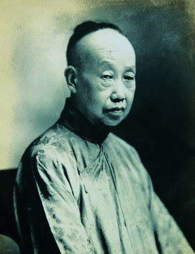
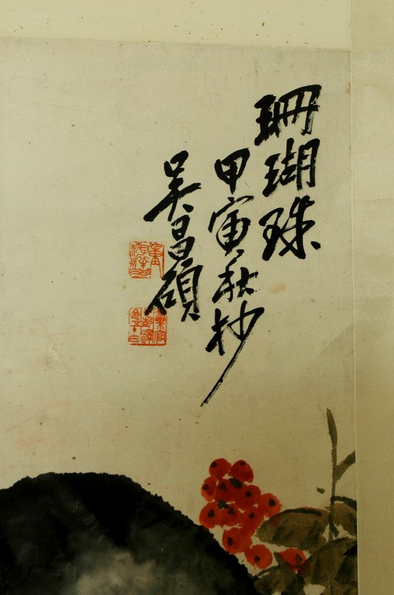

# ＜玉衡＞吴昌硕：大美出至丑

**吴昌硕书法的美感特质与传统文人书画大相径庭，他乃是以一种看似丑怪粗野的形态证实了残拙之趣、枯缺之美。吴的媒人兼诗友施旭臣（？—1890）就曾赠其诗云：“君独何为了枯槁，众人大丑君大好。”这恰恰说明吴昌硕善于从美、丑之间寻得一个平衡点，以一种别样的气度将美从丑中激发扬立出来，故而所得之美更美。**

# ** 吴昌硕：大美出至丑**

****

## 文 /谷卿（暨南大学）

2008年的夏天，我从北京去往珠海，因事件在上海略作逗留，其间突然想去看一看吴昌硕在沪上的故居。于是请朋友带我找寻。朋友和我一路打听询问，来到山西北路的一处弄堂，我们终于在一栋老房子门前发现了一块写有“吴昌硕故居”的大理石牌。等老房子里走出一个叼着烟的中年男人，我们上前问询，这里就是吴昌硕先生的故居吗？那人吸了一口烟，点点头，“就是这里了，不要感到奇怪，故居嘛，就剩这一块牌子了。”我的心顿时凉了半截，探头从老房子的大门对里面小院望了望，看见的是挂在斜拉的铁丝上挂着的一排排衣物、几把歪插在门边塑料桶内的破伞、一台浅绿色的塑料管已经破裂的旧式洗衣机，实在不敢想象当年吴昌硕居住过的旧宅而今已经成为十二户市民的居所，他们就这样蜗居在此，连堂屋都被隔为三块分为三室。我们和那位抽烟的男人聊起来，他说，经常有人到这里来看一看，问一问，最后摇摇头走了；偶尔还会有海外艺术界人士来要求参观，有一次收到从日本寄来一封邮件，信封上面写着：吴昌硕故居纪念馆馆长收。“哪有什么馆长啊，我就是馆长！哈哈哈……”吸烟的男人大笑着走开了。 在近代艺坛上，吴昌硕（1844—1927）应是名头最响亮、作品最丰富、成就最突出、影响最深远的艺术家了。中国文人画的传统到晚清吴昌硕这里，进入了一个新的境界，也打开了一个新的局面。我实在没有想到，这样一位海内外闻名的艺术大师，他的故居竟致如此寥落而喧嚣。 

 书画艺术品交易市场来看，吴昌硕的作品不仅丝毫未受冷落，近年来的热度倒是一个劲儿地蹿升。早在上个世纪八十年代中期，吴昌硕的精品书画的单件成交额就已经突破十万，九十年代以后，价格扶摇直上，在各种拍卖会和交易会上，其画作价格达到数十万的实不在少。2006年西泠印社的名家篆刻专场，吴昌硕所刻“人生只合住湖州”象牙闲章竟以七十八万元的高价拍出——这是当初估价的五倍。 虽然吴昌硕的绘画和篆刻作品极受市场青睐，但他的书法却总是找不到市场上应有的位置。与齐白石（1864—1957）相比，吴昌硕书法的价格几乎只是他的一半甚至三分之一。平心而论，齐白石的书法远不及吴昌硕，笔墨的控制、章法布局、整体气韵，都逊于吴，但在受欢迎程度和市场价位上却不是吴昌硕能与之比肩的。 吴昌硕的画名和印名实在太高，以至于大大地掩盖他书法的成就。他早年楷法学锺繇（151—230），从他那时绘画的落款来看，都是一色清隽的锺体。中年以后就少写楷书了，此时酝酿变化，但作楷书，风格多近于黄山谷（1045—1105），如他为挚友蒲华（1839—1911）所书《蒲作英墓志铭》，就开始显现出黄的笔意来，却又不拘泥于黄的结体，能够从前人陈法中跳脱出来。这在他的行草书上表现得更为明显，其所作行草纯任自然，却更能得“屋漏痕”、“锥画沙”的妙趣。沙孟海（1900—1992）先生评曰：“尺幅小品，自有排山倒海之势。晚年行草，转多藏锋，遒劲凝练，不涩不疾，亦涩亦疾。”沙孟海曾亲见吴昌硕运笔，据他回忆，“正锋运转，八面周到，势疾而意徐，笔致如精铁蟠屈，与早年所作风格迥殊。”确实，吴昌硕是一个勤苦劬劳而又着意创新求变的艺术家，他数十年临习石鼓文，早中晚年各有意态体式，到晚年终于脱离原刻面貌，达到恣肆烂漫的至高境界。吴昌硕在六十五岁时的一篇日记中写道：“余学篆好临石鼓，数十载从事于此，一日有一日之境界。”可见，不仅吴昌硕的篆书能成其一体，其行草也从篆书中得益良多。所以，我们今日所见吴昌硕的行草，并无帖学的柔媚绮丽、俊秀婉转，反倒是充满金石气味，朴茂自然、一片神行，这也就是沙孟海所言“笔致如精铁蟠屈，与早年所作风格迥殊”的原因所在了。 

 吴昌硕诸体皆善，他的隶书也极有特色。早在青年时期，他就遍临汉碑，《张迁碑》、《嵩山石刻》、《张公方碑》、《石门颂》、《曹全碑》等俱烂熟于胸中笔下。摹古之余，又受时人邓石如（1743—1805）、吴熙载（1799—1870）的影响，笔法最近杨岘（1819—1876）。一般人写隶书多加宽压扁，以增其雄浑敦厚之意，吴昌硕偏偏与别人不同，他的隶书总爱写作长体，在结体和用笔上借鉴了《开通褒斜道刻石》和《裴岑纪功碑》，更得《大三公山碑》（《汉常山相冯君祀三公山碑》）和《太室石阙铭》、《开母庙石阙铭》的风神，他从中汲索出篆隶互济、方圆参合的笔意，遂拙朴老辣亦有浑圆之致。我乡前贤柯文辉先生曾有诗句评之：“端严篆隶输情趣，行草风流本色存。”确然，吴昌硕的行草与篆隶风格并不相类，但有一个统一的意念和气味贯穿其中，那就是金石之趣，率真雄放、恢宏刚健，虽然看似乱头粗服、狂怪凌乱，但统之以法度，又直诉深心，正是生活的写照与精纯提炼。 吴昌硕书法的美感特质与传统文人书画大相径庭，他乃是以一种看似丑怪粗野的形态证实了残拙之趣、枯缺之美。吴的媒人兼诗友施旭臣（？—1890）就曾赠其诗云：“君独何为了枯槁，众人大丑君大好。”这恰恰说明吴昌硕善于从美、丑之间寻得一个平衡点，以一种别样的气度将美从丑中激发扬立出来，故而所得之美更美。 据篆刻大家陈巨来（1904—1984）回忆，吴昌硕“极矮小，至死八十四岁，头上仍盘一小髻，似道士一般，无须，故有‘无须道人’一印。初一见面，几与老尼姑无异。”从吴昌硕留下的影像来看，他确实不是修身昳貌的美男子，甚至可以说颇为丑陋，但他的精神气质之美却远远地超越于形貌之上。1927年，诗人陈三立（1859—1937）曾在重九登高时见到这位海派领袖，他在日记中回忆当时的观感：“对之悚然若古木，若瘦藤寒石，缥缈出霄光霞气中也。”此后没过多长时间，吴昌硕即中风病逝，一代大师零落。后人将陈三立的这段文字刻在吴昌硕的墓志铭上，以志悼怀。我想，这段描绘恰恰也是我们对吴昌硕其人其书的最好的想象。 

（ 采编：安镜轩 责编：黄理罡）
