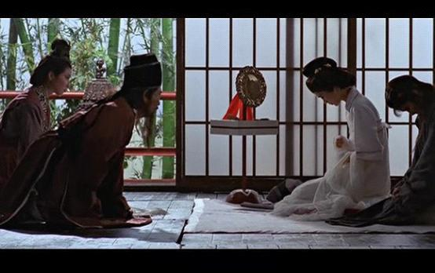
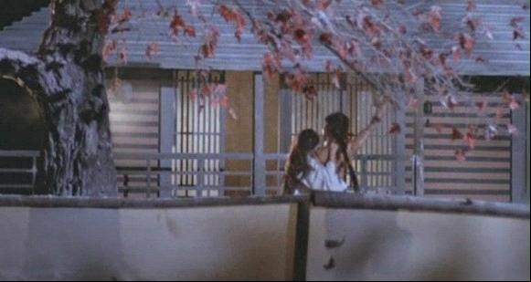
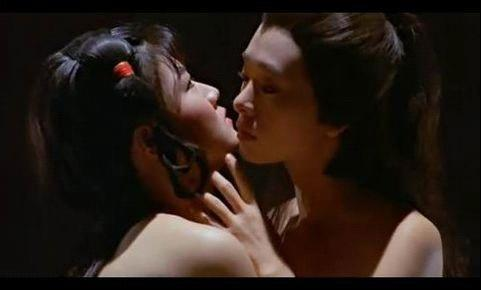

# ＜玉衡＞回归

**在《三D肉蒲团》里，除了玉燕在演戏外，其它女人只负责带着躯体赤身肉搏。你会觉得这不是一个荒淫无度的酒池肉林，而是某个机械加工厂。地上片片机器，天上朵朵浮云。带着这种强烈的失望和失落感，我又温习了一下老式港片，重见了港式情色的鼻祖的风姿，从叶子楣到叶玉卿，李丽珍到舒淇，还有不是情色片的张曼玉王祖贤等，无不怀念。她们大胆却有尺度，羞涩中带有一种处子的美丽，矜持中却蕴含着强大的吸引力，而我想这个，也正是现在很多女演员所缺失的。**

# 回归

## 文/ 仇桂莹 （Ludwig Maximilian Muenchen Universität 慕尼黑大学）

 话要从《3D肉蒲团》说起，这部剧在香港情色电影渐息渐退之时几乎是横空出世，古装，3D，引用经典，强大夸张的营销手段和噱头，宣传片的刻意裸露调足了观众胃口，犹记那是《3D肉蒲团》海外宣传，几乎把我扬眉吐气爱国主义情怀都给振奋出来了，我无比激动的拉着我外国同学的手，老泪纵横地说快快看我们中国的情色片，以中国古典名著为基石，情色而不肮脏，唯美又有底蕴。 

九十年代初香港情色电影鼎盛时期，那时候我还是个没上学到处撒丫子跑的操蛋小孩，整日跟着一群大哥哥后面——看录像带。还在懵懵懂懂时期，便有了最初的色情。暴力、限制级启蒙教育。后来稀里糊涂的带上了红领巾，做了一名优秀的少先队员，自此才做了一名成长在红旗下的阳光少女。 回归主题，几天前看了向往已久的《肉蒲团》，整整看了两遍，第一遍睡着了，颇有看《新闻联播》的感觉，带着亵渎了名著的愧疚之心，又看了第二遍，大醉，猛然入睡。惟一声叹息，当代女子，只能演绎色情，却再难演绎情色了！这部新版《肉蒲团》，不但不色情，简直是反色情！ 在多数男人眼里，情色，色情，毛片是没什么分别的，也无意区分，他们的着重点只在于这戏里面的女人是否能命中撸点。而女人，要么不看，要看起来，却是十足挑剔。一部三级电影，要想成功，首先要被女性观众接受，女人不喜欢简单的机械重复，女人喜欢故事，要戏里人物不是性爱机器，而要有性格上的升华。然后她便可以随着人家的痛苦而痛苦，随着人家的快乐而快乐，随着人家的性爱自己进入高潮。 情色片里的男人几乎没什么看头，男人对自己的要求是技术硬，口活好，时间长。无聊到周而复始的机械运动。而女人，风情万种是她，楚楚动人是她，骑在男人跨上摇曳生姿的是她，头发散在美背荡在双乳上的是她，香汗淋漓娇喘淫淫是她，被人弃负幽怨婉转轻解罗衫的还是她。古语云：妇人腰下物乃生我之门死我之户，如人参附子，大补之物，只宜长服，不宜多服，只可当药，不可当饭，不可太疏亦不可太密，不可不好亦不可酷好。 犹记《闻香识女人》里那段台词： 

_有没有把鼻子埋在一对云鬓中_

_然后希望就此睡去的经历。_

_有没有轻轻粘上一片柔软的唇_

_就像穿越沙漠后，_

_喝下的第一口美酒。_

_还有乳房，不管大的小的。_

_她们永远像两个探照灯一样瞪着你。_

_还有腿_

_不管是不是符合黄金比例_

_两条腿中间的。。_

_中间的。。_

_正是通往天堂的护照_

_the most beautiful word in the world is——pussy_

 现在的女人，比以前更敢脱更不怯场了，在港影逐渐破落的今天，三级电影层出不穷，可与昔日相比，却是另一番超越不了的失落光景。取材于古典名著的情色片， 《红楼》、《聊斋》、《金瓶梅》系列，都是天时地利人和的好题材，狐光魅影，落魄书生。深宫庭院，酒池肉林。然要玩好情色，却实属不易。有句话说，最不贞洁的诗是最贞洁的人写的，世界上最放纵的文字都出于和尚尼姑的手笔。 在《三D肉蒲团》里，除了玉燕在演戏外，其它女人只负责带着躯体赤身肉搏。你会觉得这不是一个荒淫无度的酒池肉林，而是某个机械加工厂。地上片片机器，天上朵朵浮云。带着这种强烈的失望和失落感，我又温习了一下老式港片，重见了港式情色的鼻祖的风姿，从叶子楣到叶玉卿，李丽珍到舒淇，还有不是情色片的张曼玉王祖贤等，无不怀念。她们大胆却有尺度，羞涩中带有一种处子的美丽，矜持中却蕴含着强大的吸引力，而我想这个，也正是现在很多女演员所缺失的。情色片并不好演，早年导演对女演员的要求也极高，有身材，有技术，有胆量，销魂蚀骨，万种风情，男女通吃老少皆宜。 《肉蒲团》，又名《觉后禅》，顾名思义是男人们做的一场春秋大梦，然春梦了无痕，醒来就得思悟。其宣扬的是“淫人妻女者，必为人所淫”的因果报应论。权老实和未央生最后都拜了布袋和尚为师，说出了：昔日所为，今日所受。今日所为，明日所受。未央生的妻子也许是最无辜悲情的角色了，如花似玉的年华嫁给了一个性功能障碍后期又不回家的男人，而后独守空房，被家奴强奸，后被卖到妓院，走了一圈，又被自己前夫慕名来嫖，最后羞愧悬梁自尽。这难道是说明，古代女子的悲惨命运只能系在夫婿身上，夫婿犯下的错，她也要一同受到报应吗？叶子楣在《偷情宝鉴》里演出，时隔多年，到今时今日，仍然是众多小辈女星无法复制的经典。 另一部《唐朝豪放女》，几乎是我最喜欢的情色剧，堪称香港情色史上的扛鼎之作，取材于唐朝才女鱼玄机，文笔风流，涤荡不羁，由灵气性感十足的夏文汐来出演，画面处理颇有韩国唯美情色的味道，曾获21届金马奖最佳美术设计奖。片中鲜有传统意义上的性爱场面，不过那种遮遮掩掩窥而不得的处理手法，却勾得起很多人的意淫之念。这种风月极具中国传统特色，而构成了中国古典文化的重要部分。 这部剧我记住了一个女人叫夏文汐，三分美貌，七分味道。 玄机身着薄纱躺在红叶上，俨然一副“零落成泥碾作尘，只有香如故的画面。而夏文汐本身，恰好又满足孔雀东南飞里“足下蹑丝履，头上玳瑁光。腰若流纨素，耳著明月珰。指如削葱根，口如含朱丹。纤纤作细步，精妙世无双”对女人的描写 

林花谢了春红，太匆匆，无奈朝来寒雨晚来风。胭脂泪，相留醉，几时重，自是人生长恨水长东。 

易求无价宝，难得有情郎。”——鱼玄机《赠邻女》 

一个女人如果有了涤荡的风流，夺人的美色和绝世的才华，便是任凭风吹雨打也天生难弃。她走了许多女人不敢走的路，声色犬马，杯酒诗歌，她是男人的销魂散，女人的眼中钉。她是个绽放在长安城流言蜚语里的荡妇和才女。她要做青灯古刹里的一朵奇葩，只要片刻的流光溢彩。 她穿着薄纱从水里探出头来，直盯着崔博侯的剑，那个眼神，伶俐性感极了。 博侯问她为什么要做女道士，答曰：有学问的女人可以做什么？我不喜欢做人家的妻子，不喜欢做妾，不喜欢做妓女，不喜欢做尼姑，我舍不得自己的头发！只能做女道士咯！ 够愁交错，醉眼迷离，把酒言欢，风月散去。一个继续漂泊，一个继续纵情。 半年后相见，她问他，别后半年都做过些什么？ 答曰：流浪，到处流浪。 “杀过多少人？” “不记得了” “借过多少女人的身体” “没有数过” 博候反问，你呢，这两年都做过些什么。答曰，不记得了。 他们如此相似，热爱自由，无拘无束，惺惺相惜，情意便渗透到了骨血。 她对铸剑师喊道，我的血里也有博候的！ 

她与侍女绿翘，是主仆，是姐妹，亦是情人。 她问男人，绿翘到底有什么好，引得这么多男人前来讨要。 答曰：男人也想要你，可是你不要他们。 她大笑：绿翘一生下来就属于你们这些男人。我不是，我只属于我自己。 她只属于自己，她周旋于男人，又不甘心依附男人。她让男人痴迷，又不给男人真心。 她是冬天里的一条狐狸毛围脖，夏日里的一席柔软的水床。 她被压刑场，却不曾有惧色。临刑之际，博候一匹快马，披星斩月，似是故人归来。 要救她，她却侧身躲开，男人情急对她大吼：你到底走还是不走！她大笑，冷语说道：你想来就来，想走就走，有没有问过我想怎么样！ 他惊愕，仿佛从未认识她。 这一声喊，却喊出了多久以来心里的委屈，再放荡的女人，也有为一个男人收心的时候。他喜欢流浪江湖四海为家，任凭她的美色她的才华她的万种风情也留不住他的心，直到她心死，直到她再也不想追这只断了线的风筝，他终于回来。 “救得了你，和你一起流浪，救不了你，还流浪什么？” 羞日遮罗袖，春愁懒起妆。易求无价宝，男的有情郎。 玄机终于得到自己所求，用自己的性命。 

最后抄用一部情色片《世界中心》作结语，片子体现的是女人的阴道：每个人都出自这里，这里便自然成了世界中心。当所有人为这中心而转动的时候，我们知道，我们对情欲的追求不过是回归到人之初的一种体现，无论它是为情而色还是为色而情，这种追到底的回归感，其实是与生俱来的。 

（采编：陈锴；责编：陈锴）
