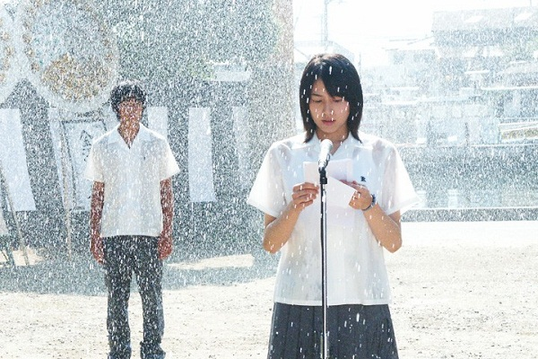
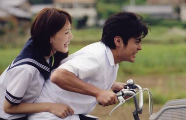

# ＜玉衡＞在世界中心呼唤爱

**那一刻，多少人无比遗憾，因为羞于“早恋”错失过很多，比如多少女孩子豆蔻年华没有在心爱的男孩家石阶上等候他过；比如，曾经多少女孩太矜持所以没有主动跳上他的车，没有主动搂紧他的腰；没有主动地告诉他，我愿意长途跋涉来看他是因为想和他说话。当影片结束的时候，多少人忽然感到应该早恋的年代，唯一遗憾的是，曾经没有大声说过我爱你。** 

# 在世界中心呼唤爱

## 文/林静（华侨大学）

### 

### 

回想初恋，满满的，是不是都是美好的味道？初恋在记忆力是有味道的，还有粗糙的慌乱感。 爱情，不过是女人停留在男人大脑诗化的那一层而已。反之亦然，作为一个女性，回忆起青少年时期喜爱的男孩子，也不过常常是把自我情绪诗意化，矫情想象生活中各种韩剧的老套并狗血的桥段，随后把这预设的情绪当做是发生过的情节。所谓自我实现。所以，那么多电影的剧情如何狗血都有巨大的票房。 

 前几天看了下载了好久的日本纯爱电影《在世界中心呼唤爱》，电影和期待中的一样轰轰烈烈，银幕前的我缺乏了一些轰轰烈烈的感动。 还是留下一些镜头让我回味，彼时，一场台风过境。雨水尖锐地宣泄而下，发出巨大的声响，冲刷过地面，冲刷过屋舍，冲刷过每一处植物，冲刷过你突如其来又突如其去的少年时代。 你记不记得。你还记不记得你的青春和爱情？记得彼时透过窗户的阳光，反射在教室的桌椅上的斑驳，风吹过那个女子的头发的时候她对你说：“我愿意”？ 可惜曾经我以为早恋是不对的，那个时候的我，懵懂无心或者麻木不仁，热情和血气总归不会同时临幸于我。而后来明白其实没有早恋才是不对的我，已经不再热衷于恋爱，每一次体会这清醒而颠倒的人生的时候，激荡在体内的不过是明镜一般的晴朗。就像大好河山面前却高度近视的人最后到了一片白茫茫的雪地前，近视却不治而愈的感觉。 日本纯情纯爱小说的泛滥是因为现在的人不再纯粹，电影只是试图制造这样的场景来证明自己的往事也有着纯净的世界，可是，不幸的是，精神家园早已倾覆，除了梦乡，精神早已一无所有。当《山楂树之恋》小说登上了感动中国十大的时候，我只是觉得国人不过是很需要感动而已。 电影，无非是追求一种可以战胜空虚的拥挤。 

 因为那种充满大悲大喜轰轰烈烈的感情比较容易让人触动人们规定的感动。影片里为了实现曾经的梦想，他们相约，风雨增加了这种可能性的难度也，让悲情达到了最大化。机场的一幕是制造高潮的需要，虽然可以理解那是女孩最后的心愿。可是，我绝对不会支持，在如此的瓢泼大雨里带着一个虚弱的女孩去实现所谓的梦想，这是对亚记的谋杀，一种不负责任的冲动。这样的情节对于青少年而言有着及其不好的负面影响，任何的前提设置都不应该以牺牲其他生命为导。我也曾经年轻，但是，我一直明白爱的意义是奉献，而奉献里就包藏着对自我情绪的理性克制。 当然我不否认，影片里还是有很多温暖的画面。两个人坐在梦之岛的破旧房子里,他想吻她,夕阳勾勒出他们的身影,就像是画中的天使一样纯洁的两个少年。那一刻，多少人无比遗憾，因为羞于“早恋”错失过很多，比如多少女孩子豆蔻年华没有在心爱的男孩家石阶上等候他过；比如，曾经多少女孩太矜持所以没有主动跳上他的车，没有主动搂紧他的腰；没有主动地告诉他，我愿意长途跋涉来看他是因为想和他说话。当影片结束的时候，多少人忽然感到应该早恋的年代，唯一遗憾的是，曾经没有大声说过我爱你。这大概是这部影片打动国人的地方。 

 该遗憾无法弥补，该说的无需说了，剩下的就是要继续男默女泪的生活。如果现在我的初恋情人现在忽然给我电话说希望听见我大声说爱你，那么我只有唯一的答案：谢谢，不想说了。   

（采编自投稿邮箱 责编：陈锴）

