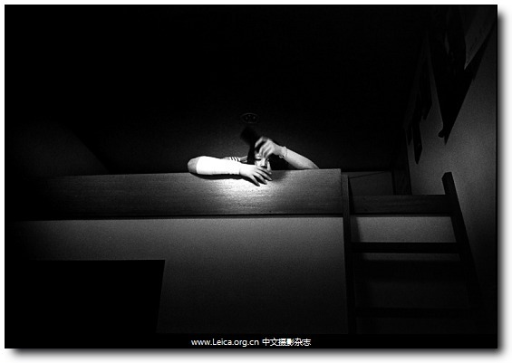

# ＜玉衡＞在路上——《观音山》观后感

**“迈克尔•杰克逊都死了，还买什么单啊？”这是肥皂在剧中的唯一一次歇斯底里，是啊，他的偶像没了，一种叫做“精神寄托的东西”没了。放眼整个人类整体，是否也在丧失着一种叫做“精神寄托”的东西，抑或是叫做“信仰”的东西，无从得知。唯一确定的是每个人都“在路上”。** ** **

### 

### 

# **在路上——《观音山》观后感**

** **

## 文/吕伟欣 中国政法大学

 只能说自己真是太后知后觉啦，观音山这部电影应该上映好久了吧，今天才想起来看一下，并且是看了两遍，我不知道什么是好电影，也不知道该如何定义“文艺片”或是“伪文艺片”，但是看过之后能让我忍不住想静静的想一想的电影就是好电影，这就是我的评价标准。 电影片头的背景音乐就是重金属打击乐，还夹杂着一种低沉的音质……一直到骑着摩托车和电动车的丁波和肥皂的登场。叼着烟再怎么装他们也只是孩子，只是提早进入社会谋生而已，毕竟“要半打儿啤酒的同时也不忘要一桶爆米花”。小小的拥挤嘈杂的酒吧里，南风在舞台上夸张的穿着装扮和唱腔，本来以为会是围绕他们展开一场关于迷茫一代的拷问，可是最后随着列车进入隧道，列车渐行渐远，隧道口的光圈越来越小，这剩下铁轨延伸向无限的远方，才明白作者想表达的并不止于此吧…… 影片中有很多“在路上”的镜头，行走在铁轨上，骑在摩托上，扒火车穿山越岭……在呼啸而过的火车上大喊大叫估计是很过瘾的一件事吧，看着沿路的风景，在“蜀道难”的大山中，任凭头发在风中零乱，一会儿是隧道中的绝对黑暗，一会儿是阳光曝晒下的绝对光亮，还有在明暗交接点处光的巨大落差。三个失去了家庭温暖的孩子，三个背负着高考落榜生称谓的孩子，三个刚刚尝到初入社会辛酸的孩子，“在这么大的城市中，我们算什么？”此刻他们心里曾经辉煌的宫殿已变成废墟，他们不知道该怎样重建，不知道该去往哪里，也不知道该信仰着什么。就像影片中，地震后观音寺的废墟，如果“每个人都搭把手”，它还可以重建，可是心灵里的废墟呢？怎样重建？难道只能是沉浸在虚无中，在刺激的摇滚乐中，在疾行的列车中找寻“存在”的真实感吗？ 

 “迈克尔•杰克逊都死了，还买什么单啊？”这是肥皂在剧中的唯一一次歇斯底里，是啊，他的偶像没了，一种叫做“精神寄托的东西”没了。放眼整个人类整体，是否也在丧失着一种叫做“精神寄托”的东西，抑或是叫做“信仰”的东西，无从得知。唯一确定的是每个人都“在路上”。是在朝着目的地前行？还是沿着路漫无目的的前行？还是其他……毕竟最终会在同一地点相遇，就是死亡。 “早晚早晚……那这个早晚是？是看自己呢？还是看什么呢？什么是早，什么是晚呢？”——当老者说人早晚要到另一个极乐世界去，常阿姨如此追问他。常阿姨的一生应该同大多数人一样，极其平淡的一生，经历过每个人都应该经历过的一切。当她再也找不到生存下去的支点后，选择过死亡，三个拥有天使之翼的孩子曾经救了她，也给她带来了久违的欢乐。可是当她第一次来到观音山这个地方，眼里所流露出来的那种神情，还有那句“这个地方可以长待”，她或许心里已经有了选择。终于有一天，在青山的怀抱中，三个孩子不见了她的身影，伴随着一声钟响，一声鸟鸣，或许她已经进入了另一个世界。那条如轻雾般飘落的瀑布还是如往常一般，没有异样。 整部影片的镜头似乎从没静止过，一直是晃动跳跃的感觉，意识流般的无逻辑。唯独有一次终于定格了，是常阿姨和三个小屁孩儿在一条木舟上，此刻的江面异常安静，每个人的都是一副凝重的表情。四个人，四种不同的心境，四种不同的有关痛的记忆，唯一相同的是他们四个人都失去了曾经珍视的东西。四个个体，两个群体，在他们共同的屋檐下，很多本来泾渭分明的东西似乎也可以融合共存，比如说摇滚乐和京剧、中国画和动漫海报、白米粥加咸菜和KFC、菩萨和上帝、金童玉女和小天使……这些风马牛不相及的东西共生在一个狭小的空间，就像如此多元的文化可以共生在地球这个小小的星球上一样。他们只是人类这个大群体中的一些普通的人，他们经历的每个个体或许都会经历，比如高考落榜，初入社会的无助，敢问路在何方的迷茫，家庭的变故以及对于生死的衡量…… 似乎每个人都是穿梭在痛苦与幸福两点之间的，就像是常阿姨对那位僧人所说的，人生无常，谁都不知道将来会是什么样子，曾经幸福过，飞来的横祸却可以将这种幸福全部抹杀。经历过的痛让他们变得坚硬，四个人都有自己的保护色，活在自己的壁垒里，可是心的最最里面的一层总有一块儿最最柔软的地方，是无论如何都坚硬不起来的，这也许是本能吧。依靠这种本能他们彼此救赎，彼此给予的同时又获取对方的温暖。也许这就是“孤单不是永远，在一起才是永远”的含义吧~~ 

（来自投稿邮箱 责编：项栋梁）
