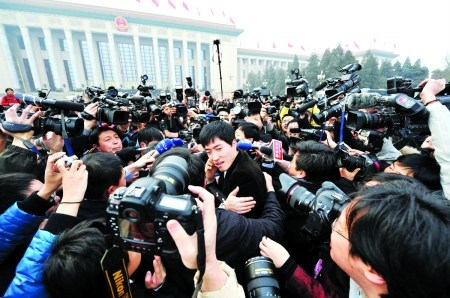

# ＜玉衡＞媒体人在搜索的道路上应如何前进

**相机中的影像是一种记录本真，并不是放大真相，媒体人的心也应该始终与胸前相机的镜头保持一致。在渐行渐远的媒体之路不断践行着搜索的真正内涵，不断诠释着最符合自身的媒体人之道。**

 

# **媒体人在搜索的道路上应如何前进**

## 文/江雨璇（南昌航空大学）

 

其实在我们的生活中，有很多事情都定义在搜索二字上。搜出事物本身，索住事物本质，也许就时刻潜伏在每个人生活环节中的任意一环。搜索可以让人们获得很多符合自身需要并且有利的信息，但是同时在这个过程中也逐渐隐射出暗藏搜索背后的无奈以及矛盾对抗的复杂心理。陈凯歌导演的影片《搜索》就是讲述着这样一种社会背景下的搜索故事。影片所展现的情节画面，所反映的社会现实，也许在传媒界更能引起共鸣和思考。媒体记者得到所谓的难得、抢手的新闻之后所做的报道评论甚至乘胜追击的后续挖掘，人们可能会有来自各方不同的理解。媒体人的工作在于报道，群众的任务在于监督和评判，然而被报道者的处境在很多情况下是被众人忽略的。如今媒体急促的发展，在同行彼此激烈的竞争现状下，为了提高关注度，提升媒体本身的影响力，会冲动会淡漠人性会不择手段会失去理智在所难免。其实，搜索的本身就是一种果敢的行为，并且也渐渐的成为了一种当今媒体生存发展的方式。

影片中，杨佳琪在公车上留心偷拍记录了一则让座风波的小新闻：叶蓝秋对一名老人不肯让坐并傲娇的拍拍自己的膝盖回应：要坐就坐这。这一句话引发了车内的公愤。此后，这件事也因为杨佳琪的影像记录做成了电视新闻公之于众。媒体大众对于叶蓝秋的搜索也由此开始。社会舆论的各种批评谴责，网络论坛上不断的更新贴时刻着表达愤怒和不解，各个媒体争相循环转播，报纸杂志醒目的头版头条。渐渐的，有关于的叶蓝秋的一切信息被迫浮出水面，赤裸裸的展现在社会大众面前：她是个精致的气质美女，她浓妆艳抹孤傲冷静，她是某跨国公司董事长沈流苏的第一秘书，她的家庭背景，甚至她曾经就读的学校曾经的成长经历也被挖掘的一览无遗。可是，偏偏却没有人知道她其实是个本分善良真挚的女孩儿，她其实是一个刚刚得知自身患有癌症晚期濒临死亡绝望的女孩儿。这些问题的关键深埋嘈杂的舆论风波之中，这也就扭转了事件本身的性质。

姚晨扮演的陈若兮是一家媒体单位的资深记者，也是影片展现主题的一条主线。她是当今社会媒体工作者的化身，在她身上的一切经历似乎可以在现实生活中有着多个复刻版本。如今，媒体人最需要的往往就是一次好的机遇。很多人可能因为一次瞩目的报道而瞬间收获名利地位。陈若兮因为作为叶蓝秋事件的主要报道策划人而广为人知，并且受到了来自各方的提携和赞赏。一次好的机遇也许就在眼前，又或许拼搏了很多年也没有遇上。这也正是媒体记者一种工作中的期盼，一种努力的方向，也同样是一种无奈的尴尬和无力的妥协。然而注意影片当中的细节，叶蓝秋事件其实是由杨佳琪主导拍摄，而陈若兮将其作为事件本身的发现者一举成名。无名记者发现的新闻难道没有自主报道的权利？新闻难道只有名记者的报道才可以搬上台面才能使人信服？这样一来，名记者更加有名，无名之辈则只能继续默默无闻。那么也就颠覆了青出于蓝而胜于蓝之说了。也许陈若兮认为无名小记发现的新闻事件很难直接登上电视台报道出来是对的，这就是一种社会现实所在。我们将目光转向生活工作中的其他领域看看，会发现潜规则的存在，不公平的俨然而生其实是社会大染缸中再不过寻常的事情了。这一处表现的是以杨佳琪为代表的一群人的真实再现，也是对于这种必须接受无力改变的现实的还原。然而其实有些事情不能给予极端的正误评判，存在即合理，优胜劣汰适者生存的法则也许就是一种无法逆转的真理。

除了机遇之谈，我还想说说媒体人在新闻工作当中的操守。这是决定新闻报道关键所在。毕竟记者也是人，不是机器，无法抛弃一切感情做到真正客观的报道。个人情感的控制也许是每一个媒体人在新闻的道路上不断成长的能力。尽量客观，理性尊重事实真相也是记者最基本的职业操守。然而陈若兮在叶蓝秋事件报道的后期遭遇也正是对这种理念的诠释和践行。杨守城在作为叶蓝秋雇佣的保护者的过程中爱上了她，这使知道真相的陈若兮倍感伤挫，她扣留了叶蓝秋为让座事件所引发的风波的道歉视频，同时对其进行更深入的挖掘和批判报道，然而最后随着叶蓝秋的自杀，所有的风波逐渐平息，陈若兮的被沈流苏设计，使其最后与杨守诚无法终成眷属，错怪杨佳琪与其分道扬镳，自己原本蒸蒸日上的事业也骤然轰踏的结局不禁让人为之惋惜和失望。媒体记者的口与手是最有力量的武器。如何做到理性报道、冷静执笔也许才是真正对于记者能力的考量标准。也许有时会被时代发展的盲目与急促而迷失了自身的前进方向，有时会被自身情感的无法抑制而最终将自己的主观强加在事实真相之上。但是人们可以原谅失误，却很难释怀失职。职业操守是每一种工作的核心，只有把握了核心才有能力去驾驭自己的工作，并散发工作的本身魅力。媒体人要谨慎处事和交友，要始终拥有自己的判断力。

《搜索》围绕着叶蓝秋让座事件的发生发展而展开。那么是否曾想过，这样的新闻可以在社会上炒的沸沸扬扬是不是有点违背了时代价值观的主流呢，人们对这次事件的关注度不断的热络似乎反衬出了当今时代主流的内在是浮躁和空虚的。人们可以对一个让座无礼的女子无情的逼迫谩骂，人们可以把一件社会小事给炒作的轰然全城。如今社会品味和社会需求似乎已经偏离了主流方向，渐渐变的迂腐低俗。媒体仿佛也只能借有这样的事件可以火热一把。浮躁的社会基调如何演奏人们生活的高尚之音，以他人之丑挖掘取乐似乎成为了一些人群的生活亮点。搜索也渐渐暴露了如今社会的弊病所在。叶蓝秋是受着搜索残忍逼迫下的一类人代表，我们身处事外纵观事件的始终，有的只有同情和无奈。这是一种对社会的思考，也是一种很好的警示！

媒体人在搜索的道路上应如何前进，这也许是一道永久的命题。相机中的影像是一种记录本真，并不是放大真相，媒体人的心也应该始终与胸前相机的镜头保持一致。在渐行渐远的媒体之路不断践行着搜索的真正内涵，不断诠释着最符合自身的媒体人之道。

 

（采编：徐海星；责编：徐海星）

 
