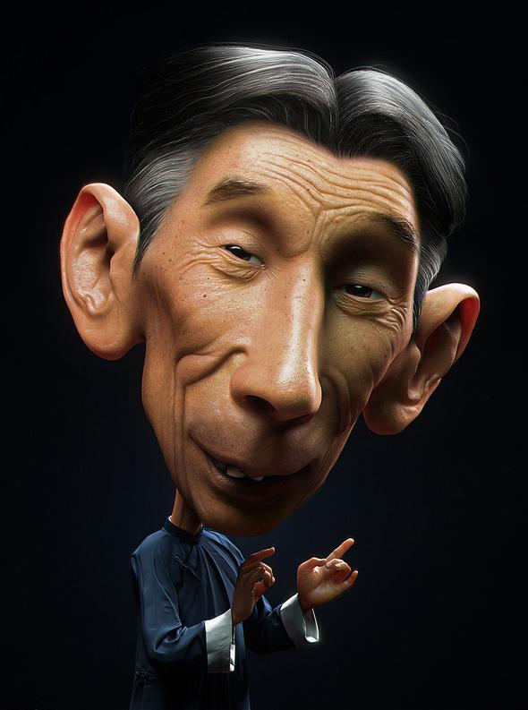
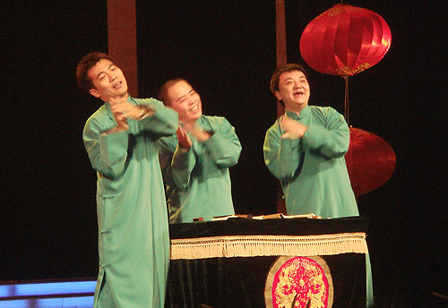

# ＜玉衡＞嬉笑怒骂——细数天朝十大讽刺型相声（上）

**“买个篮球？也开个会。买盒粉笔？也开个会。”** **（国民党全靠收税，共产党全靠开会。）** ** “同志们，我们想，在原始共产社会……”** **（什么事情都要扯回山顶洞人时代，都要扯上马列理论术语。马老讽刺辛辣。）**  

# 嬉笑怒骂——细数天朝十大讽刺型相声（上）

## 文/ 张汇泉（University of Toronto）

 

最近相声界反三俗，小可十分认同，早就该反了嘛！相声是什么？自号讽刺艺术，一百多年来相声演员在舞台上专门调侃他人取乐。大则直斥总统军阀，小则笑骂哑巴呆子，不懂得与人为善，笑脸相迎，迎来送往，往事并不如烟……看而今，我天朝物产繁盛，国运昌隆，社会和谐，百姓安乐，怎可听任汝等妄言国事，讥讽官民，破坏安定团结的大好局面？

反三俗，反的是什么？庸俗，低俗，媚俗。俗者，人民大众也。庸俗，混同于人民大众。低俗，贴近人民大众。媚俗，迎合人民大众。虽然说我们是人民共和国，但是混同人民群众、贴近人民群众、迎合人民大众的历史任务，只能交给先锋队去完成。你一个小小郭德纲或者小小德云社，怎可擅自混同、贴近、迎合人民群众？！这是赤裸裸的僭越嘛！我坚持认为，相声演员的历史使命只能是远离人民群众。你们要向冯曾孙同志学习，在人民大会堂里，举手、拍手、握手、挥手、伸手、上下其手……

总而言之，这次既然上峰明示，痛下决心反三俗，小可认为，讽刺型相声可从此进入历史博物馆矣！在此之前，小可愿为他们排个座次，做个点评，算是墓志铭吧。

#### 10、马志明、谢天顺《夜来麻将声》：讽刺官员有风险，调侃科长是底线。

讽刺对象：社会风行的赌博恶习，官员挪用公款，单位内的官僚主义作风。  尖锐性：★★★ 时代性：★★★☆ 艺术性：★★★★  少马爷马志明先生这段经典作品现在听来可能有些过时，不过在当时听来可是很时尚的：马志明先生率先采用了“电视相声”的崭新表现形式，加入了“东芝广告曲”等当时最潮的时尚元素。马志明先生在这一段相声中大胆讽刺了多种社会现象：单位里的官僚主义、盛行的赌博恶习、家庭纠纷矛盾、官员和小秘的暧昧关系等等。当然，少马爷为了不让作品锋芒太露，在改编作品的时候把主人公的身份定在科长这一级别，把挪用公款的罪过用“盖错公章”淡化，把制度性问题作为个人作风问题来批评，用心良苦。不过，九十年代初被严重污名化的“麻将热”，现在来看，也并未造成严重的社会危害，让这段相声无法再度引起当下听众的广泛共鸣。 亮点句：“我仔细一看盖得不是图章，——白板！” （写文章需要豹尾，相声作品收尾也要求收的干脆漂亮。最后这句收尾，不仅干脆利落地圆满完成了故事，还是在相声中程早有伏笔的暗线包袱。） 

#### 09、侯宝林、郭全宝《离婚前奏曲》：君不见改革开放天上来，二奶滚滚又如何？

讽刺对象：建国后革命干部们坐上高位，腐化堕落，弃旧娶新。  尖锐性：★★★ 时代性：★★★★ 艺术性：★★★★  毛左朋友们常说：五十年代的中国社会风气比现在好得多啊！我同意！的确好得多。这段相声就是一个铁证。你瞧瞧，人家这位干部仅仅是打算合法离婚，都被侯大师狂批一通，是何道理？！现在，包养99个情妇啊，玩姊妹花、母女搭啊，用MBA知识管理十几位二奶啊，各类官场桃色丑闻层出不穷，德艺双馨艺术家姜大湿连个屁都没敢放啊！对此，我只能说一句：“呵呵……” 这段作品，长于人物形象的创作：对发妻轻蔑不屑，对年轻小三儿百依百顺，对诤友的反感，对其他领导干部纷纷娶年轻妻子的羡慕嫉妒恨（同时这也表明，“弃旧娶新”这一现象在革命成功后的五十年代非常普遍）…… 亮点句：“她有什么了不起啊？” （结发夫妻，寡情如此，可发一叹。） “方秘书那个家庭最幸福了。方秘书今年四十多了，他那个小爱人才十九岁（坏笑）！” （毛时代，胡时代，多少年过去了，男人喜欢年轻女人一直没变过。） “你嫌她老啊？你也不小啦？！” “是啊，不小了，科长了！” （“不小了”这一句，一语双关：捧哏演员在讲年龄问题；而逗哏演员大谈自己的社会地位。设计十分巧妙，讽刺到位。） “划船是一种游戏啊。”“又热，又累，出一身汗！游戏啊？义务劳动！” （在五十年代说出这句话，居然能成为一个包袱，获得听众的广泛认同，可见广大人民群众实际上是根本不喜欢所谓“义务劳动”的。实际上，人人都知道，和轻松的“游戏”相对立的，就是“高尚”的义务劳动。所谓的“社会主义”制度，经常假高尚之名，违背、钳制人类本性。） 

#### 08:马三立、张庆森《开会迷》：右派分子发檄文，猖狂进攻欲何为？

讽刺对象：文山会海，文牍主义，官僚主义。  尖锐性：★★★★ 时代性：★★★★ 艺术性：★★★☆  一九五七年，相声演员马三立和相声作家何迟被双双打成右派。想必，两位艺术家的几段优秀讽刺作品《买猴》、《开会迷》、《统一病》是他们遭此横祸的罪名吧！就拿这一段《开会迷》来说，“买脸盆也开个会”，婚礼现场也来个长篇报告，一个官僚主义者无知、愚蠢、傲慢的形象瞬间立体、丰满了起来。几十年过去，官僚主义的表现形式或许改变了不少，但每当看到办公室里织毛衣玩扫雷的大妈，政府机关里冷脸对百姓的办事员，拉上一群道士热烈探讨藏传佛教文化的政协会议，拿微博当免费手机短信跟情人调情的傻逼领导，我总能想起马大师这一段讽刺。 亮点句：“买个篮球？也开个会。买盒粉笔？也开个会。” （国民党全靠收税，共产党全靠开会。） “同志们，我们想，在原始共产社会……” （什么事情都要扯回山顶洞人时代，都要扯上马列理论术语。马老讽刺辛辣。） 

#### 07:郭德纲、张文顺《论五十年相声之现状》：那些拿着痰桶炒菜的文艺官僚！

讽刺对象：TG建政后对文艺界的干预、打压，以及文艺界内部的争斗和矛盾。  尖锐性：★★★★ 时代性：★★★★☆ 艺术性：★★★☆  二十世纪的中国相声史，背后是一部血泪史：一部清廷压迫艺人、军阀凌辱艺人、日本人威逼艺人、国民党压榨艺人、共产党“改造”艺人的历史（当然也有艺人互相迫害争斗）的历史。老一辈艺人，被历次政治动荡打掉了牙齿封住了嘴巴，直到老去也未曾有机会控诉过这数十年的曲折——于是乎，我们只看到一部正史。幸而，我们遇到了敢说敢骂的老郭。这段作品中，老郭谈起了曾经天桥的繁荣，艺术市场的兴旺；说起了马三立等艺术家反右、文革中的遭遇，分析了当前市场萎缩的原因：电视相声的负面影响、演员浮躁的风气以及央视曲协等权力机构对于艺术的错误引导。正因揭露了许多相声界、文艺界的问题，老郭这段相声饱受攻击、指责。但真正热爱相声的相声迷，都能感受到这段相声的真诚和犀利，都会站在老郭这一边。 亮点句：“你学做菜，你起码要知道哪是炒勺，什么是漏勺；你拿个痰桶炒菜说是革新，那他娘的谁敢吃啊？！ ” （这句不仅适用于相声，也适用于所有盲目改革盲目求新的决策者。） “宝字辈人才济济。相声大师侯宝林，单口大王刘宝瑞，孙宝才，王宝森……贾宝玉，李宝库……” （据说，这句“王宝森”是此段相声被和谐被剪辑的最关键原因。） 

#### 06:徐德亮、高峰《安得广厦千万间》：安得广厦千万间，七十七元住几天？

讽刺对象：当下房地产开发商为了昧心钱无所不用其极，与权力和黑恶势力相勾结，强行拆迁，殴打良民，攫取财富，良心丧尽！  尖锐性：★★★★☆ 时代性：★★★★★ 艺术性：★★★☆  买房难，难于上青天。帝都三四环，开盘何茫然！徐高两位演员扮演曾经的发小：经济发展的洪流滚滚，这两位曾经处于一个社会阶层的好哥们好朋友，逐渐进入了两个命运迥然不同的阶级：逗哏演员徐德亮扮演的人物住进了光绪末年的危房（还拼了个文革时期遗留的小地震棚）；捧哏演员高峰扮演的人物则飞黄腾达，开着“嘟嘟嘟冒着黑烟”的奔驰宝马奥迪三合一的好车，成为了“堵心房产公司的总经理”。随着相声情节的展开，主角的房子被“一万多黑衣人”强行拆除，却只获得“一平方米二百”的补偿费用。流落街头的主人公一家被其他乞丐欺负，还要高呼：“咱们得构建和谐社会啊！” 亮点句：“房地产开发商啊？死得其所！” （虽然这句会被理性宽容的知识分子指责为暴民式的情绪发泄，但面对攫取巨额人民财富的权贵资产阶级，我们有权保持愤怒！） “哎，别打啊，别打啊！咱们得构建和谐社会啊！” （涛哥，沪宁博士，你们俩听见了么？） 

（采编：陈锴；责编：陈锴）

 
