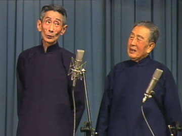
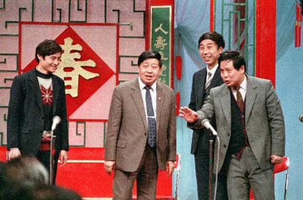
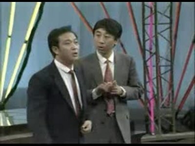
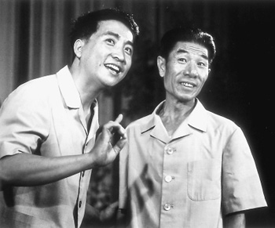
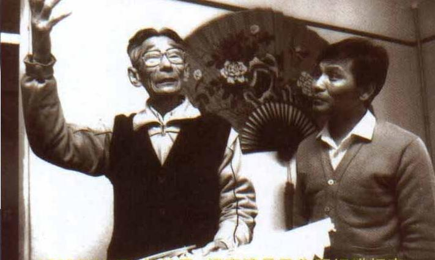

# ＜玉衡＞嬉笑怒骂——细数天朝十大讽刺型相声（下）

**马三立：“这咱们新调来的副团长，王…飞山……王飞山是不是？”** **王凤山：“王凤山！”** **（收了礼品之后，就能提拔一个连名字都不知道的陌生人为副团长，这位团长的贪婪，霸道，滥权形象，多么立体生动！）**  

# ** **嬉笑怒骂——细数天朝十大讽刺型相声（下）

## 文/ 张汇泉（University of Toronto）

 

####  05、马三立、王凤山《十点钟开始》：我不一定哪天的十点钟开始！

 讽刺对象：个人的夸夸其谈，眼高手低。 尖锐性：★★★☆ 时代性：★★★★☆ 艺术性：★★★★★  在天朝的文艺管理下，批评个人的缺点比批评组织的政策错误要安全得多；巧合的是，批评个人性格、行为方面错误的作品，只要足够优秀，会更加隽永。原因你懂的：组织，哪怕再强大，都会被瓦解；政策，哪怕再正确，也会被摒弃。而人性中根深蒂固的问题，却比任何社会制度和国家政权存在得更长久。 这一段《十点钟开始》，就是辛辣地讽刺这样了一类人：华而不实，喜好自吹自擂；夸夸其谈，肚子里却无半毫墨水；被揭穿了，又信誓旦旦地要痛改前非——可是呢？马三立老先生扮演的主人公，先后表态要做科学家、军事家、艺术家；之后又依次否定了自己立下的目标。在相声作品标准的“三翻四抖”之后，高潮到来了：“我不一定哪天的十点钟开始！”原来，主人公压根儿没打算改啊！ 在马三立、王凤山两位老艺术家的诠释下，这段作品艺术性无懈可击，即使放到现在来听也完全没有过时。多听几遍，可以让我们这些年轻人时时警醒自己。 亮点句：“十点钟过了！”“我不是今天的十点钟开始——我不一定哪天的十点钟开始！” 

#### 04、马季、赵炎、冯巩、刘伟、王金宝《五官争功》：电视相声也深刻，春晚节目亦有良

讽刺对象：集体中的个人，自私、虚荣、争名夺利、本位主义问题。  尖锐性：★★★★ 时代性：★★★★★ 艺术性：★★★★☆  该作品是群口相声的经典之作：它将“五官”的特征和相声文本紧密结合，娴熟运用谐音、成语、惯用语、时代热点（当然是八十年代的热点）等制造包袱；几位演员的表演风格、声音特质、外貌特征各具特色，可谓形神兼备，极富表现力（例如：瘦高个冯巩扮演马季先生的小眼睛，富态的赵炎扮演马季先生的厚嘴唇）；群口表演的节奏流畅，对白顶针续麻，层层推进，逻辑线索清晰，笑点安排合理。 尤其是，它所讽刺的现象不仅具有时代性，更具有隽永性：人的虚荣、贪功、“本位主义”。值得纪念的是：这段讽刺型相声登上了1987年春节联欢晚会，为亿万观众带来了欢乐和笑声。那时节，谁是总书记？谁是中宣部长？唉！想再次在CCTV的舞台上看到这么优秀的讽刺型作品，不知要再等多久？ 亮点句：赵炎：“人真正有功的从来不争。” 马季：“哎，有功人就不争功了。” 赵炎：“你看我什么时候争过啦？” （先是一副超然的高姿态，之后再去争功，这前后对比，两副嘴脸让人绝倒！） 赵炎：“行了眼睛！他们家那二十寸彩电就是给你买的！我们谁看得见啊？还有你这耳朵，他们家几千块钱买的音响，那就是你的！我们谁听得着啊？最可气就是你鼻子，你在最中间，我们全在边儿上围着你转！” （配合中国论坛上的地域攻击喊冤月经贴，可发一笑。） 

#### 03、牛群、冯巩《小偷公司》：岂止是小偷？又岂止是小偷公司？

讽刺对象：官僚主义作风。  尖锐性：★★★★☆ 时代性：★★★★★ 艺术性：★★★★☆  许多研究中国改革开放和社会转型的经济学家、社会学家都认为，中国的市场化是不完全的：我们是在在一个基本市场化的基层社会上，压上了一座重重的官僚大山。社会结构塑造文化，其结果就是：许多机构，表面上遵守的是市场原则，内底里通行的还是官僚作风。就像近期频繁出事儿的铁道部，多少老资格领导都是当年铁道兵出身的军队干部，知识陈旧，思维僵化。再比如那形形色色挂靠在政府机关下的所谓企事业单位，更是脱胎未能换骨。就连一个“小偷公司”，都难逃外行领导内行的瞎指挥，大锅饭体制下的人浮于事，和层层剥皮的公文旅行呢！这段相声在当下听来，难道不是发人深省的吗？ 亮点句：冯巩：“你们小偷公司还计划生育呀？” 牛群：“哎，你这话说的，全国一盘棋，我们小偷也不能例外呀。要不人家都计划生育，我们小偷随便生，大偷生小偷，小偷生幼偷，小偷越生越多，好人越来越少，我们偷谁去呀？！” 冯巩：“你们这也是为了保持……生态平衡。” （一个小偷，对于官话、套话的运用，多么娴熟！值得钦佩，建议报考中直公务员。） 牛群：“当然了这都是常设机构，倘若有个中心任务呢，还得增加很多临时机构。你像你到是春节你得成立得‘春盗办’吧？” 冯巩：“什么？春盗办？ ” 牛群：“春节期间突击盗窃办公室，简称春盗办。” 冯巩：“那三八妇女节呢？” 牛群：“成立女盗办。” 冯巩：“五四青年节？ ” 牛群：“青盗办! ” 冯巩：“六一儿童节？ ” 牛群：“儿盗办! ” 冯巩：“逢年过节都不耽误。” 牛群：“你甭说逢年过节了，今天综艺大观我们就立个综盗办! ” （有心人可以去研究一下，各级政府下设的各类临时委员会、协调会。） 牛群：“你说你一个小偷公司还要出国考察？说是要学习外国先进的偷盗技术！” （据说，最新的时尚是红色旅游。甚好。至少去西柏坡、井冈山不会消耗太多外汇。） 

#### 02、姜昆、李文华《如此照相》：如此照相，照出了文革众生相。

讽刺对象：文革中的极“左”意识形态和形式主义作风对人民生活的禁锢。  尖锐性：★★★★☆ 时代性：★★★★★ 艺术性：★★★★★  不管毛左如何美化文革，文革中的极“左”错误还是给人民群众的生活带来了许多负面影响。如果说打砸抢烧针对的是“黑五类”和“走资派”，算是部分正义；那么被迫背诵各种语录，被迫进行各种宗教性仪式，反复的政治运动和清查运动，则让人民的日常生活被搞得鸡犬不宁。这段作品，从一个青年去照相馆一天的经历切入，描述了主人公先后经历的“口号事件”、“背诵老三篇”、“照相标准姿势风波”等等插曲，揭露了“左”倾错误和人民群众内心对形式主义“妖风”的真实感受。主人公最后跳了一段“忠字舞”，内心想得却是饿着的肚子和晚饭，不正是社会主义国家里崇高虚伪意识形态和人民现实愿望这两重对立的最好注脚么？ 作品尖锐、深刻而又诙谐幽默，也为我们未经历过文革的八零后留下了了解文革生活的珍贵历史资料。唯一的美中不足，是《如此照相》并没有超越官方史观的套路：简单的否定、污名化“林、江”集团，并没有深挖“左”倾错误的深层原因、制度原因，也未敢指出毛在文革的中应负的历史责任。在那个大家一齐向四人帮吐口水踏上一万只脚的年代（1979），这段讽刺作品并无政治风险（相反还有巨大的政治红利），不算真正勇敢的批判，只能算是邓家民主墙的助拳。 亮点句：姜昆：我给你念念：“凡到我革命照相馆，拍革命照片的革命同志，进我革命门，问革命话，须先呼口号，如革命群众不呼革命口号，则革命职工坚决以革命态度不给革命回答。致革命敬礼。” 李文华：真够“革命”的。那时候是那样，进门得这样说：“‘为人民服务’，同志，问您点事。” 姜昆：“‘要斗私批修’！你说吧！” 李文华：“‘灭资兴无’，我照张相。” 姜昆：“‘破私立公’，照几吋？” 李文华：“‘革命无罪’，三吋的。” 姜昆：“‘造反有理’，您拿钱！” 李文华：“‘突出政治’，多少钱？” 姜昆：“‘立竿见影’，一块三。” 李文华：“‘批判反动权威’！给您钱。” 姜昆：“‘反对金钱挂帅’！给您票。” 李文华：“‘横扫一切牛鬼蛇神’！谢谢！” 姜昆：“‘狠斗私字一闪念’！不用了。” 李文华：“‘灵魂深处闹革命’！在哪儿照相？” 姜昆：“‘为公前进一步死’！往前走！” 李文华：“为公前进一步死”，我这就完了？ 

#### 01、马三立、王凤山《似曾相识的人》：这人，你见过，我见过。如果没见过，瞧，就在主席台上端坐。

讽刺对象：官员的腐败、索贿和极“左”心态。  尖锐性：★★★★★ 时代性：★★★★★ 艺术性：★★★★★  各位有没有去政府机关办过事情？去过的话，是不是常遇到各种无礼刁难？然后你掏出一条中华，是不是“上级精神”、“有关政策”都消失了，只剩下办事员满脸堆笑，把剩下的手续事情给你顺利办完？哈哈，想了解中国这特有的国情，有时间有精力的，可以看看《官场现形记》；没时间读书的朋友，至少可以花20分钟，听一听这段马老的相声作品《似曾相识的人》。 王凤山扮演的角色想进入曲艺团工作；而一手遮天的曲艺团书记兼团长（马三立扮演），则先后从家庭成分、民族、学历先后三次刁难，而一次次刁难之后，这位官员就要到了皮鞋、进口布料、彩色电视机三件礼品。（跟现在比起来是廉洁了不少呢！）而官员见钱眼开，要到了礼物之后，就一次次放宽要求，许诺这位送礼者进入曲艺团拿工资、当副团长和民族事务委员会委员，甚至许诺并不是党员的捧哏演员入党、做支部委员，一步到位。这中间马老几次变脸，把官员收礼前后两面表现的入木三分。 当然，天朝文艺作品还是要留给天朝人民以希望。捧哏演员最终亮出纪委调查员的身份，让逗哏演员扮演的索贿官员吓得尿了裤子。不过，王凤山老人扮演的纪委官员，算不算“钓鱼”执法？嘿嘿，这个问题，愿与诸君商榷。这段相声是马三立王凤山两位老艺术家在八十年代水平已臻化境的合作作品，对白、语气、节奏、人物性格、形象的刻画，都毫无瑕疵，可谓讽刺性和艺术性结合的最经典作品。 亮点句：马三立：“哎呀，每一个人的出身吗，不是自己选择的，出身……你这还是属于中农吧，地主、富农不还都改成分吗？通过劳动改造还……你这没问题……可以改造……我给你填表，给你改贫农……要不咱……咱一样了，跟我一样，都要过饭！咱就这么写…… ” 王凤山：“别介！您该怎么写就怎么写。” 马三立：“没关系，我改了好几个了！” 马三立：“你参加到曲艺团，看我……看工作合适不合适啊？” （所有领导口头上说的都是后半句，只是这段相声把领导们的心里话用前半句给点破了。） 马三立：“这咱们新调来的副团长，王…飞山……王飞山是不是？” 王凤山：“王凤山！” （收了礼品之后，就能提拔一个连名字都不知道的陌生人为副团长，这位团长的贪婪，霸道，滥权形象，多么立体生动！） 

 **另外推荐一些没有列入此排名的优秀讽刺型相声作品。** 姜昆、李文华《严重警告》：亮点：暗讽太祖时代的三门峡水库的同时，大肆歌颂李月月鸟的小丰满水电站。 郭德纲、于谦《我是黑社会》：一段作品，能读出社会贫富分化，底层社会黑社会化，可谓一粒露珠映出太阳的光辉。 刘宝瑞、《支援新厂》：这段相声除了讽刺本位主义，还能让现今的听众了解到一些当年工矿企业的风貌、人事、制度、历史沿革。 王自健、张伯鑫：《歪唱太平歌词》。涉及利比亚动荡，大跃进、文革、八九，国共关系，发改委，高油价高房价……由于太过犀利，该段相声的视频已经被和谐。   初作于2011-5-12北京 增改于2011-8-17临沂 完稿于2011-8-27多伦多  

（采编：陈锴；责编：陈锴）

 
