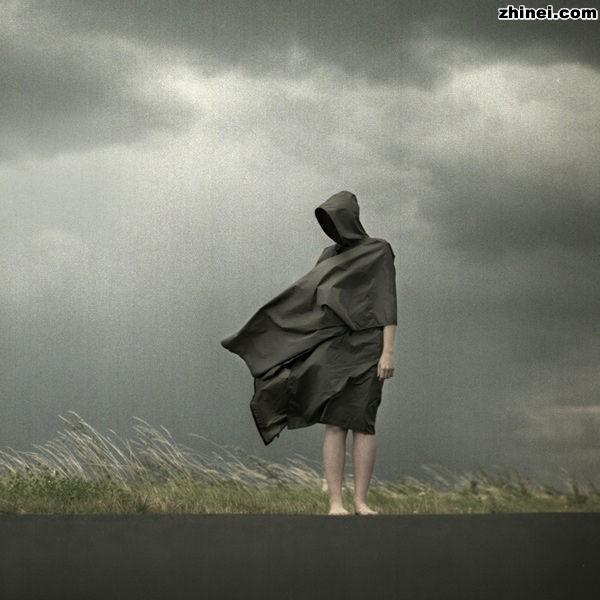

# ＜玉衡＞孤独和爱情——关于李志

**在日常的生活里，我们太容易沉入消费，爱情，游戏和电视剧的麻醉里，保持觉知，保持观照，在文字或音乐的艺术方式里保持自身的完整，是必要的。在活着的随时随地，你都要做一个功夫高手，应对来自周围的刀客的同时，记住墙上面的字。**  

# 孤独和爱情——关于李志

## 文/张栋（济南大学）

 

应该以一个怎样的论调开始？孤独早就不是个新鲜的话题，但是你不断地说起它，不是因为它早就不再新鲜，而是孤独的一直存在，并且对精神健康造成持续的影响。不断地说起它，是因为你要不断地提醒自己它的存在，不回避，不选择性无视，进而适应它的存在，“就像适应一种残疾”。

对孤独的拯救，莫过于爱情，我断定爱情中最好的体验就在于它使人短暂的脱离孤独，就像溺水的人短暂的浮出水面，就如同瘾君子从隐秘的渠道又拿到了毒品。

“你是一片光荣的叶子，落在我卑贱的心。”《山阴路上的夏天》

爱情，不是最好的解药，但却是唯一的缓解孤独之毒的东西。不过说到底，孤独和爱情，都只是一个概念和名词，在概念和名词底下，是无法言说又忍不住要言说的人心。

### 1

先从李志流传最广的“梵高先生”说起，“谁的父亲死了，请你告诉我该如何悲伤，谁的爱人走了，请你告诉我该如何遗忘”。

不是自己的父亲，就不知道如何悲伤，请你告诉我，我该如何悲伤。不是自己的爱人，就不知道如何遗忘，当他的爱人走了他只能独自遗忘，你不能分担他哪怕一点点。因为苦痛一类的东西传播性比欢乐小得多，是谁说的，当你笑时世界与你一起笑，当你哭时，你便独自哭。悲伤不能分享，“不管你拥有什么，我们生来就是孤独”。

村上春树说自己喜欢跑步的缘由，其中之一是倾向于体验痛苦的感觉，因为在咀嚼痛苦的时候才感到自己的存在。这痛苦的来由，全部都是人心的孤独。

别以为这是多么审美的体验。鲁迅说，真的猛士敢于直面惨淡的人生，这直面之中，直面孤独是最重要的一环。如果你能安于孤独，就不会投身于集体之中，就不会主动逃避自身的自由，也不会轻易被掀起那么多的革命。

村上春树自己也说，人和人之间的误解和冲突，“毫无疑问是痛苦的体验”。他喜欢跑步的理由，与其说是主动选择，不如说是意识到无处可逃之后的选择。

自然，我们没有鲁迅的勇猛，也没有村上那种用跑步来缓解，用文字来关照和化解的本事。我们只有靠爱情，和旅行相比，和消费相比，和攀比相比，和事业心相比，爱情是最靠近孤独的东西。

“雾气穿过她年轻的脖子，直到今天都没有散去。”《关于郑州的记忆》

“我多么喜欢你走在我身边的样子，想起来我的爱就不能停止。”《山阴路上的夏天》

“我要和你在一起，直到我不爱你，宝贝，我也只能这样为你。”《和你在一起》

“忽然就留下泪来，忽然就想要听到她的声音，而我却什么话也说不出来。”《忽然》

作为一个民谣的，边缘地位的，带点摇滚的李志，歌词里带些粗口和一些形容生殖器官的词应该不算意外。不算意外的还有当他唱起爱情的歌儿的时候，语气里带着的温柔、爱意、哀怨和乞求。

在没有神降临的地方，爱情是唯一接近神性的东西。我们期望爱人能像神一样，知悉自己心里的每个期望，接受我们一直掩藏的秘密和缺点，甚至在你不那么爱对方的时候，她也能爱你。

因为这样的自己才是真实地，完整的。两个真实完整的人相爱，存在才是不孤单的。否则就一无是处。“说好了一辈子，就是一辈子，差一天，差一分一秒都不是一辈子”。只是怀着这样期望的人注定会失败，因为我们都是凡人，注定会让另一个凡人失望。

### 2

“因为心动会带来危险。”《山阴路上的夏天》

李志在歌中也知道这一点，他说，“我要和你在一起，直到我不爱你”，在爱的时候我们都接近神，像是被自己召唤出的魔力摄住的巫师，圆融，陶醉，视对方为自己的肉中之肉，骨中之骨，恨不得一起跳进绞肉机里揉成一个整块，至于做爱，那简直是最浅层的结合方式。

“你拥有我的，不只是鸡巴。”《和你在一起》

但是爱情有它自己的寿命，在说完“直到我不爱你”之后，他马上跟着说，“人和人之间，一场游戏”。所以诚实的态度就是，我爱你直到我不爱你的时候。用《伤逝》中涓生的逻辑就是，当我内心不爱她的时候，还要继续关系，这不是对她的欺骗么。

“宝贝，我也只能，这样为你。”《和你在一起》

从一开始他就知道这样结局，但是又能怎样，作为一个人，一个肉身的凡夫，不太可能抵御爱情的诱惑，也不大可能阻止爱情的结束。佛说，情执难除，为情所执是人沦落六道轮回的根源。看看，执着情爱使你沦落六道，成为人形，迷恋情爱的光是你存在在这个世界的原因，你能抵挡它么？试试拽着你的头发脱离地面试试。

“爱情不过是生活的屁，折磨着我也折磨着你。”《天空之城》

“妹妹，你的咪咪很大，它比我的理想大。”《暧昧》

“亲爱的李志先生，你就像是屎的倒影。”《倒影》

在体验到爱情不能挽救生来的孤独之后，就开始了对爱情的厌弃和调弄。厌弃是带着恨的力量，有被欺骗被抛弃后的愤怒；调弄，是为了一个玩世不恭的姿态，虚拟一个高于爱情的地位。这当然是不可能的，于是又有对爱情，或者说对爱人的抱怨。

“我们从来没有想象的那样接近，只是两棵树的距离。”《山阴路上的夏天》

“我是否该写一首悲伤的歌，在你睡不着的时候唱给你听。”《卡夫卡》

“我时常在这样的夜里，听着风声想忘了你。”《卡夫卡》

“我再也不会把自己，彻底的交给一个人。”《寻找》

### 3

是应该说一下解脱之道的时候了，否则人生好像没有出路了。不过出路的确是存在的，那就是艺术。文字、音乐或者绘画。

叔本华说，人是自然意志的奴隶。被自然意志催促着去竞争，无有休止，得不到就痛苦，得到了就觉得不过如此；于是再次进入新的竞争，如果不去竞争，就会得到自然意志的惩罚：无聊。

我们人类所说的幸福，就是痛苦的暂时解除，是自然意志对人类的短暂奖励。能使人从中解脱出来的，只有艺术。

“从意志的奴役下，将认识拯救出来，忘掉个人的自我和物质利益，让心灵上升到对真理的无意志思考的高度，这是艺术的功能。”《作为意志与表象的世界》

在禅宗中，它被称为“观照”。当你愤怒，观照自己的愤怒；当你嫉妒，观照自己的嫉妒。当你能在局外看自己的时候，你就不会陷入自然意志的控制中，就不会孤独。你或许需要一个爱情，但不会那么迫切了。

“一个人必须从最简单的行动开始，比方说走路，你可以走路，你可以觉知到你在走路，每一步都可以充满觉知。吃东西……就像在禅寺里他们喝茶的方式，他们称之为“茶道”，因为在品茶的时候，一个人必须保持警觉和觉知。

你或许会在走路的时候还一直在思考，你或许会在吃东西的时候还一直在思考，试着用觉知来代替思考。继续吃，但是保持警觉说你在吃。当你在走路的时候，用觉知来代替思考。继续走，或许你的走路会变得慢一点，变得更优雅，但是在刚开始的时候，只有在这些小动作上，觉知才可能”。奥修《生存智慧》

在日本的武士道训练中，修炼者要在写满汉字的房间里，持刀应对来自周围的敌人，同时记住墙上的字。这就是觉知。在日常的生活里，我们太容易沉入消费，爱情，游戏和电视剧的麻醉里，保持觉知，保持观照，在文字或音乐的艺术方式里保持自身的完整，是必要的。在活着的随时随地，你都要做一个功夫高手，应对来自周围的刀客的同时，记住墙上面的字。

“不管曾经或是以后，拥有是什么，请你相信我，我还会唱歌。”《来了》

 

（采编：何凌昊，责编：徐海星）

 
